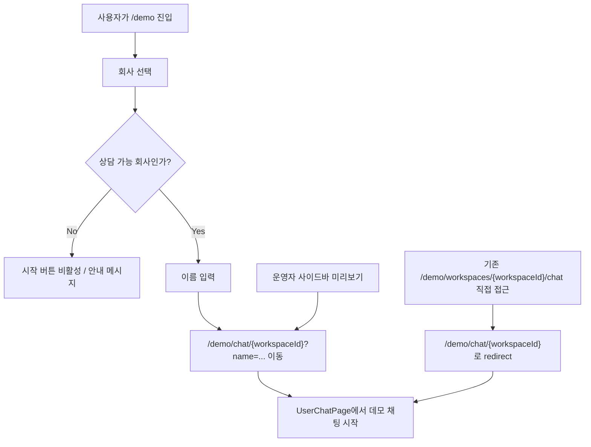

# 435 [FE] 사용자 채팅 미리보기 라우트 정리

---

## Goal

`/demo` 진입 흐름에서 시작되는 사용자 채팅 미리보기 URL을 짧고 일관된 `/demo/chat/{workspaceId}` 형태로 정리하고, 기존 `/demo/workspaces/{workspaceId}/chat` 직접 링크는 안전하게 유지한다.

---

## User Flow Chart



---

## Design Diff

### As-is vs To-be

| 영역                      | As-is                                 | To-be                                   | 변경 내용                                             |
| ------------------------- | ------------------------------------- | --------------------------------------- | ----------------------------------------------------- |
| 공개 데모 채팅 URL        | `/demo/workspaces/{workspaceId}/chat` | `/demo/chat/{workspaceId}`              | 내부 리소스 구조가 드러나는 `workspaces` segment 제거 |
| `/demo` 회사 선택 후 이동 | 기존 긴 경로로 이동                   | 새 canonical 경로로 이동                | URL 구조를 `/demo` 진입점과 일관되게 정리             |
| 운영자 사이드바 미리보기  | 기존 긴 경로를 새 탭으로 오픈         | 새 canonical 경로를 새 탭으로 오픈      | 운영자 미리보기와 공개 데모 흐름의 URL 통일           |
| 기존 직접 링크            | 같은 화면 직접 렌더링                 | 새 canonical 경로로 query 보존 redirect | 외부 공유 링크 및 북마크 호환성 유지                  |

---

## Component Tree

```text
App
├─ /demo
│  └─ DemoPage
├─ /demo/chat/:workspaceId
│  └─ UserChatPage
└─ /demo/workspaces/:workspaceId/chat
   └─ LegacyDemoChatRedirect

Sidebar
└─ 사용자 화면 미리보기 링크 -> /demo/chat/{workspaceId}
```

---

## 수정 대상 파일

| 파일                                                                   | 변경 유형 | 설명                                                                    |
| ---------------------------------------------------------------------- | --------- | ----------------------------------------------------------------------- |
| `frontend/src/app/App.tsx`                                             | modify    | 새 `/demo/chat/:workspaceId` 라우트와 기존 경로 redirect 정의           |
| `frontend/src/pages/demo/ui/DemoPage.tsx`                              | modify    | 회사/이름 선택 후 새 canonical 채팅 경로로 이동                         |
| `frontend/src/shared/ui/ostone/chrome/Sidebar.tsx`                     | modify    | 사용자 화면 미리보기 링크를 새 경로로 생성                              |
| `frontend/src/shared/lib/demoRoutes.ts`                                | new       | 데모 채팅 경로 생성 helper                                              |
| `frontend/src/features/auth/model/resolvePostLoginDestination.ts`      | modify    | 로그인 후 복귀 허용 경로에 새 데모 채팅 prefix 포함, legacy prefix 유지 |
| `frontend/src/app/App.test.tsx`                                        | modify    | legacy 경로 redirect 검증                                               |
| `frontend/src/pages/demo/ui/DemoPage.test.tsx`                         | modify    | 새 채팅 이동 경로 검증                                                  |
| `frontend/src/shared/ui/ostone/chrome/Sidebar.test.tsx`                | modify    | 사이드바 미리보기 링크 검증                                             |
| `frontend/src/features/auth/model/resolvePostLoginDestination.test.ts` | modify    | 새/기존 데모 채팅 복귀 경로 허용 검증                                   |
| `frontend/e2e/demo.spec.ts`                                            | modify    | `/demo` 시작 플로우의 새 URL 검증                                       |
| `frontend/e2e/user-chat.spec.ts`                                       | modify    | 새 직접 진입 URL과 legacy redirect 검증                                 |

---

## API Integration

백엔드 API 변경은 없다. 사용자 채팅 화면은 기존과 동일하게 workspace id를 route parameter에서 읽고, 기존 데모 채팅 API를 호출한다.

| Method | Path                                                                       | 변경 여부 |
| ------ | -------------------------------------------------------------------------- | --------- |
| POST   | `/api/v1/workspaces/{workspaceId}/demo/chat-sessions`                      | 변경 없음 |
| GET    | `/api/v1/workspaces/{workspaceId}/demo/chat-sessions/{sessionId}/messages` | 변경 없음 |
| POST   | `/api/v1/workspaces/{workspaceId}/demo/chat-sessions/{sessionId}/messages` | 변경 없음 |

---

## State Management

새 전역 상태는 추가하지 않는다. `UserChatPage`의 기존 route parameter 기반 `workspaceId` 해석과 query string 기반 `name` 자동 시작 흐름을 유지한다.

---

## Requirements

1. `/demo`에서 상담 가능 회사를 선택하고 이름을 입력하면 `/demo/chat/{workspaceId}?name=...`로 이동한다.
2. `/demo/chat/{workspaceId}` 직접 접근 시 기존 `UserChatPage`가 렌더링되고 동일한 데모 채팅 API를 호출한다.
3. `/demo/workspaces/{workspaceId}/chat` 직접 접근 시 query string을 보존하며 `/demo/chat/{workspaceId}`로 redirect한다.
4. 운영자 사이드바의 “사용자 화면 미리보기” 링크는 현재 워크스페이스 기준 `/demo/chat/{workspaceId}`를 새 탭으로 연다.
5. 로그인 후 복귀 경로 검증은 새 `/demo/chat/*` 경로를 허용하고 기존 `/demo/workspaces/*` 경로도 호환을 위해 유지한다.

---

## Non-goals

- 데모 채팅 API 경로 변경.
- `UserChatPage`의 대화 상태, localStorage key, WebSocket 구독 로직 변경.
- `/demo` 회사 선택 화면의 시각 디자인 변경.
- 워크스페이스 id가 아닌 slug 기반 공개 URL 도입.

---

## Tests

### Test Strategy

| 구분          | 방법                           | 비고                                                   |
| ------------- | ------------------------------ | ------------------------------------------------------ |
| 단위/컴포넌트 | `pnpm test`                    | 라우팅 helper 사용처, redirect, Sidebar, DemoPage 검증 |
| E2E           | `pnpm e2e` 또는 대상 spec 실행 | `/demo` 시작 플로우, 직접 진입, legacy redirect 검증   |
| 빌드          | `pnpm build`                   | route/import/type 오류 검증                            |

### Acceptance Criteria

| #   | 시나리오                                            | 기대 결과                                                        |
| --- | --------------------------------------------------- | ---------------------------------------------------------------- |
| 1   | `/demo`에서 enabled 회사 선택 후 이름 입력          | URL이 `/demo/chat/{workspaceId}?name=...`이고 채팅 화면이 열린다 |
| 2   | `/demo/chat/{workspaceId}` 직접 접근                | 이름 입력 또는 `name` query 기반 자동 시작이 기존처럼 동작한다   |
| 3   | `/demo/workspaces/{workspaceId}/chat?name=...` 접근 | `/demo/chat/{workspaceId}?name=...`로 redirect된다               |
| 4   | 운영자 사이드바에서 “사용자 화면 미리보기” 클릭     | 새 탭 링크 href가 `/demo/chat/{workspaceId}`다                   |
| 5   | 로그인 후 복귀 대상이 `/demo/chat/{workspaceId}`    | 안전한 내부 경로로 허용된다                                      |

---

## Open Questions

- 없음. 이 이슈 범위에서는 workspace id 기반 URL을 유지하고 path segment만 정리한다.
