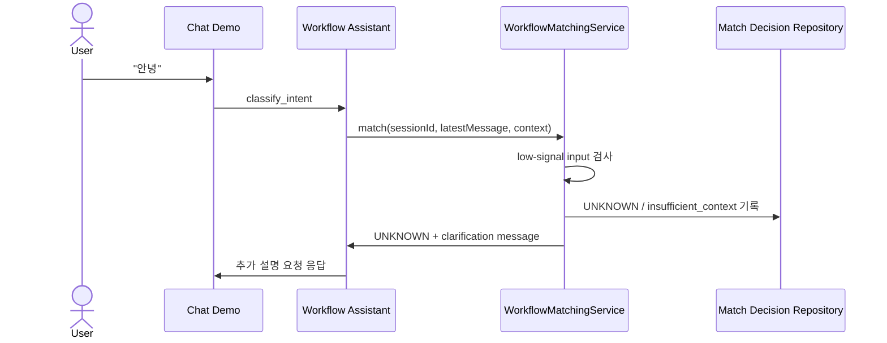

# Backend Spec: 단문 인사말 워크플로우 매칭 방지

## Goal

데모 채팅에서 `안녕` 같은 컨텍스트가 부족한 단문 입력이 업무 워크플로우로 자동 매칭되지 않고, 추가 설명을 요청하는 fallback 응답으로 분기되게 한다.

## Sequence Diagram

## Problem

현재 워크플로우 매칭은 임베딩 유사도와 후보 점수만으로 판단할 수 있어, 인사말이나 짧은 감탄사처럼 업무 의도를 확정하기 어려운 입력에도 특정 워크플로우 후보가 선택될 수 있다. 이 경우 사용자가 의도하지 않은 상담 플로우에 진입한다.

## Scope

- `backend/src/main/java/com/init/workflowruntime/application/matching/WorkflowMatchingService.java`
  - 최신 사용자 발화와 대화 문맥에 업무 의도 신호가 부족한지 먼저 판단한다.
  - 부족하면 후보 조회와 자동 실행 판단으로 진행하지 않고 `UNKNOWN` 결과와 clarification 메시지를 반환한다.
  - 감사 로그에는 `insufficient_context` 실패 사유를 남긴다.
- `backend/src/test/java/com/init/workflowruntime/application/matching/WorkflowMatchingServiceTest.java`
  - `안녕` 같은 인사말은 workflow 후보가 있더라도 `UNKNOWN`으로 분기되는지 검증한다.
  - `환불하고 싶어요`처럼 실제 문의 의도가 충분한 입력은 기존처럼 `CONFIDENT` 매칭되는지 유지 검증한다.

## Requirements

1. `안녕`, `안녕하세요`, `hi` 같은 인사말 단문은 업무 워크플로우로 자동 매칭하지 않는다.
2. 의미 있는 업무 키워드가 없는 짧은 일반 발화는 사용자에게 추가 설명을 요청하는 fallback 메시지로 분기한다.
3. fallback 메시지는 업무 의도를 더 자세히 말해 달라는 자연스러운 한국어 문장이어야 한다.
4. 실제 문의 의도가 충분한 입력은 기존 워크플로우 매칭 경로를 유지한다.
5. 매칭 실패 사유는 이후 운영 분석이 가능하도록 decision log에 남긴다.

## Non-goals

- 프론트엔드 채팅 UI 변경.
- Domain Pack 또는 workflow schema 변경.
- 임베딩 모델, profile build 파이프라인, Airflow DAG 변경.
- small-talk 전용 워크플로우 신규 도입.

## API / Data Impact

- 외부 REST API 계약 변경은 없다.
- DB 스키마 변경은 없다.
- `workflow_match_decision` 기록의 `failureReason` 값으로 `insufficient_context`가 추가될 수 있다.

## Validation

| 구분 | 확인 항목 |
|------|----------|
| Unit Test | `WorkflowMatchingServiceTest`에서 인사말 단문이 `UNKNOWN`과 clarification 메시지를 반환한다 |
| Regression Test | 기존 명확한 문의 입력이 `CONFIDENT` 매칭을 유지한다 |
| Manual Check | 데모 채팅에서 `안녕` 입력 시 업무 플로우가 시작되지 않고 추가 설명 요청 응답이 나온다 |

## Acceptance Criteria

1. `안녕` 입력은 workflow 후보가 존재해도 `CONFIDENT` 또는 `AMBIGUOUS`가 아니라 `UNKNOWN`으로 처리된다.
2. `UNKNOWN` 결과에는 `어떤 내용으로 문의하시려는지 조금 더 자세히 말씀해 주세요.` 메시지가 포함된다.
3. `decisionRepository.record` 호출에는 `insufficient_context` 실패 사유가 기록된다.
4. `환불하고 싶어요`와 같은 기존 명확한 업무 문의는 계속 `CONFIDENT`로 매칭된다.

## Open Questions

- 없음.
