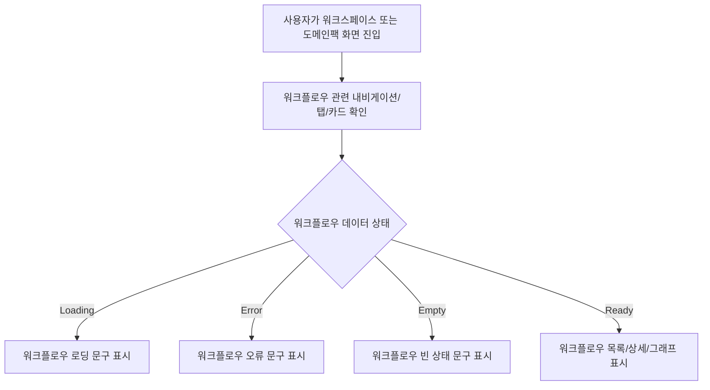

# Frontend Spec: 워크플로우 표기 복원

## Goal

사용자에게 노출되는 workflow 개념의 일반 표기를 `응대 흐름`에서 `워크플로우`로 되돌려 제품 화면 전반의 용어를 일관화한다.

## Background

워크플로우 관련 화면과 메시지 일부가 `응대 흐름`으로 표시되고 있다. 제품과 도메인 모델에서는 workflow가 핵심 개념이며, 운영자 화면에서도 `워크플로우`가 더 명확한 표현이다. 이 변경은 사용자 노출 문구와 그 문구를 검증하는 테스트 기대값을 대상으로 한다.

## Scope

- 화면 제목, 내비게이션, 탭, 카드, 빈 상태, 로딩/에러 메시지, 토스트 문구에서 workflow 개념을 `워크플로우`로 표시한다.
- workflow code를 설명하는 사용자 노출 라벨은 `워크플로우 코드`로 표시한다.
- 변경된 문구를 기준으로 프론트엔드 단위/통합/e2e 테스트 기대값을 갱신한다.

## Non-goals

- `workflow`, `workflowCode`, `workflows` 같은 코드/API/라우트/도메인 모델 명명은 변경하지 않는다.
- `응대 기준`, `응대 방법`, `상담 응대`처럼 workflow가 아닌 기존 상담/정책 용어는 변경하지 않는다.
- 디자인 레이아웃, API 연동, 데이터 구조, 백엔드/ML 동작은 변경하지 않는다.

## User Flow Chart

## Design Diff

| 영역 | As-is | To-be | 변경 내용 |
| --- | --- | --- | --- |
| Workflow navigation | `응대 흐름` | `워크플로우` | 셸, 사이드바, 탭 라벨 복원 |
| Workflow list/detail states | `응대 흐름 목록`, `응대 흐름 없음` | `워크플로우 목록`, `워크플로우 없음` | 로딩/오류/빈 상태 문구 복원 |
| Workflow edit/revision feedback | `응대 흐름 수정`, `응대 흐름 수정 검토본` | `워크플로우 수정`, `워크플로우 수정 검토본` | 폼, 시트, 토스트, validation 문구 복원 |
| Workflow code label | `응대 코드` | `워크플로우 코드` | workflowCode 표시 라벨 복원 |

## Affected Frontend Modules

| 경로 | 변경 유형 | 설명 |
| --- | --- | --- |
| `frontend/src/widgets/ostone-shell/ui` | modify | 워크플로우 내비게이션 라벨과 테스트 기대값 갱신 |
| `frontend/src/pages/domain-pack/ui` | modify | 도메인팩 워크플로우 목록/상세/그래프 화면 문구와 테스트 기대값 갱신 |
| `frontend/src/pages/workspace/ui` | modify | 워크스페이스 워크플로우 목록 화면 문구와 테스트 기대값 갱신 |
| `frontend/src/features/workflow-draft-read/ui` | modify | 워크플로우 초안 목록/상세 패널 문구와 테스트 기대값 갱신 |
| `frontend/src/features/workflow-list/ui` | modify | 워크플로우 목록/검색 UI 문구 갱신 |
| `frontend/src/features/update-workflow` | modify | 워크플로우 수정 API 메시지, 스키마, 폼/시트 문구와 테스트 기대값 갱신 |
| `frontend/src/entities/workflow` | modify | 워크플로우 API 오류/그래프 렌더링 상태 문구와 테스트 기대값 갱신 |
| `frontend/src/features/domain-pack-summary-read/ui` | modify | 워크플로우 요약/미리보기 문구와 테스트 기대값 갱신 |
| `frontend/e2e` | modify | e2e 기대 문구 갱신 |
| `frontend/src/shared/lib` | modify | 도메인팩 섹션/정렬 라벨 갱신 |

## Acceptance Criteria

1. 주요 화면에서 workflow 개념의 일반 표기가 `워크플로우`로 표시된다.
2. `응대 흐름` 문구가 frontend 사용자 노출 문자열 또는 변경 대상 테스트 기대값에 남지 않는다.
3. workflow code 사용자 노출 라벨은 `워크플로우 코드`로 표시된다.
4. workflow 관련 코드/API/라우트 식별자는 기존 `workflow` 명명을 유지한다.
5. `응대 기준`, `응대 방법`, `상담 응대` 등 workflow가 아닌 상담/정책 용어는 유지된다.

## Validation

- `cd frontend && pnpm test`
- `cd frontend && pnpm build`
- 필요 시 `frontend/e2e` 중 workflow 라벨을 검증하는 시나리오를 별도로 실행한다.

## Open Questions

- 없음. 이슈 본문 기준으로 사용자 노출 workflow 표기를 `워크플로우`로 복원하는 범위가 명확하다.
