<!--
  canonical: 487
  type: FE
  template: _TEMPLATE_FE.md
  source-recon: .handoff/487/recon-report-487.md (Version 1, 2026-06-03)
  uncertainty-register: .handoff/487/uncertainty-register-487.md
  status: DECIDED — U-001~U-004 사용자 결정 반영(2026-06-03). U-005~U-008은 Recommended Default(Assumption)로 진행.
-->

# [FE] 487 — 토스페이먼츠 v2 결제위젯 기반 워크스페이스 구독 (프론트엔드)

> 백엔드는 #488(CLOSED, `com.init.payment` 머지 완료, commit `9f3a73eb`). 본 스펙은 **프론트엔드 범위**다.
> 결정 이력과 미결 근거는 `.handoff/487/uncertainty-register-487.md`(U-001~U-008)에 보존된다.
>
> **사용자 결정 (2026-06-03)**: U-001=단일 플랜 하드코딩(`pro_monthly`) · U-002=`customerKey = ws_{workspaceId}`(기존 구독은 server값 우선; 안정성은 engineering-bound invariant로 register 보존) · U-003=위젯 일회성 결제 **포함**, `orderId`는 FE 생성(uuid)·결제수단 카드 · U-004=구독 화면은 **설정(settings) 하위** 진입.

---

## Goal

워크스페이스 단위로 토스페이먼츠 **v2 SDK(`@tosspayments/tosspayments-sdk`)** 를 사용해 자동결제(빌링) 카드 등록·구독 활성화·구독 취소·결제 내역(영수증)을 제공하는 프론트엔드 화면을 구현한다. 민감정보(secretKey/billingKey/paymentKey/authKey)는 FE에 저장·로깅하지 않고 즉시 서버로 전달한다.

---

## 범위 & 단계

issue #487 "범위 + 단계 제안" 기준 3단계 (source: recon L233-236):

1. **(1) 요금제·구독 화면 + 자동결제 등록** — 빌링 인증(`requestBillingAuth`) → `authKey` → `POST /billing/authorizations` → 구독 활성 표시
2. **(2) 결제 성공/실패 처리 + 내역** — 외부 리다이렉트 복귀 처리, 결제 내역(영수증 링크) 목록
3. **(3) 취소/환불 UI** — 구독 취소(`DELETE /subscription`), 결제 환불(`POST /payments/{paymentKey}/cancel`)

> **위젯 일회성 결제(`requestPayment` → `POST /payments/confirm`) 포함**(U-003=B 확정). `orderId`는 FE가 `uuid`로 생성해 `requestPayment`/`confirm`에 동일 값 전달, 결제수단은 카드(variantKey 기본). FE가 `amount`를 전송하므로 금액 신뢰는 BE의 expected-amount 검증(주문 시 서버가 기대 amount 저장 — #488)에 의존한다(register U-003 Execution Rule 참조).

---

## User Flow Chart

```mermaid
flowchart TD
    Start[워크스페이스 billing 진입<br/>/workspaces/:workspaceId/billing] --> LoadSub[GET /subscription 조회]
    LoadSub --> HasSub{구독 존재?}

    HasSub -->|ACTIVE| ShowActive[구독 상태 + 결제수단 + 내역 표시]
    HasSub -->|없음/INCOMPLETE| ShowPlan[요금제 표시 + 자동결제 등록 CTA]

    ShowPlan --> RegBilling[loadTossPayments&#40;clientKey&#41;<br/>payment&#40;customerKey&#41;.requestBillingAuth&#40;method:CARD&#41;]
    RegBilling --> Redirect[토스 외부 리다이렉트]
    Redirect --> ReturnOK[/billing/success<br/>customerKey, authKey/]
    Redirect --> ReturnFail[/billing/fail<br/>code, message, orderId/]

    ReturnOK --> PostAuth[POST /billing/authorizations<br/>authKey, customerKey]
    PostAuth --> SubActive[구독 활성 표시 + toast 성공]
    ReturnFail --> ShowError[실패 안내 + toast.error + 재시도]

    ShowActive --> Cancel[구독 취소: DELETE /subscription]
    ShowActive --> Refund[환불: POST /payments/&#123;paymentKey&#125;/cancel]
    ShowActive --> Receipt[영수증 링크: PaymentResponse.receiptUrl]

    subgraph onetime [위젯 일회성 결제 — U-003=B 확정]
      WidgetFlow[orderId = uuid&#40;FE 생성&#41;<br/>widgets&#40;customerKey&#41; → setAmount → renderPaymentMethods&#40;카드&#41; + renderAgreement → requestPayment&#40;orderId&#41;]
      WidgetReturn[/billing/success<br/>paymentKey, orderId, amount/]
      WidgetConfirm[POST /payments/confirm<br/>처리된 orderId 재호출 가드]
      WidgetFlow --> WidgetReturn --> WidgetConfirm
    end
```



---

## Design Diff (As-is vs To-be)

| 영역 | As-is | To-be | 변경 내용 |
|------|-------|-------|----------|
| 구독 화면 진입점 | 사이드바에 billing 항목 없음 (recon L121) | **설정(settings) 화면 내 '구독' 링크**로 진입 (U-004=B) | 신규 `SidebarActive` 값 불필요. `/billing`에서는 settings active 유지 |
| 라우팅 | `/workspaces/:id/billing`·`/billing/success`·`/billing/fail` 없음 (recon L118) | billing 페이지 + success/fail 랜딩 추가 | success/fail 배치 → **U-005**(Assumption) |
| 결제 SDK | `@tosspayments/tosspayments-sdk` 미설치 (recon L116) | v2 SDK npm 설치 + npm import | v1 SDK 설치 금지 |
| 결제 환경변수 | `VITE_TOSS_CLIENT_KEY` 미정의 (`.env.example` 확인) | FE clientKey 주입 | `.env.example` 갱신 → **U-008** |
| Generated API client | payment/subscription/billing 엔드포인트 없음 (openapi 67 paths, recon L128) | generated hook 사용 | `generateOpenApiDocs` + `pnpm api:gen` 선행 → **U-008** |
| 요금제 | seed `pro_monthly` 1개, plan 목록 API 없음 (recon L200) | **단일 Pro 플랜 상수**(`pro_monthly`, 29000 KRW/월) 표시 (U-001=A) | plan 목록 API 미사용, FE 상수 |

---

## Component Tree (제안 — FSD)

```
[진입] 설정(settings) 화면 → '구독' 링크 → BillingPage  (U-004=B)

BillingPage (pages/billing) — /workspaces/:workspaceId/billing, WorkspaceLayout 하위
├─ SubscriptionStatusCard (entities/billing)        # 구독 상태/주기/플랜
├─ PlanSection (features/subscribe-plan)            # 단일 Pro 플랜 상수 (U-001=A)
│    └─ RegisterBillingButton (features/register-billing-method)  # requestBillingAuth
├─ BillingMethodCard (entities/billing)             # 등록 카드(cardCompany, cardNumberMasked)
├─ PayOnceButton (features/pay-once)                # 위젯 일회성 결제 (U-003=B), orderId=uuid
├─ PaymentHistoryList (entities/billing)            # GET /payments, receiptUrl 링크
│    └─ PaymentRow → RefundButton (features/cancel-subscription or 별도)
└─ CancelSubscriptionButton (features/cancel-subscription)  # DELETE /subscription

BillingSuccessPage / BillingFailPage (pages/billing) — /billing/success, /billing/fail  (배치 U-005=Assumption)
└─ (success) authKey 수신 → POST /billing/authorizations  /  paymentKey 수신 → POST /payments/confirm(처리된 orderId 가드)
```

상태 3종(loading/error/empty) 및 `ErrorBoundary`(`src/shared/ui/ErrorBoundary.tsx`) 적용 필수.

---

## API Integration

### Endpoints (백엔드 소스 직접 관찰 — recon L155-198, 확정)

| Method | Path | Request | Response | Auth |
|--------|------|---------|----------|------|
| POST | `/api/v1/workspaces/{workspaceId}/billing/authorizations` | `{ authKey, customerKey }` | `{ subscription: SubscriptionResponse, billingKey: BillingKeyResponse }` | JWT |
| GET | `/api/v1/workspaces/{workspaceId}/subscription` | — | `SubscriptionResponse` | JWT |
| POST | `/api/v1/workspaces/{workspaceId}/subscription` | `{ planKey }` | `SubscriptionResponse` (201) | JWT |
| DELETE | `/api/v1/workspaces/{workspaceId}/subscription` | — | `SubscriptionResponse` | JWT |
| GET | `/api/v1/workspaces/{workspaceId}/payments` | — | `PaymentResponse[]` | JWT |
| POST | `/api/v1/workspaces/{workspaceId}/payments/{paymentKey}/cancel` | `{ cancelReason, cancelAmount? }` (`cancelAmount` null=전액) | `PaymentResponse` | JWT |
| POST | `/api/v1/workspaces/{workspaceId}/payments/confirm` | `{ paymentKey, orderId, amount }` | `PaymentResponse` | JWT |

> `POST /api/v1/payments/webhooks/toss` 는 `permitAll()` 서버-서버 웹훅으로 **FE 범위 아님**(recon L87).
> Plan 목록 조회 엔드포인트는 **백엔드에 없음**(recon L200). U-001=A 확정에 따라 FE는 plan 목록 API를 호출하지 않고 단일 `pro_monthly`(29000 KRW/월) 상수를 사용한다. `POST /subscription`에는 `planKey="pro_monthly"`를 전송.

### Response DTO (recon L80-83, 확정)

```typescript
// 백엔드 record 기준. 실제 타입은 generated client에서 가져온다(아래 prerequisite).
interface SubscriptionResponse {
  id: number; workspaceId: number; planKey: string; status: string;
  currentPeriodStart: string; currentPeriodEnd: string;
  cancelAtPeriodEnd: boolean; customerKey: string;
}
interface PaymentResponse {
  id: number; orderId: string; paymentKey: string; amount: number;
  currency: string; status: string; method: string;
  approvedAt: string; receiptUrl: string; createdAt: string;
}
interface BillingKeyResponse { id: number; cardCompany: string; cardNumberMasked: string; status: string; }
```

> `status` 문자열의 enum 값 집합(SubscriptionStatus / PaymentStatus)은 코드 직접 확인 미완 → **U-007**(unknown 방어 처리 가정).

### Generated client prerequisite (Hard)

현재 `frontend/src/shared/api/generated/`에 payment/subscription/billing 엔드포인트 **없음**(recon L126-128). 구현 전 선행:

```bash
cd backend && ./gradlew generateOpenApiDocs   # build/openapi.json 갱신(payment paths 포함)
cd frontend && pnpm api:gen                    # Orval generated hook 재생성
```

`apiClient`/`customFetch` 직접 호출은 generated에 없는 endpoint에 한해서만 허용(CLAUDE.md). 상세 → **U-008**.

### Query Key Pattern (제안)

```typescript
// entities/billing/api/queryKeys.ts
export const billingKeys = {
  all: (workspaceId: string) => ['billing', workspaceId] as const,
  subscription: (workspaceId: string) => [...billingKeys.all(workspaceId), 'subscription'] as const,
  payments: (workspaceId: string) => [...billingKeys.all(workspaceId), 'payments'] as const,
};
```

billing 인증/결제 mutation 성공 시 `subscription`·`payments` 쿼리 invalidate.

---

## SDK 통합 (토스페이먼츠 v2)

- 패키지: **`@tosspayments/tosspayments-sdk`** (v2, 2.5.x). **v1 SDK(`@tosspayments/payment-widget-sdk`, `@tosspayments/payment-sdk`) 설치 금지**(recon L19).
- import: npm import (동적 script 로드 금지). 기존 npm import 사례: `src/shared/lib/websocket/stompClient.ts`(recon L125).
- clientKey: `import.meta.env.VITE_TOSS_CLIENT_KEY` (공개키만 FE 노출) → **U-008**.

```typescript
// shared/lib/toss/loadToss.ts (제안)
import { loadTossPayments } from '@tosspayments/tosspayments-sdk';
const tossPayments = await loadTossPayments(import.meta.env.VITE_TOSS_CLIENT_KEY);

// 자동결제(빌링) 등록 — payment() API (위젯 아님)
const payment = tossPayments.payment({ customerKey });   // customerKey = ws_{workspaceId} (U-002, State Management 참조)
await payment.requestBillingAuth({
  method: 'CARD',
  successUrl, failUrl,        // 절대 URL 구성 → U-005
});

// 위젯 일회성 결제 (U-003=B 확정) — orderId는 FE가 uuid로 생성
const orderId = crypto.randomUUID();           // requestPayment와 confirm에 동일 값 사용
const widgets = tossPayments.widgets({ customerKey });
await widgets.setAmount({ currency: 'KRW', value });
await widgets.renderPaymentMethods({ selector });   // 결제수단 카드 기본(variantKey 미지정/기본)
await widgets.renderAgreement({ selector });
await widgets.requestPayment({ orderId, orderName, successUrl, failUrl, customerEmail, customerName });
```

### 리다이렉트 복귀 파라미터 (recon L24, 확정)

| 흐름 | successUrl 쿼리 | failUrl 쿼리 |
|------|-----------------|--------------|
| 빌링(자동결제) | `customerKey`, `authKey` | `code`, `message`, `orderId` |
| 위젯 일회성(U-003) | `paymentKey`, `orderId`, `amount` | `code`, `message`, `orderId` |

---

## 보안 & 견고성 (Confirmed — issue #487 본문 명시)

issue #487이 직접 선언한 요구사항(= source material)이므로 confirmed로 본문에 둔다. 추정/추가 invariant는 register로 분리.

- **clientKey만 FE 노출**. `secretKey`/`billingKey`는 FE에 두지 않음 (recon L35).
- **민감정보 비저장·비로깅**: `paymentKey`/`authKey`/`customerKey`/`billingKey`를 localStorage·로그·URL 영속 저장 금지, 수신 즉시 서버 전달 (recon L34).
- **중복 confirm 가드**: 이미 처리된 `orderId`로의 `confirm`/`billing-authorizations` 재호출 방지(처리 완료 표식) (recon L37). BE에도 `idempotency_key`/UNIQUE 제약 존재(recon L108).
- 알림: **`sonner` toast** 사용, **`alert()` 금지**(CLAUDE.md). loading/error/empty 3종 + `ErrorBoundary` 필수.

---

## DESIGN.md 준수 (Hard)

- 인터페이스 크롬 **순흑백**(`#000000`/`#ffffff`)만. 컬러는 product content에만.
- 폰트 **figmaSans**(weight 320/330/340/450/480/540/700), label은 figmaMono. 자간 음수 기본.
- 버튼 **pill(50px)** / 아이콘 **circle(50%)**. 카드 radius 6~8px.
- focus: dotted/dashed 금지 — border 심화 + soft monochrome ring.
- 상태 badge(구독/결제 status)도 흑백 + weight/보더로 위계 표현(컬러 금지).

---

## 수정 대상 파일

| 파일 | 변경 유형 | 설명 |
|------|----------|------|
| `frontend/package.json` | edit | `@tosspayments/tosspayments-sdk` 추가 |
| `.env.example` | edit | `VITE_TOSS_CLIENT_KEY` 추가 → U-008 |
| `frontend/src/shared/lib/toss/loadToss.ts` | new | `loadTossPayments` 래퍼 |
| `frontend/src/entities/billing/` | new | 타입, queryKeys, status badge, 카드/내역 UI, `deriveCustomerKey`, 단일 플랜 상수(`pro_monthly`, U-001) |
| `frontend/src/features/subscribe-plan/` | new | 단일 Pro 플랜 표시 + 구독 시작 (U-001=A) |
| `frontend/src/features/register-billing-method/` | new | `requestBillingAuth` + `POST /billing/authorizations` |
| `frontend/src/features/pay-once/` | new | 위젯 일회성 결제(`requestPayment`, orderId=uuid) + `POST /payments/confirm` (U-003=B) |
| `frontend/src/features/cancel-subscription/` | new | `DELETE /subscription` / 환불 |
| `frontend/src/pages/billing/` | new | BillingPage + Success/Fail 랜딩 |
| `frontend/src/app/App.tsx` | edit | billing/success/fail 라우트 등록 (success/fail은 PrivateRoute 하위, U-005=Assumption) |
| `frontend/src/pages/workspace/ui/WorkspaceLayout.tsx` | edit | `getActiveFromPath`에서 `/billing` → `settings` active 매핑 (U-004=B) |
| 설정(settings) 화면 | edit | '구독' 진입 링크 추가 (U-004=B). 정확 파일은 구현 시 확인(SidebarActive `"settings"` 대응 화면) |
| `frontend/src/shared/api/generated/**` | regen | `pnpm api:gen` 재생성(직접 수정 금지) |

> 신규 디렉터리(`entities/billing`, `features/subscribe-plan`·`register-billing-method`·`cancel-subscription`, `pages/billing`)는 현재 저장소에 **부재 확인**(2026-06-03).

---

## State Management

### Server State (TanStack Query)

- `useSubscription(workspaceId)` — `GET /subscription`. 진입 시 구독 유무 판정.
- `usePayments(workspaceId)` — `GET /payments`. 내역/영수증.
- mutation: `useRegisterBilling`(billing/authorizations), `useCreateSubscription`(POST /subscription), `useCancelSubscription`(DELETE), `useRefundPayment`(payments/{paymentKey}/cancel). 성공 시 관련 key invalidate + toast.
- FE wrapper는 CLAUDE.md 허용 목적(unwrap/select, query key 표준화, toast/error mapping, optimistic update, normalization)에 한정.

### customerKey 파생 (U-002=A 확정)

빌링/위젯 호출의 `customerKey`는 다음 규칙으로 얻는다:

1. `GET /subscription` 응답에 `customerKey`가 있으면 **그 서버 값을 우선 사용**(권위).
2. 없으면(신규) **`ws_{workspaceId}`** 결정적 평문으로 생성.

```typescript
// entities/billing/lib/customerKey.ts
export const deriveCustomerKey = (workspaceId: string, existing?: string) =>
  existing ?? `ws_${workspaceId}`;
```

> 워크스페이스당 customerKey 안정성(재등록·재방문에도 동일) 보호는 register U-002에 **engineering-bound invariant**로 보존된다. codeBuilder는 execution log에 해당 invariant 채택을 기록한다.

---

## Tests

### Test Environment

| 항목 | 값 |
|------|---|
| 환경 | `docker compose up -d` (FE `http://localhost:5173`) — CLAUDE.md |
| API | generated client (api:gen 선행), 필요 시 MSW mock |
| 사전 조건 | 로그인 + 워크스페이스 멤버, BE payment 모듈 가동 |

### Happy Path

| # | 시나리오 | 사전 조건 | 조작 | 기대 결과 |
|---|---------|---------|------|----------|
| 1 | 자동결제 카드 등록 → 구독 활성 | 구독 없음 | 요금제 선택 → 카드 등록 → success 복귀 | `POST /billing/authorizations` 성공, 구독 ACTIVE 표시, 성공 toast |
| 2 | 구독 상태 표시 | ACTIVE 구독 | billing 진입 | 플랜/주기/결제수단 카드 표시 |
| 3 | 결제 내역/영수증 | 결제 1건 이상 | 내역 진입 | `receiptUrl` 링크 표시·이동 |
| 4 | 구독 취소 | ACTIVE 구독 | 취소 버튼 | `DELETE /subscription`, `cancelAtPeriodEnd`/status 반영 |
| 5 | 위젯 일회성 결제 (U-003=B) | — | orderId=uuid 생성 → 위젯 렌더(카드) → requestPayment → success 복귀 | `POST /payments/confirm` 성공, 완료 화면 |

### Error & Edge

| # | 시나리오 | 조작 | 기대 결과 |
|---|---------|------|----------|
| 1 | 결제 실패/취소 복귀 | `/billing/fail?code&message` | 실패 안내 + `toast.error` + 재시도 |
| 2 | 외부 복귀 시 토큰 만료 | success 복귀 시 401 | 재로그인 후 복귀 처리 → U-006 |
| 3 | 중복 confirm | 처리된 orderId 재진입 | 재호출 차단, 기존 결과 표시 |
| 4 | 네트워크 오류 | API 실패 | `toast.error` + 재시도 |
| 5 | 구독 없음(empty) | 구독 미존재 | 요금제/등록 CTA empty 상태 |
| 6 | unknown status | 미정의 status 수신 | 방어적 fallback 표시(크래시 금지) → U-007 |

### 반응형 & 접근성

| # | 확인 항목 | 기대 결과 |
|---|---------|----------|
| 1 | 모바일(<560px) | 단일 컬럼, 터치 타겟 충분 |
| 2 | 키보드 탐색 | Tab/Enter 동작, focus ring(흑백) 가시 |
| 3 | 색 대비 | 흑백 대비 충분(DESIGN.md) |

---

## 결정 이력 & 미결 가정 (uncertainty register 참조)

전체 근거/옵션은 `.handoff/487/uncertainty-register-487.md`에 보존된다.

**사용자 결정 완료 (2026-06-03)**:

- **U-001 (Confirmed=A)** 요금제: 단일 `pro_monthly`(29000/월) FE 상수, plan 목록 API 미사용
- **U-002 (engineering-bound=A)** `customerKey = ws_{workspaceId}`(기존 구독은 server 값 우선). 워크스페이스당 안정성 invariant는 register 보존
- **U-003 (Confirmed=B)** 위젯 일회성 결제 포함, `orderId`=FE uuid, 결제수단 카드. 금액 신뢰는 BE expected-amount 검증 의존
- **U-004 (Confirmed=B)** 구독 화면은 설정(settings) 하위 링크로 진입. `/billing`은 settings active 매핑

**Recommended Default로 진행 (Assumption, 사용자 override 가능)**:

- **U-005** success/fail 라우트: top-level + PrivateRoute, `workspaceId` 쿼리, 절대 URL `window.location.origin`
- **U-006** 외부 복귀 토큰 만료: 기존 `PrivateRoute` `{from}` 메커니즘 재사용
- **U-007** Subscription/Payment status: issue #488 값 채택 + unknown 방어 fallback
- **U-008** `VITE_TOSS_CLIENT_KEY` `.env.example` 추가 + `generateOpenApiDocs`→`pnpm api:gen` 선행(generated hook 사용)
