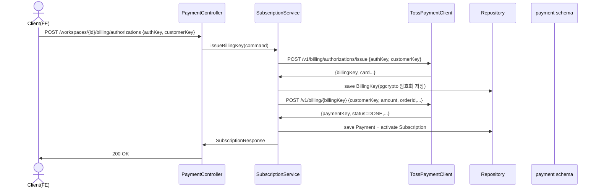
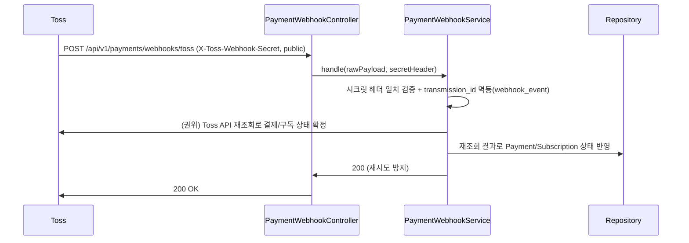
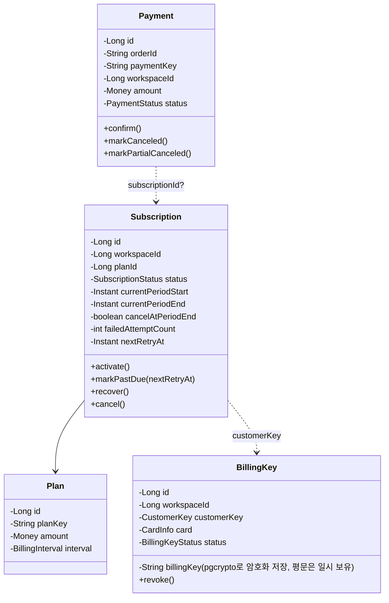

# [BE] 488 — 토스페이먼츠 v2 자동결제 기반 워크스페이스 구독 (백엔드)

> 출처: GitHub Issue #488 (`feat(payment)`, enhancement). FE companion: #487.
> 본 스펙은 `recon-report-488.md` (Version 1) 확정 fact + Code-Grounded Verification 결과를 기준으로 작성한다.
> **U-001~U-004는 2026-06-02 사용자 결정으로 확정됨**(본문 반영 완료). 나머지 가정/잔여 항목은 `uncertainty-register-488.md` 참조.

---

## Goal

워크스페이스 단위 SaaS 구독 결제를 토스페이먼츠 v2(결제위젯 + 빌링키 정기결제)로 처리하는 백엔드를 신규 Bounded Context `com.init.payment`로 구현한다. 빌링키 발급·구독 활성화·일회성 confirm·정기결제·취소/환불·웹훅 수신을 포함하며, 결제·구독은 `app.workspace`에 귀속된다.

---

## Scope

`recon-report-488.md` "Evidence-Based Scope / Done Criteria" 인용 (Issue 인수 조건):

- [ ] billingKey 발급·저장(민감정보 보호) + 구독 활성화
- [ ] confirm 금액검증 + 멱등 + 결제기록
- [ ] 정기결제 실행(스케줄) + 중복청구 방지 + PAST_DUE 전이
- [ ] 웹훅 서명검증 / 멱등 / 상태반영, 취소 / 부분환불
- [ ] secretKey/billingKey 비노출, DDD 계층 / 예외 규칙 준수

단계 제안(Issue): (1) plan/subscription 도메인 + billingKey 발급 + 첫 결제 → (2) 정기결제 스케줄러 + 웹훅 → (3) 취소/환불.

**Out of scope**: FE 결제위젯 / 구독 화면(#487). Toss 콘솔/계약 설정. 세금계산서·정산.

---

## 확정된 결정 (Resolved 2026-06-02)

사용자 묶음 질문(Q-001~Q-004) 답변으로 확정. 상세 근거/대안은 `uncertainty-register-488.md`.

| ID | 결정 | 본문 반영 |
|----|------|-----------|
| U-001 스케줄링 | **Spring `@Scheduled` 인앱 스케줄러** | 스케줄링 설계, Class Design(application) |
| U-002 billingKey 보호 | **PostgreSQL `pgcrypto` 컬럼 암호화** | Class Design(BillingKey), Database(billing_key) |
| U-003 웹훅 검증 | **공유 시크릿 헤더(`X-Toss-Webhook-Secret`) + Toss API 재조회로 권위 상태 확정** | Sequence(2), 보안 설정 변경 |
| U-004 정기결제 실패 | **즉시 `PAST_DUE` → 일 1회 재시도 × 최대 3일 → 이후 `CANCELED`** | 상태 머신, 스케줄링 설계 |

잔여 가정(Assumption)/Deferred: U-005(취소 시맨틱=기간말), U-006(customerKey=워크스페이스 UUID), U-007(DTO=BE 계약), U-008(예외 매핑), U-009/U-010(상태 매핑/머신), U-011(중복청구 키), U-012(마스킹), U-013(billing_key.status), U-014(fixture 경로), U-015(멤버십 인가 메커니즘 — recon 재호출 권고), U-016(#487 정합). 상세는 register.

---

## Sequence Diagram

### (1) 빌링키 발급 + 구독 활성화 + 첫 결제



### (2) 웹훅 수신 (U-003 확정: 공유 시크릿 헤더 + 재조회)



---

## REST API

`recon-report-488.md` "FE-Expected API Contract" 인용. Request/Response DTO 형식은 Issue body 미정의 → 본 스펙이 BE 계약으로 정의(가정, U-007). 인증/인가: 결제·구독 관리 endpoint = JWT(`AuthenticationUtils.getUserId`) + 워크스페이스 멤버십(OWNER/operator, `app.workspace_member` 기반 — 메커니즘 U-015) / 웹훅 = `permitAll` + 시크릿 헤더 검증(U-003).

### Endpoint

| Method | Path | 설명 | 인가 |
|--------|------|------|------|
| POST | `/api/v1/workspaces/{workspaceId}/billing/authorizations` | authKey→billingKey 발급 | JWT + 멤버십 |
| POST | `/api/v1/workspaces/{workspaceId}/payments/confirm` | 일회성 결제 confirm | JWT + 멤버십 |
| GET | `/api/v1/workspaces/{workspaceId}/subscription` | 구독 조회 | JWT + 멤버십 |
| POST | `/api/v1/workspaces/{workspaceId}/subscription` | 구독 생성 | JWT + 멤버십 |
| DELETE | `/api/v1/workspaces/{workspaceId}/subscription` | 구독 취소(기간말, 가정 U-005) | JWT + 멤버십 |
| GET | `/api/v1/workspaces/{workspaceId}/payments` | 결제 내역 | JWT + 멤버십 |
| POST | `/api/v1/workspaces/{workspaceId}/payments/{paymentKey}/cancel` | 취소/부분환불 | JWT + 멤버십 |
| POST | `/api/v1/payments/webhooks/toss` | 웹훅 수신(public, 시크릿 헤더) | permitAll |

### Request / Response (대표 예시 — 가정 U-007)

**POST `/billing/authorizations`**

```json
// Request
{ "authKey": "auth_xxx", "customerKey": "wsk_1_uuid" }
```
```json
// 200 OK — BillingKey 발급 + 구독 활성화 결과
{
  "subscription": { "id": 10, "workspaceId": 1, "planKey": "pro_monthly", "status": "ACTIVE",
                    "currentPeriodStart": "2026-06-02T00:00:00Z", "currentPeriodEnd": "2026-07-02T00:00:00Z",
                    "cancelAtPeriodEnd": false },
  "billingKey": { "id": 5, "cardCompany": "신한", "cardNumberMasked": "1234-****-****-5678", "status": "ACTIVE" }
}
```
> 응답에 `billingKey` 원문/secretKey 절대 미포함(U-012, 인수조건 "비노출"). 카드정보는 마스킹 값만.

**POST `/payments/confirm`**

```json
// Request
{ "paymentKey": "pay_xxx", "orderId": "ord_xxx", "amount": 29000 }
```
> 서버는 `orderId`로 보관 중인 기대 금액과 `amount` 일치를 검증(불일치 거절). 멱등: 동일 `orderId` 재요청은 기존 결제 반환.

**오류 응답** (기존 `GlobalExceptionHandler` 포맷 준수, `BusinessException.code` 기반)

```json
// 400 — 금액 불일치 / 잘못된 요청
{ "code": "PAYMENT_AMOUNT_MISMATCH", "message": "결제 금액이 일치하지 않습니다." }
// 404 — 구독/워크스페이스 없음
{ "code": "SUBSCRIPTION_NOT_FOUND", "message": "..." }
// 403 — 멤버십 없음
{ "code": "FORBIDDEN", "message": "..." }
// 502 — Toss 게이트웨이 오류(5xx/timeout) — 매핑 U-008
{ "code": "PAYMENT_GATEWAY_ERROR", "message": "..." }
```
> 실제 오류 바디 스키마는 기존 `GlobalExceptionHandler` 출력 형식을 따른다(본 예시는 의도 표현용).

---

## Class Design

### Bounded Context 구조

신규 `com.init.payment` — 기존 BC(`auth`, `workspace`, `domainpack`, `pipelinejob`, `review`, `workflowruntime`, `chatdemo`, `corpus`, `shared`)와 동일하게 4계층 + 각 계층 `package-info.java`.

```
com.init.payment
├── presentation/      PaymentController, SubscriptionController, PaymentWebhookController, DTO
├── application/       SubscriptionService, PaymentService, PaymentWebhookService,
│                      RecurringBillingScheduler (@Scheduled), exception
├── domain/            Subscription, Payment, BillingKey, Plan (+ VO, 상태 enum, 도메인 메서드)
└── infrastructure/    JPA Repository, BillingKeyCryptoRepository(pgcrypto),
                       TossPaymentClient, TossApiProperties, config
```

계층 의존성: `presentation → application → domain ← infrastructure` (CLAUDE.md DDD 규칙).

### Aggregate 경계 (Issue: "Subscription / Payment 분리, BillingKey 보호")



**도메인 규칙(Issue 인용, CLAUDE.md 준수)**:

- public setter 금지. 상태전이는 도메인 메서드(`confirm()`, `activate()`, `markPastDue()`, `recover()`, `cancel()`)로만.
- 금액은 VO(`Money`)로 캡슐화, 음수/통화 검증.
- `BillingKey`는 별도 aggregate로 보호. **저장은 pgcrypto 컬럼 암호화(U-002 확정)** — 아래 "billingKey 저장 보호" 참조.

### billingKey 저장 보호 (U-002 확정: pgcrypto)

- `payment.billing_key.billing_key_encrypted bytea` 컬럼에 `pgp_sym_encrypt(plaintext, :encKey)` 결과 저장. 조회 시 `pgp_sym_decrypt(billing_key_encrypted, :encKey)`.
- `:encKey`는 `TOSS_BILLING_KEY_ENCRYPTION_KEY` env로만 주입(앱 config → 네이티브 쿼리 파라미터 바인딩). DB·로그·응답 어디에도 평문 미노출.
- pgcrypto는 query-time 키를 요구하므로 **JPA `@Convert`가 아닌 infrastructure 계층 네이티브 쿼리**(`BillingKeyCryptoRepository`)로 encrypt/decrypt 수행. 도메인 `BillingKey`는 복호화된 평문을 메모리에서만 일시 보유(정기결제 호출 직전).
- `create extension if not exists pgcrypto;` 선행(Liquibase changeset).

### 스케줄링 설계 (U-001 확정: Spring @Scheduled)

- `RecurringBillingScheduler`(application 계층) `@Scheduled`로 만기 도래 구독을 주기 스캔 → `payment.subscription`에서 `current_period_end <= now AND status=ACTIVE`(또는 `PAST_DUE AND next_retry_at <= now`) 대상 조회 → `PaymentService.executeRecurring(subscription)`.
- **단일 실행 보장**: 다중 인스턴스 배포 시 중복 실행 방지를 위해 분산 락 또는 단일 인스턴스 전제(배포 형상에 따름). DB 레벨 중복청구 방지(U-011)가 최종 안전망.
- 실패 처리(U-004): `markPastDue(nextRetryAt = now + 1d)`, 일 1회 재시도 × 최대 3회(3일), 4회차 실패 시 `cancel()`. 성공 시 `recover()` + 기간 갱신.

### 상태 머신 (U-004 확정 반영 / 가정 U-009·U-010)

- `SubscriptionStatus`: `INCOMPLETE → ACTIVE`(첫 결제 성공) / `ACTIVE → PAST_DUE`(정기결제 실패, `failedAttemptCount++`, `nextRetryAt=+1d`) / `PAST_DUE → ACTIVE`(재시도 성공, 카운트 리셋) / `PAST_DUE → CANCELED`(재시도 3일 소진) / `* → CANCELED`(사용자 취소; 기간말, U-005).
- `PaymentStatus`: Toss 응답 status 1:1 — `READY/IN_PROGRESS/DONE/CANCELED/PARTIAL_CANCELED/ABORTED/EXPIRED`.
- `BillingKeyStatus`: `ACTIVE/DELETED`(가정 U-013).

### 외부 연동 — TossPaymentClient (recon 확정: AirflowHttpSupport 미러)

`AirflowHttpSupport`(`backend/.../pipelinejob/infrastructure/airflow/AirflowHttpSupport.java:107-113`) + `AirflowApiProperties`(`backend/.../shared/infrastructure/airflow/AirflowApiProperties.java:6-15`) 패턴을 미러링:

- `RestClient` + `SimpleClientHttpRequestFactory`, connectTimeout 기본 `3s`, readTimeout 기본 `10s`.
- 인증: HTTP Basic `base64(secretKey + ":")` — `headers.setBasicAuth(secretKey, "")`.
- 모든 승인/실행/취소 호출에 `Idempotency-Key`(UUID) 헤더(Issue 확정, 멱등 invariant).
- 예외: `RestClientException | HttpMessageConversionException` catch → payment BC 커스텀 예외 throw(`AirflowHttpSupport.java:80-83` 패턴, 매핑 U-008).
- `TossApiProperties` = `@ConfigurationProperties(prefix = "toss")` record — `AirflowApiProperties`(nested sub-record) 패턴 미러. 구조: `record TossApiProperties(Api api, Webhook webhook, String billingKeyEncryptionKey)` + `record Api(String baseUrl, String secretKey, Duration connectTimeout, Duration readTimeout)` + `record Webhook(String secret)`. → YAML `toss.api.*` / `toss.webhook.secret` / `toss.billing-key-encryption-key`와 바인딩 정합(flat record는 `toss.api.*`를 바인딩하지 못하므로 nested 필수).
- **secretKey/billingKey 로그·응답 노출 금지**(Issue 확정).
- 웹훅 재조회(U-003): `PaymentWebhookService`가 동일 client로 결제/구독 권위 상태를 Toss에서 재조회.

Toss v2 호출(recon 확정):
- confirm: `POST /v1/payments/confirm` `{paymentKey, orderId, amount}`
- 빌링키 발급: `POST /v1/billing/authorizations/issue` `{authKey, customerKey}` → `billingKey`
- 정기결제: `POST /v1/billing/{billingKey}` `{customerKey, amount, orderId, orderName,...}`
- 취소: `POST /v1/payments/{paymentKey}/cancel` `{cancelReason, cancelAmount?}`

### 예외 계층 (recon 확정: BusinessException 미러)

`com.init.payment.application.exception` 하위에 `BusinessException`(`backend/.../shared/application/exception/BusinessException.java`) 상속 예외 신설 + `GlobalExceptionHandler`(`backend/.../shared/presentation/GlobalExceptionHandler.java`)에 핸들러 등록. 후보: `PaymentAmountMismatchException`(400), `SubscriptionNotFoundException`(404), `PaymentGatewayException`(502, Toss 5xx/timeout). 구체 매핑 규칙 U-008.

### 보안 설정 변경 (recon 확정 + U-003)

- `SecurityConfig`(`backend/.../shared/infrastructure/security/SecurityConfig.java:44-80`)에 `requestMatchers(HttpMethod.POST, "/api/v1/payments/webhooks/toss").permitAll()` 추가(기존 pipeline callback permitAll 패턴 미러, line 56-58).
- `WebhookHeaderNames`(`backend/.../shared/infrastructure/web/WebhookHeaderNames.java:5`)에 `TOSS_WEBHOOK_SECRET = "X-Toss-Webhook-Secret"` 상수 추가. CORS `allowedHeaders`(line 91-93)는 웹훅이 서버-서버(브라우저 아님)이므로 등록 불요 — 단 일관성 위해 추가 가능(구현 판단).
- 웹훅 검증(U-003): `PaymentWebhookService`가 `X-Toss-Webhook-Secret` 헤더를 `toss.webhook.secret`과 상수시간 비교 → 불일치 시 거절. 본문은 신뢰하지 않고 `transmission_id` 멱등 후 Toss 재조회로 권위 상태 확정.

---

## Tests

`recon-report-488.md` "테스트 고려사항" 인용: test 프로필(H2)에서 토스 클라이언트 **mock/stub**.

> H2는 pgcrypto 미지원 → billingKey 암호화 저장 경로는 (a) test 프로필에서 crypto 추상화를 no-op/AES fake로 주입하거나 (b) 해당 통합 테스트를 Postgres testcontainer로 분리. codeBuilder가 기존 test 인프라에 맞춰 확정(U-002 후속).

### Unit
- 도메인 상태전이: `Subscription.activate()/markPastDue()/recover()/cancel()`, `Payment.confirm()`.
- 금액검증 거절: confirm 시 기대금액≠요청금액 → 거절.
- 멱등 가드: 동일 `orderId`/`transmission_id` 재처리 무중복.
- billingKey 보호: 응답/로그/`raw_response`에 민감정보 미노출(U-012).
- 정기결제 재시도(U-004): 실패 → PAST_DUE → 3일 재시도 소진 → CANCELED 전이.

### Integration (`@WebMvcTest` + `@WithLongPrincipal`)
- 기존 `backend/src/test/.../fixtures` `@WithLongPrincipal` 패턴 사용(정확 경로 U-014, codeBuilder 확인).
- TossPaymentClient는 mock. 7개 FE-facing endpoint happy/error + 웹훅 시크릿 헤더 검증/멱등.

### Test Checklist (template)
- [ ] 정상 / 멱등(동일 입력 반복) / 유효성(금액·필수필드) / 권한(멤버십·웹훅 시크릿) / 경계값(부분환불 금액) / 동시성(정기결제 중복) / 트랜잭션 롤백.

---

## Database

신규 `payment` 스키마 + 6개 테이블 + `pgcrypto` extension. Liquibase `backend/src/main/resources/db/changelog/db.changelog-master.sql`에 formatted-sql changeset append. 형식: `--changeset init:20260602-create-payment-schema` + `--comment:`. FK는 `app.workspace(id)` 참조(기존 패턴). 기존 `pipeline.webhook_receipt` 멱등 패턴과 `payment.webhook_event` 정합.

> 컬럼 초안은 `recon-report-488.md` "도메인 모델 초안" 인용. `billing_key` 암호화 컬럼은 U-002 확정(pgcrypto). 중복청구 유니크 키 컬럼은 U-011(가정).

```sql
--changeset init:20260602-enable-pgcrypto
--comment: Enable pgcrypto for billing key encryption
create extension if not exists pgcrypto;

--changeset init:20260602-create-payment-schema
--comment: Create payment schema for workspace subscription billing
create schema if not exists payment;

create table payment.plan (
    id          bigserial primary key,
    plan_key    varchar(100) not null unique,
    name        varchar(255) not null,
    amount      bigint not null,
    currency    varchar(10) not null default 'KRW',
    interval    varchar(20) not null,          -- MONTH | YEAR
    status      varchar(50) not null default 'ACTIVE',
    created_at  timestamptz not null default now(),
    updated_at  timestamptz not null default now()
);

create table payment.subscription (
    id                    bigserial primary key,
    workspace_id          bigint not null references app.workspace(id),
    plan_id               bigint not null references payment.plan(id),
    status                varchar(50) not null,  -- INCOMPLETE|ACTIVE|PAST_DUE|CANCELED
    current_period_start  timestamptz,
    current_period_end    timestamptz,
    customer_key          varchar(255),
    cancel_at_period_end  boolean not null default false,
    failed_attempt_count  int not null default 0,   -- U-004 재시도 카운트
    next_retry_at         timestamptz,              -- U-004 다음 재시도 시각
    created_at            timestamptz not null default now(),
    updated_at            timestamptz not null default now()
);
-- 활성 구독 워크스페이스당 1개 (가정 U-010): partial unique 등 제약은 구현에서 확정

create table payment.billing_key (
    id                    bigserial primary key,
    workspace_id          bigint not null references app.workspace(id),
    customer_key          varchar(255) not null,
    billing_key_encrypted bytea not null,           -- U-002: pgp_sym_encrypt(billingKey, :encKey)
    card_company          varchar(100),
    card_number_masked    varchar(50),
    status                varchar(50) not null default 'ACTIVE',  -- ACTIVE|DELETED (U-013)
    created_at            timestamptz not null default now(),
    updated_at            timestamptz not null default now()
);

create table payment.payment (
    id              bigserial primary key,
    order_id        varchar(255) not null unique,
    payment_key     varchar(255),
    workspace_id    bigint not null references app.workspace(id),
    subscription_id bigint references payment.subscription(id),
    amount          bigint not null,
    status          varchar(50) not null,  -- Toss status 1:1 (U-009)
    method          varchar(50),
    approved_at     timestamptz,
    receipt_url     text,
    raw_response    jsonb,                 -- 마스킹 후 저장 (U-012)
    idempotency_key varchar(255),
    created_at      timestamptz not null default now()
);
-- 중복청구 방지(인수조건 확정): 정기결제 동주기 유니크 키. 구체 컬럼 U-011.

create table payment.payment_cancel (
    id              bigserial primary key,
    payment_id      bigint not null references payment.payment(id),
    cancel_amount   bigint not null,
    reason          text,
    transaction_key varchar(255),
    canceled_at     timestamptz not null default now()
);

create table payment.webhook_event (
    id              bigserial primary key,
    transmission_id varchar(255) not null unique,  -- 멱등
    event_type      varchar(100),
    payload         jsonb,                          -- 마스킹 후 저장 (U-012)
    processed_at    timestamptz
);
```

> `payment.payment` 중복청구 유니크 제약(예: `(subscription_id, billing_period_key)`)은 U-011 확정 후 추가.

---

## 설정 / 환경변수 (recon 확정 패턴)

`application.yml`에 `toss.*` 블록 추가(기존 `${ENV_VAR:default}` 패턴, `airflow.*` 미러 — `application.yml:73-87`):

```yaml
toss:
  api:
    base-url: ${TOSS_API_BASE_URL:https://api.tosspayments.com}
    secret-key: ${TOSS_SECRET_KEY}
    connect-timeout: ${TOSS_API_CONNECT_TIMEOUT:3s}
    read-timeout: ${TOSS_API_READ_TIMEOUT:10s}
  webhook:
    secret: ${TOSS_WEBHOOK_SECRET}                       # U-003 시크릿 헤더 비교 값
  billing-key-encryption-key: ${TOSS_BILLING_KEY_ENCRYPTION_KEY}   # U-002 pgcrypto 대칭키
```

`.env.example`에 추가(알파벳 순, secret은 placeholder): `TOSS_API_BASE_URL`, `TOSS_BILLING_KEY_ENCRYPTION_KEY=<your-toss-billing-key-encryption-key>`, `TOSS_SECRET_KEY=<your-toss-secret-key>`, `TOSS_WEBHOOK_SECRET=change-me-toss-webhook-secret`. **secretKey·암호화키는 env로만 주입**(Issue 확정).

---

## Additional Notes

- DDD 원칙 준수: 도메인 로직은 domain layer, application은 유스케이스 오케스트레이션(+스케줄러), infrastructure는 JPA·pgcrypto·Toss 연동, presentation은 DTO·HTTP만.
- `.agent/docs/schema.md`의 기존 6개 스키마(app/corpus/pack/review/pipeline/runtime)에 `payment` 추가. 멤버십은 `app.workspace_member` 기준(인가 메커니즘 U-015 — recon 재호출 권고).
- 코드 예시는 의도 표현용(스펙은 완벽 실행 코드를 목표로 하지 않음, CLAUDE.md). 인용 경로는 CGV로 실존 확인됨.
