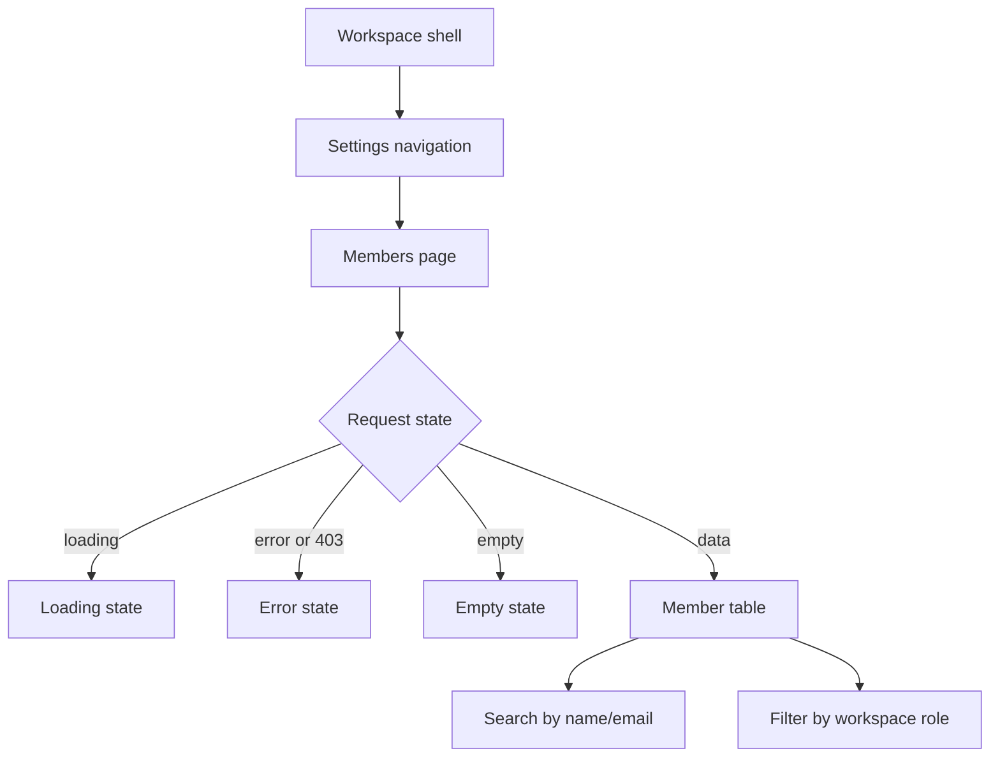

# Workspace Member Management

## Goal

워크스페이스 `OWNER` 또는 `ADMIN`이 현재 워크스페이스에 속한 멤버를 설정 화면에서 조회하고, 이름/이메일 검색과 workspace role 필터로 운영자를 찾을 수 있게 한다.

## Issue Context

- GitHub Issue: #495 `feat(workspace): 워크스페이스 멤버 목록 관리`
- 작업 성격: backend + frontend mixed enhancement
- 최종 작업 브랜치: `feature/495-workspace-members`
- 스펙 파일: `.agent/specs/495.md`

## Scope

- `app.workspace_member`와 `app.app_user`를 조인하는 workspace 멤버 목록 조회 API를 제공한다.
- API 접근은 workspace 멤버 role 기준 `OWNER`, `ADMIN`만 허용한다.
- workspace 설정 하위에 멤버 목록 화면을 제공한다.
- 화면에서 이름/이메일 검색과 workspace role 필터를 제공한다.
- 목록은 이름, 이메일, workspace role, 가입일, 계정 상태를 표로 표시한다.
- loading, error, empty 상태를 제공한다.

## Non-Goals

- 멤버 초대
- 멤버 역할 변경
- 멤버 제거
- 멤버별 상세 활동 이력
- 전역 사용자 role 기반 권한 판단

## Backend Design

### Endpoint

| Method | Path | Description |
| --- | --- | --- |
| GET | `/api/v1/workspaces/{workspaceId}/members` | workspace 멤버 목록 조회 |

### Query Parameters

| Name | Required | Description |
| --- | --- | --- |
| `q` | no | 이름 또는 이메일 부분 검색어 |
| `role` | no | workspace role 필터. 허용값: `OWNER`, `ADMIN`, `REVIEWER`, `OPERATOR` |

### Response

```json
[
  {
    "memberId": 10,
    "userId": 7,
    "name": "Admin",
    "email": "admin@ostone.com",
    "workspaceRole": "OWNER",
    "joinedAt": "2026-04-14T00:00:00Z",
    "accountStatus": "ACTIVE"
  }
]
```

### Authorization

- 인증된 사용자의 ID는 기존 `Authentication` principal에서 추출한다.
- `workspace_member.member_role`이 `OWNER` 또는 `ADMIN`인 경우만 목록 조회를 허용한다.
- `REVIEWER`, `OPERATOR`, 비멤버는 `WORKSPACE_ACCESS_DENIED`로 거부한다.
- 전역 `app_user.role` 값은 이 기능의 권한 판단에 사용하지 않는다.

### Affected Backend Paths

- `backend/src/main/java/com/init/workspace/presentation/WorkspaceController.java`
- `backend/src/main/java/com/init/workspace/presentation/dto/`
- `backend/src/main/java/com/init/workspace/application/`
- `backend/src/main/java/com/init/workspace/domain/model/WorkspaceMemberRole.java`
- `backend/src/main/java/com/init/workspace/domain/repository/WorkspaceMemberRepository.java`
- `backend/src/main/java/com/init/workspace/infrastructure/persistence/`
- `backend/src/test/java/com/init/workspace/presentation/WorkspaceControllerTest.java`
- `backend/src/test/java/com/init/workspace/application/`

### Backend Acceptance Criteria

- `OWNER`가 `GET /api/v1/workspaces/{workspaceId}/members`를 호출하면 멤버 목록을 받는다.
- `ADMIN`이 같은 API를 호출해도 멤버 목록을 받는다.
- `REVIEWER`, `OPERATOR`, 비멤버는 403으로 거부된다.
- `q`는 이름 또는 이메일에 대해 대소문자 구분 없이 부분 검색한다.
- `role`은 workspace member role로 필터링한다.
- 응답에는 비밀번호 해시, reset token, profile JSON 같은 민감 필드가 포함되지 않는다.

## Frontend Design

### User Flow



### Route

| Path | Description |
| --- | --- |
| `/workspaces/:workspaceId/settings/members` | workspace 멤버 관리 화면 |

### Affected Frontend Paths

- `frontend/src/app/App.tsx`
- `frontend/src/pages/workspace/ui/WorkspaceLayout.tsx`
- `frontend/src/pages/workspace/ui/`
- `frontend/src/entities/workspace/model/types.ts`
- `frontend/src/shared/api/generated/`
- `frontend/src/shared/api/queryKeys.ts`
- `frontend/src/shared/ui/ostone/chrome/Sidebar.tsx`

### UI Requirements

- 표 컬럼: 이름, 이메일, workspace role, 가입일, 계정 상태
- 검색 입력은 이름/이메일 검색 요청을 갱신한다.
- role 필터는 `전체`, `OWNER`, `ADMIN`, `REVIEWER`, `OPERATOR`를 제공한다.
- loading/error/empty 상태는 기존 `LoadingSpinner`, `ErrorState`, `EmptyState` 패턴을 따른다.
- 접근 거부 API 응답은 화면 error 상태로 표시한다.

### API Integration

- Backend OpenAPI를 갱신한 뒤 `frontend/src/shared/api/generated/`를 재생성한다.
- 화면은 generated endpoint function/hook을 기본값으로 사용한다.
- query key에는 `workspaceId`, 검색어, role 필터가 포함되어 필터 변경 시 캐시가 분리된다.

## Validation Expectations

- Backend unit/controller tests:
  - OWNER/ADMIN 성공
  - role/search query 전달
  - OPERATOR 또는 비권한자 403
  - invalid role 400
- Frontend tests:
  - route 렌더링
  - loading/error/empty/data 상태
  - 검색 및 role 필터 입력 시 API query 갱신
  - 비권한 응답 error 상태
- Local verification:
  - `cd backend && ./gradlew test`
  - `cd frontend && pnpm test`
  - 필요한 경우 `cd backend && ./gradlew generateOpenApiDocs` 후 `cd frontend && pnpm api:gen`

## Open Questions

- 목록 페이지네이션은 이슈 범위에 명시되지 않았다. 이번 변경은 필터링된 멤버 목록 반환에 집중하고, 대규모 멤버 워크스페이스의 페이지네이션은 후속 요구사항으로 다룬다.
