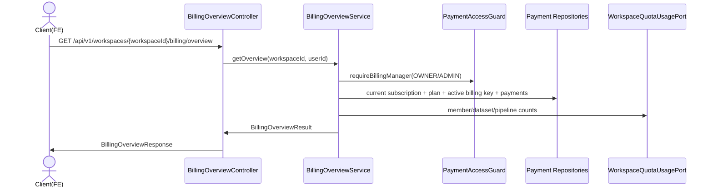

# [BE/FE] 497 — 워크스페이스 빌링과 quota 현황 조회

> 출처: GitHub Issue #497 (`feat(payment)`, enhancement). 참조: #487, #488, PR #490.
> 본 스펙은 기존 `com.init.payment` 결제/구독 구현과 `frontend/src/pages/billing/` 화면을 확장하는 mixed 작업이다.

---

## Goal

워크스페이스 `OWNER` 또는 `ADMIN`이 구독 상태, 결제수단 요약, 최근 결제 내역, 현재 결제 기간의 quota 사용량을 한 화면에서 확인할 수 있게 한다.

---

## Scope

- `GET /api/v1/workspaces/{workspaceId}/billing/overview` 조회 API를 추가한다.
- 응답은 현재 구독, 마스킹된 결제수단, 최근 결제 내역, quota 사용량을 한 번에 조합한다.
- 구독의 `currentPeriodEnd`는 화면에서 다음 결제일로 표시한다.
- `payment.plan`의 `member_limit`, `dataset_upload_limit`, `pipeline_run_limit`와 현재 subscription period 기준 사용량을 함께 노출한다.
- 프론트엔드 `BillingPage`는 overview API를 generated endpoint로 호출하고 loading/error/empty 상태를 제공한다.
- 한도에 도달했거나 초과한 quota 항목은 화면에서 명확하게 경고한다.

## Non-Goals

- 결제수단 등록 UI 신규 구현.
- 구독 생성/취소 UI 신규 구현.
- quota 하드 차단 로직 변경.
- 멤버 추가/초대 기능.

기존 #487 화면에 이미 존재하는 구독 등록/취소/환불 affordance는 본 이슈의 신규 범위가 아니며, 이번 변경은 조회 데이터와 quota 표시를 중심으로 한다.

---

## Sequence Diagram



---

## REST API

| Method | Path | Description | Auth |
|--------|------|-------------|------|
| GET | `/api/v1/workspaces/{workspaceId}/billing/overview` | 빌링/usage 조회 화면용 aggregate read model | JWT + workspace `OWNER`/`ADMIN` |

### Response

```json
{
  "subscription": {
    "id": 10,
    "workspaceId": 1,
    "planKey": "pro_monthly",
    "status": "ACTIVE",
    "currentPeriodStart": "2026-06-01T00:00:00Z",
    "currentPeriodEnd": "2026-07-01T00:00:00Z",
    "cancelAtPeriodEnd": false,
    "customerKey": "ws_1",
    "memberLimit": 10,
    "datasetUploadLimit": 10,
    "pipelineRunLimit": 10
  },
  "billingKey": {
    "id": 5,
    "cardCompany": "신한",
    "cardNumberMasked": "1234-****-****-5678",
    "status": "ACTIVE"
  },
  "payments": [
    {
      "id": 7,
      "orderId": "ord_1",
      "paymentKey": "pay_1",
      "amount": 29000,
      "currency": "KRW",
      "status": "DONE",
      "method": "카드",
      "approvedAt": "2026-06-01T00:00:00Z",
      "receiptUrl": "https://receipt.example",
      "createdAt": "2026-06-01T00:00:00Z"
    }
  ],
  "quotaUsages": [
    { "resource": "MEMBER", "used": 8, "limit": 10, "warning": false },
    { "resource": "DATASET_UPLOAD", "used": 10, "limit": 10, "warning": true },
    { "resource": "PIPELINE_RUN", "used": 11, "limit": 10, "warning": true }
  ]
}
```

구독이 없으면 `subscription`, `billingKey`는 `null`, `payments`와 `quotaUsages`는 빈 배열을 반환해 프론트엔드가 empty 상태를 표시한다.

### Security

- `secretKey`, 평문 `billingKey`, 원본 카드번호는 응답에 포함하지 않는다.
- 결제수단은 기존 `BillingKeySummary`와 동일하게 `cardCompany`, `cardNumberMasked`, `status`만 노출한다.
- overview 조회는 기존 결제 관리용 `OPERATOR` 포함 guard보다 좁은 `OWNER`/`ADMIN` 전용 guard를 사용한다.

---

## Affected Files

검증된 경로:

- `backend/src/main/java/com/init/payment/application/PaymentAccessGuard.java`
- `backend/src/main/java/com/init/payment/application/WorkspaceQuotaUsagePort.java`
- `backend/src/main/java/com/init/payment/infrastructure/JdbcWorkspaceQuotaUsageRepository.java`
- `backend/src/main/java/com/init/payment/presentation/SubscriptionController.java`
- `backend/src/main/java/com/init/payment/presentation/PaymentController.java`
- `frontend/src/pages/billing/ui/BillingPage.tsx`
- `frontend/src/entities/billing/`
- `frontend/src/shared/api/generated/`

---

## Frontend Design

`frontend/DESIGN.md` 기준을 따른다.

- 화면 chrome은 흑백 토큰을 유지한다.
- quota 경고는 색상 의존 대신 굵은 border, badge, 텍스트로 식별한다.
- loading/error/empty 상태를 각각 제공한다.
- Backend HTTP API 호출은 Orval generated endpoint를 사용한다.

---

## Tests

### Backend

- `BillingOverviewServiceTest`
  - 구독/결제수단/결제 내역/quota 사용량 조합.
  - 구독이 없을 때 빈 overview 반환.
  - dataset/pipeline/member 사용량이 한도에 도달하면 warning 표시.
- `BillingOverviewControllerTest`
  - `GET /billing/overview` 200 응답 shape 확인.
  - 인증 principal이 없으면 401.

### Frontend

- `BillingPage.test.tsx`
  - overview loading/error/empty 상태.
  - quota 사용량과 한도 경고 표시.
  - 결제 내역과 영수증 링크 렌더링.

### Validation

- `cd backend && ./gradlew test --tests "*BillingOverview*" --tests "*PaymentAccessGuardTest"`
- `cd backend && ./gradlew generateOpenApiDocs`
- `cd frontend && pnpm api:gen`
- `cd frontend && pnpm test -- BillingPage`

---

## Acceptance Criteria Mapping

- `OWNER` 또는 `ADMIN`이 구독 상태, 결제 주기, 다음 결제일, 카드 마스킹 정보, 결제 내역, 영수증 링크를 볼 수 있다.
- 현재 결제 기간의 멤버 수, dataset 업로드 수, pipeline 실행 수가 plan 한도와 함께 표시된다.
- 한도에 도달했거나 초과한 quota 항목은 경고 상태로 표시된다.
- `secretKey`, 평문 `billingKey`, 원본 카드번호는 API 응답과 화면에 노출되지 않는다.
- loading/error/empty 상태가 제공된다.
