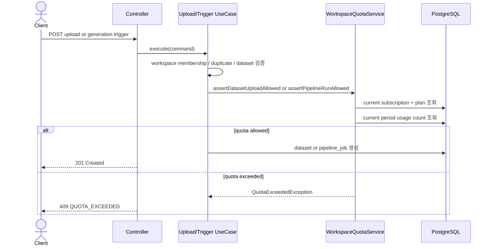

# [BE] 498 — 워크스페이스 quota 하드 차단

> 출처: GitHub Issue #498 (`feat(payment)`, enhancement). 댓글 없음.

---

## Goal

워크스페이스의 현재 결제 기간 사용량을 plan quota와 비교해 dataset 업로드와 Domain Pack Generation trigger를 하드 차단하고, 초과 응답에 사용량 계약을 포함한다.

---

## Scope

- 현재 결제 기간 기준 dataset 업로드 수 계산
- 현재 결제 기간 기준 Domain Pack Generation pipeline 실행 수 계산
- `POST /api/v1/workspaces/{workspaceId}/datasets`, `/datasets/raw`, `/datasets/raw-file` quota 차단
- `POST /api/v1/workspaces/{workspaceId}/datasets/{datasetId}/pipeline-jobs/domain-pack-generation` quota 차단
- `409 QUOTA_EXCEEDED` 응답에 `resource`, `limit`, `used` 포함
- `payment.plan`에 `memberLimit`, `datasetUploadLimit`, `pipelineRunLimit` 보관
- 무료 온보딩 첫 생성 권리가 남아 있으면 quota 차단보다 우선 허용

**Out of scope**

- quota 초과 알림 발송
- SUPER_ADMIN quota override
- 멤버 추가/초대 기능의 실제 차단
- 사용량 기반 과금
- Toss 결제 승인/정기결제/웹훅 처리

---

## Existing Context

현재 브랜치에는 `com.init.payment` 구현 패키지와 payment DB 테이블이 없다. 따라서 이 작업은 Toss 결제 전체 구현이 아니라 quota 판단에 필요한 최소 read model을 새 `payment` bounded context로 만든다.

확인된 기존 경로:

| Path | 역할 |
|------|------|
| `backend/src/main/java/com/init/corpus/application/DatasetUploadService.java` | 구조화 dataset 업로드 |
| `backend/src/main/java/com/init/corpus/application/RawDatasetUploadService.java` | raw 상담 로그 dataset 업로드 |
| `backend/src/main/java/com/init/corpus/application/RawFileUploadService.java` | raw-file 업로드 + dataset 생성 + ingestion trigger |
| `backend/src/main/java/com/init/pipelinejob/application/TriggerDomainPackGenerationUseCase.java` | Domain Pack Generation trigger |
| `backend/src/main/java/com/init/shared/presentation/GlobalExceptionHandler.java` | 공통 BusinessException HTTP 응답 매핑 |
| `backend/src/main/resources/db/changelog/db.changelog-master.sql` | Liquibase formatted SQL changelog |

---

## Sequence Diagram



---

## REST API

기존 endpoint path는 변경하지 않는다. quota 차단은 기존 성공/검증/권한 플로우 사이에 추가된다.

| Method | Path | Quota resource |
|--------|------|----------------|
| POST | `/api/v1/workspaces/{workspaceId}/datasets` | `DATASET_UPLOAD` |
| POST | `/api/v1/workspaces/{workspaceId}/datasets/raw` | `DATASET_UPLOAD` |
| POST | `/api/v1/workspaces/{workspaceId}/datasets/raw-file` | `DATASET_UPLOAD` |
| POST | `/api/v1/workspaces/{workspaceId}/datasets/{datasetId}/pipeline-jobs/domain-pack-generation` | `PIPELINE_RUN` |

### Quota Exceeded Response

**409 Conflict**

```json
{
  "code": "QUOTA_EXCEEDED",
  "message": "워크스페이스 사용량 한도를 초과했습니다.",
  "resource": "DATASET_UPLOAD",
  "limit": 3,
  "used": 3
}
```

`PIPELINE_RUN` 초과도 동일 스키마를 사용한다.

---

## Class Design

### New payment bounded context

```
com.init.payment
├── application/
│   ├── WorkspaceQuotaService
│   ├── WorkspaceQuotaQueryPort
│   ├── WorkspaceQuotaUsagePort
│   ├── WorkspaceQuota
│   └── QuotaResource
├── infrastructure/
│   ├── JdbcWorkspaceQuotaRepository
│   └── JdbcWorkspaceQuotaUsageRepository
├── domain/package-info.java
└── presentation/package-info.java
```

- `WorkspaceQuotaService`: quota 판정 application service. `Clock`으로 현재 시각을 받아 current period subscription을 조회한다.
- `WorkspaceQuotaQueryPort`: `payment.subscription`, `payment.plan`, `payment.free_onboarding_entitlement` 조회.
- `WorkspaceQuotaUsagePort`: `corpus.dataset`, `pipeline.pipeline_job` count 조회.
- `QuotaExceededException`: shared exception으로 두 bounded context(corpus, pipelinejob)에서 동일 응답 계약을 사용한다.

### Decision Rules

1. 현재 시각이 `subscription.current_period_start <= now < current_period_end`이고 status가 `ACTIVE` 또는 `PAST_DUE`인 subscription을 현재 결제 기간으로 본다.
2. dataset upload count는 `corpus.dataset.created_at`이 current period에 포함되는 row 수다.
3. pipeline run count는 `pipeline.pipeline_job.job_type = 'DOMAIN_PACK_GENERATION'`이고 `requested_at`이 current period에 포함되는 row 수다.
4. `used < limit`이면 허용한다.
5. `used >= limit`이더라도 `payment.free_onboarding_entitlement.first_creation_allowance_remaining > 0`이고 해당 resource의 기존 사용량이 0이면 허용한다.
6. 현재 subscription이 없으면 무료 온보딩 첫 생성 권리만 허용하고, 권리가 없으면 `limit = 0`으로 차단한다.

---

## Database

`backend/src/main/resources/db/changelog/db.changelog-master.sql`에 `payment` schema와 quota read model을 추가한다.

| Table | 주요 컬럼 |
|-------|-----------|
| `payment.plan` | `plan_key`, `member_limit`, `dataset_upload_limit`, `pipeline_run_limit` |
| `payment.subscription` | `workspace_id`, `plan_id`, `status`, `current_period_start`, `current_period_end` |
| `payment.free_onboarding_entitlement` | `workspace_id`, `first_creation_allowance_remaining` |

`member_limit`은 이번 PR에서 조회 응답 endpoint를 새로 만들지는 않지만, 후속 멤버 초대/추가 차단 적용을 위해 plan에 포함한다.

---

## Tests

- `WorkspaceQuotaServiceTest`
  - current period 사용량이 한도 미만이면 허용
  - current period 사용량이 한도에 도달하면 `QuotaExceededException`
  - subscription이 없어도 무료 온보딩 첫 pipeline 실행은 허용
  - subscription과 무료 온보딩 권리가 없으면 `PIPELINE_RUN` 차단
- `DatasetUploadServiceTest`, `RawDatasetUploadServiceTest`
  - quota 초과 시 dataset 저장 전 예외
- `RawDatasetUploadControllerTest`, `DatasetControllerRawFileTest`
  - upload quota 초과 응답 body 검증
- `TriggerDomainPackGenerationUseCaseTest`
  - pipeline quota 초과 시 job 생성/Airflow trigger 없음
- `DomainPackGenerationTriggerControllerTest`
  - pipeline quota 초과 응답 body 검증

---

## Acceptance Criteria

- [ ] dataset 업로드 수가 plan의 `dataset_upload_limit`에 도달하면 추가 업로드 API가 `409 QUOTA_EXCEEDED`를 반환한다.
- [ ] raw-file 업로드도 같은 `DATASET_UPLOAD` quota로 차단된다.
- [ ] Domain Pack Generation pipeline 실행 수가 plan의 `pipeline_run_limit`에 도달하면 trigger API가 `409 QUOTA_EXCEEDED`를 반환한다.
- [ ] quota 초과 응답에는 `resource`, `limit`, `used`가 포함된다.
- [ ] plan read model은 `member_limit`, `dataset_upload_limit`, `pipeline_run_limit`을 포함한다.
- [ ] 무료 온보딩 첫 생성 권리가 남아 있고 해당 resource 사용량이 0이면 quota 차단보다 우선 허용한다.
- [ ] 구독이 없고 무료 온보딩 권리도 없으면 dataset 업로드와 generation trigger를 차단한다.

---

## Open Questions

- 무료 온보딩 권리 차감 시점은 이번 이슈 본문에 명시되지 않았다. 본 PR은 `remaining > 0`과 resource별 기존 사용량 0회를 함께 보아 "첫 생성 플로우"를 1회로 제한한다.
- 멤버 수 quota 조회를 노출할 구독/plan API는 현재 코드에 존재하지 않아 이번 PR에서는 DB read model까지만 포함한다.
