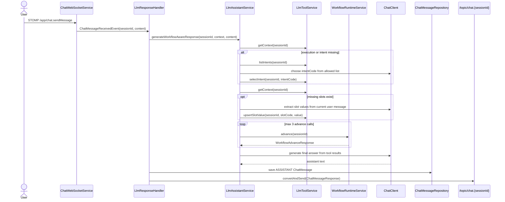
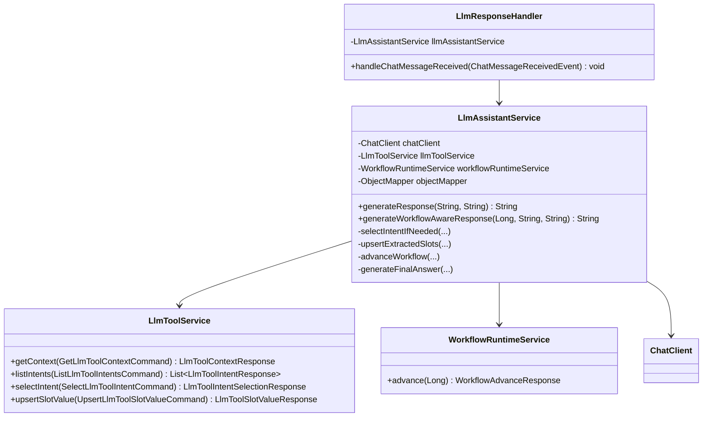

# 5.2.6 Workflow-Aware LLM Assistant

> **Backlog**: 챗봇 LLM assistant가 워크플로우 실행엔진 tool을 이용해 응답한다
> **Bounded Context**: `workflow-runtime`
> **Template**: `_TEMPLATE_BE.md`
> **Branch**: `feature/5.2.6-workflow-aware-llm-assistant`
> **Frontend Scope**: 없음. 이번 스펙은 backend LLM assistant 오케스트레이션만 다룬다.

---

## Goal

사용자 채팅에서 `ASSISTANT` 응답을 생성할 때 LLM이 workflow state, intent, slot, policy를 임의 판단하지 않고, backend의 기존 LLM tool application service와 workflow runtime engine 결과를 근거로 답변하게 한다.

기존 `LlmAssistantService.generateResponse(String conversationContext, String userMessage)`는 데모/기존 호출 호환을 위해 유지하고, 실제 사용자 채팅 WebSocket 응답 경로는 sessionId 기반 workflow-aware 응답 생성 경로로 전환한다.

---

## Non-Goals

- 신규 REST endpoint 추가
- DB migration 추가
- frontend 변경
- JS `integrations/llm-tools` adapter 확장
- Spring AI 자동 function-calling API 도입
- RAG, vector search, embedding 기반 policy 검색
- 상담사 이관 상태 변경 또는 상담사 배정 처리

---

## Existing Implementation Paths

아래 경로는 현재 저장소에서 확인된 구현 대상이다.

| Path | Layer | 역할 |
| --- | --- | --- |
| `backend/src/main/java/com/init/workflowruntime/application/LlmAssistantService.java` | application | Spring AI `ChatClient`로 assistant text 생성 |
| `backend/src/main/java/com/init/workflowruntime/application/LlmResponseHandler.java` | application event handler | 사용자 메시지 이벤트 수신 후 assistant 메시지 저장 및 STOMP push |
| `backend/src/main/java/com/init/workflowruntime/application/LlmToolService.java` | application | intent/slot/policy/workflow context tool 동작 제공 |
| `backend/src/main/java/com/init/workflowruntime/application/WorkflowRuntimeService.java` | application | 현재 execution state 기준 다음 workflow action/state 계산 |
| `backend/src/main/java/com/init/workflowruntime/domain/WorkflowExecution.java` | domain | intent/workflow/currentState/slot/policy/risk snapshot 저장 |
| `backend/src/main/java/com/init/workflowruntime/domain/ChatMessage.java` | domain | `ASSISTANT` 메시지 저장 |
| `backend/src/main/java/com/init/workflowruntime/config/AiConfig.java` | config | `ChatClient` bean 및 system prompt 구성 |
| `backend/src/main/resources/application.yml` | config | `app.ai.chat.system-prompt`, OpenAI chat option |

---

## Core Concept

### 역할 분리

| 주체 | 책임 |
| --- | --- |
| `LlmResponseHandler` | 사용자 메시지 이벤트를 받아 assistant 응답 생성, DB 저장, STOMP push를 수행한다. |
| `LlmAssistantService` | 대화 context와 user message를 바탕으로 workflow-aware tool orchestration을 수행하고 최종 자연어 답변을 생성한다. |
| `LlmToolService` | 현재 session의 intent/slot/policy/workflow context 조회 및 intent/slot write tool을 제공한다. |
| `WorkflowRuntimeService` | `advance(sessionId)`로 현재 state, slot, policy 기준 다음 action/state를 결정한다. |
| LLM | intent/slot 추출과 최종 문장 생성을 돕되, backend tool 결과에 없는 code/state/policy를 만들 수 없다. |

### 중요한 원칙

1. LLM은 임의 `sessionId`, `intentCode`, `slotCode`, workflow state를 만들 수 없다.
2. intent 선택은 `listIntents` 응답에 포함된 `intentCode`와 정확히 일치할 때만 허용한다.
3. slot 저장은 현재 context의 slot 목록에 포함된 `slotCode`만 허용한다.
4. workflow 이동은 `WorkflowRuntimeService.advance(sessionId)` 결과만 따른다.
5. `ANSWER`/`HANDOFF`/`ASK_SLOT` 답변은 `WorkflowAdvanceResponse`와 policy context를 근거로 생성한다.
6. tool orchestration 도중 LLM JSON 파싱 실패나 미확인 code 반환은 write tool 호출 없이 clarification 답변으로 복구한다.
7. 예상 밖 예외는 기존 `LlmResponseHandler` fallback 경로를 사용한다.

---

## Application Flow



---

## Detailed Behavior

### 1. Public API

`LlmAssistantService`에 session-aware 메서드를 추가한다.

```java
public String generateWorkflowAwareResponse(
    Long sessionId,
    String conversationContext,
    String userMessage
)
```

기존 메서드는 유지한다.

```java
public String generateResponse(String conversationContext, String userMessage)
```

`generateResponse`는 `DemoChatSessionRegistrationService` 등 기존 호출 호환을 위해 현재 동작을 유지한다.

### 2. Context Loading

`generateWorkflowAwareResponse`는 먼저 다음 tool들을 backend 내부 application service 호출로 실행한다.

| Step | Method | 목적 |
| --- | --- | --- |
| context | `LlmToolService.getContext(new GetLlmToolContextCommand(sessionId))` | execution, currentState, slot values, missing slots, current policy 확인 |
| intents | `LlmToolService.listIntents(new ListLlmToolIntentsCommand(sessionId))` | execution/intent 미선택 시 선택 가능한 intent 목록 확인 |
| select intent | `LlmToolService.selectIntent(new SelectLlmToolIntentCommand(sessionId, intentCode))` | LLM이 선택한 허용 intent로 workflow execution 시작 |
| slot upsert | `LlmToolService.upsertSlotValue(new UpsertLlmToolSlotValueCommand(sessionId, slotCode, value))` | 현재 발화에서 확보한 slot 값 저장 |
| advance | `WorkflowRuntimeService.advance(sessionId)` | 다음 workflow action/state 계산 |

HTTP로 자기 자신을 호출하지 않는다. `sessionId`는 LLM 프롬프트에 노출하지 않는다.

### 3. Intent Selection

`getContext` 결과에서 `executionId`가 null이거나 `currentState`가 null이면 intent 선택을 시도한다.

1. `listIntents`로 허용 intent 목록을 조회한다.
2. LLM에는 `intentCode`, `name`, `description` 목록과 현재 user message만 전달한다.
3. LLM 응답은 JSON object만 허용한다.

```json
{
  "intentCode": "request_refund",
  "confidence": 0.82,
  "reason": "사용자가 환불 요청을 직접 표현함"
}
```

검증:

- `intentCode`가 목록에 없으면 `selectIntent`를 호출하지 않는다.
- `intentCode`가 비어 있거나 confidence가 낮다고 판단되면 clarification 답변을 생성한다.
- rejected intent는 `LlmToolService.selectIntent`의 기존 검증에 맡긴다.

### 4. Slot Extraction

`missingSlots`가 있으면 현재 user message에서 채울 수 있는 slot만 추출한다.

LLM에는 현재 missing slot 목록과 각 slot의 `slotCode`, `name`, `description`, `dataType`, `validationRule`, `promptHint`만 전달한다.

LLM 응답은 JSON object만 허용한다.

```json
{
  "values": [
    {
      "slotCode": "order_id",
      "value": "A-100"
    }
  ],
  "missingQuestions": [
    {
      "slotCode": "customer_name",
      "question": "주문자 성함을 알려주시겠어요?"
    }
  ]
}
```

검증:

- `slotCode`가 현재 context의 slot 목록에 없으면 무시한다.
- `value`가 null이면 `upsertSlotValue`를 호출하지 않는다.
- 민감 slot masking은 기존 `LlmToolService` decision log 정책을 따른다.

### 5. Workflow Advance

slot upsert 이후 또는 slot upsert가 필요 없으면 `WorkflowRuntimeService.advance(sessionId)`를 호출한다.

자동 전이 지원:

- 최대 3회까지 반복 호출한다.
- `actionType=ADVANCE`인 경우 다음 action 산출을 위해 반복할 수 있다.
- 다음 action이 `ASK_SLOT`, `ANSWER`, `HANDOFF`, `COMPLETED`, `WAIT`, `WAIT_CONDITION`이면 반복을 멈춘다.

무한 루프 방지:

- 같은 `currentState + actionType + edgeId` 조합이 반복되면 즉시 중단한다.
- `advance`에서 `WORKFLOW_EXECUTION_NOT_FOUND`, `WORKFLOW_NOT_SELECTED`, `WORKFLOW_STATE_MISSING`이 발생하면 intent/context 복구 경로 이후에도 실패한 것으로 보고 clarification 답변을 생성한다.

### 6. Final Answer Generation

최종 자연어 답변은 `ChatClient`가 생성하되, 프롬프트에는 다음 정보를 구조화해 전달한다.

| Field | Source |
| --- | --- |
| `conversationContext` | 최근 메시지 context |
| `userMessage` | 현재 사용자 메시지 |
| `context.currentState` | `LlmToolContextResponse.currentState` 또는 최신 advance 결과 |
| `context.missingSlots` | `LlmToolContextResponse.missingSlots` / `WorkflowAdvanceResponse.missingSlotCodes` |
| `advance.actionType` | `WorkflowAdvanceResponse.actionType` |
| `advance.reason` | `WorkflowAdvanceResponse.reason` |
| `currentPolicy` | `WorkflowAdvanceResponse.currentPolicy` |
| `transitionPolicy` | `WorkflowAdvanceResponse.transitionPolicy` |

Action별 응답 규칙:

| `actionType` | 응답 방향 |
| --- | --- |
| `ASK_SLOT` | `missingSlotCodes` 중 가장 먼저 필요한 slot을 자연스럽게 질문한다. |
| `ANSWER` | `currentPolicy` 또는 `transitionPolicy`의 answer guide/evidence를 근거로 답한다. |
| `HANDOFF` | 상담사 연결이 필요하다고 안내한다. 실제 이관 상태 변경은 하지 않는다. |
| `COMPLETED` | 처리 완료를 안내하고 추가 문의가 있는지 묻는다. |
| `WAIT` / `WAIT_CONDITION` | 추가 정보가 필요함을 설명하고 확인 질문을 한다. |
| `ADVANCE` | 반복 한도에 걸려 멈춘 경우 현재 state 기준 다음 안내를 생성한다. |

최종 답변 프롬프트 제약:

```text
너는 CS 상담 assistant다.
workflow/tool 결과에 없는 정책, 보상, 환불 가능 여부, 처리 완료 여부를 만들지 않는다.
다음 workflow state는 직접 판단하지 않는다.
allowedActions/prohibitedActions가 있으면 반드시 따른다.
확인되지 않은 정보는 추가 확인이 필요하다고 답한다.
```

---

## Failure Handling

| Scenario | Expected behavior |
| --- | --- |
| LLM intent JSON parse 실패 | write tool 호출 없이 clarification 답변 생성 |
| LLM이 목록에 없는 intentCode 반환 | `selectIntent` 호출 없이 clarification 답변 생성 |
| LLM slot JSON parse 실패 | slot 저장 없이 현재 `advance` 또는 clarification 답변 진행 |
| LLM이 목록에 없는 slotCode 반환 | 해당 slot만 무시 |
| `advance`가 workflow 미선택 오류 반환 | intent 선택 복구를 한 번 시도 |
| `ChatClient` 최종 답변 생성 실패 | 예외를 올려 기존 `LlmResponseHandler` fallback 처리 |
| session not found | 예외를 올려 기존 `LlmResponseHandler` fallback 처리 |

`LlmResponseHandler`의 기존 error STOMP payload는 유지한다.

---

## Class Design



---

## Implementation Changes

### `LlmAssistantService`

- 생성자 주입에 `LlmToolService`, `WorkflowRuntimeService`, `ObjectMapper`를 추가한다.
- 기존 `generateResponse`는 그대로 둔다.
- 신규 `generateWorkflowAwareResponse`를 추가한다.
- LLM JSON 응답 파싱은 `ObjectMapper.readTree`를 사용한다.
- LLM의 structured decision prompt와 final answer prompt는 private method로 분리한다.
- 내부 record를 사용해 orchestration 결과를 표현할 수 있다.

권장 내부 records:

```java
private record IntentDecision(String intentCode, Double confidence, String reason) {}
private record SlotExtractionResult(List<SlotValueDraft> values, List<SlotQuestionDraft> missingQuestions) {}
private record SlotValueDraft(String slotCode, JsonNode value) {}
private record AdvanceTrace(List<WorkflowAdvanceResponse> responses, WorkflowAdvanceResponse last) {}
```

### `LlmResponseHandler`

현재 호출:

```java
llmAssistantService.generateResponse(conversationContext, event.content());
```

변경 후:

```java
llmAssistantService.generateWorkflowAwareResponse(
    event.sessionId(), conversationContext, event.content());
```

### `application.yml`

`app.ai.chat.system-prompt`는 workflow/tool 제약을 반영하도록 갱신한다.

```yaml
app:
  ai:
    chat:
      system-prompt: |
        당신은 고객상담 어시스턴트입니다.
        친절하고 정확하게 답변하되, workflow tool 결과에 없는 정책이나 처리 결과를 만들지 않습니다.
        다음 workflow 단계, intent, slot, policy는 backend tool 결과만 따릅니다.
        확인되지 않은 내용은 단정하지 말고 추가 확인이 필요하다고 답합니다.
```

---

## Tests

### Unit Tests

`LlmAssistantServiceTest`

- `generateResponse`: 기존 단순 LLM 응답 반환 테스트 유지.
- `generateWorkflowAwareResponse`: execution이 없으면 intent 목록에서 허용 code를 선택하고 `selectIntent`를 호출한다.
- `generateWorkflowAwareResponse`: LLM이 목록에 없는 intentCode를 반환하면 `selectIntent`를 호출하지 않고 clarification 답변을 생성한다.
- `generateWorkflowAwareResponse`: missing slot이 있고 user message에서 값이 추출되면 `upsertSlotValue`를 호출한다.
- `generateWorkflowAwareResponse`: 없는 slotCode는 무시한다.
- `generateWorkflowAwareResponse`: `advance`가 `ASK_SLOT`이면 missing slot 질문을 생성한다.
- `generateWorkflowAwareResponse`: `advance`가 `ANSWER`이면 policy context를 final prompt에 포함한다.
- `generateWorkflowAwareResponse`: `advance`가 `HANDOFF`이면 상담사 연결 안내를 생성한다.
- `generateWorkflowAwareResponse`: `ADVANCE` 반복은 최대 3회에서 멈춘다.

`LlmResponseHandlerTest`

- 사용자 메시지 이벤트 처리 시 `generateWorkflowAwareResponse(sessionId, context, content)`를 호출한다.
- 정상 응답 저장/push 동작은 유지한다.
- 예외 fallback push 동작은 유지한다.

`DemoChatSessionRegistrationServiceTest`

- 기존 `generateResponse` 호출 경로가 깨지지 않는다.

### Validation Commands

```bash
cd backend && ./gradlew test --tests '*LlmAssistantServiceTest' --tests '*LlmResponseHandlerTest' --tests '*DemoChatSessionRegistrationServiceTest'
```

필요 시:

```bash
cd backend && ./gradlew test
```

---

## Acceptance Criteria

- 사용자 WebSocket 메시지 이후 생성되는 `ASSISTANT` 응답은 workflow-aware 경로를 사용한다.
- LLM이 생성한 intent/slot code는 backend에서 조회한 허용 목록과 일치할 때만 write tool에 전달된다.
- 다음 workflow action/state는 `WorkflowRuntimeService.advance` 결과만 따른다.
- 기존 demo append message 경로는 `generateResponse` 유지로 호환된다.
- 신규 REST endpoint, DB migration, frontend 변경이 없다.
- 지정 unit tests가 통과한다.
