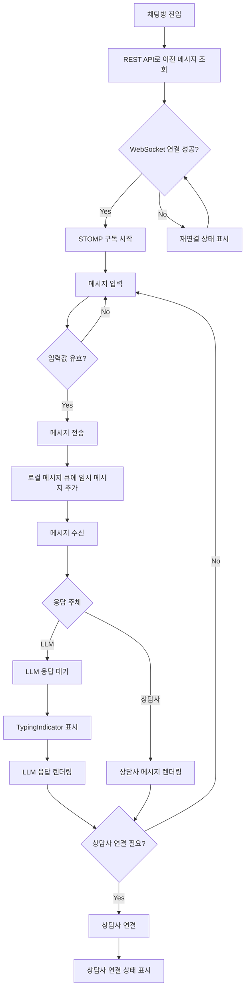

# 5.3.1 사용자 채팅 UI 스펙

> 이 문서는 CS 워크플로우 시스템의 사용자 채팅 화면을 설계한다.
> Vite+ 기반 프론트엔드와 FSD 아키텍처를 따른다.

---

## Goal

워크스페이스 사용자가 `/workspaces/:workspaceId/chat`에서 상담 메시지를 보내고 STOMP WebSocket으로 LLM 또는 상담사 응답을 실시간으로 받는 사용자 전용 채팅 UI를 구현한다.

---

## User Flow Chart



---

## Design Diff

### As-is vs To-be

| 영역 | As-is | To-be | 변경 내용 |
|------|-------|-------|----------|
| 사용자 채팅 화면 | 사용자 전용 채팅 라우트 없음 | `/workspaces/:workspaceId/chat` 라우트 제공 | 워크스페이스 하위에 고객용 채팅 진입점 추가 |
| 기능 경계 | `features/consultation/`이 상담사 화면 역할 담당 | `features/user-chat/`이 사용자 채팅만 담당 | 상담사 UI와 사용자 UI를 분리 |
| 메시지 역할 | CUSTOMER, AGENT, SYSTEM, NOTE를 모두 표현 | 사용자 입력은 CUSTOMER만 허용하고 수신 메시지는 AGENT, SYSTEM, ASSISTANT를 표시 | 내부 메모와 상담사 전용 선택 기능 제거 |
| 실시간 통신 | 상담 화면은 REST 기반 메시지 패턴 사용 | STOMP WebSocket을 기본 수신 경로로 사용 | `/topic/chat.{sessionId}` 구독으로 실시간 반영 |
| 초기 데이터 | 선택된 상담 세션의 메시지 조회 | 페이지 진입 시 세션 생성 또는 기존 세션 확인 후 히스토리 조회 | REST API로 이전 대화 복원 |
| 입력 UX | NOTE 토글과 상담사 입력 지원 | 일반 메시지 입력, 전송 버튼, IME Enter 처리 | 사용자에게 필요한 입력만 유지 |
| 대기 상태 | 상담 진행 상태만 표시 | LLM 생성 중 또는 상담사 입력 중 `TypingIndicator` 표시 | 응답 대기 상태를 명확히 안내 |
| 연결 오류 | 별도 사용자 채팅 오류 상태 없음 | WebSocket 끊김, 재연결 중, 재연결 실패 상태 표시 | 네트워크 불안정 상황에서 복구 가능성을 안내 |

---

## Component Tree

```
ChatPage
├─ ChatWidget
│  ├─ ChatHeader
│  │  ├─ ConnectionStatusBadge
│  │  └─ AgentHandoffStatus
│  ├─ ChatMessageList
│  │  ├─ ChatMessage
│  │  ├─ ChatMessage
│  │  └─ TypingIndicator
│  ├─ ChatInput
│  │  ├─ MessageTextarea
│  │  └─ SendButton
│  └─ ReconnectBanner
└─ ChatErrorBoundary
```

핵심 구조는 `ChatPage > ChatWidget > (ChatMessageList, ChatInput)` 관계를 유지하며, `TypingIndicator`는 `ChatMessageList` 내부에서 응답 생성 상태에 따라 렌더링한다. 실제 배치는 화면 하단 입력 영역과 메시지 목록의 시각 순서를 따르며, 컴포넌트 책임은 다음처럼 나눈다.

| 컴포넌트 | 책임 |
|----------|------|
| `ChatPage` | `workspaceId` 라우트 파라미터 확인, 세션 준비, 페이지 레이아웃 구성 |
| `ChatWidget` | 사용자 채팅 상태를 받아 헤더, 목록, 입력, 오류 배너 조합 |
| `ChatMessageList` | 메시지 목록 렌더링, 새 메시지 수신 시 하단 스크롤 |
| `ChatMessage` | 발신자와 상태에 맞는 말풍선 렌더링 |
| `TypingIndicator` | LLM 응답 생성 중 또는 상담사 입력 중 대기 상태 표시 |
| `ChatInput` | 입력값 관리, 공백 전송 방지, 한글 IME 조합 중 Enter 전송 방지 |

---

## API Integration

### Endpoints

| Method | Path | Description |
|--------|------|-------------|
| GET | `/api/v1/workspaces/:workspaceId/chat/sessions/current` | 현재 사용자 채팅 세션 조회 또는 생성 |
| GET | `/api/v1/chat/sessions/:sessionId/messages` | 채팅 히스토리 조회 |
| POST | `/api/v1/chat/sessions/:sessionId/messages` | WebSocket 전송 실패 시 사용자 메시지 전송 보조 경로 |

### STOMP WebSocket

| 구분 | 값 | 설명 |
|------|----|------|
| 연결 엔드포인트 | `/api/v1/ws` | JWT Bearer 토큰을 연결 헤더에 포함 |
| Subscribe destination | `/topic/chat.{sessionId}` | 세션별 메시지와 typing 이벤트 수신 |
| Publish destination | `/app/chat.{sessionId}.send` | 사용자 메시지 전송 |
| 이벤트 타입 | `MESSAGE_CREATED`, `TYPING_STARTED`, `TYPING_STOPPED`, `HANDOFF_REQUESTED`, `HANDOFF_CONNECTED`, `ERROR` | UI 상태 갱신 기준 |

### Query Key Pattern

| Key | 용도 | 예시 |
|-----|------|------|
| `userChatKeys.all` | 사용자 채팅 루트 키 | `['user-chat']` |
| `userChatKeys.session(workspaceId)` | 워크스페이스별 현재 채팅 세션 | `['user-chat', 'session', workspaceId]` |
| `userChatKeys.messages(sessionId)` | 세션별 메시지 히스토리 | `['user-chat', 'messages', sessionId]` |

### Existing API Pattern Reference

`features/consultation/api/consultationApi.ts`의 `getMessages(sessionId)`와 `sendMessage(sessionId, content, isNote)` 패턴을 참고한다. 사용자 채팅 API는 `isNote` 인자를 받지 않으며, 사용자 발신 메시지는 항상 CUSTOMER 역할로 보낸다. REST 클라이언트는 `shared/api/index.ts`의 `apiClient`와 동일하게 `/api/v1` 기본 경로와 JWT Bearer 토큰 규칙을 따른다.

---

## Data Flow

```
┌─────────────────────────────────────────────────────────┐
│ Shared Layer                                            │
│  WebSocket client + STOMP                               │
│  apiClient, auth token reader, reconnect policy          │
└─────────────────────────────────────────────────────────┘
                            │
                            ▼
┌─────────────────────────────────────────────────────────┐
│ Entities Layer                                          │
│  Message type, Session type, ChatEvent type              │
│  senderRole, deliveryStatus, handoffStatus               │
└─────────────────────────────────────────────────────────┘
                            │
                            ▼
┌─────────────────────────────────────────────────────────┐
│ Features Layer                                          │
│  useUserChat                                            │
│  useStompConnection                                     │
│  send message, receive event, sync local queue           │
└─────────────────────────────────────────────────────────┘
                            │
                            ▼
┌─────────────────────────────────────────────────────────┐
│ Widgets Layer                                           │
│  ChatWidget                                             │
│  combines header, message list, input, connection banner │
└─────────────────────────────────────────────────────────┘
                            │
                            ▼
┌─────────────────────────────────────────────────────────┐
│ Pages Layer                                             │
│  ChatPage                                               │
│  route: /workspaces/:workspaceId/chat                   │
└─────────────────────────────────────────────────────────┘
```

FSD 의존성 방향은 `Pages(ChatPage) → Widgets(ChatWidget) → Features(useUserChat, useStompConnection) → Entities(Message/Session types) → Shared(WebSocket client + STOMP)`로 유지한다. Shared는 상위 레이어를 import하지 않는다.

---

## 수정 대상 파일

| 파일 | 변경 유형 | 설명 |
|------|----------|------|
| `frontend/src/app/App.tsx` | modify | `/workspaces/:workspaceId/chat` 라우트를 `PrivateRoute`와 `WorkspaceLayout` 하위에 추가 |
| `frontend/src/pages/user-chat/ui/ChatPage.tsx` | new | 라우트 파라미터를 읽고 사용자 채팅 화면 구성 |
| `frontend/src/pages/user-chat/index.ts` | new | 페이지 public export |
| `frontend/src/widgets/user-chat/ui/ChatWidget.tsx` | new | 채팅 헤더, 메시지 목록, 입력, 연결 배너 조합 |
| `frontend/src/widgets/user-chat/index.ts` | new | 위젯 public export |
| `frontend/src/features/user-chat/api/userChatApi.ts` | new | 세션 조회, 히스토리 조회, REST 보조 전송 API |
| `frontend/src/features/user-chat/model/useUserChat.ts` | new | 메시지 큐, 히스토리 로딩, 전송 흐름 관리 |
| `frontend/src/features/user-chat/model/useStompConnection.ts` | new | STOMP 연결, 구독, publish, 재연결 상태 관리 |
| `frontend/src/features/user-chat/ui/ChatInput.tsx` | new | 메시지 입력, 전송 버튼, IME Enter 처리 |
| `frontend/src/features/user-chat/ui/ChatMessageList.tsx` | new | 메시지 목록과 자동 스크롤 처리 |
| `frontend/src/features/user-chat/ui/ChatMessage.tsx` | new | 사용자, LLM, 상담사, 시스템 메시지 말풍선 표시 |
| `frontend/src/features/user-chat/ui/TypingIndicator.tsx` | new | 응답 생성 또는 상담사 입력 상태 표시 |
| `frontend/src/features/user-chat/index.ts` | new | feature slice public export |
| `frontend/src/entities/user-chat/model/types.ts` | new | Message, Session, ChatEvent, ConnectionStatus 타입 정의 |
| `frontend/src/entities/user-chat/index.ts` | new | entity public export |
| `frontend/src/shared/api/stompClient.ts` | new | shared 레벨 STOMP WebSocket client 생성과 연결 관리 |
| `frontend/src/shared/api/index.ts` | modify | STOMP client export 추가 |

---

## State Management

### Server State (TanStack Query)

| 상태 | 소유 위치 | 갱신 방식 | 비고 |
|------|----------|----------|------|
| 현재 채팅 세션 | `features/user-chat/api` | 페이지 진입 시 query 실행 | `workspaceId` 기준 |
| 메시지 히스토리 | `features/user-chat/api` | 세션 준비 후 query 실행 | 오래된 메시지부터 정렬 |
| REST 전송 결과 | `features/user-chat/api` | WebSocket publish 실패 시 mutation | 성공 시 로컬 큐와 동기화 |

### Client State (Local State)

| 상태 | 위치 | 초기값 | 갱신 조건 |
|------|------|--------|----------|
| `messages` | `useUserChat` | 히스토리 응답 | STOMP `MESSAGE_CREATED` 수신, REST 전송 성공 |
| `pendingQueue` | `useUserChat` | 빈 배열 | 사용자가 전송한 메시지를 임시 추가, 서버 ack 수신 시 제거 |
| `connectionStatus` | `useStompConnection` | `connecting` | 연결 성공, 끊김, 재연결 중, 실패 |
| `subscriptionState` | `useStompConnection` | `idle` | `/topic/chat.{sessionId}` 구독 시작과 해제 |
| `typingState` | `useUserChat` | `idle` | `TYPING_STARTED`, `TYPING_STOPPED`, `MESSAGE_CREATED` 이벤트 |
| `handoffStatus` | `useUserChat` | `none` | `HANDOFF_REQUESTED`, `HANDOFF_CONNECTED` 이벤트 |
| `inputValue` | `ChatInput` | 빈 문자열 | 사용자 입력과 전송 완료 시 초기화 |

### State Rules

1. WebSocket 연결이 `connected`가 아니면 전송 버튼은 비활성화하고 재연결 배너를 표시한다.
2. 사용자가 메시지를 전송하면 즉시 `pendingQueue`에 추가해 말풍선을 표시한다.
3. 서버 메시지에 같은 client message id가 포함되면 임시 메시지를 확정 메시지로 교체한다.
4. STOMP 구독은 `sessionId`가 준비된 뒤 한 번만 생성하고 페이지 이탈 시 해제한다.
5. LLM typing 이벤트가 시작되면 `TypingIndicator`를 표시하고, 응답 메시지를 받거나 stop 이벤트를 받으면 숨긴다.
6. 상담사 연결 이벤트를 받으면 헤더에 연결 상태를 표시하되 사용자 입력 흐름은 유지한다.

---

## Tests

### Test Strategy

| 구분 | 방법 | 도구 | 비고 |
|------|------|------|------|
| 수동 테스트 | 브라우저에서 사용자 채팅 플로우 확인 | Chrome DevTools | WebSocket 연결 상태 확인 포함 |
| 컴포넌트 테스트 | 입력, 메시지 목록, 대기 표시 렌더링 검증 | Vitest, Testing Library | STOMP 이벤트는 mock으로 주입 |
| 통합 테스트 | 세션 조회, 히스토리 조회, STOMP 이벤트 반영 검증 | Vitest, MSW | REST와 WebSocket 경계 동시 확인 |
| 접근성 테스트 | 키보드 조작과 스크린 리더 라벨 확인 | Testing Library, 브라우저 | 입력창, 전송 버튼, 상태 배너 중심 |

### Test Environment & 사전 조건

| 항목 | 값 |
|------|---|
| 환경 | `pnpm dev` 또는 `docker compose up -d frontend backend` |
| API Mock | MSW로 세션 조회와 히스토리 응답 제공 |
| WebSocket Mock | STOMP client mock으로 subscribe, publish, reconnect 이벤트 제공 |
| 사전 조건 | 로그인된 사용자, 접근 가능한 `workspaceId`, 채팅 세션 1개 |

### Test Scenarios

#### Happy Path

| # | 시나리오 | 사전 조건 | 조작 | 기대 결과 | Figma |
|---|---------|---------|------|----------|-------|
| 1 | 채팅방 진입 | 로그인과 workspace 접근 가능 | `/workspaces/:workspaceId/chat` 진입 | 현재 세션 조회, 히스토리 표시, WebSocket 연결 상태 표시 | 해당 없음 |
| 2 | 사용자 메시지 전송 | WebSocket connected | 메시지 입력 후 전송 버튼 클릭 | CUSTOMER 말풍선이 즉시 표시되고 publish 호출 | 해당 없음 |
| 3 | LLM 응답 대기 | 사용자 메시지 전송 완료 | `TYPING_STARTED` 이벤트 수신 | `TypingIndicator` 표시 | 해당 없음 |
| 4 | LLM 응답 수신 | typing 표시 중 | `MESSAGE_CREATED` 이벤트 수신 | typing 숨김, 응답 말풍선 추가, 목록 하단 스크롤 | 해당 없음 |
| 5 | 상담사 연결 | handoff 이벤트 수신 가능 | `HANDOFF_CONNECTED` 이벤트 수신 | 헤더에 상담사 연결 상태 표시, 입력 유지 | 해당 없음 |

#### Error & Edge Cases

| # | 시나리오 | 조작 | 기대 결과 |
|---|---------|------|----------|
| 1 | WebSocket 최초 연결 실패 | 페이지 진입 후 연결 실패 이벤트 발생 | 재연결 배너 표시, 전송 비활성화 |
| 2 | 연결 중단 후 복구 | connected 상태에서 disconnect 이벤트 후 reconnect 성공 | 배너 표시 후 숨김, 기존 메시지 유지 |
| 3 | 히스토리 조회 실패 | GET messages가 500 응답 | 오류 상태와 다시 시도 버튼 표시 |
| 4 | 빈 메시지 전송 | 공백만 입력 후 Enter | publish 호출 없음, 입력 유지 |
| 5 | 한글 IME 입력 중 Enter | 조합 중 Enter 입력 | 메시지를 전송하지 않음 |
| 6 | 중복 메시지 수신 | 같은 message id의 이벤트 2회 수신 | 목록에 한 번만 표시 |
| 7 | 권한 만료 | 세션 조회 또는 히스토리 조회가 401 응답 | 기존 인증 처리 규칙에 따라 세션 정리와 로그인 유도 |
| 8 | REST 보조 전송 실패 | WebSocket publish 실패 후 POST도 실패 | 임시 메시지를 실패 상태로 표시하고 재전송 버튼 제공 |

#### 반응형 & 접근성

| # | 확인 항목 | 기대 결과 |
|---|---------|----------|
| 1 | 모바일 뷰포트 375px | 채팅이 단일 열로 표시되고 입력 영역이 화면 하단에 고정 |
| 2 | 태블릿 768px | 메시지 목록 폭이 읽기 편한 길이로 제한되고 입력 영역이 겹치지 않음 |
| 3 | 데스크톱 1440px | WorkspaceLayout 안에서 최대 폭을 유지하고 빈 공간이 과도하게 늘어나지 않음 |
| 4 | 키보드 탐색 | Tab으로 입력창과 전송 버튼 이동, Enter 전송, Shift+Enter 줄바꿈 |
| 5 | 스크린 리더 | 연결 상태, 전송 실패, typing 상태가 aria-live로 전달 |
| 6 | 터치 타겟 | 전송 버튼과 재시도 버튼이 최소 44px 터치 영역 확보 |
| 7 | 색상 대비 | 메시지 말풍선, 상태 배너, focus outline이 4.5:1 이상 대비 유지 |

---

## Implementation Example

이 스펙은 구현 코드를 포함하지 않는다. 구현 시에는 아래 계약을 만족해야 한다.

| 항목 | 계약 |
|------|------|
| 라우팅 | `App.tsx`의 워크스페이스 중첩 라우트 아래 `chat` 경로를 추가한다. |
| feature 경계 | 사용자 채팅 로직은 `features/user-chat/`에 두고 `features/consultation/`을 수정하거나 재사용하지 않는다. |
| shared WebSocket | STOMP client 생성과 연결 관리는 `shared/api/stompClient.ts`에 둔다. |
| REST API | 기존 `consultationApi.ts`의 `getMessages`, `sendMessage` 모양을 참고하되 사용자 채팅 API에는 NOTE 개념을 넣지 않는다. |
| 입력 처리 | `frontend/src/features/consultation/ui/ChatPanel.tsx`의 공백 방지와 한글 IME 조합 중 Enter 방지 패턴을 사용자 입력에도 적용한다. |
| 표시 정책 | CUSTOMER 발신 말풍선, LLM 또는 상담사 수신 말풍선, SYSTEM 안내 메시지만 표시한다. |

---

## Performance Considerations

- 메시지 목록은 최신 50개를 우선 렌더링하고, 이전 대화는 위로 스크롤할 때 추가 조회한다.
- STOMP 재연결은 화면이 살아 있는 동안만 수행하고 페이지 이탈 시 구독과 연결 리소스를 정리한다.
- 새 메시지 수신 시 전체 히스토리 query를 매번 다시 가져오지 않고 이벤트 payload로 로컬 목록을 갱신한다.
- 메시지 id 기준으로 중복 이벤트를 제거해 재연결 직후 같은 메시지가 반복 렌더링되지 않게 한다.
- TypingIndicator는 이벤트 상태만 반영하고 불필요한 타이머 기반 렌더링을 만들지 않는다.
