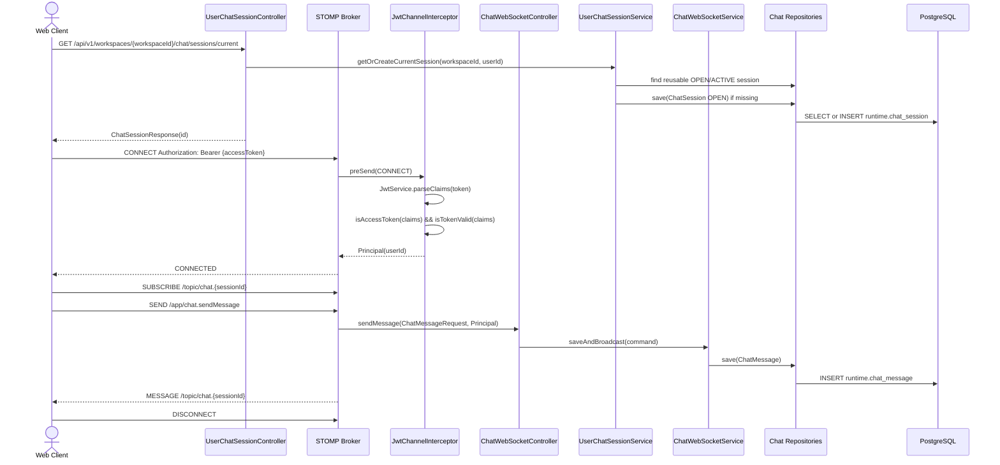
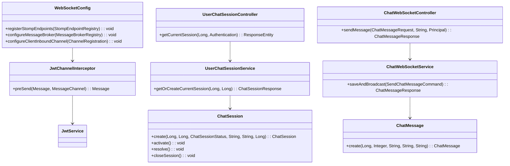

# [BE-5.3.2] STOMP WebSocket 채팅 인프라

> **Backlog**: 5.3.2 STOMP over WebSocket chat infrastructure
> **Bounded Context**: `workflowruntime`
> **Template**: `_TEMPLATE_BE.md`
> **Branch**: `spec/5.3.2`
> **작업 브랜치 (구현 단계)**: `feature/5.3.2-stomp-chat-infrastructure`

---

## Goal

STOMP over WebSocket 기반 채팅 인프라 API와 아키텍처를 정의해 사용자와 상담 에이전트가 `workflow-runtime`의 `ChatSession`, `ChatMessage`, workflow 실행 흐름을 실시간 메시지로 주고받을 수 있게 한다.

범위는 `workflowruntime` bounded context 안의 WebSocket presentation surface다. 기존 `ChatSession`, `ChatMessage`, `ChatSessionStatus`, repository를 재사용한다. STOMP `CONNECT` 단계에서 JWT access token을 검증해 WebSocket session의 `Principal`에 userId를 연결한다. 신규 DB migration은 만들지 않고 `runtime.chat_session.meta_json`, `runtime.chat_message.payload_json`을 사용한다.

---

## Sequence Diagram



---

## STOMP API

### Destinations

| Direction | Destination | Description |
|-----------|-------------|-------------|
| REST GET | `/api/v1/workspaces/{workspaceId}/chat/sessions/current` | 새 `ChatSession`을 조회 또는 생성한다. 세션 id가 정해진 뒤 STOMP topic을 구독한다. |
| Client SEND | `/app/chat.sendMessage` | 기존 session에 사용자 메시지를 저장하고 구독자에게 메시지를 발행한다. |
| Client SUBSCRIBE | `/topic/chat.{sessionId}` | session 참여자가 실시간 메시지 이벤트를 받는다. |
| Client SUBSCRIBE | `/user/queue/errors` | message handling 중 발생한 개인 오류를 수신한다. |

### CONNECT Headers

```text
CONNECT
Authorization: Bearer {accessToken}
accept-version: 1.2
heart-beat: 10000,10000
```

### Request

**GET /api/v1/workspaces/{workspaceId}/chat/sessions/current**

```json
{ "id": 5001, "status": "OPEN", "channel": "WEB", "metaJson": "{}", "startedAt": "2026-05-20T10:00:00Z", "assignedCounselorId": null, "endedAt": null }
```

서버는 `workspaceId`와 인증 사용자의 workspace membership을 검증한다. 재사용 가능한 `OPEN`/`ACTIVE` 세션이 없으면 해당 workspace의 현재 `PUBLISHED` domain pack version으로 `channel="WEB"` 세션을 만든다.

**SEND /app/chat.sendMessage**

```json
{ "sessionId": 5001, "content": "주문 취소하고 싶어요." }
```

### Response

**MESSAGE /topic/chat.{sessionId}**

```json
{ "id": 9001, "seqNo": 3, "senderRole": "USER", "messageType": "TEXT", "content": "주문 취소하고 싶어요.", "createdAt": "2026-05-20T10:00:00Z" }
```

세션 id는 구독 destination에 포함되어 있으므로 payload에는 포함하지 않는다. 프론트는 `senderRole`을 `USER`/`AGENT`/`BOT` UI 타입으로 변환한다.

### Error Handling

Error payload shape은 다음과 같다.

```json
{ "error": "UNKNOWN_SESSION", "message": "Chat session not found: 5001", "sessionId": 5001, "timestamp": "2026-05-20T10:00:00Z" }
```

| Error | Destination | Payload |
|-------|-------------|---------|
| Missing, expired, refresh JWT on `CONNECT` | STOMP connection rejection or `ERROR` frame | body 없이 연결 거부 |
| `UNKNOWN_SESSION` from send | `/user/queue/errors` | `{ "error": "UNKNOWN_SESSION", "message": "...", "sessionId": 5001, "timestamp": "..." }` |
| `VALIDATION_ERROR` with `sessionId` | `/user/queue/errors` | `{ "error": "VALIDATION_ERROR", "message": "...", "sessionId": 5001, "timestamp": "..." }` |
| Current session REST validation error | HTTP error response | `code`, `message` |

---

## Class Design

### DDD Layered Structure



### presentation/

Boundary note: 아키텍처 문서상 `chat-demo`는 데모 화면과 WebSocket 이벤트 접점을 담당하지만, 현재 `ChatSession`/`ChatMessage` Java entity는 `com.init.workflowruntime.domain`에 있다. 이 스펙은 기존 entity 위치에 맞춰 `workflow-runtime` presentation layer를 확장하며, `chat-demo`는 frontend integration layer로 남긴다.

| Class | Contract |
|-------|----------|
| `WebSocketConfig` | STOMP endpoint registration, allowed origins, `WebSocketMessageBrokerConfigurer` 설정을 담당한다. endpoint는 `/ws/chat`, application prefix는 `/app`, broker prefix는 `/topic`, `/queue`를 사용한다. |
| `ChatWebSocketController` | `@MessageMapping("/chat.sendMessage")` handler를 제공하고 service에 위임한다. |
| `UserChatSessionController` | `GET /api/v1/workspaces/{workspaceId}/chat/sessions/current`로 current session 조회/생성을 제공한다. |
| `dto/ChatMessageRequest` | incoming message DTO. 필드: `sessionId`, `content`. |
| `dto/ChatMessageResponse` | outgoing message DTO. 필드: `id`, `seqNo`, `senderRole`, `messageType`, `content`, `createdAt`. |

### application/

| Class | Contract |
|-------|----------|
| `UserChatSessionService` | current session 조회/생성을 담당한다. 기존 `OPEN`/`ACTIVE` 세션을 재사용하고, 없으면 현재 `PUBLISHED` domain pack version으로 새 `OPEN` 세션을 생성한다. |
| `ChatWebSocketService` | 기존 session에 사용자 메시지를 저장하고 `/topic/chat.{sessionId}`로 `ChatMessageResponse`를 발행한다. |
| `getOrCreateCurrentSession()` | `workspaceId`와 인증 사용자 ID로 workspace membership을 검증한다. 단일 transaction 안에서 `ChatSession.create(workspaceId, domainPackVersionId, OPEN, "WEB", "{}", userId)`로 `startedBy(userId)`를 함께 저장한다. |
| `sendMessage()` | `sessionId` 존재, `session.startedBy == Principal userId` 조건을 확인한다. session status는 `OPEN` 또는 `ACTIVE`만 허용한다. 조건 불충족 시 메시지를 저장하지 않고 `/user/queue/errors`로 error `ChatMessageResponse`를 반환한다. `seqNo`는 세션별로 증가하는 일련번호를 보장하며, 동시성으로 인한 충돌을 방지하기 위해 단일 transaction 내에서 계산한다. `messageType`은 항상 `TEXT`로 저장하고 `ChatMessage.create(sessionId, seqNo, "USER", "TEXT", content)`로 저장한다. |

### domain/

`ChatSession`은 기존 entity를 재사용한다. 상태값은 `OPEN`, `ACTIVE`, `RESOLVED`, `COMPLETED`이며 상태 전이는 의미 있는 도메인 메서드로 수행한다. `ChatMessage`는 기존 entity를 재사용하고 `create()` validation과 `payloadJson="{}"` 기본값을 유지한다. `ChatSessionStatus`도 기존 enum을 그대로 사용한다.

### infrastructure/

`JwtChannelInterceptor`는 `ChannelInterceptor` 구현체다. `CONNECT` frame에서 JWT를 추출하고 `JwtService.parseClaims()`, `isAccessToken()`, `isTokenValid()`로 검증한다. 성공하면 claims subject userId로 `Principal`을 설정하고, 실패하면 `preSend()`에서 `null`을 반환한다. 기존 `ChatSessionRepository`, `ChatMessageRepository`를 재사용하고 WebSocket 전용 repository를 새로 만들지 않는다.

---

## WebSocket Authentication

JWT access token은 STOMP `CONNECT` header로 전달한다. `JwtChannelInterceptor`는 `CONNECT` message만 인증 대상으로 처리하고, `Authorization: Bearer {accessToken}` 또는 native `accessToken` header에서 token을 추출한다.

검증 순서: `JwtService.parseClaims(token)` 호출, `JwtService.isAccessToken(claims)` 확인, `JwtService.isTokenValid(claims)` 확인, `claims.getSubject()`를 `Long userId`로 변환, STOMP accessor에 `Principal` 설정. 어느 단계든 실패하면 `preSend()`에서 `null`을 반환해 연결을 거부한다. HTTP `JwtAuthenticationFilter`처럼 `role` claim은 authority 구성에 쓸 수 있지만, WebSocket 연결의 최소 식별 기준은 subject userId다.

`JwtChannelInterceptor`는 `/topic/chat.{sessionId}` SUBSCRIBE에 대해 세션 접근 권한을 검증한다. `OPERATOR`는 상담 화면 호환을 위해 세션 topic 구독을 허용하고, 일반 사용자는 `runtime.chat_session.started_by`가 인증 userId와 일치하는 세션만 구독할 수 있다.

---

## Database

신규 table이나 migration은 추가하지 않는다. `.agent/docs/schema.md`의 `7.7 runtime` DDL을 재사용한다.

- `runtime.chat_session`: 기존 컬럼 `id`, `workspace_id`, `domain_pack_version_id`, `status`, `channel`, `started_by`, `meta_json`, `started_at`, `ended_at`을 사용한다. `meta_json`에는 `stompSessionId`, `lastConnectedUserId`, `lastConnectedAt`을 저장한다.
- `runtime.chat_message`: 기존 컬럼 `id`, `chat_session_id`, `seq_no`, `sender_role`, `message_type`, `content`, `payload_json`, `created_at`을 사용한다. `(chat_session_id, seq_no)` unique 제약을 유지한다. `payload_json`은 4.1.4의 AGENT/NOTE 실행 metadata(`workflowCode`, `workflowRefId`, `intentCode`, `currentNodeId`, `incomingEdgeId`, `policyRef`, `slotRefs`, `state`)와 호환되며, 5.3.2는 여기에 일반 mapping(`workflowExecutionId`, `nodeId`, `edgeId`, `decisionType`)을 추가로 허용한다.

---

## Tests

### Unit Tests

**`JwtChannelInterceptorTest`**: valid access token은 `Principal` subject userId를 설정한다. missing token, expired token, refresh token은 `preSend(CONNECT)`에서 `null`을 반환한다. non CONNECT frame은 JWT validation 없이 통과한다.

### Integration Tests

**`UserChatSessionControllerTest`** verifies `GET /api/v1/workspaces/{workspaceId}/chat/sessions/current` delegates with the authenticated user id.

**`ChatWebSocketControllerTest`** and service tests verify `/app/chat.sendMessage` persists and broadcasts `ChatMessageResponse`.

| Case | Flow | Expected |
|------|------|----------|
| valid JWT can exchange messages | Get current session through REST, connect with valid JWT, subscribe to `/topic/chat.{sessionId}`, then send `/app/chat.sendMessage`. | Subscriber receives `ChatMessageResponse` with `content`, `senderRole="USER"`. |
| missing JWT rejects connection | Connect without JWT. | STOMP connection is rejected before subscription or send succeeds. |

Persistence assertions: `runtime.chat_session` row has `status="OPEN"`, current published `domain_pack_version_id`, `channel="WEB"`, and `started_by` set to the authenticated user. `runtime.chat_message` row has increasing `seq_no`, `sender_role="USER"`, `message_type="TEXT"`, and request content.
