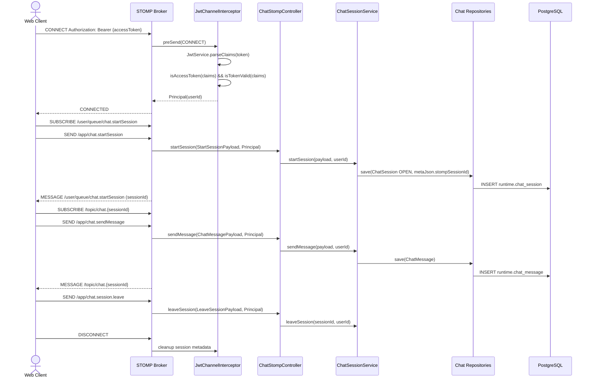
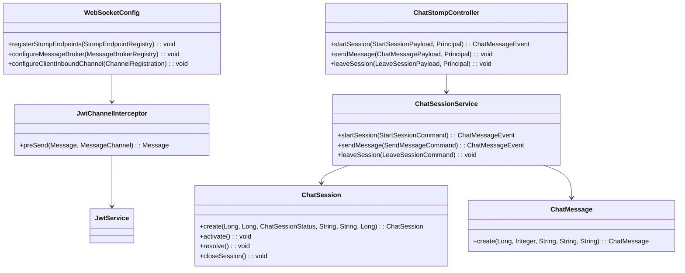

# [BE-5.3.2] STOMP WebSocket 채팅 인프라

> **Backlog**: 5.3.2 STOMP over WebSocket chat infrastructure
> **Bounded Context**: `workflowruntime`
> **Template**: `_TEMPLATE_BE.md`
> **Branch**: `spec/5.3.2`
> **작업 브랜치 (구현 단계)**: `feature/5.3.2-stomp-chat-infrastructure`

---

## Goal

STOMP over WebSocket 기반 채팅 인프라 API와 아키텍처를 정의해 사용자와 상담 에이전트가 `workflow-runtime`의 `ChatSession`, `ChatMessage`, workflow 실행 흐름을 실시간 메시지로 주고받을 수 있게 한다.

범위는 `workflowruntime` bounded context 안의 WebSocket presentation surface다. 기존 `ChatSession`, `ChatMessage`, `ChatSessionStatus`, repository를 재사용한다. STOMP `CONNECT` 단계에서 JWT access token을 검증해 WebSocket session의 `Principal`에 userId를 연결한다. 신규 DB migration은 만들지 않고 `runtime.chat_session.meta_json`, `runtime.chat_message.payload_json`을 사용한다.

---

## Sequence Diagram



---

## STOMP API

### Destinations

| Direction | Destination | Description |
|-----------|-------------|-------------|
| Client SEND | `/app/chat.startSession` | 새 `ChatSession`을 시작한다. 결과는 session id가 정해지기 전에도 구독 가능한 `/user/queue/chat.startSession`으로 반환한다. |
| Client SEND | `/app/chat.sendMessage` | 기존 session에 사용자 메시지를 저장하고 구독자에게 이벤트를 발행한다. |
| Client SEND | `/app/chat.session.leave` | 사용자가 session을 떠났음을 기록하고 cleanup을 수행한다. |
| Client SUBSCRIBE | `/topic/chat.{sessionId}` | session 참여자가 실시간 메시지 이벤트를 받는다. |
| Client SUBSCRIBE | `/queue/chat.{sessionId}` | session 생성 결과와 session scoped error를 받는다. |
| Client SUBSCRIBE | `/user/queue/chat.startSession` | startSession 결과와 생성 실패 응답을 받는다. |
| Agent SUBSCRIBE | `/topic/chat.queue` | `ROLE_AGENT`만 새 OPEN session과 queue 변화를 받는다. 비상담원 구독은 STOMP `ERROR` frame으로 거부한다. |

### CONNECT Headers

```text
CONNECT
Authorization: Bearer {accessToken}
accept-version: 1.2
heart-beat: 10000,10000
```

### Request

**SEND /app/chat.startSession**

```json
{ "domainPackVersionId": 101, "channel": "WEB" }
```

`channel` 허용값은 `WEB`, `DEMO_WEB`이다. 생략 시 DB 기본값은 `DEMO_WEB`이며, 운영자 웹 콘솔은 `WEB`, 데모 화면은 `DEMO_WEB`을 사용한다.

**SEND /app/chat.sendMessage**

```json
{ "sessionId": 5001, "content": "주문 취소하고 싶어요.", "messageType": "TEXT" }
```

**SEND /app/chat.session.leave**

```json
{ "sessionId": 5001 }
```

### Response

**MESSAGE /user/queue/chat.startSession**, **MESSAGE /topic/chat.{sessionId}**, **MESSAGE /queue/chat.{sessionId}**

```json
{ "sessionId": 5001, "seqNo": 3, "senderRole": "USER", "content": "주문 취소하고 싶어요.", "messageType": "TEXT", "timestamp": "2026-05-20T10:00:00Z" }
```

**MESSAGE /topic/chat.queue**는 agent queue 전용 알림이며 `sessionId`, `status`, `domainPackVersionId`, `channel`, `startedAt`으로 새 OPEN session과 queue 변화를 알린다.

### Error Handling

Error payload shape은 다음과 같다.

```json
{ "error": "UNKNOWN_SESSION", "message": "Chat session not found: 5001", "sessionId": 5001, "timestamp": "2026-05-20T10:00:00Z" }
```

| Error | Destination | Payload |
|-------|-------------|---------|
| Missing, expired, refresh JWT on `CONNECT` | STOMP connection rejection or `ERROR` frame | body 없이 연결 거부 |
| `UNKNOWN_SESSION` from send/leave | `/queue/chat.{sessionId}` | `error`, `message`, `sessionId`, `timestamp` |
| `VALIDATION_ERROR` with `sessionId` | `/queue/chat.{sessionId}` | `error`, `message`, `sessionId`, `field`, `timestamp` |
| `VALIDATION_ERROR` before session creation | STOMP `ERROR` frame | `error`, `message`, `field`, `timestamp` |

---

## Class Design

### DDD Layered Structure



### presentation/

Boundary note: 아키텍처 문서상 `chat-demo`는 데모 화면과 WebSocket 이벤트 접점을 담당하지만, 현재 `ChatSession`/`ChatMessage` Java entity는 `com.init.workflowruntime.domain`에 있다. 이 스펙은 기존 entity 위치에 맞춰 `workflow-runtime` presentation layer를 확장하며, `chat-demo`는 frontend integration layer로 남긴다.

| Class | Contract |
|-------|----------|
| `WebSocketConfig` | STOMP endpoint registration, `setAllowedOrigins()`, `WebSocketMessageBrokerConfigurer` 설정을 담당한다. endpoint는 `/ws`, application prefix는 `/app`, broker prefix는 `/topic`, `/queue`를 기본값으로 둔다. |
| `ChatStompController` | `@MessageMapping("/chat.startSession")`, `@MessageMapping("/chat.sendMessage")`, `@MessageMapping("/chat.session.leave")` handler를 제공하고 service에 위임한다. |
| `dto/ChatMessagePayload` | incoming message DTO. 필드: `sessionId`, `content`, `messageType`. |
| `dto/ChatMessageEvent` | outgoing message event. 필드: `sessionId`, `seqNo`, `senderRole`, `content`, `messageType`, `timestamp`. |
| `dto/StartSessionPayload` | session start request. 필드: `workspaceId`, `domainPackVersionId`, `channel`; `channel`은 `WEB` 또는 `DEMO_WEB`. |
| `dto/LeaveSessionPayload` | session leave request. 필드: `sessionId`. |

### application/

| Class | Contract |
|-------|----------|
| `ChatSessionService` | 기존 `ConsultationService` 흐름을 확장하거나 재사용한다. `startSession()`, `sendMessage()`, `leaveSession()`가 WebSocket message flow의 단일 진입점이다. |
| `startSession()` | `StartSessionPayload.workspaceId`를 명시적으로 전달받고, 서버는 `Principal` userId의 해당 workspace membership을 검증한다. `workspaceId` 누락 또는 유효하지 않은 workspace는 validation error로 거부하고 session을 생성하지 않는다. 단일 transaction 안에서 `ChatSession.create(workspaceId, domainPackVersionId, OPEN, channel, metaJson, userId)`로 `startedBy(userId)`를 함께 전달해 원자적으로 생성한다. session 생성 결과는 `/user/queue/chat.startSession`으로 반환하고, 새 OPEN session 알림만 `/topic/chat.queue`로 발행한다. |
| `sendMessage()` | `sessionId` 존재, session의 `workspaceId`에 `Principal` membership, `session.startedBy == Principal userId`, session status가 `OPEN`인지 확인한다. 조건 불충족 시 메시지를 저장하지 않고 `NOT_FOUND`, `FORBIDDEN`, `SESSION_CLOSED` 등 구분 가능한 error payload를 개인 큐(`/user/queue/chat.errors`)로 반환한다. seqNo는 단일 transaction에서 session row를 write lock으로 잠근 뒤 현재 최대 `seqNo` 기준으로 다음 번호를 배정한다. `ChatMessage.create(sessionId, seqNo, "USER", messageType, content)`로 저장한다. workflow 결과가 있으면 같은 lock 범위 안에서 연속 `seqNo`로 assistant/system event도 저장한다. |
| `leaveSession()` | WebSocket 이탈 정보를 session metadata에 반영한다. 종료 조건이 충족되면 `ChatSession.closeSession()`을 사용한다. |

### domain/

`ChatSession`은 기존 entity를 재사용한다. 상태값은 `OPEN`, `ACTIVE`, `RESOLVED`, `COMPLETED`이며 상태 전이는 의미 있는 도메인 메서드로 수행한다. `ChatMessage`는 기존 entity를 재사용하고 `create()` validation과 `payloadJson="{}"` 기본값을 유지한다. `ChatSessionStatus`도 기존 enum을 그대로 사용한다.

### infrastructure/

`JwtChannelInterceptor`는 `ChannelInterceptor` 구현체다. `CONNECT` frame에서 JWT를 추출하고 `JwtService.parseClaims()`, `isAccessToken()`, `isTokenValid()`로 검증한다. 성공하면 claims subject userId로 `Principal`을 설정하고, 실패하면 `preSend()`에서 `null`을 반환한다. 기존 `ChatSessionRepository`, `ChatMessageRepository`를 재사용하고 WebSocket 전용 repository를 새로 만들지 않는다.

---

## WebSocket Authentication

JWT access token은 STOMP `CONNECT` header로 전달한다. `JwtChannelInterceptor`는 `CONNECT` message만 인증 대상으로 처리하고, `Authorization: Bearer {accessToken}` 또는 native `accessToken` header에서 token을 추출한다.

검증 순서: `JwtService.parseClaims(token)` 호출, `JwtService.isAccessToken(claims)` 확인, `JwtService.isTokenValid(claims)` 확인, `claims.getSubject()`를 `Long userId`로 변환, STOMP accessor에 `Principal` 설정. 어느 단계든 실패하면 `preSend()`에서 `null`을 반환해 연결을 거부한다. HTTP `JwtAuthenticationFilter`처럼 `role` claim은 authority 구성에 쓸 수 있지만, WebSocket 연결의 최소 식별 기준은 subject userId다.

`JwtChannelInterceptor`는 `/topic/chat.queue` SUBSCRIBE에 대해 role 기반 인가도 수행한다. `ROLE_AGENT` authority를 가진 사용자만 구독할 수 있으며, 권한 없는 SUBSCRIBE는 `{"error":"FORBIDDEN"}` payload를 담은 STOMP `ERROR` frame과 connection-level denial detail로 거부한다.

---

## Database

신규 table이나 migration은 추가하지 않는다. `.agent/docs/schema.md`의 `7.7 runtime` DDL을 재사용한다.

- `runtime.chat_session`: 기존 컬럼 `id`, `workspace_id`, `domain_pack_version_id`, `status`, `channel`, `started_by`, `meta_json`, `started_at`, `ended_at`을 사용한다. `meta_json`에는 `stompSessionId`, `lastConnectedUserId`, `lastConnectedAt`을 저장한다.
- `runtime.chat_message`: 기존 컬럼 `id`, `chat_session_id`, `seq_no`, `sender_role`, `message_type`, `content`, `payload_json`, `created_at`을 사용한다. `(chat_session_id, seq_no)` unique 제약을 유지한다. `payload_json`은 4.1.4의 AGENT/NOTE 실행 metadata(`workflowCode`, `workflowRefId`, `intentCode`, `currentNodeId`, `incomingEdgeId`, `policyRef`, `slotRefs`, `state`)와 호환되며, 5.3.2는 여기에 일반 mapping(`workflowExecutionId`, `nodeId`, `edgeId`, `decisionType`)을 추가로 허용한다.

---

## Tests

### Unit Tests

**`JwtChannelInterceptorTest`**: valid access token은 `Principal` subject userId를 설정한다. missing token, expired token, refresh token은 `preSend(CONNECT)`에서 `null`을 반환한다. non CONNECT frame은 JWT validation 없이 통과한다.

### Integration Tests

**`ChatStompControllerTest`** uses `@SpringBootTest(webEnvironment = RANDOM_PORT)` and `WebSocketStompClient`.

| Case | Flow | Expected |
|------|------|----------|
| valid JWT can exchange messages | Connect with valid JWT, subscribe to `/user/queue/chat.startSession`, send `/app/chat.startSession`, then subscribe to `/topic/chat.{sessionId}` and send `/app/chat.sendMessage`. | Subscriber receives `ChatMessageEvent` with matching `sessionId`, `content`, `senderRole="USER"`. |
| missing JWT rejects connection | Connect without JWT. | STOMP connection is rejected before subscription or send succeeds. |
| leave session records cleanup | Connect with valid JWT, start session, send `/app/chat.session.leave`. | Session metadata or status reflects leave handling without deleting messages. |

Persistence assertions: `runtime.chat_session` row has `status="OPEN"`, requested `domainPackVersionId`, requested `channel`, and `meta_json.stompSessionId`; `runtime.chat_message` row has increasing `seq_no`, `sender_role="USER"`, `message_type="TEXT"`, and request content.
