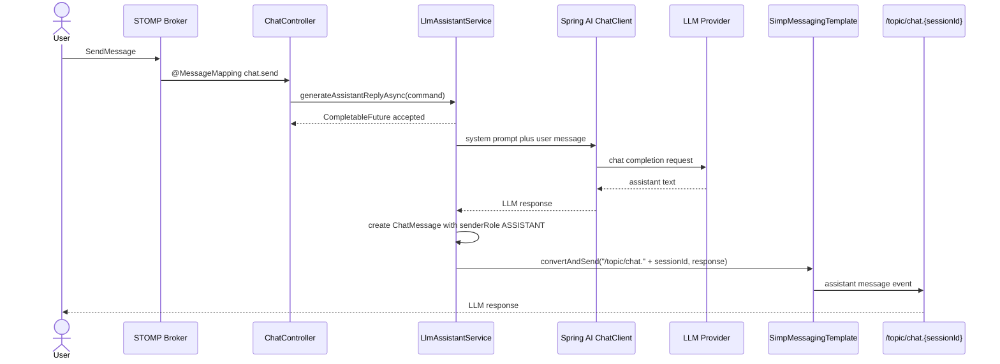
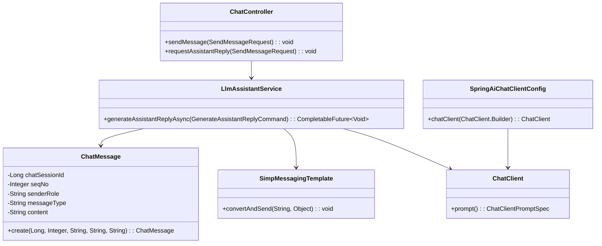

# 5.3.3 Backend Spec: 채팅 데모 LLM Assistant 응답

## Goal

채팅 데모에서 사용자가 STOMP로 메시지를 보내면 백엔드가 Spring AI로 LLM Assistant 응답을 비동기 생성하고 같은 세션 topic으로 push한다.

## Sequence Diagram



## Class Design

### DDD Layered Structure



### presentation/

> **참고**: `ChatController`, `LlmAssistantService`, `SpringAiChatClientConfig`는
> 이 스펙에 따라 5.3.3 구현 단계에서 신규 생성할 예정이다.
> 현재 저장소에는 해당 클래스 파일이 없으므로, 아래 항목은 기존 파일 경로가 아니라
> **구현 예정 클래스와 책임**을 설명한다.
> `workflow-runtime` 모듈 내 DDD 계층 구조(`presentation`/`application`/`domain`/`infrastructure`)를 따라 신규 패키지에 추가한다.

* ChatController: 채팅 요청/응답 STOMP API 진입점 — 기존 사용자 메시지 STOMP 처리 흐름을 유지한다.
* `@MessageMapping` 오버로드 또는 별도 mapping 메서드로 Assistant 응답 생성을 요청한다.
* Controller는 `SendMessageRequest`를 application command로 변환하고 `LlmAssistantService.generateAssistantReplyAsync(...)`만 호출한다.
* LLM 응답 생성, 메시지 저장, push 대상 결정은 Controller에 두지 않는다.
* 클라이언트 구독 topic은 `/topic/chat.{sessionId}` 형식을 사용한다.

예상 요청 필드:

```java
public record SendMessageRequest(
    Long sessionId,
    Long workspaceId,
    String content
) {}
```

### application/

> **참고**: `LlmAssistantService`는 5.3.3 구현 단계에서 신규 생성 예정이다.
> 아래 항목은 구현 예정 클래스의 책임을 설명한다.

* LlmAssistantService: LLM 응답 생성 애플리케이션 서비스 — 책임:

1. 사용자 메시지와 세션 컨텍스트를 받아 Spring AI `ChatClient`에 전달한다.
2. system prompt를 포함해 Assistant 역할과 응답 제약을 고정한다.
3. LLM 응답을 `ChatMessage.create(sessionId, seqNo, "ASSISTANT", "TEXT", content)`로 생성한다.
4. 생성된 응답 DTO를 `SimpMessagingTemplate.convertAndSend("/topic/chat." + sessionId, response)`로 push한다.
5. seqNo 생성 규칙: 같은 sessionId 내에서 seqNo는 중복 없이 단조 증가해야 한다.
   구현 시 다음 중 하나를 선택한다:
   a) DB unique constraint on (chat_session_id, seq_no) + unique violation 시 retry
   b) @Transactional 내부에서 SELECT MAX(seq_no) + 1 (비권장, 동시성 낮음)
   c) session-scoped atomic increment (Redis INCR 등, 추후 도입 가능)
   구현 단계에서 (a) 방식으로 우선 적용하고 실패 시 재시도 로직을 포함한다.

비동기 처리 방식:

```java
@Async
public CompletableFuture<Void> generateAssistantReplyAsync(GenerateAssistantReplyCommand command) {
    // seqNo 할당 → ChatClient 호출 → ASSISTANT 메시지 생성 → STOMP push를 한 작업 단위로 처리한다.
    // seqNo는 DB unique constraint로 중복을 방지하고, unique violation 발생 시 재시도한다.
    return CompletableFuture.completedFuture(null);
}
```

구현 기준:

* `@EnableAsync`는 configuration 계층에서 활성화한다.
* service 메서드는 `CompletableFuture<Void>`를 반환해 Controller가 LLM 응답 완료를 기다리지 않게 한다.
* LLM 호출 실패 시 구체적인 예외를 로깅하고 같은 session topic에 실패 이벤트를 보낸다.

```java
// STOMP 실패 이벤트 스키마
public record LlmAssistantFailureEvent(
    String eventType,    // "failure"
    String errorCode,    // "LLM_TIMEOUT", "LLM_UNAVAILABLE", "INTERNAL_ERROR"
    boolean retryable,   // true = 재시도 가능, false = 복구 불가
    String message,      // 사람이 읽을 수 있는 오류 설명
    String timestamp     // ISO-8601 포맷
) {}
```

Clients는 eventType/errorCode/retryable 필드로 분기 처리한다.
destination: `/topic/chat.{sessionId}` (정상 응답과 동일한 destination)

```json
{
  "eventType": "failure",
  "errorCode": "LLM_TIMEOUT",
  "retryable": true,
  "message": "LLM 응답 시간이 초과되었습니다.",
  "timestamp": "2026-05-20T14:42:19Z"
}
```

* 재시도, 상담원 개입, escalation 판단은 이번 범위에 넣지 않는다.

System prompt 초안:

```text
당신은 고객 상담 데모를 돕는 CS Assistant입니다.
상담 로그 기반 도메인 팩의 정책과 워크플로우를 따르는 답변만 제공합니다.
확인되지 않은 내용은 단정하지 말고 추가 확인이 필요하다고 답합니다.
상담원 개입 여부는 판단하지 않습니다.
```

### domain/

`backend/src/main/java/com/init/workflowruntime/domain/ChatMessage.java`

* 기존 `senderRole`은 `String` 필드다.
* 현재 생성 메서드는 `senderRole`이 blank가 아니면 trim 후 저장한다.
* enum 도입 없이 신규 문자열 값 `ASSISTANT`를 추가 값으로 사용한다.
* 기존 값 `USER`, `AGENT`, `NOTE`와 같은 저장 방식으로 LLM 응답 메시지를 기록한다.
* 메시지 유형은 기존 텍스트 메시지와 맞춰 `TEXT`를 사용한다.

예상 생성 방식:

```java
ChatMessage.create(sessionId, nextSeqNo, "ASSISTANT", "TEXT", assistantContent);
```

### infrastructure/

> **참고**: `SpringAiChatClientConfig`는 5.3.3 구현 단계에서 신규 생성 예정이다.
> 아래 항목은 구현 예정 설정 클래스의 책임을 설명한다.

* SpringAiChatClientConfig: Spring AI ChatClient 설정 구성 — 설정 책임:

1. `ChatClient.Builder`를 주입받아 공통 `ChatClient` bean을 구성한다.
2. default system prompt를 지정한다.
3. model temperature, max tokens 같은 기본 옵션은 `application.yml` 설정 값을 따른다.

예상 구성:

```java
@Configuration
@EnableAsync
public class SpringAiChatClientConfig {
    @Bean
    ChatClient chatClient(ChatClient.Builder builder) {
        return builder
            .defaultSystem("CS Assistant system prompt")
            .build();
    }
}
```

`backend/build.gradle.kts` 반영 필요 항목:

```kotlin
dependencyManagement {
    imports {
        mavenBom("org.springframework.ai:spring-ai-bom:{version}")
    }
}

dependencies {
    implementation("org.springframework.ai:spring-ai-openai-spring-boot-starter")
}
```

현재 `build.gradle.kts`는 Spring Boot starter, JPA, validation, actuator, security, Liquibase, JWT, AWS S3, springdoc 의존성을 사용하고 있으며 Spring AI 의존성은 아직 없다. Spring AI starter는 기존 `dependencies` 블록의 Spring Boot starter 그룹 근처에 배치한다.

### Spring AI Config

`backend/src/main/resources/application.yml` 예상 설정:

```yaml
spring:
  ai:
    openai:
      api-key: ${OPENAI_API_KEY}
      chat:
        options:
          model: ${OPENAI_CHAT_MODEL:gpt-4o-mini}
          temperature: ${OPENAI_CHAT_TEMPERATURE:0.2}
          max-tokens: ${OPENAI_CHAT_MAX_TOKENS:800}

app:
  chat-demo:
    assistant:
      system-prompt: |
        당신은 고객 상담 데모를 돕는 CS Assistant입니다.
        상담 로그 기반 도메인 팩의 정책과 워크플로우를 따르는 답변만 제공합니다.
        확인되지 않은 내용은 단정하지 말고 추가 확인이 필요하다고 답합니다.
        상담원 개입 여부는 판단하지 않습니다.
```

운영 기준:

* `OPENAI_API_KEY`는 환경 변수로만 주입한다.
* 테스트 프로필은 실제 외부 API를 호출하지 않도록 mock bean 또는 test configuration을 사용한다.
* model, temperature, max tokens는 환경 변수 기본값으로 조정할 수 있게 둔다.

## Tests

### Unit Tests

`LlmAssistantServiceTest`

```java
@DisplayName("LlmAssistantService")
class LlmAssistantServiceTest {
    @Test
    @DisplayName("LLM 응답을 ASSISTANT 메시지로 push한다")
    void generateAssistantReplyAsync_withMockResponse_pushesAssistantMessage() {
        // given
        // MockChatClient 또는 ChatClient test double이 "배송 상태를 확인해드릴게요"를 반환한다.

        // when
        // service.generateAssistantReplyAsync(command).join();

        // then
        // ChatMessage senderRole은 ASSISTANT다.
        // SimpMessagingTemplate.convertAndSend는 /topic/chat.{sessionId}로 호출된다.
    }
}
```

검증 항목:

* `MockChatClient` 또는 동등한 test double로 LLM 응답을 고정한다.
* `ChatClient` 호출에 system prompt와 사용자 메시지가 포함되는지 검증한다.
* 생성 메시지의 `senderRole`이 `ASSISTANT`인지 검증한다.
* push destination이 `/topic/chat.{sessionId}`인지 검증한다.
* LLM 호출 실패 시 실패 이벤트를 같은 destination으로 보내는지 검증한다.

### Integration Tests

`ChatControllerStompTest`

```java
@SpringBootTest
@DisplayName("ChatController STOMP Assistant")
class ChatControllerStompTest {
    @Test
    @DisplayName("사용자 메시지 후 assistant 응답을 session topic으로 보낸다")
    void sendMessage_requestsAssistantReply() {
        // given
        // ChatClient는 mock 응답을 반환한다.

        // when
        // STOMP로 SendMessage를 보낸다.

        // then
        // /topic/chat.{sessionId}에서 ASSISTANT 응답 event를 받는다.
    }
}
```

### Test Checklist

* 정상 시나리오: 사용자 메시지 입력 시 LLM 모의 응답이 session topic으로 push된다.
* 비동기 처리: Controller는 LLM 완료를 기다리지 않고 service 호출 후 반환한다.
* Spring AI 설정: test profile에서 실제 API key 없이 mock `ChatClient`로 실행된다.
* 도메인 기록: Assistant 응답은 `ChatMessage.senderRole = "ASSISTANT"`, `messageType = "TEXT"`로 생성된다.
* 실패 처리: LLM 호출 실패 시 같은 topic으로 실패 event가 push된다.
* 범위 제외: 상담원 개입 판단, escalation, agent intervention 로직은 포함하지 않는다.

## Additional Notes

* 이번 스펙은 문서 설계 범위이며 Java 구현을 포함하지 않는다.
* 기존 workflow runtime의 DDD 계층 구조인 `presentation`, `application`, `domain`, `infrastructure`를 유지한다.
* `ChatMessage.senderRole`은 enum이 아니므로 데이터 마이그레이션 없이 `ASSISTANT` 문자열 값을 추가로 사용한다.
* Spring AI 의존성은 backend module의 Gradle 설정에 BOM과 starter를 함께 추가해야 한다.
* STOMP push destination은 클라이언트가 세션 단위로 구독하기 쉬운 `/topic/chat.{sessionId}`로 고정한다.
* 5.3.4 범위인 상담원 개입, 라우팅, handoff 판단은 이 문서에서 다루지 않는다.
