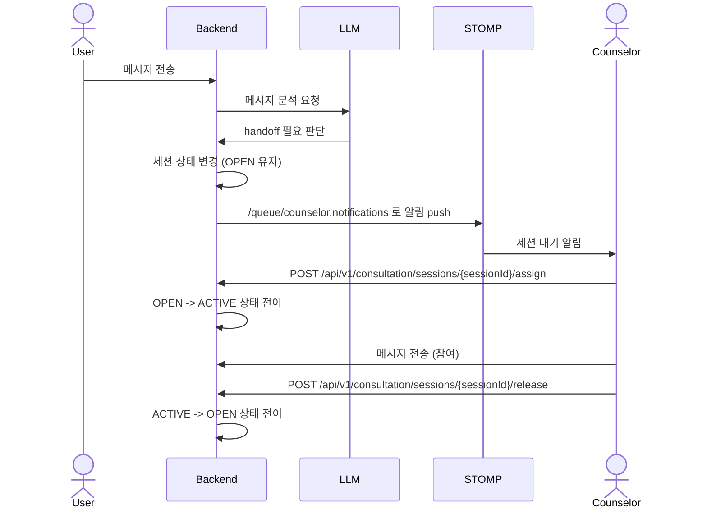
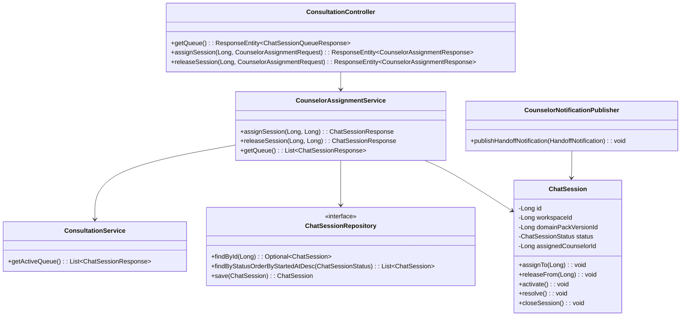

# [BE-5.3.4] 상담사 개입 기능

> **Backlog**: 5.3.4 BE 상담사 개입 기능
> **Bounded Context**: `workflow-runtime`
> **Template**: `_TEMPLATE_BE.md`
> **Branch**: `spec/5.3.4`
> **작업 브랜치 (구현 단계)**: `feature/5.3.4-counselor-intervention`

---

## Goal

LLM assistant가 처리하기 어려운 상황에서 상담사에게 세션을 전환(human handoff)하고, 상담사가 세션을 할당받아 참여할 수 있는 기능을 정의한다.

이 스펙은 상담사 개입 프로세스의 상태 전이, 상담사 세션 할당과 해제, STOMP 기반 상담사 알림, 데이터 저장 기준을 고정한다.

---

## Sequence Diagram



### 상태 전이 규칙

| 이벤트 | 이전 상태 | 다음 상태 | 비고 |
|--------|-----------|-----------|------|
| LLM handoff 판단 | OPEN | OPEN | 상담사 큐에 남기고 알림만 발행한다. 신규 상태를 추가하지 않는다. |
| 상담사 할당 | OPEN | ACTIVE | `assignedCounselorId`를 저장한다. |
| 상담사 참여 메시지 | ACTIVE | ACTIVE | 메시지 `senderRole`은 `operator`로 기록한다. |
| 상담사 해제 | ACTIVE | OPEN | `assignedCounselorId`를 초기화하고 큐에 복귀한다. |
| 상담 완료 처리 | ACTIVE | RESOLVED 또는 COMPLETED | 기존 `ChatSessionStatus`만 사용한다. |

---

## REST API

### Endpoint

| Method | Path | Description |
|--------|------|-------------|
| GET | /api/v1/consultation/queue | 상담사 대기 세션 목록 조회 |
| POST | /api/v1/consultation/sessions/{sessionId}/assign | 상담사에게 세션 할당 |
| POST | /api/v1/consultation/sessions/{sessionId}/release | 상담사 세션 해제 |

### GET /api/v1/consultation/queue

대기 중인 상담 세션 목록을 조회한다. 기존 `ConsultationService.getActiveQueue()`를 사용하며, `OPEN` 상태인 세션만 반환한다.

#### Request

```http
GET /api/v1/consultation/queue
```

Request body 없음.

#### Response

**200 OK**

```json
[
  {
    "sessionId": 1001,
    "workspaceId": 1,
    "domainPackVersionId": 101,
    "status": "OPEN",
    "channel": "DEMO_WEB",
    "assignedCounselorId": null,
    "customerInfo": {
      "customerId": 501,
      "displayName": "김고객"
    },
    "lastMessage": "배송 전 주문 취소 가능한가요?",
    "intent": "cancel_order",
    "priority": "HIGH",
    "startedAt": "2026-05-20T10:00:00Z"
  }
]
```

### POST /api/v1/consultation/sessions/{sessionId}/assign

`OPEN` 상태 세션을 상담사에게 할당하고 `ACTIVE` 상태로 전환한다.

#### Request

```json
{
  "counselorId": 42
}
```

#### Response

**200 OK**

```json
{
  "sessionId": 1001,
  "status": "ACTIVE",
  "assignedCounselorId": 42,
  "assignedAt": "2026-05-20T10:01:00Z"
}
```

**400 Bad Request**

이미 `ACTIVE`, `RESOLVED`, `COMPLETED` 상태인 세션을 할당하려고 하면 실패한다.

```json
{
  "error": "INVALID_SESSION_STATE",
  "message": "assignSession() requires status OPEN but was ACTIVE"
}
```

**404 Not Found**

```json
{
  "error": "SESSION_NOT_FOUND",
  "message": "Session not found: 9999"
}
```

### POST /api/v1/consultation/sessions/{sessionId}/release

상담사에게 할당된 `ACTIVE` 상태 세션을 해제하고 `OPEN` 상태로 되돌린다.

#### Request

```json
{
  "counselorId": 42
}
```

#### Response

**200 OK**

```json
{
  "sessionId": 1001,
  "status": "OPEN",
  "assignedCounselorId": null,
  "releasedAt": "2026-05-20T10:05:00Z"
}
```

**400 Bad Request**

할당된 상담사와 요청 상담사가 다르거나, 세션이 `ACTIVE`가 아니면 실패한다.

```json
{
  "error": "INVALID_SESSION_STATE",
  "message": "releaseSession() requires assigned counselor 42"
}
```

**404 Not Found**

```json
{
  "error": "SESSION_NOT_FOUND",
  "message": "Session not found: 9999"
}
```

### STOMP Notifications

상담사 알림은 STOMP 개인 큐로 발행한다.

| Destination | 대상 | 설명 |
|-------------|------|------|
| `/queue/counselor.notifications` | 상담사 | LLM이 handoff 필요를 판단한 세션 대기 알림 |

#### Trigger

LLM 분석 결과가 human handoff 필요로 반환되면 Backend가 세션을 `OPEN` 상태로 유지한 뒤 알림을 발행한다.

#### Payload

```json
{
  "sessionId": 1001,
  "customerInfo": {
    "customerId": 501,
    "displayName": "김고객"
  },
  "intent": "cancel_order",
  "priority": "HIGH",
  "timestamp": "2026-05-20T10:00:30Z"
}
```

#### Delivery Rule


- 알림은 상담사 전용 개인 큐로만 전송한다.
- 알림 발행은 세션 상태를 `ACTIVE`로 바꾸지 않는다.
- 동일 세션이 이미 상담사에게 할당된 경우 새 대기 알림을 발행하지 않는다.
- 알림 수신 후 실제 소유권은 `POST /assign` 성공 시점에만 확정된다.

---

## Class Design

### DDD Layered Structure



### Application Service

```java
@Service
@Transactional(readOnly = true)
public class CounselorAssignmentService {
    private final ChatSessionRepository chatSessionRepository;
    private final ConsultationService consultationService;

    public CounselorAssignmentService(
            ChatSessionRepository chatSessionRepository,
            ConsultationService consultationService) {
        this.chatSessionRepository = chatSessionRepository;
        this.consultationService = consultationService;
    }

    @Transactional
    public ChatSessionResponse assignSession(Long sessionId, Long counselorId) {
        ChatSession session = findSession(sessionId);
        session.assignTo(counselorId);
        return ChatSessionResponse.from(session);
    }

    @Transactional
    public ChatSessionResponse releaseSession(Long sessionId, Long counselorId) {
        ChatSession session = findSession(sessionId);
        session.releaseFrom(counselorId);
        return ChatSessionResponse.from(session);
    }

    public List<ChatSessionResponse> getQueue() {
        return consultationService.getActiveQueue();
    }

    private ChatSession findSession(Long sessionId) {
        return chatSessionRepository.findById(sessionId)
            .orElseThrow(() -> new NotFoundException(
                "SESSION_NOT_FOUND",
                "Session not found: " + sessionId));
    }
}
```

### ChatSession Entity Extension

기존 `ChatSessionStatus`는 `OPEN`, `ACTIVE`, `RESOLVED`, `COMPLETED`만 유지한다. 상담사 대기, 할당, 해제는 신규 상태가 아니라 `status`와 `assignedCounselorId` 조합으로 표현한다.

```java
@Entity
@Table(name = "chat_session", schema = "runtime")
public class ChatSession {
    @Id
    @GeneratedValue(strategy = GenerationType.IDENTITY)
    private Long id;

    @Enumerated(EnumType.STRING)
    @Column(nullable = false)
    private ChatSessionStatus status;

    @Column(name = "assigned_counselor_id")
    private Long assignedCounselorId;

    public Long getAssignedCounselorId() {
        return assignedCounselorId;
    }

    public void assignTo(Long counselorId) {
        if (this.status != ChatSessionStatus.OPEN) {
            throw new InvalidSessionStateException(
                "assignTo() requires status OPEN but was " + this.status);
        }
        if (counselorId == null) {
            throw new IllegalArgumentException("counselorId is required");
        }
        this.assignedCounselorId = counselorId;
        this.status = ChatSessionStatus.ACTIVE;
    }

    public void releaseFrom(Long counselorId) {
        if (this.status != ChatSessionStatus.ACTIVE) {
            throw new InvalidSessionStateException(
                "releaseFrom() requires status ACTIVE but was " + this.status);
        }
        if (!Objects.equals(this.assignedCounselorId, counselorId)) {
            throw new InvalidSessionStateException(
                "releaseFrom() requires assigned counselor " + this.assignedCounselorId);
        }
        this.assignedCounselorId = null;
        this.status = ChatSessionStatus.OPEN;
    }
}
```

### DTO Shape

```java
public record CounselorAssignmentRequest(Long counselorId) {}

public record CounselorAssignmentResponse(
    Long sessionId,
    ChatSessionStatus status,
    Long assignedCounselorId,
    OffsetDateTime changedAt
) {}

public record HandoffNotification(
    Long sessionId,
    CustomerInfo customerInfo,
    String intent,
    String priority,
    OffsetDateTime timestamp
) {}
```

---

## Tests

### Unit Tests

```java
@DisplayName("ChatSession counselor assignment")
class ChatSessionCounselorAssignmentTest {

    @Test
    @DisplayName("assignTo changes OPEN session to ACTIVE and stores counselor id")
    void assignTo_withOpenSession_changesStatusAndStoresCounselorId() {
        ChatSession session = ChatSession.create(
            1L,
            101L,
            ChatSessionStatus.OPEN,
            "DEMO_WEB",
            "{}"
        );

        session.assignTo(42L);

        assertThat(session.getStatus()).isEqualTo(ChatSessionStatus.ACTIVE);
        assertThat(session.getAssignedCounselorId()).isEqualTo(42L);
    }

    @Test
    @DisplayName("assignTo throws when session is already ACTIVE")
    void assignTo_withActiveSession_throwsException() {
        ChatSession session = ChatSession.create(
            1L,
            101L,
            ChatSessionStatus.OPEN,
            "DEMO_WEB",
            "{}"
        );
        session.assignTo(42L);

        assertThatThrownBy(() -> session.assignTo(43L))
            .isInstanceOf(InvalidSessionStateException.class)
            .hasMessageContaining("status OPEN");
    }

    @Test
    @DisplayName("releaseFrom changes ACTIVE session to OPEN and clears counselor id")
    void releaseFrom_withAssignedSession_reopensAndClearsCounselorId() {
        ChatSession session = ChatSession.create(
            1L,
            101L,
            ChatSessionStatus.OPEN,
            "DEMO_WEB",
            "{}"
        );
        session.assignTo(42L);

        session.releaseFrom(42L);

        assertThat(session.getStatus()).isEqualTo(ChatSessionStatus.OPEN);
        assertThat(session.getAssignedCounselorId()).isNull();
    }

    @Test
    @DisplayName("releaseFrom throws when counselor id does not match")
    void releaseFrom_withDifferentCounselor_throwsException() {
        ChatSession session = ChatSession.create(
            1L,
            101L,
            ChatSessionStatus.OPEN,
            "DEMO_WEB",
            "{}"
        );
        session.assignTo(42L);

        assertThatThrownBy(() -> session.releaseFrom(43L))
            .isInstanceOf(InvalidSessionStateException.class)
            .hasMessageContaining("assigned counselor");
    }
}
```

### Integration Tests

```java
@SpringBootTest
@AutoConfigureMockMvc
@DisplayName("Counselor assignment API")
class CounselorAssignmentControllerTest {

    @Autowired
    private MockMvc mockMvc;

    @Autowired
    private ObjectMapper objectMapper;

    @Test
    @DisplayName("POST /api/v1/consultation/sessions/{sessionId}/assign assigns open session")
    void assignSession_withOpenSession_returnsActiveSession() throws Exception {
        Long sessionId = createOpenSession();
        var request = new CounselorAssignmentRequest(42L);

        mockMvc.perform(post("/api/v1/consultation/sessions/{sessionId}/assign", sessionId)
                .contentType(MediaType.APPLICATION_JSON)
                .content(objectMapper.writeValueAsString(request)))
            .andExpect(status().isOk())
            .andExpect(jsonPath("$.sessionId").value(sessionId))
            .andExpect(jsonPath("$.status").value("ACTIVE"))
            .andExpect(jsonPath("$.assignedCounselorId").value(42L));
    }

    @Test
    @DisplayName("POST /api/v1/consultation/sessions/{sessionId}/assign returns 404 when session does not exist")
    void assignSession_withMissingSession_returnsNotFound() throws Exception {
        var request = new CounselorAssignmentRequest(42L);

        mockMvc.perform(post("/api/v1/consultation/sessions/{sessionId}/assign", 9999L)
                .contentType(MediaType.APPLICATION_JSON)
                .content(objectMapper.writeValueAsString(request)))
            .andExpect(status().isNotFound())
            .andExpect(jsonPath("$.error").value("SESSION_NOT_FOUND"));
    }

    @Test
    @DisplayName("handoff, assign, operator message, release flow returns session to queue")
    void counselorInterventionFlow_returnsReleasedSessionToQueue() throws Exception {
        Long sessionId = createOpenSessionWithHandoffNotification();
        var request = new CounselorAssignmentRequest(42L);

        mockMvc.perform(post("/api/v1/consultation/sessions/{sessionId}/assign", sessionId)
                .contentType(MediaType.APPLICATION_JSON)
                .content(objectMapper.writeValueAsString(request)))
            .andExpect(status().isOk())
            .andExpect(jsonPath("$.status").value("ACTIVE"));

        mockMvc.perform(post("/api/v1/consultation/sessions/{sessionId}/messages", sessionId)
                .contentType(MediaType.APPLICATION_JSON)
                .content("""
                    {
                      "senderRole": "operator",
                      "content": "상담사가 이어서 도와드리겠습니다."
                    }
                    """))
            .andExpect(status().isOk());

        mockMvc.perform(post("/api/v1/consultation/sessions/{sessionId}/release", sessionId)
                .contentType(MediaType.APPLICATION_JSON)
                .content(objectMapper.writeValueAsString(request)))
            .andExpect(status().isOk())
            .andExpect(jsonPath("$.status").value("OPEN"))
            .andExpect(jsonPath("$.assignedCounselorId").isEmpty());

        mockMvc.perform(get("/api/v1/consultation/queue"))
            .andExpect(status().isOk())
            .andExpect(jsonPath("$[?(@.sessionId == %s)]", sessionId).exists());
    }
}
```

### Test Checklist

- [ ] 상담사 할당 시 `OPEN`에서 `ACTIVE`로 상태가 바뀌고 할당자 ID가 저장된다.
- [ ] 이미 `ACTIVE`인 세션에 재할당하면 예외가 발생한다.
- [ ] 상담사 해제 시 `ACTIVE`에서 `OPEN`으로 상태가 복원되고 할당자 ID가 초기화된다.
- [ ] handoff, 할당, `operator` 메시지 참여, 해제 전체 시나리오가 통과한다.
- [ ] 존재하지 않는 세션 할당 시 404를 반환한다.
- [ ] LLM handoff 알림은 `/queue/counselor.notifications`로 발행된다.

---

## Database

### Migration (Liquibase)

`runtime.chat_session`에 상담사 할당 컬럼과 조회 인덱스를 추가한다.

```sql
ALTER TABLE runtime.chat_session
    ADD COLUMN assigned_counselor_id BIGINT REFERENCES app.app_user(id);

CREATE INDEX idx_chat_session_assigned_counselor
    ON runtime.chat_session(assigned_counselor_id);

CREATE INDEX idx_chat_session_queue
    ON runtime.chat_session(status, assigned_counselor_id)
    WHERE status = 'OPEN';
```

### Column Semantics

| Column | Nullable | 의미 |
|--------|----------|------|
| `assigned_counselor_id` | yes | 현재 세션을 담당 중인 상담사 ID. `OPEN` 큐 대기 상태에서는 `null`이다. |

`assigned_counselor_id`는 `app.app_user(id)`를 참조한다. 상담사 권한 검증은 Application Service 또는 인증 계층에서 처리하며, DB 컬럼은 사용자 참조 무결성만 보장한다.

---

## Additional Notes

### Acceptance Criteria

- [ ] Handoff sequence diagram 포함
- [ ] 세션 상태 전이(`OPEN` -> `ACTIVE` -> `RESOLVED` 또는 `COMPLETED`) 정의
- [ ] 상담사 큐, 할당, 해제 REST API 설계 포함
- [ ] STOMP 알림(`/queue/counselor.notifications`) 설계 포함
- [ ] DB 마이그레이션(`assigned_counselor_id`) 포함

### Guardrails

1. 실제 구현 코드, 마이그레이션 파일, 테스트 파일은 이 스펙 작업에서 작성하지 않는다.
2. 유저 채팅 UI(5.3.1) 화면 설계는 포함하지 않는다.
3. `ChatSessionStatus`에 신규 상태를 추가하지 않는다.
4. 상담사는 메시지 기록에서 기존 `operator` 역할을 사용한다.
5. 상담사 할당 소유권은 STOMP 알림 수신 시점이 아니라 `/assign` 성공 시점에만 확정한다.
