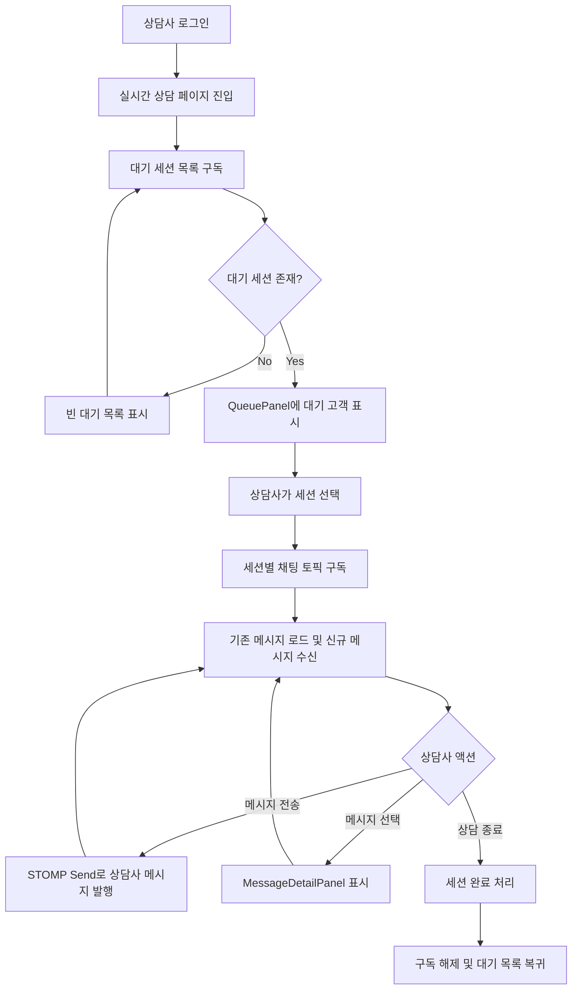

# 5.3.5 Frontend Spec: 상담사 채팅 UI

> Vite+ 기반 프론트엔드 기능 설계 문서다.
> FSD 아키텍처를 따르며, 실제 React 구현은 `impl/5.3.5` 단계에서 진행한다.

---

## Goal

상담사가 대기 세션을 실시간으로 확인하고, 세션별 대화를 STOMP 기반으로 송수신하며, 상담 종료까지 처리할 수 있는 상담사 채팅 UI를 설계한다.

---

## User Flow Chart



---

## Design Diff

### As-is vs To-be

| 영역 | As-is | To-be | 변경 내용 |
|------|-------|-------|----------|
| 대기 세션 동기화 | `frontend/src/pages/consultation/ui/ConsultationPage.tsx:90-119`의 `loadQueue`가 `consultationApi.getQueue()`를 호출하고, `useEffect`에서 `setInterval(loadQueue, 5000)`로 5초마다 대기 세션 목록을 폴링한다. | 페이지 mount 시 `/queue/counselor.notifications`를 구독하고, 대기 세션 생성, 변경, 종료 알림을 받으면 `queue`를 갱신한다. | 5초 polling을 상담사별 STOMP 알림 구독으로 대체한다. 초기 진입 시에는 REST 1회 조회로 스냅샷을 만들고, 이후 변경분은 STOMP 이벤트로 반영한다. |
| 세션 메시지 동기화 | `ConsultationPage.tsx:121-151`의 `useEffect`가 `activeCustomerId` 변경 시 `consultationApi.getMessages(Number(activeCustomerId))`를 호출하고, 선택된 세션 메시지를 `setInterval(loadMessages, 5000)`로 5초마다 폴링한다. | 세션 선택 시 `/topic/chat.{sessionId}`를 구독하고, 신규 메시지 이벤트를 `messages`에 append한다. 세션 변경 또는 unmount 시 이전 세션 구독을 해제한다. | 세션별 메시지 polling을 세션별 STOMP 토픽 구독으로 대체한다. 초기 세션 진입 시에는 REST 1회 조회로 과거 메시지를 로드한다. |
| 메시지 전송 | `ConsultationPage.tsx:161-182`의 `handleSendMessage`가 `consultationApi.sendMessage(Number(targetId), content, isNote)` REST 호출 후 응답 메시지를 로컬 `messages`에 append한다. `ChatPanel.tsx:50-54`는 공백을 검사하고 `onSendMessage(input.trim(), isNoteMode)`를 호출한다. | 상담사 일반 메시지는 STOMP Send로 발행한다. 발행 destination은 백엔드 5.3.2 스펙 파일이 현재 worktree에서 확인되지 않아 미확인 경로로 둔다. 구현 전 백엔드 스펙 또는 실제 controller/message mapping을 확인해 `/app/chat.{sessionId}.send`처럼 세션 ID를 포함한 destination으로 확정해야 한다. 내부 메모는 고객에게 노출되지 않아야 하므로 별도 REST 또는 별도 STOMP destination 여부를 백엔드 계약으로 분리한다. | REST 전송 중심 흐름을 STOMP 발행 중심 흐름으로 바꾼다. 단, 전송 실패 토스트와 입력 초기화 UX는 유지한다. |
| 연결 생명주기 | 현재 `ConsultationPage.tsx:115-119`, `ConsultationPage.tsx:144-150`에서 interval 생성과 `clearInterval`만 관리한다. 연결 상태, reconnect, 구독 해제 상태는 없다. | `ConsultationPage` mount 시 상담사 알림 연결을 열고, unmount 시 `/queue/counselor.notifications` 구독과 WebSocket 연결을 정리한다. `activeCustomerId`가 바뀌면 이전 `/topic/chat.{sessionId}` 구독을 해제하고 새 세션 토픽을 구독한다. reconnect 중에는 `QueuePanel`과 `ChatPanel`에 연결 재시도 상태를 표시하고, reconnect 성공 시 REST 1회 재동기화 후 STOMP 이벤트를 이어 받는다. | timer cleanup에서 WebSocket lifecycle cleanup으로 전환한다. fallback은 자동 폴링 복귀가 아니라 명시적인 재연결 상태 표시와 수동 새로고침으로 제한한다. |
| 대기 목록 UI | `QueuePanel.tsx:20-64`는 `customers`, `activeCustomerId`, `onSelectCustomer`만 받아 목록과 빈 상태를 렌더링한다. `QueuePanel.tsx:55-56`에서 대기 시간과 unread dot을 표시하지만, unread 값은 `ConsultationPage.tsx:106`에서 항상 `false`로 들어간다. | `QueuePanel`은 STOMP 알림으로 갱신된 `hasUnread`, 새 대기 세션, 종료된 세션 제거를 반영한다. 연결 상태가 끊긴 경우 목록 상단에 재연결 중 상태를 표시한다. | 실시간 이벤트를 반영할 수 있도록 `QueueCustomer.hasUnread`를 실제 알림 기반 값으로 채운다. |
| 채팅 패널 UI | `ChatPanel.tsx:40-44`는 `messages` 변경 시 스크롤을 맨 아래로 내린다. `ChatPanel.tsx:66-75`는 선택된 고객이 없을 때 빈 상태를 표시한다. `ChatPanel.tsx:96-156`은 `SYSTEM`, `NOTE`, `CUSTOMER`, `AGENT` 메시지를 렌더링한다. | `ChatPanel`의 렌더링 책임은 유지한다. 실시간 수신, 전송 중, 전송 실패, reconnect 상태는 상위 feature 상태로 계산해 props로 전달한다. | 채팅 UI 구조는 유지하고 데이터 공급 방식을 STOMP 구독 상태로 바꾼다. |
| MessageDetailPanel 전환 | `ConsultationPage.tsx:303-322`는 `selectedMessage`가 있으면 `MessageDetailPanel`, 없으면 `CustomerPanel`을 오른쪽 패널에 렌더링한다. | 동일한 전환 구조를 유지한다. STOMP로 새 메시지가 들어와도 `ConsultationPage.tsx:83-88`의 선택 메시지 정합성 유지 동작처럼 선택된 메시지가 사라지면 상세 패널을 닫는다. | 오른쪽 패널은 기존 구조를 유지하고 메시지 목록 갱신 방식만 바꾼다. |
| Dead code | `ConsultationPage.tsx:10-17`에서 `CustomerInfoPanel`, `StatusBar`를 import한 뒤 `void CustomerInfoPanel`, `void StatusBar`로 미사용 경고만 피한다. render 경로에는 두 컴포넌트가 없다. `CustomerInfoPanel.tsx:16-90`은 고객 정보, 상담 상세, 메모 UI를 제공하지만 현재 페이지는 `ConsultationPage.tsx:310-321`에서 `CustomerPanel`을 사용한다. `StatusBar.tsx:31-87`은 상태, 카테고리, 상담 종료 UI를 제공하지만 현재 페이지는 `StatusRight`와 상단 세션 헤더 버튼으로 상태를 표시한다. | `CustomerInfoPanel`은 삭제보다 활성화를 권장한다. 현재 오른쪽 `CustomerPanel`이 이미 같은 역할을 담당하는지 구현 단계에서 비교한 뒤 하나만 남긴다. `StatusBar`는 삭제를 권장한다. 상태 변경과 상담 종료 UX가 세션 헤더와 topbar로 분산되어 있고, `categories` 상태도 `ConsultationPage.tsx:65-69`에서 선언 후 `void` 처리되어 실제 기능이 없다. | `CustomerInfoPanel`은 고객 상세와 메모 영역 통합 후보로 살리고, `StatusBar`는 별도 상태 편집 요구가 확정되기 전까지 제거 대상으로 둔다. |

---

## Component Tree

```
ConsultationPage
├─ QueuePanel
│  ├─ ConnectionStatusBanner
│  ├─ QueueSummary
│  └─ QueueCustomerItem
├─ ChatPanel
│  ├─ ChatHeader
│  ├─ MessageList
│  │  ├─ SystemMessage
│  │  ├─ InternalNote
│  │  ├─ CustomerMessage
│  │  └─ AgentMessage
│  └─ MessageInput
│     ├─ NoteModeToggle
│     └─ SendButton
├─ SuggestedReplyBar
└─ RightPanel
   ├─ MessageDetailPanel
   └─ CustomerPanel 또는 CustomerInfoPanel
```

---

## API Integration

### Endpoints

| Method | Path | Description |
|--------|------|-------------|
| GET | 기존 `consultationApi.getQueue()` 경로 | 상담 페이지 초기 진입, reconnect 이후 대기 세션 스냅샷 조회 |
| GET | 기존 `consultationApi.getMessages(sessionId)` 경로 | 세션 선택 직후 기존 메시지 스냅샷 조회 |
| PATCH | 기존 `consultationApi.updateStatus(sessionId, 'COMPLETED')` 경로 | 상담 종료 처리 |

### STOMP Destinations

| Direction | Destination | Payload 용도 | UI 반영 |
|-----------|-------------|--------------|---------|
| Subscribe | `/queue/counselor.notifications` | 상담사에게 배정되거나 대기 중인 세션 생성, 상태 변경, unread 변경 알림 | `queue` 추가, 갱신, 제거, `hasUnread` 표시 |
| Subscribe | `/topic/chat.{sessionId}` | 선택된 세션의 고객 메시지, 상담사 메시지, 시스템 메시지 수신 | `messages` append, 선택 메시지 정합성 확인, 스크롤 하단 이동 |
| Send | 미확인 경로, 백엔드 5.3.2 스펙 파일 부재 | 상담사에서 고객으로 보내는 일반 메시지 발행 | 낙관적 추가 또는 서버 echo 수신 후 추가 중 하나로 확정 |

백엔드 5.3.2 스펙 파일(`.agent/specs/5.3.2.md`)은 현재 PR/worktree 기준으로 확인되지 않았다. 따라서 상담사 메시지 발행 destination은 구현 전에 백엔드 스펙 또는 실제 message mapping으로 확정해야 한다. 이 문서에서는 구독 destination만 확정한다.

### Query Key Pattern

```typescript
// entities/consultation/api/queryKeys.ts
export const consultationKeys = {
  all: ['consultation'] as const,
  queue: () => [...consultationKeys.all, 'queue'] as const,
  messages: (sessionId: string) => [...consultationKeys.all, 'messages', sessionId] as const,
};
```

---

## Data Flow

```
┌─────────────────────────────────────────────────────────┐
│                     Page Layer                          │
│  ConsultationPage                                       │
│  - activeCustomerId                                     │
│  - selectedMessageId                                    │
│  - WebSocket lifecycle orchestration                    │
└─────────────────────────────────────────────────────────┘
                           │
                           ▼
┌─────────────────────────────────────────────────────────┐
│                   Feature Layer                         │
│  QueuePanel                                             │
│  - 대기 세션 목록 표시                                  │
│  ChatPanel                                              │
│  - 메시지 목록 표시                                     │
│  - 입력, 내부 메모 모드, 메시지 선택                    │
└─────────────────────────────────────────────────────────┘
                           │
                           ▼
┌─────────────────────────────────────────────────────────┐
│                   Entity Layer                          │
│  Consultation session, chat message types               │
│  STOMP event payload mapping                            │
└─────────────────────────────────────────────────────────┘
                           │
                           ▼
┌─────────────────────────────────────────────────────────┐
│                   Shared Layer                          │
│  API client                                             │
│  STOMP/WebSocket client                                 │
│  toast, design system atoms                             │
└─────────────────────────────────────────────────────────┘
```

---

## 수정 대상 파일

| 파일 | 변경 유형 | 설명 |
|------|----------|------|
| `frontend/src/pages/consultation/ui/ConsultationPage.tsx` | modify | polling interval 제거, 상담사 알림과 세션 토픽 구독 생명주기 연결, 세션 종료 후 구독 정리 |
| `frontend/src/features/consultation/ui/QueuePanel.tsx` | modify | 실시간 연결 상태와 unread 상태 표시 입력 추가 |
| `frontend/src/features/consultation/ui/ChatPanel.tsx` | modify | 전송 중, reconnect, 전송 실패 표시 props 추가. 기존 메시지 렌더링 구조는 유지 |
| `frontend/src/features/consultation/ui/CustomerInfoPanel.tsx` | review | 오른쪽 고객 상세 패널로 활성화할지 `CustomerPanel`과 비교 후 하나만 유지 |
| `frontend/src/features/consultation/ui/StatusBar.tsx` | delete candidate | 현재 render 경로가 없고 세션 헤더와 역할이 중복되어 제거 후보 |
| `frontend/src/features/consultation/api/consultationApi.ts` | modify | 초기 REST 스냅샷과 세션 종료 API만 남기고 메시지 전송 계약은 STOMP 발행 계약과 분리 |
| `frontend/src/shared` 하위 WebSocket 클라이언트 위치 | new candidate | 실제 존재 경로는 구현 전 확인 필요. STOMP client는 shared layer에 두되 FSD 역방향 import를 만들지 않는다. |

---

## State Management

### Server State (TanStack Query)

```typescript
// 초기 스냅샷과 reconnect 후 재동기화에만 사용한다.
// 실시간 변경분은 STOMP event handler가 같은 상태를 갱신한다.
type QueueSnapshot = QueueCustomer[];
type MessageSnapshot = ChatMessage[];
```

### Client State (Local State)

```typescript
interface ConsultationRealtimeState {
  connection: 'connecting' | 'connected' | 'reconnecting' | 'disconnected';
  activeCustomerId: string | null;
  selectedMessageId: string | null;
  queue: QueueCustomer[];
  messages: ChatMessage[];
}
```

상담 페이지 상태는 세션 선택, 오른쪽 패널 전환, 입력 상태처럼 화면에 묶인 값이 많으므로 우선 `ConsultationPage` local state로 유지한다. 여러 페이지에서 같은 실시간 상담 상태를 공유해야 할 때만 store 추출을 검토한다.

---

## Tests

### Test Strategy

| 구분 | 방법 | 도구 | 비고 |
|------|------|------|------|
| 수동 테스트 | 브라우저에서 상담사 로그인 후 대기 세션 수신, 세션 선택, 메시지 송수신 확인 | Chrome DevTools | WebSocket frames와 Network 탭 확인 |
| 컴포넌트 테스트 | QueuePanel, ChatPanel 상태별 렌더링 확인 | Vitest, Testing Library | 연결 상태, 빈 상태, unread, 메시지 타입별 렌더링 |
| 통합 테스트 | STOMP client mock으로 알림과 메시지 이벤트 주입 | Vitest | REST 초기 스냅샷 이후 이벤트 반영 검증 |
| E2E 테스트 | 상담사 채팅 핵심 플로우 확인 | Playwright | 실제 백엔드 또는 계약 mock 필요 |

### Test Environment & 사전 조건

| 항목 | 값 |
|------|---|
| 환경 | `pnpm dev` 또는 Docker Compose 프론트엔드 dev server |
| API Mock | MSW 또는 테스트용 백엔드 |
| WebSocket Mock | STOMP client test double |
| 사전 조건 | 상담사 계정, 대기 세션 1개 이상, 세션별 기존 메시지 1개 이상 |

### Test Scenarios

#### Happy Path

| # | 시나리오 | 사전 조건 | 조작 | 기대 결과 | Figma |
|---|---------|---------|------|----------|-------|
| 1 | 대기 세션 수신 시 큐 갱신 | 상담사 알림 구독 연결됨 | `/queue/counselor.notifications` 이벤트 수신 | QueuePanel에 신규 고객이 추가되고 대기 인원 수가 갱신됨 | 미정 |
| 2 | 세션 선택 시 메시지 구독 | 대기 세션 1개 존재 | 고객 항목 클릭 | 기존 메시지 스냅샷 표시 후 `/topic/chat.{sessionId}` 신규 메시지가 append됨 | 미정 |
| 3 | 상담사 메시지 전송 | 세션 선택됨 | 메시지 입력 후 Enter 또는 Send 클릭 | STOMP Send가 호출되고 메시지가 서버 echo 또는 성공 응답 기준으로 목록에 표시됨 | 미정 |
| 4 | 메시지 상세 확인 | 메시지 목록 표시됨 | 메시지 bubble 클릭 | 오른쪽 패널이 MessageDetailPanel로 전환됨 | 미정 |
| 5 | 상담 종료 | 세션 선택됨 | 상담 종료 클릭 | 세션 상태가 완료 처리되고 채팅 구독 해제, activeCustomerId 초기화, 대기 목록 갱신이 수행됨 | 미정 |

#### Error & Edge Cases

| # | 시나리오 | 조작 | 기대 결과 |
|---|---------|------|----------|
| 1 | STOMP 연결 끊김 | WebSocket 연결 중단 | QueuePanel 또는 ChatPanel에 재연결 중 상태가 표시됨 |
| 2 | reconnect 성공 | 연결 재개 이벤트 발생 | REST 스냅샷 1회 재조회 후 누락 메시지 없이 목록이 갱신됨 |
| 3 | 메시지 전송 실패 | Send frame 실패 또는 서버 오류 | 입력값을 잃지 않고 에러 토스트 표시 |
| 4 | 세션 변경 | A 세션 선택 후 B 세션 선택 | A 세션 `/topic/chat.A` 구독 해제, B 세션 `/topic/chat.B` 구독 시작 |
| 5 | 선택 메시지 삭제 또는 목록 갱신 | 선택된 messageId가 새 목록에 없음 | MessageDetailPanel이 닫히고 CustomerPanel 또는 CustomerInfoPanel이 표시됨 |
| 6 | 대기 세션 없음 | queue 빈 배열 | QueuePanel 빈 상태 문구 표시 |

#### 반응형 & 접근성

| # | 확인 항목 | 기대 결과 |
|---|---------|----------|
| 1 | 데스크톱 1440px | QueuePanel, ChatPanel, 오른쪽 패널이 동시에 표시됨 |
| 2 | 태블릿 768px | 채팅 영역 우선 표시, 오른쪽 패널은 접힘 또는 하단 전환으로 처리 |
| 3 | 모바일 375px | 대기 목록과 채팅을 단계형 화면으로 전환할 수 있음 |
| 4 | 키보드 탐색 | 대기 고객과 메시지 bubble을 Tab으로 이동하고 Enter로 선택 가능 |
| 5 | 스크린 리더 | 연결 상태, unread 상태, 전송 실패 상태가 텍스트로 전달됨 |
| 6 | 포커스 표시 | 메시지 선택과 전송 버튼에 명확한 focus outline 표시 |

---

## Implementation Example

```typescript
// 실제 destination 이름은 백엔드 계약 확인 후 확정한다.
subscribe('/queue/counselor.notifications', handleQueueEvent);
subscribe(`/topic/chat.${sessionId}`, handleChatEvent);
send(confirmedCounselorSendDestination, {
  sessionId,
  content,
  senderRole: 'AGENT',
});
```

---

## Performance Considerations

- 대기 세션과 메시지 이벤트는 id 기준으로 중복 제거한다.
- reconnect 후에는 REST 스냅샷 1회 조회로 누락 이벤트를 보정한다.
- 메시지 목록이 길어지면 가상 스크롤은 3번 이상 성능 문제가 재현될 때 검토한다.
- 세션 변경 시 이전 `/topic/chat.{sessionId}` 구독을 반드시 해제해 중복 이벤트와 메모리 누수를 막는다.
- 전송 실패 시 입력 내용을 유지해 상담사가 같은 내용을 다시 타이핑하지 않게 한다.
