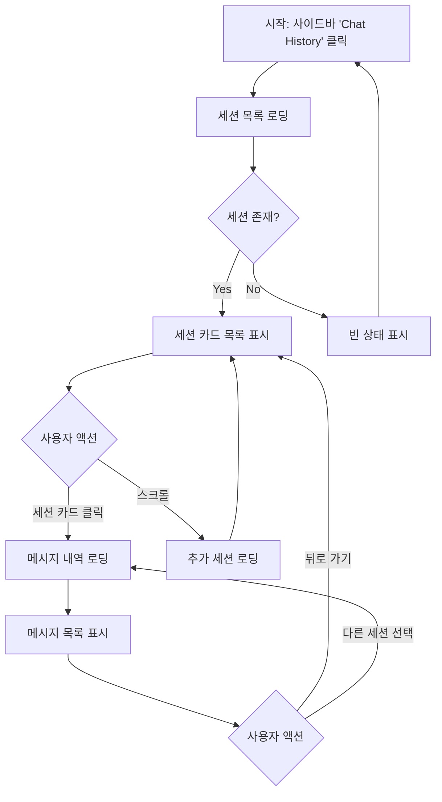

# 5.3.6 FE 상담사 채팅 기록 API 연동

> 이 스펙은 채팅 기록 페이지에서 과거 상담 세션 목록을 조회하고, 선택한 세션의 메시지 내역을 표시하는 기능을 정의한다.
> FSD (Feature-Sliced Design) 아키텍처를 따른다.

---

## Goal

채팅 기록 페이지를 구현하여 상담사가 과거 상담 세션의 메시지 내역을 조회하고 확인할 수 있도록 한다. 페이지네이션을 지원하는 세션 목록 API와 기존 메시지 내역 API를 연동한다.

---

## User Flow Chart



> Gate ON/OFF 분기가 있으면 서브그래프로 분리하여 표기

---

## Design Diff

### As-is vs To-be

| 영역 | As-is | To-be | 변경 내용 |
|------|-------|-------|----------|
| 세션 목록 | 없음 (실시간 대기열만 존재) | 페이지네이션 목록 추가 | `features/chat-history/` 신규 |
| 메시지 조회 | 실시간 채팅 패널에서만 가능 | 독립 채팅 기록 페이지 | 기존 API 재활용 |
| 페이지네이션 | 없음 | cursor/page 기반 무한 스크롤 | UX 개선 |

---

## Component Tree

```
ChatHistoryPage
├─ ChatHistoryHeader
│    └─ PageTitle (채팅 기록)
├─ SessionList
│    ├─ SessionCard
│    │    ├─ SessionInfo
│    │    │    ├─ SessionId
│    │    │    ├─ SessionStatusBadge
│    │    │    └─ SessionTimestamp
│    │    └─ SessionMeta (channel, user info)
│    └─ InfiniteScrollLoader
├─ MessageHistory (세션 선택 시 표시)
│    ├─ MessageBubble
│    │    ├─ SenderLabel (USER / AGENT / NOTE)
│    │    ├─ MessageContent
│    │    └─ MessageTimestamp
│    └─ MessageListScrollContainer
└─ EmptyState
     └─ EmptyMessage
```

---

## API Integration

### Endpoints

| Method | Path | Description | Status |
|--------|------|-------------|--------|
| GET | `/api/v1/consultation/sessions?status=&page=0&size=50` | 세션 목록 조회 (페이지네이션) | 신규 (impl-534 Cycle 5에서 추가 예정) |
| GET | `/api/v1/consultation/sessions/{sessionId}/messages` | 특정 세션 메시지 내역 조회 | 기존 |

### Query Key Pattern

```typescript
// entities/chat-history/api.ts
export const chatHistoryKeys = {
  all: ['chat-history'] as const,
  sessions: () => [...chatHistoryKeys.all, 'sessions'] as const,
  sessionList: (filters: SessionFilters) => [...chatHistoryKeys.sessions(), filters] as const,
  messages: (sessionId: number) => [...chatHistoryKeys.all, 'messages', sessionId] as const,
};

// features/chat-history/api/useSessions.ts
export function useSessions(filters: SessionFilters) {
  return useInfiniteQuery({
    queryKey: chatHistoryKeys.sessionList(filters),
    queryFn: ({ pageParam = 0 }) => fetchSessions({ ...filters, page: pageParam }),
    getNextPageParam: (lastPage, allPages) => {
      return lastPage.length === filters.size ? allPages.length : undefined;
    },
    initialPageParam: 0,
  });
}

// features/chat-history/api/useSessionMessages.ts
export function useSessionMessages(sessionId: number | null) {
  return useQuery({
    queryKey: chatHistoryKeys.messages(sessionId),
    queryFn: () => fetchSessionMessages(sessionId),
    enabled: !!sessionId,
  });
}
```

### Response Types

```typescript
// GET /api/v1/consultation/sessions?page=0&size=50
// Response: ChatSessionResponse[]
interface ChatSessionResponse {
  id: number;
  status?: string;        // OPEN | ACTIVE | RESOLVED | COMPLETED
  channel?: string;
  metaJson?: string;
  startedAt?: string;     // ISO 8601 offset datetime
}

// GET /api/v1/consultation/sessions/{sessionId}/messages
// Response: ChatMessageResponse[]
interface ChatMessageResponse {
  id?: number;
  seqNo?: number;
  senderRole?: string;    // USER | AGENT | NOTE
  messageType?: string;   // TEXT
  content?: string;
  createdAt?: string;     // ISO 8601 offset datetime
}
```

---

## Data Flow

```
┌─────────────────────────────────────────────────────────┐
│                     UI Layer (widgets)                   │
│  ┌─────────────────────────────────────────────────┐   │
│  │ ChatHistoryPage                                  │   │
│  │  - SessionList (session card list)               │   │
│  │  - MessageHistory (message bubbles)              │   │
│  └─────────────────────────────────────────────────┘   │
└─────────────────────────────────────────────────────────┘
                           │
                           ▼
┌─────────────────────────────────────────────────────────┐
│                   Feature Layer                          │
│  ┌─────────────────────────────────────────────────┐   │
│  │ useSessions()                                    │   │
│  │  - useInfiniteQuery (TanStack Query)             │   │
│  │  - fetcher: consultationApi.getSessions()        │   │
│  │  - staleTime: 30_000 (30초)                     │   │
│  ├─────────────────────────────────────────────────┤   │
│  │ useSessionMessages(sessionId)                    │   │
│  │  - useQuery (TanStack Query)                    │   │
│  │  - fetcher: consultationApi.getMessages(id)      │   │
│  │  - enabled: !!sessionId                          │   │
│  │  - staleTime: 60_000 (1분, 기록은 변하지 않음)   │   │
│  └─────────────────────────────────────────────────┘   │
└─────────────────────────────────────────────────────────┘
                           │
                           ▼
┌─────────────────────────────────────────────────────────┐
│                   Feature Layer (API)                    │
│  ┌─────────────────────────────────────────────────┐   │
│  │ consultationApi.getSessions(params)             │   │
│  │  - new method in consultationApi.ts             │   │
│  │  - calls generated consultation-controller      │   │
│  ├─────────────────────────────────────────────────┤   │
│  │ consultationApi.getMessages(sessionId)          │   │
│  │  - existing method (비변경)                      │   │
│  └─────────────────────────────────────────────────┘   │
└─────────────────────────────────────────────────────────┘
                           │
                           ▼
┌─────────────────────────────────────────────────────────┐
│                   Shared Layer                           │
│  ┌─────────────────────────────────────────────────┐   │
│  │ api client, tanstack query config               │   │
│  │ generated consultation-controller hooks          │   │
│  └─────────────────────────────────────────────────┘   │
└─────────────────────────────────────────────────────────┘
```

---

## 수정 대상 파일

| 파일 | 변경 유형 | 설명 |
|------|----------|------|
| `src/entities/chat-history/api.ts` | new | ChatHistoryQueryKeys, fetch 함수 |
| `src/features/consultation/api/consultationApi.ts` | modify | `getSessions()` 메서드 추가 |
| `src/features/chat-history/api/useSessions.ts` | new | 무한 스크롤 query hook |
| `src/features/chat-history/api/useSessionMessages.ts` | new | 메시지 조회 query hook |
| `src/features/chat-history/ui/SessionList.tsx` | new | 세션 카드 목록 컴포넌트 |
| `src/features/chat-history/ui/MessageHistory.tsx` | new | 메시지 내역 컴포넌트 |
| `src/pages/chat-history/ui/ChatHistoryPage.tsx` | new | 페이지 컴포넌트 |
| `src/app/App.tsx` | modify | `/chat-history` 라우트 추가 |

---

## State Management

### Server State (TanStack Query)

```typescript
// entities/chat-history/api.ts
export interface SessionFilters {
  status?: string;
  page: number;
  size: number;
}

export async function fetchSessions(
  filters: SessionFilters
): Promise<ChatSessionResponse[]> {
  return await consultationApi.getSessions(filters);
}

export async function fetchSessionMessages(
  sessionId: number
): Promise<ChatMessageResponse[]> {
  return await consultationApi.getMessages(sessionId);
}
```

### Client State (Local State)

```typescript
// features/chat-history/model/selectedSession.ts
// 간단한 local state로 관리 (상위 컴포넌트에서 useState)
interface ChatHistoryState {
  selectedSessionId: number | null;
  setSelectedSessionId: (id: number | null) => void;
}
```

---

## Pagination Strategy

세션 목록은 **Infinite Query** (무한 스크롤) 방식으로 구현한다.

- 첫 페이지: `GET /api/v1/consultation/sessions?page=0&size=50`
- 다음 페이지: 스크롤 bottom 도달 시 `page` 증가 → `page=1, page=2, ...`
- 종료 조건: 서버 응답 길이가 `size`보다 작으면 더 이상 페이지 없음
- 세션 레벨 staleTime: `30_000` (30초, 새 세션이 생길 수 있음)

메시지 내역은 단순 `useQuery`로 한 번에 로드한다.
- 메시지는 변경되지 않는 기록이므로 staleTime: `60_000` (1분)
- `enabled: !!sessionId`로 세션 선택 시에만 fetch

---

## 라우팅

```
/chat-history                    → ChatHistoryPage (세션 목록)
/chat-history/:sessionId         → ChatHistoryPage (해당 세션 메시지 자동 표시)
```

- `/consultation/:sessionId` (기존)과 별도 URL
- 사이드바에 `chat-history` 메뉴 항목 추가
- URL 기반으로 `selectedSessionId` 초기화 가능

---

## Tests

### Test Strategy

| 구분 | 방법 | 도구 | 비고 |
|------|------|------|------|
| 단위 테스트 | Vitest | `pnpm test` | Hook, API wrapper |
| 컴포넌트 테스트 | Vitest + Testing Library | `pnpm test` | UI 컴포넌트 |
| 통합 테스트 | MSW mocking | `pnpm test` | 세션 → 메시지 플로우 |

### Test Environment & 사전 조건

| 항목 | 값 |
|------|---|
| 환경 | `pnpm dev` |
| API Mock | MSW (Mock Service Worker) 또는 vi.mock |
| 사전 조건 | 과거 상담 세션 3개 이상 존재 |

### Test Scenarios

#### Happy Path

| # | 시나리오 | 사전 조건 | 조작 | 기대 결과 |
|---|---------|---------|------|----------|
| 1 | 세션 목록 조회 | 5개 세션 존재 | 페이지 진입 | 5개 세션 카드 표시 |
| 2 | 세션 선택 후 메시지 조회 | 세션 1개 + 메시지 10개 | 세션 카드 클릭 | 10개 메시지 버블 표시 |
| 3 | 무한 스크롤 | 60개 세션 존재 | 스크롤 bottom 도달 | 추가 10개 로딩 |

#### Error & Edge Cases

| # | 시나리오 | 조작 | 기대 결과 |
|---|---------|------|----------|
| 1 | 네트워크 오류 | WiFi 끊기 | 에러 토스트 표시, 재시도 버튼 |
| 2 | 빈 세션 목록 | 세션 0개 | 빈 상태 화면 ("완료된 상담이 없습니다") |
| 3 | 잘못된 sessionId | URL 직접 입력 | "세션을 찾을 수 없습니다" |
| 4 | 메시지 없음 | 신규 세션 선택 | "메시지가 없습니다" 표시 |

#### 반응형 & 접근성

| # | 확인 항목 | 기대 결과 |
|---|---------|----------|
| 1 | 모바일 뷰포트 (375px) | 세션 리스트 전환, 터치 타겟 44px 이상 |
| 2 | 키보드 탐색 | Tab 이동 + Enter로 세션 선택 |
| 3 | 스크린 리더 | aria-label: "세션 {id}, {status}, {startedAt}" |

---

## Performance Considerations

- 세션 목록은 `useInfiniteQuery`로 무한 스크롤 (초기 로딩 최소화)
- TanStack Query 캐싱으로 동일 세션 재조회 방지
- 메시지 목록은 staleTime 60초 (변경되지 않는 기록)
- 세션 목록 staleTime 30초 (새 세션 반영)
- 과도한 세션 렌더링 방지를 위해 가상 스크롤(virtual scroll)은 필요 시 고려

---

## Implementation Notes

1. **세션 목록 API**: `GET /api/v1/consultation/sessions`는 impl-534 Cycle 5에서 신규 구현 예정. 본 spec에서는 해당 API가 존재한다는 전제로 FE 설계를 진행한다.
2. **메시지 내역 API**: 기존 `GET /api/v1/consultation/sessions/{sessionId}/messages`를 재사용한다. 별도 백엔드 작업 불필요.
3. **consultationApi 확장**: `consultationApi.ts`에 `getSessions()` 메서드만 추가하면 나머지는 기존 API로 처리 가능.
4. **URL 파라미터 활용**: `/chat-history/:sessionId`로 URL 기반 직접 접근 지원.
5. **상태 배지**: `ChatSessionResponse.status` 값에 따라 OPEN=대기중, ACTIVE=진행중, RESOLVED=해결됨, COMPLETED=완료로 표시.
