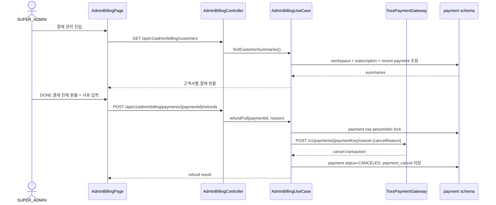

# [Mixed] 500 — cstone 결제 관리와 전체 환불

## Goal

`SUPER_ADMIN`이 CStone 관리자 콘솔에서 고객사별 구독·결제 상태를 조회하고, 결제 완료 건에 한해 Toss cancel API를 통한 전체 환불을 실행할 수 있게 한다.

## Scope

- `SUPER_ADMIN` 전용 결제 관리 API와 화면을 제공한다.
- 고객사별 구독 상태, 결제 기간, 다음 결제일, 최근 결제, 실패 상태를 조회한다.
- 결제 상태가 `DONE`인 결제에 대해서만 전체 환불을 실행한다.
- 환불 사유는 요청 값으로 받아 `payment.payment_cancel.reason`에 저장한다.
- Toss cancel API 요청에는 `cancelReason`만 전달하고 환불 금액 입력은 받지 않는다.
- 응답과 화면에는 `secretKey`, `billingKey`, `paymentKey`, 원본 카드번호를 포함하지 않는다.

## Non-goals

- 부분 환불
- 구독 상태 직접 변경
- 수동 청구
- 별도 감사 로그 테이블
- billingKey 발급, 정기결제 실행, 웹훅 동기화 전체 구현

## Sequence Diagram



## REST API

### Endpoint

| Method | Path | Description | Auth |
|--------|------|-------------|------|
| GET | `/api/v1/admin/billing/customers` | 고객사별 결제 현황 조회 | `SUPER_ADMIN` |
| POST | `/api/v1/admin/billing/payments/{paymentId}/refunds` | 결제 완료 건 전체 환불 | `SUPER_ADMIN` |

`/api/v1/admin/**`는 기존 `backend/src/main/java/com/init/shared/infrastructure/security/SecurityConfig.java`의 `hasRole("SUPER_ADMIN")` 규칙을 따른다. 따라서 일반 `OPERATOR`와 workspace `ADMIN`은 API 접근이 차단된다.

### Response

**GET `/api/v1/admin/billing/customers`**

```json
[
  {
    "workspaceId": 1,
    "workspaceKey": "acme",
    "workspaceName": "Acme",
    "subscription": {
      "status": "ACTIVE",
      "currentPeriodStart": "2026-06-01T00:00:00Z",
      "currentPeriodEnd": "2026-07-01T00:00:00Z",
      "nextBillingAt": "2026-07-01T00:00:00Z",
      "planName": "Pro",
      "planAmount": 29000
    },
    "recentPayment": {
      "id": 10,
      "amount": 29000,
      "status": "DONE",
      "approvedAt": "2026-06-01T00:00:00Z"
    },
    "failedStatus": null
  }
]
```

**POST `/api/v1/admin/billing/payments/{paymentId}/refunds`**

```json
{
  "reason": "고객 요청으로 전체 환불"
}
```

```json
{
  "paymentId": 10,
  "workspaceId": 1,
  "refundAmount": 29000,
  "paymentStatus": "CANCELED",
  "transactionKey": "cancel_tx",
  "canceledAt": "2026-06-03T12:00:00Z",
  "reason": "고객 요청으로 전체 환불"
}
```

### Error Mapping

| Case | Code | Status |
|------|------|--------|
| 결제 없음 | `PAYMENT_NOT_FOUND` | 404 |
| 이미 환불 기록 있음 | `PAYMENT_ALREADY_REFUNDED` | 409 |
| `DONE`이 아닌 결제 | `PAYMENT_NOT_REFUNDABLE` | 400 |
| `paymentKey`가 없거나 공백인 결제 | `PAYMENT_NOT_REFUNDABLE` | 400 |
| Toss 4xx 거절 | `PAYMENT_GATEWAY_REJECTED` | 400 |
| Toss 5xx/network | `PAYMENT_GATEWAY_UNAVAILABLE` | 502 |
| Toss 설정 누락/오류 | `PAYMENT_CONFIGURATION_INVALID` | 500 |

## Class Design

### Backend

```
backend/src/main/java/com/init/payment/
├── presentation/
│   ├── AdminBillingController.java
│   └── dto/
├── application/
│   ├── AdminBillingUseCase.java
│   ├── AdminBillingCustomerSummary.java
│   ├── AdminBillingRefundCommand.java
│   ├── AdminBillingRefundResult.java
│   ├── exception/
│   └── gateway/
├── domain/
│   ├── model/
│   │   ├── Payment.java
│   │   ├── PaymentCancel.java
│   │   ├── PaymentStatus.java
│   │   └── SubscriptionStatus.java
│   └── repository/
└── infrastructure/
    ├── persistence/
    └── toss/
```

- `Payment.refundFull()`이 결제 상태 전이와 `PaymentCancel` 생성을 담당한다.
- `AdminBillingUseCase.refundFull()`은 결제 row를 잠그고, 중복 환불 기록을 확인한 뒤 Toss cancel API를 호출한다.
- `TossPaymentClient`는 Basic auth와 `Idempotency-Key`를 사용하며 민감 값을 로그·응답으로 노출하지 않는다.
- `AdminBillingJdbcQueryRepository`는 고객사별 결제 현황 조회용 read model을 제공한다.

### Frontend

```
frontend/src/pages/admin/ui/AdminBillingPage.tsx
frontend/src/features/admin-billing/
├── api/adminBillingApi.ts
├── index.ts
└── ui/AdminBillingManagement.tsx
```

- `AdminBillingPage`는 기존 admin layout의 `/admin/billing` route에 연결된다.
- `AdminBillingManagement`는 loading/error/empty 상태, 고객사 검색, 새로고침, 환불 확인 dialog를 제공한다.
- `adminBillingApi.ts`는 이 브랜치에서 새로 추가된 backend endpoint라 generated endpoint가 아직 없음을 명시하고 `apiClient`를 직접 사용한다.

## Database

`backend/src/main/resources/db/changelog/db.changelog-master.sql`에 `payment` schema와 다음 테이블을 추가한다.

- `payment.plan`
- `payment.subscription`
- `payment.billing_key`
- `payment.payment`
- `payment.payment_cancel`
- `payment.webhook_event`

`payment.payment_cancel`은 `payment_id` unique 제약으로 전체 환불 중복 기록을 막는다. `payment.billing_key`는 원문 billingKey를 저장하지 않는다.

## Validation

- Backend unit: `Payment.refundFull()`은 `DONE` 결제만 `CANCELED`로 전이하고 전체 금액 cancel 기록을 만든다.
- Backend application: 이미 환불 기록이 있으면 Toss 호출 없이 실패한다.
- Backend WebMvc: `SUPER_ADMIN`은 조회/환불 가능, `OPERATOR`는 `/api/v1/admin/**` 접근이 403이어야 한다.
- Frontend component: 목록 로딩/렌더링, 사유 없는 환불 차단, 정상 환불 시 API 호출과 새로고침을 검증한다.
- Local verification target: `cd backend && ./gradlew test`, `cd frontend && pnpm test`.

## Acceptance Criteria

- [ ] `SUPER_ADMIN`이 고객사별 구독 상태, 결제 기간, 다음 결제일, 최근 결제, 실패 상태를 조회할 수 있다.
- [ ] `SUPER_ADMIN`이 결제 완료 건에 대해 전체 환불을 실행할 수 있다.
- [ ] 환불은 Toss cancel API를 통해 실행된다.
- [ ] 환불 성공 시 결제 상태와 환불 기록이 반영된다.
- [ ] 환불 사유는 요청 값으로 받아 payment cancel 기록에 남긴다.
- [ ] 일반 `OPERATOR`와 workspace `ADMIN`은 결제 admin API와 화면에 접근할 수 없다.
