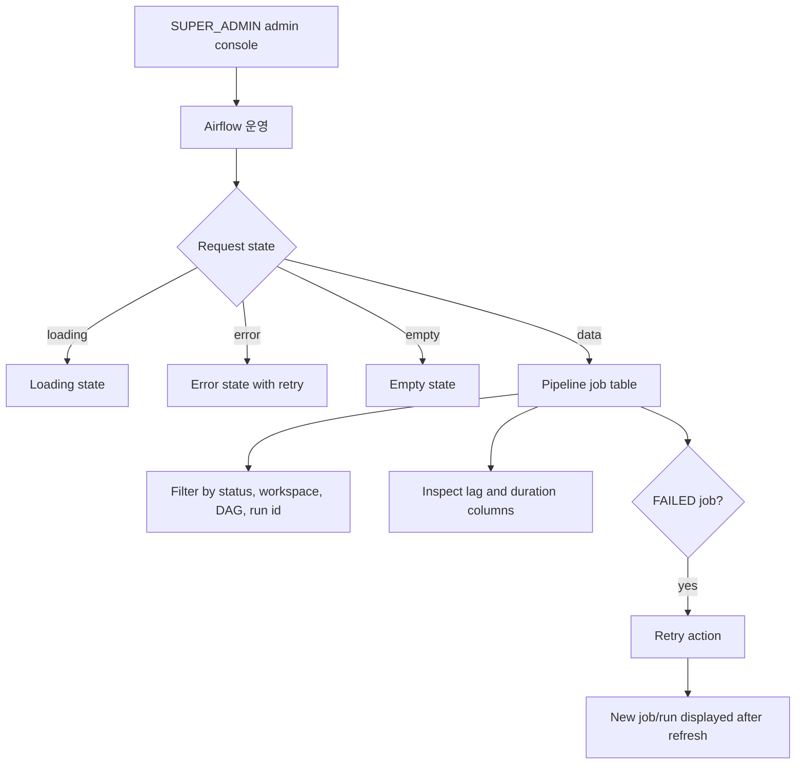

# Admin Pipeline Job Lag Monitoring

## Goal

SUPER_ADMIN이 pipeline job 지연과 실패 상태를 한 화면에서 확인하고, 실패한 Domain Pack generation job을 같은 입력으로 재시도할 수 있게 한다.

## Issue Context

- GitHub Issue: #501 `feat(admin): Airflow job lag 모니터링과 실패 재시도`
- 작업 성격: backend + frontend mixed enhancement
- 최종 작업 브랜치: `feature/501-admin-pipeline-job-monitoring`
- 스펙 파일: `.agent/specs/501.md`

## Scope

- SUPER_ADMIN 전용 admin API로 pipeline job 목록을 조회한다.
- 목록은 status, workspace id, DAG id, run id 검색 조건을 지원한다.
- 각 job에 queue lag, running duration, total duration을 표시한다.
- queue lag가 threshold를 초과한 job을 API 응답과 화면에서 강조한다.
- FAILED Domain Pack generation job을 기존 Spring trigger 흐름으로 재시도한다.
- 재시도 결과로 새 pipeline job/run이 생성되고 원본 job과의 관계를 응답과 목록에서 확인할 수 있다.
- 일반 OPERATOR와 workspace ADMIN은 admin API와 admin 화면에 접근할 수 없다.

## Non-Goals

- Airflow API 직접 clear/retry/stop
- RUNNING/WAITING job 취소
- Slack/email 알림
- 자동 재시도 정책
- Airflow task-level retry 이력 조회

## Backend Design

### Endpoints

| Method | Path | Description |
| --- | --- | --- |
| GET | `/api/v1/admin/pipeline-jobs` | pipeline job 운영 목록 조회 |
| POST | `/api/v1/admin/pipeline-jobs/{pipelineJobId}/retry` | FAILED job 재시도 |

### Query Parameters

| Name | Required | Description |
| --- | --- | --- |
| `status` | no | pipeline job status 필터 |
| `workspaceId` | no | workspace id 필터 |
| `dagId` | no | `airflow_dag_id` 부분 검색 |
| `runId` | no | `airflow_run_id` 부분 검색 |
| `page` | no | 0부터 시작하는 page. 기본값 0 |
| `size` | no | page size. 기본값 20, 최대 100 |
| `lagThresholdSeconds` | no | queue lag 강조 기준. 기본값은 서버 기본값 |

### List Response

```json
{
  "items": [
    {
      "pipelineJobId": 11,
      "workspaceId": 1,
      "datasetId": 7,
      "domainPackId": null,
      "jobType": "DOMAIN_PACK_GENERATION",
      "status": "FAILED",
      "airflowDagId": "domain_pack_generation",
      "airflowRunId": "pipeline_job_11",
      "requestedAt": "2026-06-03T01:00:00Z",
      "startedAt": "2026-06-03T01:01:30Z",
      "finishedAt": "2026-06-03T01:03:00Z",
      "queueLagSeconds": 90,
      "runningDurationSeconds": null,
      "totalDurationSeconds": 180,
      "lagExceeded": true,
      "lastErrorMessage": "Airflow trigger failed",
      "retriedFromPipelineJobId": null,
      "retryPipelineJobId": 12
    }
  ],
  "page": 0,
  "size": 20,
  "totalElements": 1,
  "totalPages": 1
}
```

### Retry Response

```json
{
  "sourcePipelineJobId": 11,
  "retryPipelineJobId": 12,
  "workspaceId": 1,
  "datasetId": 7,
  "jobType": "DOMAIN_PACK_GENERATION",
  "status": "RUNNING",
  "airflowDagId": "domain_pack_generation",
  "airflowRunId": "pipeline_job_12",
  "requestedAt": "2026-06-03T02:00:00Z",
  "startedAt": "2026-06-03T02:00:01Z"
}
```

### Authorization

- `/api/v1/admin/**`는 기존 `SecurityConfig`의 `hasRole("SUPER_ADMIN")` 규칙을 따른다.
- controller/service는 별도의 workspace membership 권한으로 admin 접근을 허용하지 않는다.
- OPERATOR 또는 workspace ADMIN JWT는 403으로 거부된다.
- JWT가 없으면 401로 거부된다.

### Metrics

- queue lag: `started_at - requested_at`
  - `started_at`이 없고 job이 아직 QUEUED이면 `now - requested_at`으로 표시한다.
- running duration: `now - started_at`
  - RUNNING 또는 WAITING 계열 job에만 표시한다.
- total duration: `finished_at - requested_at`
  - `finished_at`이 있는 terminal job에만 표시한다.
- lag threshold 초과 여부는 `queueLagSeconds > lagThresholdSeconds`로 계산한다.

### Retry Rules

- 재시도 대상은 `status = FAILED`인 job으로 제한한다.
- v1 재시도는 `job_type = DOMAIN_PACK_GENERATION`인 job만 지원한다.
- 원본 job의 `workspace_id`, `dataset_id`, request payload의 `objectKey`를 사용해 기존 Domain Pack generation trigger 흐름을 호출한다.
- 새 job의 `triggered_by`는 재시도를 요청한 SUPER_ADMIN 사용자로 기록한다.
- 원본 request payload, dataset id, raw file object key를 확인할 수 없으면 명확한 비즈니스 오류를 반환한다.
- retry는 dataset의 최신 raw file을 다시 조회해 입력을 바꾸지 않는다. 원본 job의 `objectKey`를 재사용해 같은 입력으로 새 run을 만든다.
- 재시도 job은 `retried_from_job_id`로 원본 job을 참조한다.
- 목록 응답은 원본 job의 최신 retry job id와 retry job의 source job id를 모두 노출한다.

### Data Impact

- `pipeline.pipeline_job`에 nullable self-reference column을 추가한다.

```sql
alter table pipeline.pipeline_job
  add column retried_from_job_id bigint references pipeline.pipeline_job(id);

create index idx_pipeline_job_retried_from
  on pipeline.pipeline_job(retried_from_job_id);
```

### Affected Backend Paths

- `backend/src/main/java/com/init/pipelinejob/domain/model/PipelineJob.java`
- `backend/src/main/java/com/init/pipelinejob/domain/repository/PipelineJobRepository.java`
- `backend/src/main/java/com/init/pipelinejob/infrastructure/persistence/JpaPipelineJobRepository.java`
- `backend/src/main/java/com/init/pipelinejob/application/TriggerDomainPackGenerationUseCase.java`
- `backend/src/main/java/com/init/pipelinejob/application/`
- `backend/src/main/java/com/init/pipelinejob/presentation/`
- `backend/src/main/java/com/init/pipelinejob/presentation/dto/`
- `backend/src/main/java/com/init/shared/infrastructure/security/SecurityConfig.java`
- `backend/src/main/resources/db/changelog/db.changelog-master.sql`
- `backend/src/test/java/com/init/pipelinejob/`

## Frontend Design

### Route

| Path | Description |
| --- | --- |
| `/admin/airflow` | pipeline job 운영 현황 화면 |

### User Flow



### UI Requirements

- admin sidebar의 `Airflow 운영` 메뉴가 실제 운영 현황 화면으로 연결된다.
- 필터: status select, workspace id input, DAG id input, run id input, 조회 버튼, 초기화 버튼.
- 표 컬럼: job id, workspace, dataset, status, DAG/run id, queue lag, running duration, total duration, retry relation, error, action.
- lag threshold 초과 row는 monochrome 강조 스타일로 구분한다.
- FAILED job에만 재시도 버튼을 노출한다.
- retry 성공 시 toast와 함께 새 job/run id를 보여주고 목록을 새로고침한다.
- loading/error/empty 상태를 제공한다.
- text는 모바일/데스크톱에서 셀과 버튼 안에 겹치지 않아야 한다.

### API Integration

- Backend OpenAPI 갱신 후 `frontend/src/shared/api/generated/`를 재생성한다.
- feature wrapper는 generated endpoint를 호출하고 response data unwrap, query key, retry mutation 후 목록 갱신을 담당한다.

### Affected Frontend Paths

- `frontend/src/app/App.tsx`
- `frontend/src/pages/admin/ui/AdminLayout.tsx`
- `frontend/src/pages/admin/ui/`
- `frontend/src/features/admin/`
- `frontend/src/shared/api/generated/`

## Acceptance Criteria

- SUPER_ADMIN이 status, workspace id, DAG id, run id로 pipeline job 목록을 검색/필터링할 수 있다.
- queue lag, running duration, total duration이 화면에 표시된다.
- threshold를 초과한 queue lag job이 화면에서 강조된다.
- FAILED job 재시도 시 새 pipeline job/run이 생성된다.
- 원본 job과 retry job의 관계를 목록과 retry 응답에서 확인할 수 있다.
- OPERATOR와 workspace ADMIN은 admin API와 `/admin/airflow` 화면에 접근할 수 없다.
- 재시도할 수 없는 job status/job type이면 명확한 오류를 반환한다.

## Validation Expectations

- Backend tests:
  - admin list 필터와 duration 계산
  - FAILED Domain Pack generation retry 성공 및 원본 request payload의 `objectKey` 재사용
  - non-FAILED retry 거부
  - unsupported job type retry 거부
  - SUPER_ADMIN success, OPERATOR 403, no JWT 401
- Frontend tests:
  - admin airflow route renders the operation screen
  - loading/error/empty/data states
  - filters call API with expected query params
  - lag-exceeded row is highlighted
  - FAILED job retry calls API and refreshes the list
- Local verification:
  - `cd backend && ./gradlew test`
  - `cd backend && ./gradlew generateOpenApiDocs`
  - `cd frontend && pnpm api:gen`
  - `cd frontend && pnpm test`

## Open Questions

- 대량 운영 데이터를 위한 page size 기본값은 20으로 둔다. 더 큰 page size나 server-side 정렬 옵션은 후속 요구사항으로 다룬다.
- v1 retry는 기존 trigger 흐름이 확인된 Domain Pack generation job에 한정한다. ingestion retry는 별도 trigger contract가 확정되면 확장한다.
