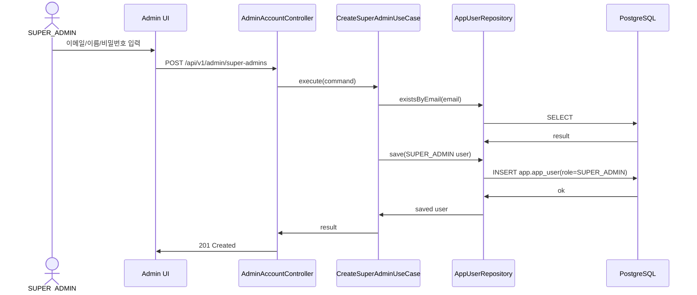

# Backend DDD Spec: cstone admin 권한과 콘솔 셸

## Goal

cstone 내부 운영자만 접근할 수 있는 전역 `SUPER_ADMIN` 권한 모델과 `/admin` 콘솔 진입 기반을 제공한다.

## Background

고객사 workspace 화면과 분리된 내부 운영자 영역을 만들기 위해, 전역 사용자 role과 workspace member role을 명확히 분리한다. `app.app_user.role`은 제품 로그인 사용자의 전역 권한이며 `OPERATOR` 또는 `SUPER_ADMIN`만 가진다. 기존 전역 `ADMIN` 값은 `SUPER_ADMIN`으로 마이그레이션하고, workspace 권한은 계속 `app.workspace_member.member_role`의 `OWNER`, `ADMIN`, `OPERATOR` 등을 사용한다.

## Scope

- `backend/src/main/java/com/init/auth`의 전역 사용자 role 모델을 `OPERATOR | SUPER_ADMIN`으로 정리한다.
- `backend/src/main/resources/db/changelog/db.changelog-master.sql`에 기존 `ADMIN` 전역 role을 `SUPER_ADMIN`으로 전환하는 Liquibase 변경을 추가한다.
- JWT `role` claim과 Spring Security authority가 `SUPER_ADMIN`을 그대로 반영하도록 유지하고 `/api/v1/admin/**` 접근을 `ROLE_SUPER_ADMIN`으로 제한한다.
- `backend/src/main/java/com/init/auth`에 SUPER_ADMIN 계정 생성 유스케이스와 `/api/v1/admin/super-admins` API를 추가한다.
- fresh install에서 SUPER_ADMIN이 0명인 상태를 피하기 위해 `SUPER_ADMIN_EMAIL`, `SUPER_ADMIN_PASSWORD`, 선택 `SUPER_ADMIN_NAME` 환경 변수 기반 초기 계정 bootstrap을 제공한다.
- `frontend/src/app/App.tsx`에 `/admin` 라우트와 SUPER_ADMIN 전용 route guard를 추가한다.
- `frontend/src/pages/admin`에 workspace shell과 분리된 admin shell과 SUPER_ADMIN 계정 생성 화면을 추가한다.
- frontend auth 저장/로그인 후 이동 로직에서 `SUPER_ADMIN`을 admin 콘솔 기본 목적지로 처리한다.

## Non-goals

- 고객사 현황 데이터 조회
- 결제 현황/환불
- Airflow job 조회/재시도
- 감사 로그
- workspace member role 체계 변경

## Sequence Diagram



## REST API

### Endpoint

| Method | Path | Description | Auth |
|--------|------|-------------|------|
| POST | `/api/v1/admin/super-admins` | 새 SUPER_ADMIN 계정 생성 | `ROLE_SUPER_ADMIN` |

### Request

```json
{
  "name": "운영 관리자",
  "email": "admin@example.com",
  "password": "password123"
}
```

### Response

**201 Created**

```json
{
  "id": 123,
  "email": "admin@example.com",
  "name": "운영 관리자",
  "role": "SUPER_ADMIN"
}
```

**400 Bad Request**

입력값 유효성 실패 시 기존 validation error 응답을 사용한다.

**401 Unauthorized**

JWT가 없거나 유효하지 않은 경우 기존 authentication entry point 응답을 사용한다.

**403 Forbidden**

인증 사용자가 `SUPER_ADMIN`이 아닌 경우 Spring Security가 접근을 차단한다.

**409 Conflict**

동일 이메일이 이미 존재하는 경우 기존 `EMAIL_ALREADY_EXISTS` 응답을 사용한다.

## Backend Design

### Affected modules

- `backend/src/main/java/com/init/auth/domain/model/AppUser.java`
- `backend/src/main/java/com/init/auth/domain/model/UserRole.java`
- `backend/src/main/java/com/init/auth/application`
- `backend/src/main/java/com/init/auth/presentation`
- `backend/src/main/java/com/init/shared/infrastructure/security/SecurityConfig.java`
- `backend/src/main/resources/db/changelog/db.changelog-master.sql`

### Domain

- `UserRole.ADMIN`을 제거하고 `UserRole.SUPER_ADMIN`을 추가한다.
- `AppUser.create(...)`는 계속 일반 가입 계정을 `OPERATOR`로 만든다.
- `AppUser.createSuperAdmin(...)` 팩토리는 `SUPER_ADMIN`, `ACTIVE`, `profileJson={}` 상태의 계정을 만든다.

### Application

- `CreateSuperAdminCommand`와 `CreateSuperAdminResult`를 추가한다.
- `CreateSuperAdminUseCase`는 이메일 중복 검사, 비밀번호 해시, 저장, 중복 DB 예외 매핑을 담당한다.
- 기존 공개 signup 플로우는 변경하지 않는다.

### Presentation

- `AdminAccountController`는 `/api/v1/admin/super-admins` 요청/응답 DTO 변환만 수행한다.
- DTO validation은 기존 signup과 동일한 이름/이메일 제약을 사용한다.
- 비밀번호 validation은 BCrypt 인코딩 한계에 맞춰 UTF-8 기준 8바이트 이상 72바이트 이하를 보장한다.

### Security

- `/api/v1/admin/**`는 `hasRole("SUPER_ADMIN")`로 제한한다.
- `/api/v1/consultation/**`, `/api/v1/workflow-runtime/**`의 `OPERATOR` 제한은 유지한다.
- JWT 필터는 `role` claim을 `ROLE_{role}` authority로 변환하는 기존 동작을 유지한다.

### Bootstrap

- `SUPER_ADMIN_EMAIL`과 `SUPER_ADMIN_PASSWORD`가 모두 설정되어 있고 기존 SUPER_ADMIN 계정이 없을 때만 초기 SUPER_ADMIN 계정을 생성한다.
- `SUPER_ADMIN_NAME`이 비어 있으면 `"Super Admin"`을 사용한다.
- 비밀번호가 UTF-8 기준 8바이트 미만 또는 72바이트 초과이면 bootstrap을 건너뛰고 warning log를 남긴다.
- 설정된 이메일이 이미 존재하면 계정 role을 암묵적으로 승격하지 않고 bootstrap을 건너뛰며 warning log를 남긴다.
- 기존 `ADMIN` row가 있는 환경은 Liquibase migration에서 먼저 `SUPER_ADMIN`으로 전환되므로 bootstrap은 추가 계정을 만들지 않는다.

### Database

- Liquibase changeset에서 기존 `app.app_user.role = 'ADMIN'` 값을 `SUPER_ADMIN`으로 갱신한다.
- 이후 `app.app_user.role`은 `OPERATOR`, `SUPER_ADMIN`만 허용하는 check constraint를 가진다.
- `app.workspace_member.member_role`의 `ADMIN` 값은 변경하지 않는다.

## Frontend Design

### Affected modules

- `frontend/src/app/App.tsx`
- `frontend/src/shared/lib/auth.ts`
- `frontend/src/shared/ui`
- `frontend/src/features/auth`
- `frontend/src/features/admin` (new)
- `frontend/src/pages/admin` (new)
- `frontend/src/shared/api/generated`

### Route guard

- `/admin/*`는 인증 여부와 access token의 `role` claim을 확인한다.
- `SUPER_ADMIN`이 아니면 `/workspaces`로 redirect한다.
- 로그인 후 SUPER_ADMIN은 기본적으로 `/admin`으로 이동한다.

### Admin shell

- workspace `OstoneShell`/workspace sidebar와 분리된 admin 전용 shell을 둔다.
- 하위 메뉴 구조는 다음 placeholder를 포함한다.
  - 고객사 현황
  - 결제 관리
  - Airflow 운영
  - 관리자 계정
- 이번 이슈에서 실제 기능 화면은 SUPER_ADMIN 계정 생성만 제공한다.

### Admin account creation

- admin UI는 이름, 이메일, 비밀번호 입력과 제출 버튼을 제공한다.
- 생성 성공 시 새 SUPER_ADMIN의 이메일과 role을 확인할 수 있는 성공 상태를 표시한다.
- validation/API 오류는 form 내부 메시지와 toast로 표시한다.

## Acceptance Criteria

- `app_user.role`에서 cstone 내부 운영자는 `SUPER_ADMIN`으로 구분된다.
- 전역 `ADMIN`은 제거되고, workspace member role의 `ADMIN`은 유지된다.
- `SUPER_ADMIN` JWT로 `/admin`과 `/api/v1/admin/**`에 접근할 수 있다.
- 일반 `OPERATOR`, workspace `OWNER`, workspace `ADMIN`은 admin 화면과 API에 접근할 수 없다.
- SUPER_ADMIN은 admin UI에서 이메일/이름/비밀번호를 입력해 새 SUPER_ADMIN 계정을 만들 수 있다.
- 생성된 SUPER_ADMIN 계정은 입력한 비밀번호로 로그인하면 `role=SUPER_ADMIN`을 받는다.
- admin shell은 고객사 현황, 결제 관리, Airflow 운영 화면을 하위 메뉴로 붙일 수 있는 구조를 가진다.
- fresh install에서는 bootstrap 환경 변수를 설정해 최초 SUPER_ADMIN 계정을 만들 수 있다.

## Validation Plan

- Backend unit/controller/security tests:
  - `AppUser.createSuperAdmin(...)`
  - `CreateSuperAdminUseCase`
  - `AdminAccountController`
  - `/api/v1/admin/**` security boundary
  - SUPER_ADMIN bootstrap runner
  - UTF-8 byte length password validator
- Frontend tests:
  - SUPER_ADMIN admin route 접근 허용
  - OPERATOR admin route 차단
  - localStorage user role 변조로는 admin route 접근 불가
  - SUPER_ADMIN 로그인 기본 목적지
  - admin 계정 생성 form API 호출과 성공/오류 상태
- Generated API:
  - backend OpenAPI 생성 후 `frontend/src/shared/api/generated` 재생성
- Local verification:
  - `cd backend && ./gradlew test`
  - `cd frontend && pnpm test`
  - `cd frontend && pnpm build`

## Open Questions

- 없음
