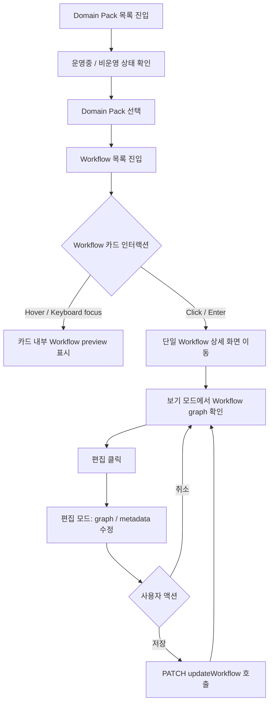

# [FE-511] 데모용 Domain Pack / Workflow UX 리디자인

> **Backlog**: 511 데모용 Domain Pack 및 Workflow 화면 리디자인
> **Bounded Context**: `domain-pack`, `workflow`
> **Template**: `_TEMPLATE_FE.md`
> **Branch**: `spec/511`
> **작업 브랜치 (구현 단계)**: `feature/511-demo-workflow-redesign`

---

## Goal

데모 화면에서 Domain Pack 운영 상태, Workflow 목록/상세/편집 흐름, Intent 조회 화면, 사이드바 사용성을 정돈하여 "AI가 생성한 CS 워크플로우를 운영자가 빠르게 검토하고 명시적으로 저장한다"는 제품 흐름을 명확하게 보여준다.

---

## User Flow Chart



---

## Design Diff

### As-is vs To-be

| 영역 | As-is | To-be | 변경 내용 |
|------|-------|-------|----------|
| Workflow 목록 | 카드를 클릭해야 graph preview가 펼쳐지고, 별도 `열기` 버튼으로 상세 진입 | Hover 또는 keyboard focus 시 graph preview가 보이고, 카드 클릭은 바로 상세 화면으로 이동 | 클릭 의미를 "상세 이동"으로 단순화 |
| Workflow 상세 상단 액션 | 편집 중 상단에 `보기` 버튼이 노출되어 자동 저장처럼 보일 수 있음 | 보기 모드에는 `편집`, 편집 모드에는 `취소`와 `저장`만 노출 | 저장 의도를 명시적으로 분리 |
| Workflow 저장 | 기존 `저장` 버튼에서 PATCH API 호출 | 기존 PATCH API 유지 | 신규 API 없음 |
| Domain Pack 상태 표시 | `운영중`, `비운영` 배지 글씨가 얇게 보임 | 상태 배지를 더 굵고 또렷하게 표시 | 데모 시 상태 인지성 강화 |
| Focus 표시 | 전역 dashed focus outline 및 일부 컴포넌트 점선 outline | 점선 outline 제거, border color와 soft focus ring으로 대체 | 접근성은 유지하되 시각 톤 정돈 |
| Intent 조회 화면 | 다른 Domain Pack 화면 대비 header/list/detail 톤이 다소 분리됨 | Domain Pack/Workflow 화면과 spacing, surface, badge, typography 톤 정렬 | 운영자 도구처럼 차분한 정보 구조 유지 |
| 사이드바 | collapsed/expanded 전환 버튼과 256px expanded width | 접기 버튼 제거, 200px 고정 sidebar로 축소 | 접기 버튼이 차지하던 공간만큼 줄여 데모 화면 가로 공간 확보 |

### Design System Note

`frontend/DESIGN.md`는 현재 dashed focus outline을 기본 디자인 특징으로 설명한다. 이번 511 구현은 사용자 요구에 따라 focus 표현을 다음 기준으로 변경한다.

- `outline: dashed`를 기본 focus 스타일로 사용하지 않는다.
- focus-visible 상태는 `border-color`를 더 진하게 하고, 필요한 경우 낮은 불투명도의 `box-shadow` 또는 ring으로 보조한다.
- 키보드 접근성은 유지한다. focus 상태가 시각적으로 사라지면 안 된다.
- 구현 시 `frontend/DESIGN.md`의 focus 관련 설명도 함께 갱신한다.

### Implementation Decisions

| 항목 | 결정 | 이유 |
|------|------|------|
| Workflow preview 표시 | 카드 hover 또는 keyboard focus 중에만 preview 영역을 렌더링하고, hover/focus가 빠지면 닫는다. | 목록에서는 탐색을 방해하지 않고, 사용자가 관심을 둔 workflow만 빠르게 미리 본다. |
| Workflow preview 데이터 조회 | preview 내부의 `WorkflowGraphMini`가 렌더링되는 시점에 기존 workflow detail query를 사용한다. | hover 전 모든 workflow 상세를 미리 가져오지 않아 API 호출을 줄이고, 신규 endpoint 없이 기존 구조를 재사용한다. |
| Workflow 카드 클릭 | 카드 click 또는 Enter는 preview toggle이 아니라 단일 Workflow 상세 화면 이동으로 고정한다. | click 의미를 "열기"로 단순화하여 데모 흐름을 빠르게 만든다. |
| Workflow 편집 저장 | `저장` 버튼만 `PATCH updateWorkflow`를 호출한다. | `보기`, `취소`, `목록` 같은 탐색 동작이 저장처럼 보이는 혼란을 제거한다. |
| Sidebar width | sidebar는 `200px` 고정 width를 사용한다. | 기존 expanded 256px에서 접기 버튼 영역을 덜어낸 폭으로, nav 정보는 유지하면서 화면 공간을 확보한다. |
| Focus style | dashed/dotted outline 대신 진한 border와 soft ring을 사용한다. | "점선 선택 테두리"의 저품질 인상을 줄이되 keyboard focus 식별성은 유지한다. |

---

## Component Tree

```text
PackWorkflowListPage
└─ WorkflowListView
   ├─ WorkflowSearchBar
   ├─ WorkflowSettingsPanel
   └─ WorkflowCard
      └─ WorkflowGraphMini

WorkflowDraftReadPage
├─ DetailHeader
│  ├─ BackToListButton
│  ├─ WorkflowTitleMeta
│  └─ WorkflowActions
└─ GraphArea
   ├─ GraphViewer
   └─ InlineWorkflowEditor
      └─ WorkflowEditForm
         └─ InteractiveGraphEditor

DomainPackListPage
└─ PackSection
   └─ PackCard
      └─ StatusBadge

IntentDraftReadPage
├─ IntentDraftHeader
├─ IntentTreePanel
└─ IntentDetailSlot

OstoneShell
└─ Sidebar
   ├─ WorkspaceMarker
   ├─ GlobalNavItems
   └─ AccountMenu
```

---

## API Integration

### Existing Endpoints

| Method | Path | Description | 변경 여부 |
|--------|------|-------------|----------|
| GET | `/api/v1/workspaces/{workspaceId}/domain-packs/{packId}/versions/{versionId}/workflows` | Workflow 목록 조회 | 유지 |
| GET | `/api/v1/workspaces/{workspaceId}/domain-packs/{packId}/versions/{versionId}/workflows/{workflowId}` | Workflow 상세 및 graphJson 조회 | hover preview에서 재사용 가능 |
| PATCH | `/api/v1/workspaces/{workspaceId}/domain-packs/{packId}/versions/{versionId}/workflows/{workflowId}` | Workflow name/description/graphJson 저장 | 유지 |

### Request Body: updateWorkflow

```json
{
  "name": "워크플로우 이름",
  "description": "워크플로우 설명",
  "graphJson": {}
}
```

### Query Key / Cache

- 기존 `useGetWorkflowDefinition` detail query를 preview와 상세 화면에서 공유한다.
- Workflow preview는 hover/focus 상태에서만 렌더링한다.
- `WorkflowGraphMini`는 렌더링되는 시점에 기존 detail query를 사용해 graph 데이터를 조회한다.
- hover/focus가 해제되어 preview가 닫히면 preview UI도 unmount된다. TanStack Query cache에 남은 상세 데이터는 재-hover 시 재사용할 수 있다.
- 구현 단순성을 위해 511 범위에서는 별도 prefetch 정책을 추가하지 않는다.
- 신규 backend endpoint는 만들지 않는다.

---

## Data Flow

```text
Workflow 목록
  useListWorkflows
    -> WorkflowListView
      -> WorkflowCard
        -> hover/focus: preview 표시
        -> click/Enter: PackWorkflowListPage.handleOpen
          -> domainPackSectionPath(..., "workflows", workflowId)

Workflow 상세
  useGetWorkflowDefinition
    -> 보기 모드: GraphViewer
    -> 편집 모드: InlineWorkflowEditor
      -> WorkflowEditForm
        -> 저장: useUpdateWorkflow
          -> PATCH updateWorkflow
          -> detail/list query invalidate
          -> 보기 모드 복귀
        -> 취소: mutation 없이 보기 모드 복귀
```

---

## 수정 대상 파일

| 파일 | 변경 유형 | 설명 |
|------|----------|------|
| `frontend/DESIGN.md` | update | dashed focus 규칙을 511 리디자인 기준으로 갱신 |
| `frontend/src/app/index.css` | update | 전역 `*:focus-visible` 점선 outline 제거 및 focus-visible 기본 스타일 조정 |
| `frontend/src/pages/domain-pack/ui/PackWorkflowListPage.tsx` | update | Workflow 목록 click 동작과 preview UX 연결 |
| `frontend/src/features/workflow-list/ui/WorkflowListView.tsx` | update | expanded click 상태 제거 또는 hover/focus preview 상태로 대체 |
| `frontend/src/features/workflow-list/ui/WorkflowCard.tsx` | update | hover/focus preview, click 상세 이동, keyboard 동작 정리 |
| `frontend/src/features/workflow-list/ui/WorkflowGraphMini.tsx` | update | preview loading/error/empty 표현을 목록 카드용으로 정돈 |
| `frontend/src/features/workflow-list/ui/workflow-list-view.module.css` | update | 목록 layout과 preview hover 상태 스타일 조정 |
| `frontend/src/features/workflow-list/ui/workflow-card.module.css` | update | hover preview, focus ring, card footer/action 정리 |
| `frontend/src/pages/domain-pack/ui/WorkflowDraftReadPage.tsx` | update | 편집 중 상단 `보기` 제거, 보기/편집 액션 재배치 |
| `frontend/src/features/update-workflow/ui/WorkflowEditForm.tsx` | update | 저장/취소 액션의 시각적 우선순위 및 명시성 강화 |
| `frontend/src/features/update-workflow/ui/workflowEditForm.module.css` | update | 입력 필드 focus 스타일과 footer/action 디자인 정돈 |
| `frontend/src/pages/domain-pack/ui/DomainPackListPage.tsx` | update | 상태 배지 구조가 필요할 경우 보조 class/data 속성 추가 |
| `frontend/src/pages/domain-pack/ui/domain-pack-list-page.module.css` | update | `운영중`, `비운영` 배지 font-weight와 contrast 강화 |
| `frontend/src/pages/domain-pack/ui/IntentDraftReadPage.tsx` | update | header/action 배치가 필요한 경우 구조 보정 |
| `frontend/src/pages/domain-pack/ui/intent-draft-read-page.module.css` | update | Intent 화면 surface, spacing, badge, typography 톤 정렬 |
| `frontend/src/widgets/ostone-shell/ui/OstoneShell.tsx` | update | sidebar collapsed local state 제거 또는 고정 compact 상태로 단순화 |
| `frontend/src/shared/ui/ostone/chrome/Sidebar.tsx` | update | 접기 버튼 제거, sidebar width 축소, collapsed click-to-expand 제거 |
| `frontend/src/widgets/ostone-shell/ui/OstoneShell.test.tsx` | update | 접기/펼치기 기대값 제거 및 고정 sidebar 검증 |
| `frontend/src/shared/ui/ostone/chrome/Sidebar.test.tsx` | update | 접기 버튼 및 collapsed 동작 관련 테스트 갱신 |
| `frontend/src/pages/domain-pack/ui/WorkflowDraftReadPage.test.tsx` | update | 편집 중 `보기` 제거, 취소/저장 동작 기대값 갱신 |
| `frontend/src/features/workflow-list/ui/WorkflowListView.test.tsx` | update | hover/focus preview 및 click 상세 이동 테스트 |
| `frontend/src/features/workflow-list/ui/WorkflowCard.test.tsx` | update | 카드 interaction 테스트 갱신 |
| `frontend/src/pages/domain-pack/ui/DomainPackListPage.test.tsx` | update | 상태 배지 텍스트/접근성 유지 검증 |
| `frontend/src/pages/domain-pack/ui/IntentDraftReadPage.test.tsx` | update | 구조 변경 시 기존 조회/선택 흐름 유지 검증 |

---

## State Management

### Server State

- Workflow 목록: 기존 `useListWorkflows` 유지
- Workflow 상세/preview: 기존 `useGetWorkflowDefinition` 유지
- Workflow 저장: 기존 `useUpdateWorkflow` 유지

### Client State

| 상태 | 위치 | 설명 |
|------|------|------|
| `hoveredWorkflowId` 또는 CSS hover/focus 상태 | `WorkflowListView` 또는 `WorkflowCard` | preview 표시 여부 |
| `isEditing` | `WorkflowDraftReadPage` | 보기/편집 모드 전환 |
| graph editor internal state | `WorkflowEditForm` | 저장 전 임시 graph 상태 |
| sidebar collapsed state | 제거 예정 | 데모에서는 200px 고정 sidebar 사용 |

### Save / Cancel Rules

- `저장` 버튼만 PATCH API를 호출한다.
- `취소`는 변경사항을 버리고 보기 모드로 돌아간다.
- 편집 중 상단 `보기` 버튼은 제거한다.
- 목록 이동 또는 브라우저 뒤로가기 시 변경사항 확인 모달은 이번 511 범위에서 필수로 구현하지 않는다. 단, 구현 중 변경 감지가 이미 쉽게 가능하면 확인 모달을 추가할 수 있다.

---

## Interaction Requirements

### Workflow 목록

- 카드 hover 시 preview 영역이 열린다.
- 카드에서 pointer가 벗어나면 preview 영역이 닫힌다.
- keyboard 사용자를 위해 카드 focus-visible 시에도 preview 영역이 열린다.
- keyboard focus가 카드 밖으로 빠지면 preview 영역이 닫힌다.
- 카드 click 또는 Enter는 단일 Workflow 상세 화면으로 이동한다.
- 기존 `열기` 버튼은 제거한다. 기본 동작은 카드 전체 click 이동이다.
- preview가 loading/error/empty 상태여도 카드 height가 과하게 흔들리지 않도록 안정적인 높이를 둔다.

### Workflow 상세 / 편집

- 보기 모드 상단에는 `목록`, title/meta, `편집`만 노출한다.
- 편집 모드에서는 `보기` 버튼을 노출하지 않는다.
- 편집 모드의 primary action은 `저장`, secondary action은 `취소`다.
- 저장 성공 후 toast와 함께 보기 모드로 돌아간다.
- 저장 실패 시 기존 `useUpdateWorkflow` error toast를 유지하고 편집 모드에 머문다.

### Focus Style

- dotted/dashed outline은 제거한다.
- focus-visible은 다음 우선순위로 표현한다.
  - input/select/textarea: 더 진한 border + soft ring
  - button/card/link: 더 진한 border 또는 background + soft ring
  - graph node/input: 기존 node token을 유지하되 dashed border는 solid/ring으로 대체
- mouse hover와 keyboard focus가 서로 구분 가능해야 한다.

### Sidebar

- 접기 버튼을 렌더링하지 않는다.
- collapsed 상태 클릭으로 확장되는 동작을 제거한다.
- sidebar는 expanded 정보 구조를 유지하되 `200px` 고정 width를 사용한다.
- 기존 expanded `256px`에서 접기 버튼 영역을 제외한 폭으로 간주한다.
- `ostone:sidebar:collapsed` localStorage 값은 더 이상 layout 상태를 결정하지 않는다.

---

## Acceptance Criteria

### Workflow 목록

- Workflow 카드에 마우스를 올리면 preview 영역이 열린다.
- Workflow 카드에서 마우스가 벗어나면 preview 영역이 닫힌다.
- Workflow 카드에 keyboard focus가 들어오면 preview 영역이 열린다.
- Workflow 카드에서 keyboard focus가 빠지면 preview 영역이 닫힌다.
- Workflow 카드 click 또는 Enter는 단일 Workflow 상세 화면으로 이동한다.
- Workflow 카드 click은 preview open/close toggle로 동작하지 않는다.

### Workflow 상세 / 편집

- 보기 모드에는 `편집` 버튼이 보인다.
- 편집 모드에는 `취소`, `저장` 버튼만 보이고 `보기` 버튼은 렌더링되지 않는다.
- `취소`는 `PATCH updateWorkflow`를 호출하지 않고 보기 모드로 돌아간다.
- `저장`만 `PATCH updateWorkflow`를 호출한다.
- 저장 성공 시 toast를 표시하고 보기 모드로 돌아간다.
- 저장 실패 시 error toast를 표시하고 편집 모드에 머문다.

### Domain Pack / Intent / Sidebar / Focus

- Domain Pack 목록의 `운영중`, `비운영` 배지는 기존보다 굵고 명확하게 보인다.
- Intent 화면의 list/detail/header는 Domain Pack 및 Workflow 화면과 유사한 spacing, surface, badge 톤을 가진다.
- Sidebar 접기 버튼은 렌더링되지 않는다.
- Sidebar는 `200px` 고정 width로 렌더링된다.
- Sidebar 클릭으로 expanded/collapsed 상태가 바뀌지 않는다.
- input/button/card/graph node focus 상태에서 dashed/dotted outline이 보이지 않는다.
- focus 상태는 진한 border 또는 soft ring으로 식별 가능하다.

---

## Tests

### Test Strategy

| 구분 | 방법 | 도구 | 비고 |
|------|------|------|------|
| 컴포넌트 테스트 | interaction 및 rendering 검증 | Vitest + Testing Library | hover/focus/click 중심 |
| 페이지 테스트 | 기존 route/query 흐름 유지 확인 | Vitest + Testing Library | Domain Pack, Workflow, Intent |
| 수동 테스트 | 로컬 Docker Compose 또는 Vite 화면 확인 | Browser | 데모 체감 확인 |
| 접근성 확인 | keyboard tab/focus 확인 | Browser | focus 시각 표시 유지 |

### Test Environment & 사전 조건

| 항목 | 값 |
|------|---|
| 환경 | 루트 `docker compose up -d` 또는 `frontend` 단독 `pnpm dev` |
| 기본 URL | `http://localhost:5173` |
| 사전 조건 | Domain Pack과 Workflow mock/seed 데이터가 존재 |

### Happy Path

| # | 시나리오 | 사전 조건 | 조작 | 기대 결과 |
|---|---------|----------|------|----------|
| 1 | Domain Pack 상태 확인 | 운영중/비운영 pack 존재 | Domain Pack 목록 진입 | `운영중`, `비운영` 배지가 굵고 명확하게 표시 |
| 2 | Workflow hover preview | Workflow 1개 이상 존재 | 목록 카드 hover | 카드 내부에 workflow graph preview 표시 |
| 3 | Workflow keyboard preview | Workflow 1개 이상 존재 | Tab으로 카드 focus | preview 표시 및 focus 상태 식별 가능 |
| 4 | Workflow 상세 이동 | Workflow 1개 이상 존재 | 카드 click | 단일 Workflow 상세 화면으로 이동 |
| 5 | Workflow 편집 취소 | Workflow 상세 진입 | `편집` 클릭 후 `취소` | PATCH 호출 없이 보기 모드 복귀 |
| 6 | Workflow 저장 | Workflow 상세 진입 | `편집` 후 변경, `저장` | PATCH 호출, 성공 toast, 보기 모드 복귀 |
| 7 | Sidebar compact | 앱 shell 진입 | 화면 확인 | 접기 버튼 없음, compact width 적용 |
| 8 | Intent 화면 톤 | Intent 페이지 진입 | 목록/상세 확인 | Domain Pack/Workflow 화면과 유사한 surface, spacing, badge 톤 |

### Error & Edge Cases

| # | 시나리오 | 조작 | 기대 결과 |
|---|---------|------|----------|
| 1 | Workflow preview 상세 조회 실패 | hover preview 상세 API 실패 | 카드에 작고 안정적인 error 상태 표시, 상세 이동은 가능 |
| 2 | Workflow graph 없음 | hover preview | empty graph 상태가 레이아웃을 깨지 않음 |
| 3 | 저장 실패 | `저장` 클릭 후 API 실패 | error toast 표시, 편집 모드 유지 |
| 4 | 키보드 사용 | Tab/Enter 사용 | focus-visible 표시 유지, Enter로 상세 이동 |
| 5 | 모바일 화면 | 375px viewport | Workflow/Intent 화면에서 text overflow 및 action 겹침 없음 |

### 반응형 & 접근성

| # | 확인 항목 | 기대 결과 |
|---|---------|----------|
| 1 | 375px mobile | 목록/상세/Intent 화면에서 액션이 겹치지 않음 |
| 2 | 768px tablet | 2-pane 화면은 기존 mobile selection behavior 유지 |
| 3 | 1440px desktop | compact sidebar 덕분에 content 영역이 안정적으로 보임 |
| 4 | Keyboard navigation | focus가 보이고 Enter/Space 동작이 예측 가능 |
| 5 | Screen reader | 카드/버튼 label이 기존보다 나빠지지 않음 |
| 6 | Contrast | 상태 배지와 focus ring이 배경 대비 충분히 보임 |

---

## Non-goals

- 신규 backend API 추가
- Workflow graph 편집 기능 자체의 도메인 규칙 변경
- autosave 도입
- Workflow 변경사항 이탈 방지 모달 필수 구현
- 사이드바 전체 정보 구조 개편
- Intent revision draft 도메인 로직 변경

---

## Performance Considerations

- hover preview가 모든 카드를 즉시 상세 조회하지 않도록 한다.
- preview query는 preview 렌더링 시점에만 시작하며, 511 범위에서는 별도 prefetch를 추가하지 않는다.
- graph preview는 고정 높이와 lightweight SVG/mini viewer를 우선 사용한다.
- masonry layout에서 hover preview로 인해 지나친 layout shift가 생기면 grid 대신 안정적인 list/grid 구조로 단순화한다.

---

## Verification Commands

```bash
cd frontend && pnpm test
cd frontend && pnpm lint
```

필요 시 로컬 데모 확인은 루트에서 다음 흐름을 사용한다.

```bash
docker compose up -d frontend
```
