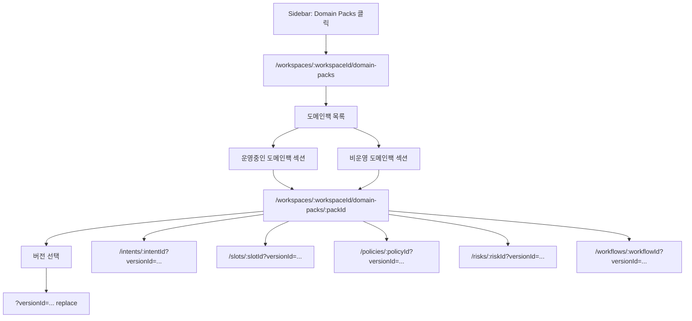

# 512: [FE] Domain Pack 운영 목록 및 상세 라우팅 정리

> **Backlog**: 운영자가 Domain Packs 메뉴에서 도메인팩 목록을 보고, 운영중/비운영 상태와 상세 컴포넌트 라우팅을 안정적으로 탐색하고 싶다.
> **Bounded Context**: `domain-pack` FE
> **Template**: `_TEMPLATE_FE.md`
> **Branch**: `spec/512`
> **Canonical Number**: `512`
> **Type**: Frontend (FSD)
> **작성일**: 2026-05-22
> **수정일**: 2026-05-22

---

## Goal

운영자가 workspace 내부의 `Domain Packs` 메뉴를 눌렀을 때 드롭다운이 아니라 도메인팩 목록 화면으로 진입하고, 목록에서 운영중인 도메인팩과 비운영 도메인팩을 명확히 구분할 수 있게 한다.

도메인팩 상세 화면에서는 버전 선택을 독립 라우트로 다루지 않고, 도메인팩 하위 컴포넌트(`intents`, `slots`, `policies`, `risks`, `workflows`) 중심으로 라우팅한다. 브라우저 뒤로가기/앞으로가기는 화면 단위 이동에만 영향을 주어야 하며, 버전만 바뀌는 히스토리 항목이 쌓이면 안 된다.

## 배경

기존 Domain Pack 흐름에는 다음 문제가 있었다.

- 사이드바의 `Domain Packs` 항목이 도메인팩 목록 진입점이 아니라 드롭다운 트리처럼 동작했다.
- 도메인팩 상세의 하위 화면이 `versions/:versionId/...` 중심으로 라우팅되어 브라우저 히스토리가 버전 변경만으로 오염되었다.
- 운영중/비운영 도메인팩 구분 기준이 화면에서 명확하지 않았다.
- Domain Pack 목록 화면에 업로드 진입 버튼이 포함되어 있었지만, 현재 요구사항에서는 목록의 핵심 동선에 포함하지 않는다.
- 상세 요약 패널의 `승인 준비 상태`는 현재 화면 요구사항 대비 과한 정보라 제거 대상이다.

## User Flow Chart



## Scope Decision

### In Scope

- Domain Pack 목록 query 결과의 현재 운영 버전 필드를 사용한다.
- workspace 기준 운영중인 도메인팩은 최대 하나로 표시한다.
- Domain Pack 목록 화면을 운영중/비운영 섹션으로 나눈다.
- Domain Pack 목록 화면에서 업로드 버튼을 제거한다.
- 사이드바의 `Domain Packs`는 전역 목록 링크로만 동작한다.
- 사이드바에서 도메인팩/워크플로우 트리 드롭다운을 제거한다.
- 도메인팩 상세 라우팅을 버전 중심에서 컴포넌트 중심으로 정리한다.
- 버전 선택은 query string `versionId`로 유지하되 히스토리에는 `replace`로 반영한다.
- 기존 `versions/:versionId/...` URL은 새 컴포넌트 라우트로 리다이렉트한다.
- 상세 요약 패널에서 `승인 준비 상태`를 제거한다.
- `Summary JSON`은 유지한다.

### Out of Scope

- 도메인팩 생성 UI 추가
- 상담 로그 업로드 플로우 추가
- publish/activate 도메인 정책 변경
- review 승인 워크플로우 개편
- 버전 diff, 검색, 정렬, 필터 고도화
- Orval 전체 재생성 자동화

## 운영 상태 정의

운영중 도메인팩은 FE에서 `DomainPack.status`만으로 판단하지 않는다. 목록 query 결과의 `currentVersionId` 존재 여부를 운영중 표시 기준으로 사용한다.

정의는 다음과 같다.

| 구분 | 기준 |
| --- | --- |
| 운영중 도메인팩 | `currentVersionId != null`인 도메인팩 |
| 비운영 도메인팩 | `currentVersionId == null`인 도메인팩 |
| 운영중 도메인팩 개수 | FE 화면에서는 workspace당 최대 1개로 표시되는 것을 기대한다 |
| 현재 운영 버전 정보 | `currentVersionId`, `currentVersionNo`, `currentVersionPublishedAt` |

서버가 어떤 방식으로 현재 운영 버전을 계산하는지는 이 FE 스펙의 범위가 아니다. FE는 전달된 `currentVersion*` 필드를 신뢰하고 화면 표시와 라우팅만 담당한다.

## Existing FE Patterns

아래 기존 파일의 구조와 책임 분리를 따른다. 경로는 현재 repository 기준으로 존재를 확인했다.

| Existing file | 재사용 기준 |
| --- | --- |
| `frontend/src/app/App.tsx` | workspace 하위 route 선언, nested route 구성 방식 |
| `frontend/src/pages/domain-pack/ui/DomainPackSummaryPage.tsx` | pack 상세 화면의 version 선택, query string 관리, summary/detail 조합 |
| `frontend/src/features/domain-pack-summary-read/ui/SummaryDetailPanel.tsx` | version detail loading/error/ready 상태와 JSON summary 표시 패턴 |
| `frontend/src/features/domain-pack-summary-read/ui/ComponentCountGrid.tsx` | intent/slot/policy/risk/workflow 상세 화면 이동 링크 구성 |
| `frontend/src/shared/ui/ostone/chrome/Sidebar.tsx` | global navigation active state와 workspace base path 처리 |
| `frontend/src/widgets/ostone-shell/ui/OstoneShell.tsx` | sidebar와 page content를 조합하는 shell boundary |
| `frontend/src/shared/api/generated/zod/domainPackSummaryResult.zod.ts` | 목록 query item의 runtime schema 동기화 지점 |

구조 결정:

- route 선언과 legacy redirect는 `app`/`pages` 계층에서 처리한다.
- domain pack route helper는 여러 page에서 공유되므로 `shared/lib`에 둔다.
- sidebar는 global navigation만 담당하고 domain pack 내부 트리 상태를 갖지 않는다.
- summary/detail 컴포넌트는 기존 `features/domain-pack-summary-read`의 UI 상태 패턴을 유지한다.

## Design Diff

| 항목 | As-Is | To-Be |
| --- | --- | --- |
| Sidebar `Domain Packs` | 도메인팩/워크플로우 트리 드롭다운 노출 | 목록 화면으로 이동하는 단일 링크 |
| Domain Pack 목록 | 단순 목록 중심 | 운영중/비운영 섹션과 요약 카운트 |
| 업로드 버튼 | 목록 화면에서 노출 | 제거 |
| 상세 라우팅 | `versions/:versionId/...` 중심 | `:packId/intents`, `:packId/workflows` 등 컴포넌트 중심 |
| 버전 선택 | URL path 또는 history entry로 누적될 수 있음 | `?versionId=` query를 `replace`로 갱신 |
| 브라우저 뒤로가기/앞으로가기 | 버전만 바뀌는 이동 발생 | 화면 단위 이동만 발생 |
| Summary Detail | `승인 준비 상태` 포함 | `승인 준비 상태` 제거, `Summary JSON` 유지 |

## Route Structure

```text
/workspaces/:workspaceId/domain-packs
/workspaces/:workspaceId/domain-packs/:packId
/workspaces/:workspaceId/domain-packs/:packId/intents
/workspaces/:workspaceId/domain-packs/:packId/intents/:intentId
/workspaces/:workspaceId/domain-packs/:packId/slots
/workspaces/:workspaceId/domain-packs/:packId/slots/:slotId
/workspaces/:workspaceId/domain-packs/:packId/policies
/workspaces/:workspaceId/domain-packs/:packId/policies/:policyId
/workspaces/:workspaceId/domain-packs/:packId/risks
/workspaces/:workspaceId/domain-packs/:packId/risks/:riskId
/workspaces/:workspaceId/domain-packs/:packId/workflows
/workspaces/:workspaceId/domain-packs/:packId/workflows/:workflowId
/workspaces/:workspaceId/domain-packs/:packId/workflows/:workflowId/graph
```

버전은 다음처럼 query string으로 전달한다.

```text
/workspaces/:workspaceId/domain-packs/:packId/intents/:intentId?versionId=123
```

기존 URL 호환을 위해 아래 레거시 라우트는 새 라우트로 리다이렉트한다.

```text
/workspaces/:workspaceId/domain-packs/:packId/versions/:versionId
/workspaces/:workspaceId/domain-packs/:packId/versions/:versionId/*
```

### Legacy Route Redirect Mapping

| Legacy route | New route |
| --- | --- |
| `versions/:versionId` | `.` + `?versionId=:versionId` |
| `versions/:versionId/intents` | `intents?versionId=:versionId` |
| `versions/:versionId/intents/:intentId` | `intents/:intentId?versionId=:versionId` |
| `versions/:versionId/slots` | `slots?versionId=:versionId` |
| `versions/:versionId/slots/:slotId` | `slots/:slotId?versionId=:versionId` |
| `versions/:versionId/policies` | `policies?versionId=:versionId` |
| `versions/:versionId/policies/:policyId` | `policies/:policyId?versionId=:versionId` |
| `versions/:versionId/risks` | `risks?versionId=:versionId` |
| `versions/:versionId/risks/:riskId` | `risks/:riskId?versionId=:versionId` |
| `versions/:versionId/workflows` | `workflows?versionId=:versionId` |
| `versions/:versionId/workflows/:workflowId` | `workflows/:workflowId?versionId=:versionId` |
| `versions/:versionId/workflows/:workflowId/graph` | `workflows/:workflowId/graph?versionId=:versionId` |

알 수 없는 legacy suffix는 pack summary route에 `?versionId=:versionId`를 붙여 이동한다. 잘못된 세부 path를 보존해 404를 만들기보다 사용자가 선택한 version context를 유지하는 쪽을 우선한다.

## Component Tree

```text
app/App.tsx
└─ pages/domain-pack
   ├─ DomainPackListPage
   ├─ DomainPackRouteOutlet
   ├─ DomainPackSummaryPage
   ├─ LegacyDomainPackVersionRedirect
   ├─ IntentDraftReadPage
   ├─ SlotDraftReadPage
   ├─ PolicyDraftReadPage
   ├─ RiskDraftReadPage
   ├─ PackWorkflowListPage
   ├─ WorkflowDraftReadPage
   └─ WorkflowGraphViewerPage

widgets/ostone-shell
└─ OstoneShell
   └─ shared/ui/ostone/chrome/Sidebar
```

FSD 의존성 방향은 `app -> pages -> widgets -> features -> entities -> shared`를 따른다. `shared`에서 `pages`, `widgets`, `features`, `entities`를 import하지 않는다.

## FE Data Contract

### DomainPackSummaryResult

목록 카드와 운영 상태 계산에 필요한 generated item 필드는 다음과 같다.

| 필드 | 타입 | 설명 |
| --- | --- | --- |
| `id` | number | Domain Pack ID |
| `name` | string | Domain Pack 이름 |
| `description` | string \| null | 설명 |
| `status` | string | Domain Pack 자체 상태 |
| `currentVersionId` | number \| null | workspace 기준 현재 운영 버전 ID |
| `currentVersionNo` | number \| null | 현재 운영 버전 번호 |
| `currentVersionPublishedAt` | string \| null | 현재 운영 버전 게시 시각 |
| `updatedAt` | string | 도메인팩 수정 시각 |

프론트엔드의 generated zod schema도 위 필드와 동기화되어야 한다. Orval 재생성 환경이 준비되지 않은 경우 수동 반영은 허용하되, 추후 Orval 실행 시 같은 스키마가 유지되어야 한다.

## Data Flow

1. Domain Pack 목록 query 결과를 받는다.
2. `currentVersionId != null` 기준으로 운영중/비운영 목록을 분리한다.
3. Domain Pack 카드 클릭 시 `:packId` 상세로 이동한다.
4. 상세 내부에서 버전을 선택하면 `?versionId=`만 `replace`로 갱신한다.
5. Intent/Slot/Policy/Risk/Workflow 화면 이동은 컴포넌트 라우트 path를 변경하고, 선택 버전은 query string으로 이어받는다.

## State Management

- Domain Pack 목록과 상세 데이터는 기존 API query hook 흐름을 사용한다.
- 운영중/비운영 분류는 서버 응답의 `currentVersionId`를 기준으로 화면에서 계산한다.
- 선택 버전은 `versionId` query string으로 표현한다.
- 버전 선택, 신규 draft 생성 후 선택 버전 갱신은 `setSearchParams(..., { replace: true })` 방식으로 처리한다.
- 사이드바는 도메인팩 트리 상태를 갖지 않는다.
- 상세 하위 화면의 active nav는 현재 컴포넌트 라우트를 기준으로 계산한다.

## Navigation Boundary

| 사용자 액션 | URL 변경 | History 동작 | 이유 |
| --- | --- | --- | --- |
| Sidebar `Domain Packs` 클릭 | `/domain-packs` | push | 전역 메뉴 이동 |
| Domain Pack 카드 클릭 | `/domain-packs/:packId` | push | pack 상세 화면 이동 |
| 상세에서 버전 선택 | `?versionId=...` | replace | 버전은 화면 단위가 아니라 상세 context |
| draft 생성 후 새 버전 선택 | `?versionId=...` | replace | 생성 결과 context 갱신 |
| Intent/Slot/Policy/Risk 메뉴 클릭 | `/:component` 또는 `/:component/:id?versionId=...` | push | 실제 하위 화면 이동 |
| Workflow graph 보기 | `/workflows/:workflowId/graph?versionId=...` | push | 별도 화면 이동 |
| Legacy route 진입 | 새 route + `?versionId=...` | replace | 호환 redirect가 히스토리를 오염시키지 않음 |

브라우저 뒤로가기/앞으로가기는 pack 목록, pack summary, component detail, workflow graph 같은 화면 단위 사이를 이동해야 한다. 버전 선택만으로 이전/다음 히스토리 항목이 생기면 안 된다.

## Screen States

### DomainPackListPage

| 상태 | 조건 | 화면 |
| --- | --- | --- |
| loading | 목록 query pending | 기존 페이지 톤에 맞는 로딩 상태 |
| error | 목록 query 실패 | 재시도 가능한 에러 상태 |
| empty | 목록 query 성공 + item 없음 | 빈 상태 표시, 업로드 버튼/링크 없음 |
| operating only | 운영중 item만 존재 | 운영중 섹션과 카운트 표시, 비운영 섹션은 비어있는 상태 처리 |
| non-operating only | 비운영 item만 존재 | 비운영 섹션 표시, 운영중 섹션은 비어있는 상태 처리 |
| mixed | 운영중/비운영 item 모두 존재 | 두 섹션 분리 표시 |

### DomainPackSummaryPage

| 상태 | 조건 | 화면 |
| --- | --- | --- |
| version 미선택 | `versionId` query 없음 | 버전 선택 안내 |
| version 선택 | `versionId` query 존재 | 선택 version detail 조회 |
| version 선택 변경 | 사용자가 version list item 클릭 | 같은 화면에서 query만 replace |
| component 이동 | intent/slot/policy/risk/workflow 링크 클릭 | component route로 push 이동 |
| legacy 접근 | `versions/:versionId/...` path 진입 | 새 route로 replace redirect |

### SummaryDetailPanel

| 항목 | 처리 |
| --- | --- |
| `승인 준비 상태` | 제거 |
| `Summary JSON` | 유지 |
| activate/readiness UI | 이번 스펙 화면에서 노출하지 않음 |

## 수정 대상 파일

| 파일 | 변경 유형 | 설명 |
| --- | --- | --- |
| `frontend/src/app/App.tsx` | modify | Domain Pack 상세 라우팅을 컴포넌트 중심으로 재구성 |
| `frontend/src/pages/domain-pack/ui/DomainPackListPage.tsx` | modify | 운영중/비운영 목록 UI, 업로드 버튼 제거 |
| `frontend/src/pages/domain-pack/ui/domain-pack-list-page.module.css` | new | 목록 화면 스타일 추가 |
| `frontend/src/pages/domain-pack/ui/DomainPackSummaryPage.tsx` | modify | 버전 선택을 query string replace로 처리 |
| `frontend/src/pages/domain-pack/ui/DomainPackRouteOutlet.tsx` | new | Domain Pack 상세 parent route outlet |
| `frontend/src/pages/domain-pack/ui/LegacyDomainPackVersionRedirect.tsx` | new | 기존 version path를 새 라우트로 리다이렉트 |
| `frontend/src/pages/domain-pack/ui/IntentDraftReadPage.tsx` | modify | `?versionId=` 기반 상세 조회 및 라우팅 |
| `frontend/src/pages/domain-pack/ui/SlotDraftReadPage.tsx` | modify | `?versionId=` 기반 상세 조회 및 라우팅 |
| `frontend/src/pages/domain-pack/ui/PolicyDraftReadPage.tsx` | modify | `?versionId=` 기반 상세 조회 및 라우팅 |
| `frontend/src/pages/domain-pack/ui/RiskDraftReadPage.tsx` | modify | `?versionId=` 기반 상세 조회 및 라우팅 |
| `frontend/src/pages/domain-pack/ui/PackWorkflowListPage.tsx` | modify | workflow 목록을 컴포넌트 route 기준으로 연결 |
| `frontend/src/pages/domain-pack/ui/WorkflowDraftReadPage.tsx` | modify | workflow 상세를 query version 기준으로 조회 |
| `frontend/src/pages/domain-pack/ui/WorkflowGraphViewerPage.tsx` | modify | workflow graph를 query version 기준으로 조회 |
| `frontend/src/shared/lib/domainPackRoutes.ts` | new | Domain Pack route helper 추가 |
| `frontend/src/shared/ui/ostone/chrome/Sidebar.tsx` | modify | 도메인팩 트리 제거, 단일 링크화 |
| `frontend/src/shared/ui/ostone/chrome/useSidebarTreeData.ts` | remove | sidebar domain pack tree fetch 제거 |
| `frontend/src/shared/ui/ostone/chrome/useSidebarTreeData.test.ts` | remove | 제거된 sidebar tree hook 테스트 제거 |
| `frontend/src/widgets/ostone-shell/ui/OstoneShell.tsx` | modify | sidebar tree fetch 제거 |
| `frontend/src/shared/api/generated/zod/domainPackSummaryResult.zod.ts` | modify | 목록 응답 필드와 zod schema 동기화 |

## Validation Criteria

| 시나리오 | 기대 결과 |
| --- | --- |
| 사이드바에서 `Domain Packs` 클릭 | `/workspaces/:workspaceId/domain-packs` 목록으로 이동 |
| Domain Pack 상세/하위 화면 진입 | 사이드바에 도메인팩 목록 드롭다운이 노출되지 않음 |
| 운영 버전이 있는 Domain Pack 존재 | `운영중인 도메인팩` 섹션에 1개만 표시 |
| 운영 버전이 없는 Domain Pack 존재 | `비운영 도메인팩` 섹션에 표시 |
| 운영중 Domain Pack 카드 | `운영중` 배지와 현재 버전 번호 표시 |
| 비운영 Domain Pack 카드 | `비운영` 배지와 `운영 버전 없음` 표시 |
| 목록 화면 | 업로드 버튼/링크가 노출되지 않음 |
| 상세에서 버전 선택 | URL query의 `versionId`가 바뀌지만 history entry가 추가되지 않음 |
| 뒤로가기/앞으로가기 | 버전만 바뀌는 이동이 아니라 이전/다음 화면으로 이동 |
| 레거시 `versions/:versionId/...` URL 접근 | 새 컴포넌트 라우트와 `?versionId=`로 리다이렉트 |
| Summary Detail | `승인 준비 상태` 미노출, `Summary JSON` 유지 |
| API 실패 | 기존 에러 상태와 재시도 동선 유지 |
| 빈 목록 | 빈 상태를 표시하되 업로드 버튼은 제공하지 않음 |

## Tests

### Test Strategy

| 구분 | 방법 | 도구 | 비고 |
| --- | --- | --- | --- |
| 타입 검사 | TypeScript project build | `pnpm exec tsc -b` | 라우트/query param 타입 오류 확인 |
| 정적 검사 | ESLint | `pnpm exec eslint` | 변경 파일 중심 검사 |
| 컴포넌트 테스트 | Vitest | `pnpm test` | 현재 테스트 런타임 의존성 이슈 별도 추적 |
| 수동 테스트 | 사용자 브라우저 확인 | 로컬 FE | 화면 시각 검수는 사용자 기준 |

### Test Commands

```bash
cd frontend
# TypeScript build is project-wide and covers route helpers, generated zod schema,
# page/controller files, and CSS module import resolution.
pnpm exec tsc -b

# ESLint is scoped to FE artifacts touched by this spec. CSS modules are not
# linted by ESLint; their imports are covered by the project build above.
pnpm exec eslint \
  src/app/App.tsx \
  "src/pages/domain-pack/model/**/*.{ts,tsx}" \
  "src/pages/domain-pack/ui/**/*.{ts,tsx}" \
  src/shared/lib/domainPackRoutes.ts \
  src/shared/api/generated/zod/domainPackSummaryResult.zod.ts \
  "src/shared/ui/ostone/chrome/**/*.{ts,tsx}" \
  "src/widgets/ostone-shell/ui/**/*.{ts,tsx}"
```

기대 결과:

- TypeScript compile이 통과한다.
- 변경 파일 lint가 통과한다.
- FSD 의존성 방향 위반이 없다.

현재 Vitest targeted run은 테스트 assertion 이전에 `html-encoding-sniffer`와 `@exodus/bytes/encoding-lite.js` 사이의 ESM require 문제로 실패할 수 있다. 이 이슈는 본 기능 변경의 런타임 assertion 실패가 아니라 테스트 런타임 의존성 문제로 별도 추적한다.

## Risks / Follow-ups

- Orval 재생성 시 `DomainPackSummaryResult` 스키마 필드가 수동 변경분과 동일하게 유지되는지 확인해야 한다.
- 레거시 `versions/:versionId/...` URL은 사용자가 저장한 링크를 고려해 유지하되, 신규 링크 생성은 컴포넌트 중심 라우트만 사용한다.
- UI 시각 검수는 사용자 확인을 기준으로 진행한다.
