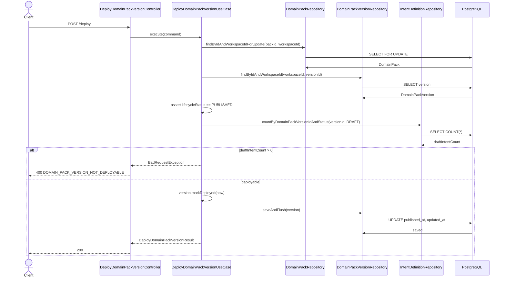

# 5121: [BE] Domain Pack Published 버전 배포중 선택 정책

> **Backlog**: 운영자가 이미 PUBLISHED된 Domain Pack 버전 중 하나를 현재 배포중 버전으로 선택하고, DRAFT 버전은 배포중으로 처리되지 않기를 원한다.
> **Bounded Context**: `domain-pack`
> **Template**: `_TEMPLATE_BE.md`
> **Branch**: `spec/5121`
> **Canonical Number**: `5121`
> **Type**: Backend (Spring Boot DDD)
> **작성일**: 2026-05-22
> **수정일**: 2026-05-23

---

## Goal

DB migration 없이 `domain_pack_version`의 기존 `lifecycle_status`와 `published_at`만으로 현재 배포중인 Domain Pack 버전을 계산한다. 배포 버튼은 DRAFT를 PUBLISHED로 발행하는 동작이 아니라 이미 PUBLISHED된 버전을 현재 배포중 버전으로 선택하는 동작이며, DRAFT Intent가 남아 있는 PUBLISHED 버전은 배포중 후보와 배포 요청 대상에서 제외한다.

## 배경

현재 FE 작업에서는 Domain Pack 목록과 상세 화면에서 `배포중` 버전을 표시한다. 이 표시의 기준은 backend가 내려주는 `currentVersion*` 필드가 되어야 한다.

기존 backend 흐름에는 다음 문제가 있다.

- FE의 배포 버튼은 “이미 발행된 PUBLISHED 버전을 배포중으로 선택”해야 하는데, 현재 연결된 `activate` API는 `DRAFT -> PUBLISHED` 발행 동작이다.
- 따라서 PUBLISHED 버전에 배포 버튼을 누르면 backend는 이미 PUBLISHED인 버전이라 실패한다.
- Domain Pack 목록 API에는 current version 필드가 일부 추가되어 있지만, 상세 API에는 아직 `currentVersionId/currentVersionNo/currentVersionPublishedAt`가 없다.
- 별도 current pointer 컬럼이 없으므로 current version 기준을 명확히 문서화해야 한다.
- 기존 데이터나 이전 로직으로 인해 PUBLISHED 버전 내부에 DRAFT Intent가 남아 있을 수 있으므로, 현재 배포중 표시와 배포 요청 모두 같은 방어 기준을 사용해야 한다.

이번 스펙은 DB migration 없이 다음 정책을 backend에 명확히 반영한다.

## Policy Decision

### Deploy와 Publish 구분

이 스펙에서 `배포`는 `DRAFT -> PUBLISHED` 발행이 아니다.

| 용어 | 의미 | 대상 |
| --- | --- | --- |
| Publish / Activate | DRAFT version을 PUBLISHED로 전이 | DRAFT version |
| Deploy | 이미 PUBLISHED된 version을 현재 배포중 버전으로 선택 | PUBLISHED version |

FE의 배포 버튼은 `Deploy`만 수행한다.

따라서 DRAFT version은 배포 버튼 대상이 아니다. DRAFT version을 PUBLISHED로 만드는 발행/승인 플로우는 별도 정책으로 다룬다.

### Current Version 정책

현재 배포중인 Domain Pack Version은 DB에 별도 포인터를 저장하지 않는다.

대신 workspace 범위에서 다음 조건을 만족하는 1개 버전을 current version으로 간주한다.

```text
lifecycle_status = 'PUBLISHED'
AND NOT EXISTS (
  SELECT 1
  FROM pack.intent_definition i
  WHERE i.domain_pack_version_id = domain_pack_version.id
    AND i.status = 'DRAFT'
)
ORDER BY published_at DESC NULLS LAST, version_no DESC, id DESC
LIMIT 1
```

정책 의미는 다음과 같다.

| 개념 | 정의 |
| --- | --- |
| DRAFT Version | 아직 발행되지 않은 Domain Pack Version |
| PUBLISHED Version | 발행 완료된 Domain Pack Version |
| 배포 가능 PUBLISHED Version | PUBLISHED 상태이고 하위 DRAFT Intent가 0개인 버전 |
| 배포중 Version | 배포 가능 PUBLISHED Version 중 `published_at` 기준 가장 최근에 배포중으로 선택된 버전 |
| 비배포 PUBLISHED Version | PUBLISHED 상태지만 현재 최신 `published_at`이 아닌 버전 |

`DRAFT` 상태 version은 어떤 경우에도 배포중으로 처리하지 않는다.

PUBLISHED 상태라도 하위 DRAFT Intent가 1개 이상 남아 있으면 현재 배포중으로 표시하지 않는다. 이 경우 운영자는 해당 DRAFT Intent를 PUBLISHED 또는 REJECTED로 정리한 뒤 다시 배포해야 한다.

DB migration 없이 과거 PUBLISHED version을 다시 배포중으로 선택하려면 해당 version의 `published_at`을 현재 시각으로 갱신한다. 이 스펙에서 `published_at`은 “처음 발행된 시각”이 아니라 “PUBLISHED 버전이 현재 배포중으로 선택된 마지막 시각”으로 취급한다.

`published_at`의 최초 발행 시각 보존이 필요해지면 `deployed_at` 또는 `current_version_id` 같은 별도 저장소가 필요하므로 DB migration을 재검토한다.

5121 이후 Domain Pack 목록/상세의 current version 기준은 과거의 `versionNo` 최대 PUBLISHED 기준을 대체한다. current는 workspace의 PUBLISHED version 중 DRAFT Intent가 없고 `publishedAt`이 가장 최신인 version이다.

### Workspace Current 범위

현재 FE 스펙 `512.md`에서는 workspace 기준 운영중인 도메인팩이 최대 1개로 표시되는 것을 기대한다.

따라서 5121의 `currentVersionId/currentVersionNo/currentVersionPublishedAt`는 항상 workspace 기준 실제 배포중인 Domain Pack Version만 의미한다.

목록 API에서는 workspace 기준 최신 배포 가능 PUBLISHED version 1개를 current로 간주한다. 그 version이 속한 pack만 `currentVersionId`를 가진다.

상세 API도 같은 workspace 기준을 사용한다. 현재 workspace 배포중 version이 요청한 pack에 속하면 `currentVersion*`를 채우고, 다른 pack에 속하거나 배포중 version이 없으면 `currentVersion*`를 `null`로 반환한다.

pack 내부의 최신 PUBLISHED version은 배포중과 다른 개념이다. 본 스펙에서는 pack-local latest PUBLISHED를 `current`로 취급하지 않는다.

| API | current 계산 범위 |
| --- | --- |
| `GET /api/v1/workspaces/{workspaceId}/domain-packs` | workspace 기준 최신 배포 가능 PUBLISHED version |
| `GET /api/v1/workspaces/{workspaceId}/domain-packs/{packId}` | workspace 기준 최신 배포 가능 PUBLISHED version이 해당 pack에 속하는 경우만 current |

이 정책은 별도 DB migration 없이 현재 테이블 구조로 구현한다.

## Out of Scope

- `domain_pack.current_version_id` 컬럼 추가
- DRAFT version을 PUBLISHED로 발행하는 publish/activate 플로우 개편
- review 도메인 전체 승인 워크플로우 개편
- Slot/Policy/Risk/Workflow까지 포함한 전체 배포 readiness 정책 확장
- OpenAPI/Orval 재생성 자동화

## Domain Rules

### Version Lifecycle

`DomainPackVersion.lifecycleStatus`는 version 단위 상태다. 하위 Intent 상태가 바뀐다고 version lifecycle이 자동으로 바뀌지 않는다.

즉, 다음 자동 전이는 없다.

```text
IntentDefinition.status = DRAFT 존재
-> DomainPackVersion.lifecycleStatus = DRAFT 자동 변경
```

대신 PUBLISHED version을 현재 배포중으로 선택하려는 시점에 하위 상태를 검증한다.

### Intent Status Cleanup

PUBLISHED version 안에 DRAFT Intent가 남아 있는 기존 데이터는 version lifecycle을 자동으로 되돌리지 않는다. 운영자는 해당 Intent를 기존 status endpoint로 PUBLISHED 또는 REJECTED로 전환한다.

```http
PATCH /api/v1/workspaces/{workspaceId}/domain-packs/{packId}/versions/{versionId}/intents/{intentId}/status
```

`UpdateIntentStatusUseCase`는 다음 버전에서 DRAFT Intent 상태 변경을 허용한다.

| Version lifecycle | 허용 여부 | 이유 |
| --- | --- | --- |
| `DRAFT` | 허용 | 일반 draft 검토 |
| `PUBLISHED` | 허용 | 과거 데이터 정리 및 current 후보 복구 |

단, `IntentDefinition.changeStatus()`는 Intent 자체가 DRAFT일 때만 `PUBLISHED` 또는 `REJECTED`로 전환한다. 이미 PUBLISHED 또는 REJECTED인 Intent는 다시 변경하지 않는다.

### Rejected Intent Operational Exclusion

`REJECTED` Intent는 review 이력으로 row를 유지하지만 운영 구성에서는 제외한다.

| 사용처 | 처리 |
| --- | --- |
| Intent 목록 조회 | `status != REJECTED`만 반환 |
| Version 상세 `intentCount` | `status != REJECTED`만 count |
| Version clone | `status != REJECTED` Intent만 복제하고 binding remap |
| Deploy blocker | `status = DRAFT`만 blocker로 count |

즉, REJECTED Intent만 남아 있는 PUBLISHED version은 DRAFT blocker가 없으므로 배포 가능하다.

### Deploy Guard

배포 use case는 다음 조건을 모두 만족할 때만 PUBLISHED version을 현재 배포중으로 선택한다.

| 조건 | 실패 시 |
| --- | --- |
| workspace 존재 | `DomainPackWorkspaceNotFoundException` |
| requester가 OWNER/OPERATOR/ADMIN | `DomainPackUnauthorizedWorkspaceAccessException` |
| pack 존재 및 workspace 소속 | `DomainPackNotFoundException` |
| version 존재 및 workspace 소속 | `DomainPackVersionNotFoundException` |
| version이 path의 pack 소속 | `DomainPackVersionNotFoundException` |
| version lifecycle이 PUBLISHED | `DomainPackVersionInvalidStateException` |
| version 내 DRAFT Intent가 0개 | `BadRequestException("DOMAIN_PACK_VERSION_NOT_DEPLOYABLE", ...)` |

현재 스펙에서는 Intent만 blocker로 본다. 추후 Policy/Risk/Slot까지 확장할 수 있지만, 현재 요구사항은 “DRAFT 상태 Intent가 남아 있으면 배포중 선택 불가”다.

## Sequence Diagram



## REST API

### API

| Method | Path | Description |
| --- | --- | --- |
| GET | `/api/v1/workspaces/{workspaceId}/domain-packs` | workspace Domain Pack 목록과 workspace 기준 current version 정보 조회 |
| GET | `/api/v1/workspaces/{workspaceId}/domain-packs/{packId}` | pack 상세와 workspace 기준 current version 정보 조회 |
| GET | `/api/v1/workspaces/{workspaceId}/domain-packs/{packId}/versions/{versionId}` | version 상세 count 조회. REJECTED Intent는 `intentCount`에서 제외 |
| GET | `/api/v1/workspaces/{workspaceId}/domain-packs/{packId}/versions/{versionId}/intents` | Intent 목록 조회. REJECTED Intent는 목록에서 제외 |
| PATCH | `/api/v1/workspaces/{workspaceId}/domain-packs/{packId}/versions/{versionId}/intents/{intentId}/status` | DRAFT Intent를 PUBLISHED 또는 REJECTED로 정리 |
| POST | `/api/v1/workspaces/{workspaceId}/domain-packs/{packId}/versions/{versionId}/deploy` | PUBLISHED version을 현재 배포중으로 선택 |

배포 버튼은 `activate` endpoint를 호출하지 않는다. 기존 `activate` endpoint는 DRAFT를 PUBLISHED로 만드는 발행 동작으로 남기거나, 별도 스펙에서 정리한다.

### GET Domain Pack List Response

`DomainPackSummaryResult`는 다음 필드를 포함한다.

```json
{
  "packId": 10,
  "workspaceId": 1,
  "name": "CS Support Pack",
  "description": "고객 지원용",
  "status": "ACTIVE",
  "currentVersionId": 101,
  "currentVersionNo": 3,
  "currentVersionPublishedAt": "2026-05-22T10:00:00+09:00",
  "createdAt": "2026-05-18T15:48:38+09:00",
  "updatedAt": "2026-05-22T10:00:00+09:00"
}
```

workspace 기준 latest 배포 가능 PUBLISHED version이 특정 pack에 속하면 해당 pack만 `currentVersion*`를 가진다. 나머지 pack은 current 필드가 `null`이다.

```json
{
  "packId": 11,
  "workspaceId": 1,
  "name": "Draft Pack",
  "description": null,
  "status": "ACTIVE",
  "currentVersionId": null,
  "currentVersionNo": null,
  "currentVersionPublishedAt": null,
  "createdAt": "2026-05-18T15:48:38+09:00",
  "updatedAt": "2026-05-18T15:48:38+09:00"
}
```

### GET Domain Pack Detail Response

`DomainPackDetailResult`도 목록과 동일한 current 필드를 포함해야 한다.

```json
{
  "packId": 10,
  "workspaceId": 1,
  "code": "CS_SUPPORT",
  "name": "CS Support Pack",
  "description": "고객 지원용",
  "currentVersionId": 101,
  "currentVersionNo": 3,
  "currentVersionPublishedAt": "2026-05-22T10:00:00+09:00",
  "versions": [
    {
      "versionId": 101,
      "versionNo": 3,
      "lifecycleStatus": "PUBLISHED",
      "sourcePipelineJobId": 55,
      "createdAt": "2026-05-22T09:30:00+09:00",
      "updatedAt": "2026-05-22T10:00:00+09:00"
    }
  ],
  "createdAt": "2026-05-18T15:48:38+09:00",
  "updatedAt": "2026-05-22T10:00:00+09:00"
}
```

상세 API의 current 기준도 workspace 기준 latest 배포 가능 PUBLISHED version이다. 해당 version이 요청한 pack에 속하지 않으면 상세 응답의 `currentVersion*`는 `null`이다.

### Deploy Error Response

DRAFT Intent가 남아 있으면 `400 Bad Request`를 반환한다.

```json
{
  "code": "DOMAIN_PACK_VERSION_NOT_DEPLOYABLE",
  "message": "DRAFT 상태의 Intent가 1개 남아 있어 Domain Pack Version을 배포할 수 없습니다."
}
```

메시지는 blocker 수를 포함한다. FE는 이 에러를 toast에 표시할 수 있다.

DRAFT version을 deploy하려고 하면 `400 Bad Request`를 반환한다.

```json
{
  "code": "DOMAIN_PACK_VERSION_INVALID_STATE",
  "message": "PUBLISHED 상태의 version만 배포할 수 있습니다."
}
```

## Class Design

### 주요 변경 영역

| 영역 | 책임 |
| --- | --- |
| Deploy controller/use case | PUBLISHED version을 현재 배포중으로 선택하는 endpoint 제공 |
| DomainPackVersion domain method | PUBLISHED version의 `publishedAt`을 배포 선택 시각으로 갱신 |
| Domain Pack list/detail query | workspace 기준 current version 필드 계산 |
| Intent status use case | PUBLISHED version 안의 DRAFT Intent를 PUBLISHED 또는 REJECTED로 정리 |
| Intent list/version detail/clone | REJECTED Intent를 운영 목록, count, clone 대상에서 제외 |
| Repository query | current 후보에서 DRAFT Intent가 남은 PUBLISHED version 제외 |

구현은 기존 `domain-pack` 계층 구조를 따른다.

```text
presentation -> application -> domain <- infrastructure
```

Controller는 HTTP/path/authentication 변환만 담당하고, 배포 가능 여부와 상태 전이는 application/domain 계층에서 처리한다.

### Query Policy

current 조회와 deploy guard는 같은 blocker 기준을 사용한다.

| 목적 | 기준 |
| --- | --- |
| current 후보 조회 | `lifecycle_status = PUBLISHED` AND 하위 DRAFT Intent 없음 |
| current 정렬 | `published_at DESC NULLS LAST`, `version_no DESC`, `id DESC` |
| deploy blocker | 하위 DRAFT Intent count가 1 이상이면 실패 |
| 운영 Intent 목록/count | REJECTED Intent 제외 |

### Domain Method

`DomainPackVersion`에는 PUBLISHED 버전을 현재 배포중으로 선택하기 위한 메서드를 추가한다.

```java
public void markDeployed(OffsetDateTime now) {
  Objects.requireNonNull(now, "deployedAt (now) must not be null");
  if (!STATUS_PUBLISHED.equals(this.lifecycleStatus)) {
    throw new IllegalStateException("PUBLISHED 상태의 version만 배포할 수 있습니다.");
  }
  this.publishedAt = now;
  this.updatedAt = now;
}
```

기존 `activate()`는 DRAFT를 PUBLISHED로 전이하는 발행 메서드로 남긴다. 배포 버튼에서 호출되는 use case는 `activate()`를 사용하지 않는다.

## Application Flow

### GetDomainPackListUseCase

1. workspace 접근 권한을 검증한다.
2. workspace 기준 latest 배포 가능 PUBLISHED version을 조회한다.
3. workspace의 pack 목록을 조회한다.
4. latest 배포 가능 PUBLISHED version이 속한 pack만 `currentVersion*` 필드를 채운다.
5. 나머지 pack의 `currentVersion*` 필드는 null로 반환한다.

### GetDomainPackDetailUseCase

1. workspace 접근 권한과 pack 소속을 검증한다.
2. pack의 version 목록을 조회한다.
3. workspace 기준 latest 배포 가능 PUBLISHED version을 조회한다.
4. 해당 version이 요청한 pack에 속하면 `DomainPackDetailResult.currentVersion*`를 채운다.
5. 해당 version이 다른 pack에 속하거나 없으면 `DomainPackDetailResult.currentVersion*`를 null로 반환한다.

### Intent 조회 / Version 상세

1. `GetIntentDefinitionListUseCase`는 `status != REJECTED` Intent만 반환한다.
2. `GetDomainPackVersionDetailUseCase`의 `intentCount`는 `status != REJECTED` Intent만 count한다.
3. REJECTED Intent row는 DB에 남지만, 운영자가 보는 목록과 운영 count에서는 제외한다.

### UpdateIntentStatusUseCase

1. workspace 존재와 권한을 검증한다.
2. version 존재와 pack 소속을 검증한다.
3. version lifecycle이 DRAFT 또는 PUBLISHED인지 검증한다.
4. Intent가 해당 version에 속하는지 검증한다.
5. Intent 자체가 DRAFT이면 요청 status인 PUBLISHED 또는 REJECTED로 전환한다.
6. Intent가 이미 PUBLISHED 또는 REJECTED이면 `INTENT_NOT_EDITABLE`을 반환한다.

### DeployDomainPackVersionUseCase

1. workspace 존재와 권한을 검증한다.
2. pack을 lock으로 조회한다.
3. version 존재와 pack 소속을 검증한다.
4. version lifecycle이 PUBLISHED인지 검증한다.
5. `IntentDefinitionRepository.countByDomainPackVersionIdAndStatus(versionId, DRAFT)`를 호출한다.
6. count가 1 이상이면 `DOMAIN_PACK_VERSION_NOT_DEPLOYABLE` 에러를 던진다.
7. blocker가 없으면 `version.markDeployed(now)`를 수행한다.
8. 저장 후 deploy response를 반환한다.

## FE Contract Impact

FE는 다음 방식으로 단순해질 수 있다.

- Domain Pack 목록은 `DomainPackSummaryResult.currentVersionId`를 신뢰한다.
- Domain Pack 상세는 `DomainPackDetailResult.currentVersionId`를 신뢰한다.
- FE는 `PUBLISHED` 개수, `versionNo`, pack-local latest 여부로 `배포중`을 추론하지 않고 backend의 `currentVersionId`만 신뢰한다.
- `배포중` 배지는 `version.versionId === currentVersionId && version.lifecycleStatus === "PUBLISHED"`일 때만 표시한다.
- DRAFT version의 배포 버튼은 비활성화한다.
- PUBLISHED이지만 현재 배포중이 아닌 version의 배포 버튼은 `POST /deploy`를 호출한다.
- 현재 배포중인 PUBLISHED version은 `배포중`으로 표시하고 배포 버튼을 비활성화한다.

## Validation Criteria

| 시나리오 | 기대 결과 |
| --- | --- |
| workspace에 PUBLISHED version이 없음 | 목록의 모든 pack `currentVersion*`가 null |
| workspace에 여러 배포 가능 PUBLISHED version이 있음 | 가장 최신 배포 가능 PUBLISHED version이 속한 pack만 current 필드 보유 |
| workspace의 최신 PUBLISHED version에 DRAFT Intent가 있음 | 해당 version은 current 후보에서 제외 |
| pack 상세의 pack이 workspace current version을 포함하지 않음 | 상세 `currentVersion*`가 null |
| pack 상세의 pack이 workspace current version을 포함함 | 상세 `currentVersion*`가 workspace current version으로 채워짐 |
| pack 안에 더 최신 PUBLISHED version이 있어도 workspace current가 아니면 | 상세에서 `배포중`으로 표시하지 않음 |
| PUBLISHED version에 DRAFT Intent가 남아 있음 | deploy 요청이 400 `DOMAIN_PACK_VERSION_NOT_DEPLOYABLE`로 실패 |
| PUBLISHED version의 Intent가 모두 PUBLISHED 또는 REJECTED | deploy 성공, `publishedAt`이 현재 시각으로 갱신 |
| DRAFT version deploy 요청 | 400 invalid state 에러 |
| PUBLISHED version deploy 성공 후 | `publishedAt` 갱신으로 workspace current가 되고 목록/해당 pack 상세에서 `currentVersionId`로 반환 |
| DRAFT version | current/배포중으로 표시되지 않음 |
| PUBLISHED version 안의 DRAFT Intent를 승인 | Intent status가 PUBLISHED로 전환되고 current 후보 blocker가 줄어듦 |
| PUBLISHED version 안의 DRAFT Intent를 반려 | Intent status가 REJECTED로 전환되고 목록/count/clone 대상에서 제외 |
| REJECTED Intent만 남은 PUBLISHED version | DRAFT blocker가 없으므로 current/deploy 후보가 될 수 있음 |

## Tests

### Unit / Application Tests

| 테스트 범위 | 검증 내용 |
| --- | --- |
| Deploy use case | DRAFT version은 실패, DRAFT Intent가 남은 PUBLISHED version은 실패, blocker가 없으면 성공 |
| Current query | 목록/상세 모두 workspace 기준 current가 DRAFT Intent 없는 최신 PUBLISHED version으로 계산됨 |
| Intent status cleanup | PUBLISHED version 안의 DRAFT Intent를 PUBLISHED 또는 REJECTED로 전환 가능 |
| Rejected exclusion | REJECTED Intent가 목록/count/clone 대상에서 제외됨 |

### Controller Tests

| 테스트 범위 | 검증 내용 |
| --- | --- |
| Domain Pack list/detail response | `currentVersionId/currentVersionNo/currentVersionPublishedAt` 포함 |
| Deploy response/error | deploy 성공 response와 blocker 400 response 매핑 확인 |

### Commands

```bash
cd backend
./gradlew test
./gradlew build
```

기대 결과:

- 관련 backend tests가 통과한다.
- backend build가 통과한다.
- 신규 migration 파일은 없다.

## Risks / Follow-ups

- `currentVersion*`는 목록/상세 모두 workspace 기준 실제 배포중 version만 의미한다. pack-local latest PUBLISHED를 current로 섞으면 배포중 pack이 여러 개처럼 보일 수 있다.
- current 조회 기준과 deploy guard 기준은 모두 `DRAFT Intent = 0`이어야 한다. 둘 중 하나만 적용하면 PUBLISHED badge와 배포중 badge가 서로 모순될 수 있다.
- `published_at`이 null인 기존 PUBLISHED 데이터가 있으면 `version_no DESC, id DESC` fallback으로 current가 결정된다.
- DB migration 없이 과거 PUBLISHED version을 다시 배포중으로 만들기 위해 `published_at`을 갱신한다. 최초 발행 시각을 별도로 보존해야 하면 `domain_pack.current_version_id` 또는 `deployed_at` 컬럼 추가를 재검토한다.
- REJECTED Intent는 삭제하지 않고 이력 row로 유지한다. 다만 운영 목록/count/clone에서는 제외하므로, review 이력 조회가 필요해지면 별도 endpoint를 둔다.
- Policy/Risk/Slot/Workflow readiness까지 배포 조건에 포함할지는 별도 스펙에서 결정한다.
- OpenAPI/Orval 재생성 시 FE generated zod schema의 `DomainPackDetailResult`와 `DomainPackSummaryResult`가 backend response와 일치해야 한다.
