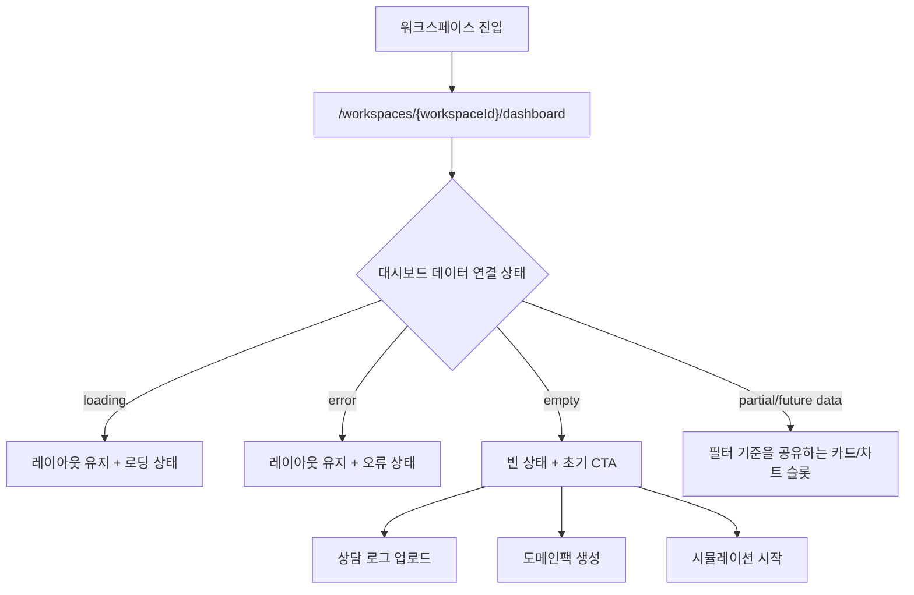

# Frontend Spec: 워크스페이스 고객용 대시보드 셸

## Goal

워크스페이스 멤버가 진입 직후 CS 운영 현황 화면을 받을 수 있도록 `/workspaces/{workspaceId}/dashboard` 라우트, 공통 필터 상태, 대시보드 배치 슬롯, 빈/로딩/오류 상태, 초기 CTA를 제공한다.

---

## User Flow Chart



---

## Design Diff

### As-is vs To-be

| 영역 | As-is | To-be | 변경 내용 |
|------|-------|-------|----------|
| 워크스페이스 기본 진입 | `/workspaces/{workspaceId}`가 워크플로우 목록으로 이동 | 대시보드 홈으로 이동 | 고객용 홈을 워크스페이스 첫 화면으로 둔다 |
| 사이드바 | 상담 응대, 사용자 화면 미리보기, 상담 로그 수집, 워크스페이스 설정, 도메인팩 관리 | 대시보드를 첫 메뉴로 추가 | active state에 `dashboard`를 추가한다 |
| 대시보드 화면 | 없음 | 필터, CTA, 상태 패널, 카드/차트 슬롯 | 실제 KPI 계산 없이 붙일 수 있는 셸만 제공한다 |
| 상태 처리 | 화면별 개별 처리 | loading/error/empty/부분 데이터용 안정 레이아웃 | 데이터 섹션 연결 전에도 화면이 깨지지 않게 한다 |

---

## Component Tree

```text
WorkspaceDashboardPage
├─ DashboardHeader
├─ DashboardFilterBar
│    ├─ PeriodSegmentControl
│    ├─ CustomDateInputs
│    ├─ DomainPackVersionSelect
│    ├─ ChannelSelect
│    └─ WorkflowStatusSelect
├─ DashboardStatePanel
│    ├─ Loading view
│    ├─ Error view
│    └─ Empty view
│         ├─ Upload CTA
│         ├─ Domain Pack CTA
│         └─ Simulation CTA
└─ DashboardSectionGrid
     ├─ MetricSlot
     ├─ ChartSlot
     └─ TableSlot
```

---

## API Integration

초기 이슈에서는 신규 API를 연결하지 않는다. 필터는 페이지 상태로 관리하고, 이후 대시보드 데이터 API가 추가되면 같은 상태 객체를 query key와 request parameter로 전달할 수 있게 둔다.

| Method | Path | Description |
|--------|------|-------------|
| - | - | 신규 API 없음 |

---

## Data Flow

```text
App routes
  -> WorkspaceLayout
    -> OstoneShell(active="dashboard")
      -> WorkspaceDashboardPage
        -> DashboardFilters local state
        -> Future dashboard data hooks
        -> Cards / charts / empty CTA
```

필터 상태는 다음 값을 가진다.

| 필드 | 값 |
|------|----|
| period | `today`, `7d`, `30d`, `custom` |
| customFrom | 사용자 지정 시작일 |
| customTo | 사용자 지정 종료일 |
| domainPackVersion | 전체 또는 특정 버전 식별자 |
| channel | 전체, 웹채팅, 이메일, 전화 |
| workflowStatus | 전체, 진행 중, 완료, 핸드오프, 실패 |

---

## 수정 대상 파일

| 파일 | 변경 유형 | 설명 |
|------|----------|------|
| `frontend/src/app/App.tsx` | update | `/workspaces/:workspaceId/dashboard` 라우트와 워크스페이스 index redirect 변경 |
| `frontend/src/app/App.test.tsx` | update | 워크스페이스 루트가 dashboard로 이동하는 통합 테스트 갱신 |
| `frontend/src/pages/workspace/ui/WorkspaceRootRedirect.tsx` | update | 기본 워크스페이스 진입 경로를 dashboard로 변경 |
| `frontend/src/pages/workspace/ui/WorkspaceRootRedirect.test.tsx` | update | 기본 redirect 기대 경로 갱신 |
| `frontend/src/pages/workspace/ui/WorkspaceLayout.tsx` | update | dashboard active state 인식 |
| `frontend/src/shared/ui/ostone/chrome/Sidebar.tsx` | update | dashboard 메뉴와 `SidebarActive` 타입 추가 |
| `frontend/src/widgets/ostone-shell/ui/OstoneShell.tsx` | update | dashboard breadcrumb 라벨 추가 |
| `frontend/src/widgets/ostone-shell/ui/OstoneShell.test.tsx` | update | 사이드바 첫 메뉴 검증 갱신 |
| `frontend/src/pages/workspace/ui/WorkspaceDashboardPage.tsx` | new | 대시보드 셸 페이지 |
| `frontend/src/pages/workspace/ui/WorkspaceDashboardPage.test.tsx` | new | 필터 상태, 상태 패널, CTA 테스트 |
| `frontend/src/pages/workspace/ui/workspace-dashboard-page.module.css` | new | 대시보드 레이아웃 스타일 |

---

## State Management

서버 상태는 아직 없다. 페이지 내부에서 공통 필터 상태를 한 객체로 관리한다.

```typescript
interface DashboardFilters {
  period: "today" | "7d" | "30d" | "custom";
  customFrom: string;
  customTo: string;
  domainPackVersion: string;
  channel: string;
  workflowStatus: string;
}
```

기간 필터 변경 시 future 카드/차트가 같은 기준으로 갱신될 수 있도록 필터 요약과 상태 객체를 같은 페이지에서 계산한다.

---

## Tests

### Test Strategy

| 구분 | 방법 | 도구 | 비고 |
|------|------|------|------|
| 라우팅 테스트 | App 통합 렌더 | Vitest + React Testing Library | 워크스페이스 기본 진입점 확인 |
| 페이지 테스트 | 컴포넌트 렌더 | Vitest + React Testing Library | 필터, 상태, CTA 확인 |
| 사이드바 테스트 | 셸 컴포넌트 렌더 | Vitest + React Testing Library | 대시보드 메뉴 노출 확인 |

### Test Scenarios

#### Happy Path

| # | 시나리오 | 조작 | 기대 결과 |
|---|---------|------|----------|
| 1 | 워크스페이스 루트 진입 | `/workspaces/{workspaceId}` 접근 | `/dashboard`로 이동한다 |
| 2 | 기간 필터 변경 | 오늘/7일/30일/사용자 지정 선택 | 필터 요약이 같은 기준으로 갱신된다 |
| 3 | 공통 필터 변경 | domain pack version, channel, workflow status 선택 | 화면 상태가 변경 값을 반영한다 |
| 4 | 빈 상태 | 초기 데이터 없음 | 상담 로그 업로드, 도메인팩 생성, 시뮬레이션 시작 CTA가 표시된다 |

#### Error & Edge Cases

| # | 시나리오 | 기대 결과 |
|---|---------|----------|
| 1 | 잘못된 workspaceId | `/workspaces`로 이동한다 |
| 2 | loading 상태 | 로딩 패널이 배치 영역 안에서 표시된다 |
| 3 | error 상태 | 오류 패널이 배치 영역 안에서 표시된다 |
| 4 | 모바일 폭 | 필터와 슬롯이 1열로 접힌다 |

---

## Non-goals

- 상담 처리 KPI 계산
- 핫패스 워크플로우 랭킹 계산
- 도메인팩 건강도 계산
- 추천 액션 생성
- 실제 대시보드 API 또는 mock KPI 데이터 생성
