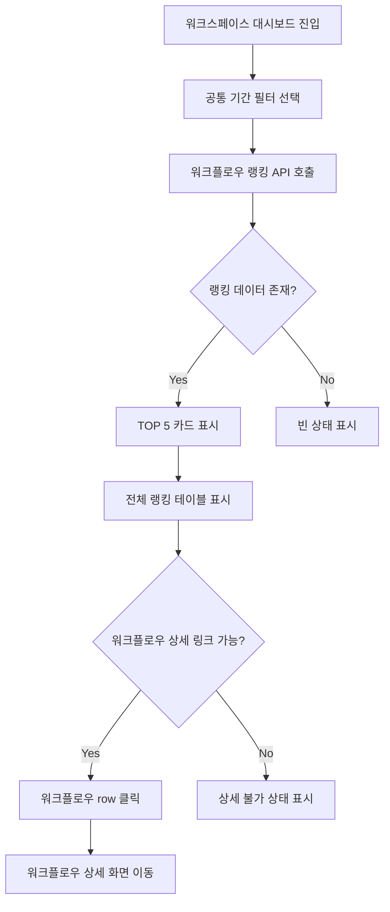

# 519. 핫패스 워크플로우 랭킹

## Goal

선택 기간에 많이 실행된 워크플로우를 실행량, 비중, 완료율, 실패율, 평균 처리 시간, 상담사 개입률, 전 기간 대비 증가율로 랭킹화하여 고객용 대시보드에서 우선 개선 대상을 찾을 수 있게 한다.

## User Flow Chart



## Design Diff

| 영역 | As-is | To-be | 변경 내용 |
| --- | --- | --- | --- |
| 대시보드 데이터 | 상담 처리 KPI와 운영 지식팩 건강도만 표시 | 핫패스 워크플로우 TOP 5와 전체 랭킹 표시 | 워크플로우 실행량 기반 패널을 추가한다 |
| 워크플로우 슬롯 | 향후 연결용 placeholder | 실제 랭킹 카드/테이블 | placeholder 한 칸을 실행 가능한 데이터 영역으로 대체한다 |
| 상세 이동 | 워크플로우 목록 버튼만 제공 | 각 row별 상세 링크 상태 제공 | pack/version/workflow 식별자가 확인되는 row는 상세 화면으로 이동한다 |
| 과거 데이터 | 정의 join 실패 시 화면 요구 없음 | 정의가 없거나 링크를 만들 수 없어도 row 유지 | left join 기반 fallback 이름과 상세 불가 상태를 제공한다 |

## Component Tree

```text
WorkspaceDashboardPage
├─ DashboardFilters
├─ DashboardMetricsGrid
├─ KnowledgePackHealthPanel
├─ HotpathWorkflowRankingPanel
│  ├─ TopWorkflowCard
│  └─ WorkflowRankingTable
└─ DashboardStatePanel
```

## API Integration

### Endpoints

| Method | Path | Description |
| --- | --- | --- |
| GET | `/api/v1/workspaces/{workspaceId}/dashboard/workflow-rankings` | 선택 기간 workflow 랭킹 조회 |

### Query Parameters

| 이름 | 필수 | 설명 |
| --- | --- | --- |
| `from` | 아니오 | `yyyy-MM-dd`; `to`와 함께 전달한다 |
| `to` | 아니오 | `yyyy-MM-dd`; 포함 종료일이며 서버에서 다음 날 0시 exclusive로 변환한다 |

### Response Shape

```json
{
  "workspaceId": 1,
  "periodStart": "2026-05-29T00:00:00+09:00",
  "periodEnd": "2026-06-05T00:00:00+09:00",
  "totalConsultationCount": 120,
  "rankings": [
    {
      "rank": 1,
      "workflowDefinitionId": 10,
      "domainPackId": 2,
      "domainPackVersionId": 3,
      "workflowCode": "refund_flow",
      "workflowName": "환불 처리",
      "executionCount": 48,
      "shareRate": 40.0,
      "completedCount": 42,
      "failedCount": 3,
      "runningCount": 3,
      "completionRate": 87.5,
      "failureRate": 6.3,
      "averageHandlingSeconds": 180,
      "humanInterventionRate": 25.0,
      "changeRate": 33.3,
      "surging": true,
      "detailPath": "/workspaces/1/domain-packs/2/workflows/10?versionId=3"
    }
  ],
  "topRankings": [
    {
      "rank": 1,
      "workflowDefinitionId": 10,
      "domainPackId": 2,
      "domainPackVersionId": 3,
      "workflowCode": "refund_flow",
      "workflowName": "환불 처리",
      "executionCount": 48,
      "shareRate": 40.0,
      "completedCount": 42,
      "failedCount": 3,
      "runningCount": 3,
      "completionRate": 87.5,
      "failureRate": 6.3,
      "averageHandlingSeconds": 180,
      "humanInterventionRate": 25.0,
      "changeRate": 33.3,
      "surging": true,
      "detailPath": "/workspaces/1/domain-packs/2/workflows/10?versionId=3"
    }
  ]
}
```

## Data Flow

```text
WorkspaceDashboardPage local filters
  -> buildMetricDateRange(filters)
  -> consultationApi.getWorkflowRankings(workspaceId, dateRange)
  -> GET /api/v1/workspaces/{workspaceId}/dashboard/workflow-rankings
  -> WorkspaceWorkflowRankingService
  -> WorkflowRankingRepository
  -> runtime.workflow_execution + runtime.chat_session + pack.workflow_definition
```

## 수정 대상 파일

| 파일 | 변경 유형 | 설명 |
| --- | --- | --- |
| `backend/src/main/java/com/init/workflowruntime/presentation/WorkspaceWorkflowRankingController.java` | new | 대시보드 workflow 랭킹 API |
| `backend/src/main/java/com/init/workflowruntime/application/WorkspaceWorkflowRankingService.java` | new | 기간 해석, 멤버십 검증, 변화율 계산 |
| `backend/src/main/java/com/init/workflowruntime/application/command/GetWorkspaceWorkflowRankingsCommand.java` | new | workspace/user/date 요청 값 검증 |
| `backend/src/main/java/com/init/workflowruntime/application/dto/WorkspaceWorkflowRankingResponse.java` | new | 랭킹 응답 DTO |
| `backend/src/main/java/com/init/workflowruntime/application/dto/WorkspaceWorkflowRankingItemResponse.java` | new | 랭킹 row 응답 DTO |
| `backend/src/main/java/com/init/workflowruntime/domain/WorkflowRankingRepository.java` | new | 랭킹 조회 포트 |
| `backend/src/main/java/com/init/workflowruntime/domain/WorkflowRankingExecutionRow.java` | new | workflow 실행 row 모델 |
| `backend/src/main/java/com/init/workflowruntime/infrastructure/persistence/JpaWorkflowRankingRepository.java` | new | Native SQL 집계 |
| `frontend/src/features/consultation/api/consultationApi.ts` | update | workflow ranking 수동 API 함수와 타입 추가 |
| `frontend/src/pages/workspace/ui/WorkspaceDashboardPage.tsx` | update | 핫패스 랭킹 패널 연결 |
| `frontend/src/pages/workspace/ui/workspace-dashboard-page.module.css` | update | TOP 5 카드와 랭킹 테이블 스타일 |

## State Management

- 서버 상태는 현재 `WorkspaceDashboardPage`의 local loading/error 패턴을 따른다.
- 기간이 `custom`이고 시작/종료일 중 하나라도 비어 있으면 API를 호출하지 않고 빈 랭킹 상태를 유지한다.
- domain pack version, channel, workflow status 공통 필터는 #517의 화면 상태로 유지하되, 이번 API 쿼리에는 기간만 전달한다.

## Backend Rules

- workspace membership 검증은 상담 KPI와 같은 `WorkspaceMemberRepository` 기반으로 수행한다.
- simulation/demo 채널은 제외한다: `DEMO`, `DEMO_WEB`, `SIMULATION`, `SIMULATION_WEB`, `SIMULATION%`.
- 현재 기간 집계는 `runtime.workflow_execution.started_at` 기준이다.
- 전체 상담 대비 비중의 분모는 같은 기간에 시작한 운영 `runtime.chat_session` 수다.
- 완료율은 `status = 'COMPLETED'`, 실패율은 `status = 'FAILED'`, 진행 중은 그 외 terminal이 아닌 상태를 `runningCount`로 집계한다.
- 평균 처리 시간은 `finished_at`이 존재하는 실행의 `finished_at - started_at` 초 단위 평균이다.
- 상담사 개입률은 해당 workflow 실행의 `chat_session`에 `COUNSELOR` 또는 `AGENT` 메시지가 있는 비율이다.
- workflow 정의가 없거나 링크 구성에 필요한 pack/version/workflow id가 없으면 집계 row는 유지하고 `detailPath`를 `null`로 반환한다.
- 확인된 DB FK 기준으로 `pack.workflow_definition` 물리 삭제는 기존 실행이 참조 중이면 제한된다. 그래도 legacy/null 참조나 join 누락이 있어도 랭킹 응답과 화면이 깨지지 않아야 한다.

## Tests

### Backend

| 구분 | 대상 | 기대 |
| --- | --- | --- |
| Unit | `WorkspaceWorkflowRankingService` | 현재/전 기간 실행량으로 rank, 비중, 완료율, 실패율, 평균 처리 시간, 상담사 개입률, 증가율, 급증 여부를 계산한다 |
| Unit | `WorkspaceWorkflowRankingService` | 멤버가 아니면 repository를 호출하지 않고 접근을 거부한다 |
| Repository | `JpaWorkflowRankingRepository` | workflow 실행을 집계하고 simulation/demo 채널과 삭제/미연결 정의 row를 안전하게 처리한다 |

### Frontend

| 구분 | 대상 | 기대 |
| --- | --- | --- |
| API | `consultationApi.getWorkflowRankings` | 기간 쿼리를 endpoint에 전달하고 응답을 unwrap한다 |
| Page | `WorkspaceDashboardPage` | TOP 5 카드, 전체 랭킹 row, 급증 표시, 상세 링크 가능/불가 상태를 표시한다 |
| Page | `WorkspaceDashboardPage` | metrics와 ranking 중 하나만 실패해도 대시보드 전체가 깨지지 않는다 |

## Acceptance Criteria

1. 선택 기간의 workflow TOP N이 대시보드에 표시된다.
2. 각 workflow row에 실행 수, 전체 대비 비중, 완료율, 평균 처리 시간이 표시된다.
3. 각 workflow row에 상담사 개입률과 실패율이 표시된다.
4. 전 기간 대비 실행 수가 급증한 workflow가 시각적으로 강조된다.
5. 링크 구성에 필요한 식별자가 있는 workflow row는 상세 화면으로 이동할 수 있다.
6. workflow 정의가 변경되거나 API join에서 누락되어도 과거 실행 row는 fallback 이름과 상세 불가 상태로 표시된다.
7. simulation/demo 채널 실행은 랭킹에서 제외된다.

## Non-goals

- 상태 전이별 병목 분석은 포함하지 않는다.
- missing slot/policy/risk 상세 분석은 포함하지 않는다.
- 추천 액션 생성은 포함하지 않는다.
- domain pack version, channel, workflow status 공통 필터의 서버 쿼리 적용은 후속 확장으로 둔다.

## Open Questions

- workflow 정의 변경 전의 과거 이름을 완전히 보존하려면 runtime 실행 스냅샷 컬럼이 필요하지만, 현재 확인된 스키마에는 해당 컬럼이 없다. 이번 범위에서는 현재 정의명 또는 left join fallback으로 화면 깨짐을 방지한다.
