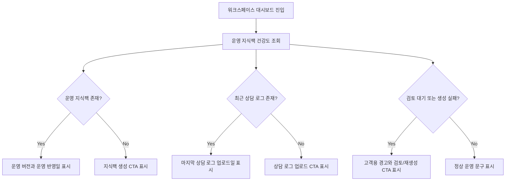

# Issue 520 feat(dashboard): 도메인팩 운영 건강도

## Goal

워크스페이스 대시보드에서 고객사가 현재 운영 중인 지식팩 상태, 최근 상담 로그 업로드, 최근 지식팩 생성 상태, 검토 대기 항목을 고객용 표현으로 확인하고 다음 행동으로 이동할 수 있게 한다.

## User Flow Chart



## Design Diff

| 영역 | As-is | To-be | 변경 내용 |
|------|-------|-------|----------|
| 대시보드 본문 | 빈 상태와 placeholder 슬롯만 표시 | 운영 지식팩 건강도 패널 표시 | 기존 shell 위에 실제 운영 상태 카드 추가 |
| 용어 | Domain Pack / Pipeline / Review 혼재 | 운영 지식팩 / 지식팩 생성 / 검토 대기 / 운영 반영 | 고객용 표현으로 상태 설명 |
| CTA | 초기 empty CTA만 표시 | 상황별 상담 로그 업로드, 검토 화면, 지식팩 생성 CTA 표시 | 실패/대기/미업로드 상태별 다음 행동 제공 |

## Component Tree

```
WorkspaceDashboardPage
├─ DashboardFilters
├─ FilterSummary
├─ KnowledgePackHealthPanel
│  ├─ HealthMetric
│  ├─ HealthAlertList
│  └─ HealthCtaList
└─ DashboardSlot
```

## API Integration

### Endpoint

| Method | Path | Description |
|--------|------|-------------|
| GET | `/api/v1/workspaces/{workspaceId}/dashboard/knowledge-pack-health` | 운영 지식팩 건강도 조회 |

### Response Shape

```json
{
  "activeKnowledgePack": {
    "packId": 1,
    "packName": "고객지원 운영 지식팩",
    "versionId": 12,
    "versionNo": 4,
    "publishedAt": "2026-06-03T10:00:00Z",
    "createdAt": "2026-06-02T10:00:00Z",
    "sourcePipelineJobId": 77
  },
  "lastLogUpload": {
    "datasetId": 9,
    "datasetKey": "june-cs-log",
    "datasetName": "6월 상담 로그",
    "datasetStatus": "READY",
    "uploadedAt": "2026-06-03T09:00:00Z"
  },
  "lastKnowledgePackGeneration": {
    "pipelineJobId": 77,
    "datasetId": 9,
    "domainPackId": 1,
    "status": "SUCCEEDED",
    "requestedAt": "2026-06-03T09:10:00Z",
    "startedAt": "2026-06-03T09:11:00Z",
    "finishedAt": "2026-06-03T09:30:00Z",
    "lastErrorMessage": null
  },
  "pendingReviewCount": 0
}
```

## Data Flow

```
WorkspaceDashboardPage
  -> useWorkspaceDashboardHealth(workspaceId)
  -> customFetch("/api/v1/workspaces/{workspaceId}/dashboard/knowledge-pack-health")
  -> WorkspaceDashboardController
  -> GetWorkspaceDashboardHealthUseCase
  -> WorkspaceDashboardQueryPort
  -> JdbcWorkspaceDashboardQueryAdapter
```

## Affected Files

| 파일 | 변경 유형 | 설명 |
|------|----------|------|
| `.agent/specs/520.md` | new | 이슈 스펙 |
| `backend/src/main/java/com/init/workspace/application/WorkspaceDashboardQueryPort.java` | new | 대시보드 read model port |
| `backend/src/main/java/com/init/workspace/application/GetWorkspaceDashboardHealthUseCase.java` | new | 멤버십 검증 후 건강도 조회 |
| `backend/src/main/java/com/init/workspace/application/WorkspaceDashboardHealthResult.java` | new | 건강도 응답 record |
| `backend/src/main/java/com/init/workspace/application/WorkspaceDashboardKnowledgePackResult.java` | new | 운영 지식팩 응답 record |
| `backend/src/main/java/com/init/workspace/application/WorkspaceDashboardLogUploadResult.java` | new | 최근 상담 로그 업로드 응답 record |
| `backend/src/main/java/com/init/workspace/application/WorkspaceDashboardGenerationResult.java` | new | 최근 지식팩 생성 응답 record |
| `backend/src/main/java/com/init/workspace/infrastructure/persistence/JdbcWorkspaceDashboardQueryAdapter.java` | new | 기존 schema에서 운영 상태 조회 |
| `backend/src/main/java/com/init/workspace/presentation/WorkspaceDashboardController.java` | new | 고객 대시보드 건강도 API |
| `frontend/src/features/workspace-dashboard-health/` | new | API hook, view model, 건강도 패널 |
| `frontend/src/pages/workspace/ui/WorkspaceDashboardPage.tsx` | modify | 대시보드에 건강도 패널 연결 |

## State Management

- Server state: TanStack Query로 workspace별 건강도 조회.
- Client state: 기존 dashboard filter local state 유지.
- OpenAPI generated endpoint가 아직 없으므로 `workspace-dashboard-health/api`에 직접 wrapper를 두고, OpenAPI 미생성 사유를 파일에 명시한다.

## Alerts and CTA Rules

| 조건 | 경고 | CTA |
|------|------|-----|
| 운영 지식팩 없음 | 운영에 반영된 지식팩이 없다는 문구 | 지식팩 생성 |
| 마지막 상담 로그 없음 | 상담 로그가 아직 없다는 문구 | 상담 로그 업로드 |
| 마지막 상담 로그 업로드일이 운영 반영일보다 최신 | 새 로그가 운영 지식팩에 아직 반영되지 않았다는 문구 | 지식팩 생성 |
| 최근 지식팩 생성 상태가 `FAILED` | 지식팩 생성 실패를 고객용 문구로 표시 | 지식팩 생성 |
| 검토 대기 항목 수 > 0 | 검토 대기 항목 수 표시 | 검토 화면 |

## Non-goals

- 상세 pipeline job 로그 표시
- admin 운영 관제 기능
- 자동 추천 생성
- 새로운 지표 계산 또는 chart 구현

## Validation

- Backend: `GetWorkspaceDashboardHealthUseCaseTest`, `WorkspaceDashboardControllerTest`
- Frontend: `buildWorkspaceDashboardHealthView.test.ts`, `KnowledgePackHealthPanel.test.tsx`, `WorkspaceDashboardPage.test.tsx`
- Local verification: backend/frontend targeted tests and module build/lint where feasible

## Open Questions

- "오래된 지식팩"의 절대 기간 기준은 아직 issue에서 확정되지 않았다. 이번 범위에서는 운영 반영 이후 더 최신 상담 로그가 있으면 오래된 상태로 간주한다.
