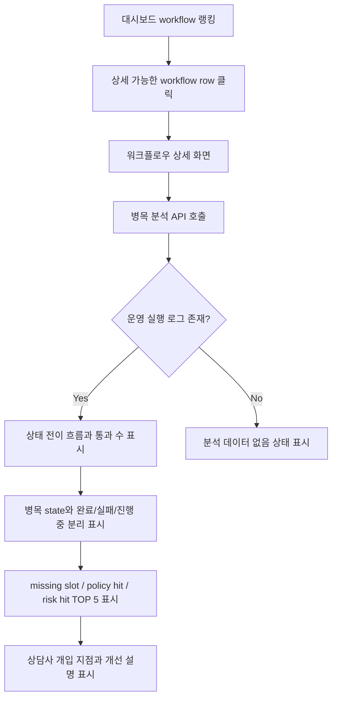

# 521. 워크플로우 상세 병목 분석

## Goal

워크플로우 상세 화면에서 운영 실행 로그를 기준으로 상태 전이, 병목 state, slot/policy/risk hit, 상담사 개입 지점을 확인할 수 있게 한다.

## Background

고객사는 핫패스 workflow가 어디서 막히는지 이해하고, 어떤 slot/policy/risk를 검토해야 하는지 판단해야 한다. 선행 이슈 #517은 워크스페이스 대시보드 셸을 제공했고, #519는 workflow 랭킹과 상세 이동 경로를 제공했다. 이번 범위는 그 상세 화면에서 특정 workflow의 병목 원인을 분석하는 기능이다.

확인된 기존 경로와 모듈:

| Path | 역할 |
| --- | --- |
| `backend/src/main/java/com/init/workflowruntime/presentation/WorkspaceWorkflowRankingController.java` | 대시보드 workflow 랭킹 API |
| `backend/src/main/java/com/init/workflowruntime/application/WorkspaceWorkflowRankingService.java` | 기간 해석과 멤버십 검증 패턴 |
| `backend/src/main/java/com/init/workflowruntime/infrastructure/persistence/JpaWorkflowRankingRepository.java` | 운영 상담/simulation 제외 SQL 패턴 |
| `backend/src/main/java/com/init/workflowruntime/domain/WorkflowExecutionStep.java` | state transition 로그 |
| `backend/src/main/java/com/init/workflowruntime/domain/DecisionLog.java` | missing slot, policy hit, risk hit 로그 |
| `frontend/src/pages/domain-pack/ui/WorkflowDraftReadPage.tsx` | workflow 상세 화면 |
| `frontend/src/features/consultation/api/consultationApi.ts` | OpenAPI 미생성 dashboard API 수동 wrapper |

## User Flow Chart



## REST API

| Method | Path | Description |
| --- | --- | --- |
| GET | `/api/v1/workspaces/{workspaceId}/dashboard/workflows/{workflowDefinitionId}/bottleneck-analysis` | 특정 workflow의 선택 기간 병목 분석 조회 |

### Query Parameters

| 이름 | 필수 | 설명 |
| --- | --- | --- |
| `from` | 아니오 | `yyyy-MM-dd`; `to`와 함께 전달 |
| `to` | 아니오 | `yyyy-MM-dd`; 포함 종료일이며 서버에서 다음 날 0시 exclusive로 변환 |

### Response Shape

```json
{
  "workspaceId": 1,
  "workflowDefinitionId": 10,
  "periodStart": "2026-05-29T00:00:00+09:00",
  "periodEnd": "2026-06-05T00:00:00+09:00",
  "totalExecutionCount": 48,
  "completedCount": 32,
  "failedCount": 8,
  "runningCount": 8,
  "transitions": [
    {
      "stateFrom": "collect_slots",
      "stateTo": "verify_policy",
      "passCount": 35
    }
  ],
  "longestDwellState": {
    "stateName": "collect_slots",
    "metricValue": 420,
    "executionCount": 12,
    "description": "평균 7분 동안 머문 state"
  },
  "mostStoppedState": {
    "stateName": "verify_policy",
    "metricValue": 6,
    "executionCount": 6,
    "description": "실패/진행 중 실행이 가장 많이 멈춘 state"
  },
  "missingSlotTop": [
    {
      "name": "order_id",
      "count": 18,
      "stateName": "collect_slots",
      "description": "collect_slots에서 자주 비어 있는 slot"
    }
  ],
  "policyHitTop": [],
  "riskHitTop": [],
  "humanInterventionPoints": [
    {
      "stateName": "handoff",
      "count": 5,
      "description": "상담사 개입 action이 자주 발생한 state"
    }
  ],
  "improvementHints": [
    "order_id slot 수집 문구와 검증 규칙을 우선 점검하세요."
  ]
}
```

## Backend Rules

- workspace membership 검증은 #519와 같은 `WorkspaceMemberRepository.findByWorkspaceIdAndUserId` 패턴을 따른다.
- 기간 해석은 #519와 같은 Asia/Seoul 일자 기준을 사용한다.
- 운영 실행 모집단은 `runtime.workflow_execution.started_at` 기준으로 집계한다.
- simulation/demo 채널은 제외한다: `DEMO`, `DEMO_WEB`, `SIMULATION`, `SIMULATION_WEB`, `SIMULATION%`.
- 상태 전이는 `runtime.workflow_execution_step.state_from`, `state_to`와 `action_type`으로 집계한다.
- 완료/실패/진행 중 분리는 `runtime.workflow_execution.status` 기준이며, `COMPLETED`, `FAILED` 외 상태는 진행 중으로 본다.
- 가장 오래 머문 state는 동일 execution 안에서 연속 step 사이의 시간 차이를 state별 평균으로 계산한다. 계산 가능한 연속 step이 없으면 null을 반환한다.
- 가장 많이 멈춘 state는 실패/진행 중 execution의 `current_state` 기준으로 집계한다.
- missing slot, policy hit, risk hit는 `runtime.decision_log.missing_slots_json`, `policy_hits_json`, `risk_hits_json` 배열을 파싱해 TOP 5를 만든다.
- JSON payload가 비어 있거나 파싱할 수 없으면 해당 로그만 빈 배열처럼 처리하고 응답은 실패시키지 않는다.
- 상담사 개입 지점은 step `action_type` 또는 decision `selected_action`에 handoff 계열 값이 있는 state로 집계한다.

## Frontend Integration

워크플로우 상세 화면 `frontend/src/pages/domain-pack/ui/WorkflowDraftReadPage.tsx`에 병목 분석 패널을 추가한다. 기존 랭킹 row의 상세 링크가 이 화면으로 이동하므로 별도 신규 라우트는 만들지 않는다.

### Component Tree

```text
WorkflowDraftReadPage
├─ Workflow header
├─ Workflow graph/editor canvas
└─ WorkflowBottleneckAnalysisPanel
   ├─ Execution status summary
   ├─ Transition pass count list
   ├─ Bottleneck state summary
   ├─ Missing slot / policy hit / risk hit TOP 5
   ├─ Human intervention points
   └─ Improvement hints
```

## 수정 대상 파일

| 파일 | 변경 유형 | 설명 |
| --- | --- | --- |
| `backend/src/main/java/com/init/workflowruntime/presentation/WorkspaceWorkflowBottleneckAnalysisController.java` | new | 병목 분석 API |
| `backend/src/main/java/com/init/workflowruntime/application/WorkspaceWorkflowBottleneckAnalysisService.java` | new | 기간 해석, 멤버십 검증, state/hit 집계 |
| `backend/src/main/java/com/init/workflowruntime/application/command/GetWorkflowBottleneckAnalysisCommand.java` | new | 요청 command |
| `backend/src/main/java/com/init/workflowruntime/application/dto/*Bottleneck*.java` | new | 응답 DTO |
| `backend/src/main/java/com/init/workflowruntime/domain/WorkflowBottleneckAnalysisRepository.java` | new | 분석 조회 포트 |
| `backend/src/main/java/com/init/workflowruntime/domain/WorkflowBottleneck*Row.java` | new | repository row 모델 |
| `backend/src/main/java/com/init/workflowruntime/infrastructure/persistence/JpaWorkflowBottleneckAnalysisRepository.java` | new | Native SQL 조회 |
| `frontend/src/features/consultation/api/consultationApi.ts` | update | OpenAPI 미생성 병목 분석 API wrapper |
| `frontend/src/features/consultation/api/consultationApi.test.ts` | update | API URL/쿼리 검증 |
| `frontend/src/pages/domain-pack/ui/WorkflowDraftReadPage.tsx` | update | 분석 패널 표시 |
| `frontend/src/pages/domain-pack/ui/workflow-draft-read-page.module.css` | update | 분석 패널 스타일 |
| `frontend/src/pages/domain-pack/ui/WorkflowDraftReadPage.test.tsx` | update | 분석 패널 상태 검증 |

## Tests

| 구분 | 대상 | 기대 |
| --- | --- | --- |
| Backend Unit | `WorkspaceWorkflowBottleneckAnalysisService` | 실행 상태 분리, transition count, longest dwell, stopped state, TOP 5, 설명을 계산한다 |
| Backend Unit | `WorkspaceWorkflowBottleneckAnalysisService` | JSON 파싱 실패/빈 값을 안전하게 건너뛴다 |
| Backend Unit | `WorkspaceWorkflowBottleneckAnalysisService` | 멤버가 아니면 repository를 호출하지 않고 접근을 거부한다 |
| Frontend API | `consultationApi.getWorkflowBottleneckAnalysis` | endpoint와 기간 쿼리를 올바르게 호출한다 |
| Frontend Page | `WorkflowDraftReadPage` | 분석 로딩/빈/데이터 상태를 표시한다 |

## Acceptance Criteria

1. workflow별 상태 전이 흐름과 통과 수가 상세 화면에 표시된다.
2. 가장 오래 머문 state와 가장 많이 멈춘 state가 표시된다.
3. 완료/실패/진행 중 실행 수가 분리되어 표시된다.
4. missing slot, policy hit, risk hit TOP 5가 각각 집계된다.
5. 상담사 개입이 자주 발생한 지점이 표시된다.
6. 고객이 어떤 slot/policy/risk를 검토해야 하는지 알 수 있는 설명이 제공된다.
7. JSON payload가 비어 있거나 파싱 실패해도 화면과 API 응답이 깨지지 않는다.
8. simulation/demo 채널 실행은 분석에서 제외된다.

## Non-goals

- 개선 후보 자동 생성
- workflow graph 직접 편집
- golden case replay
- workflow별 비교 분석
- domain pack version, channel, workflow status 공통 필터의 서버 적용

## Open Questions

- 상담사 메시지 자체에는 state 컬럼이 없으므로, 상담사 개입 지점은 workflow step/decision action의 handoff 신호로 집계한다.
- policy/risk hit writer가 아직 빈 배열 위주로 기록되는 실행에서는 해당 TOP 5가 빈 상태로 표시될 수 있다.
