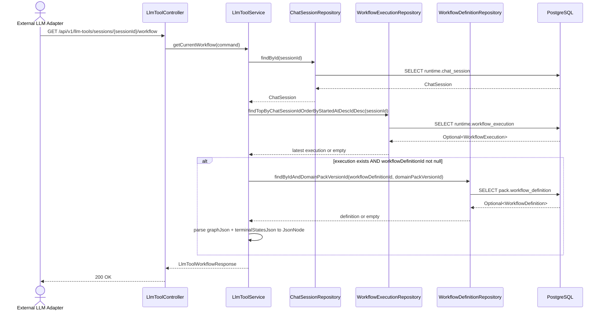
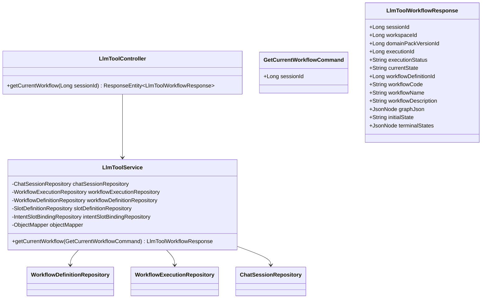

# 521. Get Current Workflow LLM Tool

## Goal

외부 LLM이 현재 상담 세션에 묶인 워크플로우 그래프(`pack.workflow_definition.graph_json` 포함)와 현재 실행 메타데이터(`runtime.workflow_execution.status`, `current_state`)를 한 번에 조회할 수 있는 REST tool을 제공한다.

이 endpoint는 결정론적 워크플로우 엔진의 입구다. LLM은 본 응답의 graph + currentState를 기준으로 다음 액션 후보를 좁힌다.

본 spec은 5.2.x tool 시리즈 중 첫 번째이며, 기존 4개 slot tool (5.2.x 시리즈가 아닌 5.2.3에 문서화됨, 코드는 같은 base path) 옆에 5번째 tool로 추가된다. 5.2.2~5.2.4가 같은 DTO를 공유한다는 청사진은 source materials의 fact가 아니므로 본 spec 범위 밖이다 (`uncertainty-register-521.md` U-005 참조).

---

## Background

### 기존 인프라 (재사용)

- `LlmToolController` (`backend/src/main/java/com/init/workflowruntime/presentation/LlmToolController.java`): base path `/api/v1/llm-tools/sessions/{sessionId}`, 기존 4개 slot endpoint.
- `LlmToolService` (`backend/src/main/java/com/init/workflowruntime/application/LlmToolService.java`): `ChatSessionRepository`, `WorkflowExecutionRepository`, `SlotDefinitionRepository`, `IntentSlotBindingRepository`, `ObjectMapper` 주입. `findExecution(sessionId)` private helper는 `workflowExecutionRepository.findTopByChatSessionIdOrderByStartedAtDescIdDesc(sessionId).orElse(null)` 형태로 최신 execution을 반환.
- `WorkflowExecution` (`backend/src/main/java/com/init/workflowruntime/domain/WorkflowExecution.java`): `workflowDefinitionId` 컬럼은 nullable. `WorkflowExecution.create(sessionId)` factory는 `workflowDefinitionId`를 null로 둔다.
- `WorkflowDefinition` (`backend/src/main/java/com/init/domainpack/domain/model/WorkflowDefinition.java`): `pack.workflow_definition` 매핑. `graphJson`, `initialState`, `terminalStatesJson` 필드 Java type은 모두 `String`이며 `@JdbcTypeCode(SqlTypes.JSON)`로 jsonb에 저장.
- `WorkflowDefinitionRepository` (`backend/src/main/java/com/init/domainpack/domain/repository/WorkflowDefinitionRepository.java`): `findByIdAndDomainPackVersionId(Long id, Long domainPackVersionId)` 기존 메서드 보유. **단독 `findById(Long id)` 메서드는 의도적으로 추가하지 않는다** (U-004 결정).
- Security: `/api/v1/llm-tools/**` → `ROLE_OPERATOR` (`backend/src/main/java/com/init/shared/infrastructure/security/SecurityConfig.java:65-66`). 본 endpoint도 동일 규칙으로 자동 보호된다.

### DB DDL (이미 존재)

- `runtime.workflow_execution`: `backend/src/main/resources/db/changelog/db.changelog-master.sql:518-532`.
- `pack.workflow_definition`: `backend/src/main/resources/db/changelog/db.changelog-master.sql:230-245`. `graph_json` NOT NULL, `terminal_states_json` NOT NULL DEFAULT `'[]'`.

신규 migration 없음.

### Integration adapter

- `integrations/llm-tools/tool-schema.mjs`: 기존 4개 slot tool schema. `LLM_SLOT_TOOL_NAMES` 상수 `getContext` / `listSlots` / `getSlot` / `upsertSlotValue` 패턴 (`*_current_*`). 신규 tool도 동일 패턴 따른다.
- `integrations/llm-tools/llm-tool-adapter.mjs`: tool call → backend REST 매핑.
- `integrations/llm-tools/README.md`: 외부 LLM 공개 인터페이스 문서.

---

## REST API

### Endpoint

| Method | Path | Description |
| --- | --- | --- |
| GET | `/api/v1/llm-tools/sessions/{sessionId}/workflow` | 현재 세션의 최신 workflow execution과 정의된 workflow graph를 조회 |

Security: `ROLE_OPERATOR` (기존 wildcard 규칙으로 자동 적용).

### Request

Path variables only.

| Variable | Type | Description |
| --- | --- | --- |
| `sessionId` | `Long` | `runtime.chat_session.id` |

Request body 없음.

### Response

**200 OK** — `LlmToolWorkflowResponse`

```json
{
  "sessionId": 1,
  "workspaceId": 10,
  "domainPackVersionId": 101,
  "executionId": 50,
  "executionStatus": "RUNNING",
  "currentState": "collect_slots",
  "workflowDefinitionId": 77,
  "workflowCode": "refund_v1",
  "workflowName": "환불 처리 워크플로우",
  "workflowDescription": "환불 요청 분류와 정책 적용",
  "graphJson": {
    "nodes": [{ "id": "collect_slots", "type": "STATE" }],
    "edges": [{ "from": "collect_slots", "to": "decide_refund" }]
  },
  "initialState": "collect_slots",
  "terminalStates": ["refund_granted", "refund_denied"]
}
```

응답 필드:

| Field | Type | Nullable | Source |
| --- | --- | --- | --- |
| `sessionId` | Long | No | `ChatSession.id` |
| `workspaceId` | Long | No | `ChatSession.workspaceId` |
| `domainPackVersionId` | Long | No | `ChatSession.domainPackVersionId` |
| `executionId` | Long | Yes | `WorkflowExecution.id` — execution이 없으면 null |
| `executionStatus` | String | Yes | `WorkflowExecution.status` — execution이 없으면 null |
| `currentState` | String | Yes | `WorkflowExecution.currentState` — execution이 없거나 정의되지 않으면 null |
| `workflowDefinitionId` | Long | Yes | `WorkflowDefinition.id` — execution이 없거나 `workflowDefinitionId`가 null이면 null |
| `workflowCode` | String | Yes | `WorkflowDefinition.workflowCode` — workflow가 없으면 null |
| `workflowName` | String | Yes | `WorkflowDefinition.name` — workflow가 없으면 null |
| `workflowDescription` | String | Yes | `WorkflowDefinition.description` — workflow가 없으면 null |
| `graphJson` | JsonNode | Yes | `WorkflowDefinition.graphJson` 을 `ObjectMapper.readTree`로 파싱. workflow가 없으면 null |
| `initialState` | String | Yes | `WorkflowDefinition.initialState` — workflow가 없으면 null |
| `terminalStates` | JsonNode (array) | Yes | `WorkflowDefinition.terminalStatesJson` 을 파싱한 JSON array. workflow가 없으면 null |

**404 Not Found**

```json
{
  "error": "SESSION_NOT_FOUND",
  "message": "Session not found: 1"
}
```

`sessionId`가 존재하지 않는 경우만 404. workflow execution 부재 / `workflowDefinitionId` null / workflow definition 미일치는 모두 200으로 처리한다 (U-003 결정).

**500 Internal Server Error**

```json
{
  "error": "JSON_PARSE_FAILED",
  "message": "Stored JSON value cannot be parsed"
}
```

`graphJson` 또는 `terminalStatesJson` parse 실패 시. 기존 `LlmToolService` 의 `readJsonNode` 헬퍼가 `InternalException("JSON_PARSE_FAILED", ...)`을 던지는 패턴을 그대로 따른다.

### 200 응답의 부재 시나리오 (Hard)

세션이 존재하면 항상 200 이다. 다음 3가지 부재 케이스는 모두 200 + 부분 null 응답으로 처리한다 (`U-003` 결정, 기존 `getContext` 패턴 일치).

1. **execution 없음** (예: 세션이 막 생성되고 아직 slot 입력이 들어오지 않은 상태)
   - `executionId`, `executionStatus`, `currentState`, `workflowDefinitionId`, `workflowCode`, `workflowName`, `workflowDescription`, `graphJson`, `initialState`, `terminalStates` 모두 null.
   - `sessionId`, `workspaceId`, `domainPackVersionId` 는 채워짐.
2. **execution 있으나 `workflowDefinitionId`가 null** (예: `upsertSlotValue`에서 `WorkflowExecution.create(sessionId)`로 생성되어 workflow가 아직 묶이지 않은 상태)
   - `executionId`, `executionStatus`, `currentState` 채움.
   - `workflowDefinitionId`, `workflowCode`, `workflowName`, `workflowDescription`, `graphJson`, `initialState`, `terminalStates` 모두 null.
3. **execution.workflowDefinitionId 가 있으나 session의 domainPackVersionId 와 일치하는 WorkflowDefinition 미존재**
   - `findByIdAndDomainPackVersionId` 가 `Optional.empty()`를 반환. cross-pack 데이터 누수 방지를 위해 의도적으로 200 + workflow 필드 null 응답.
   - 이 케이스는 운영상 inconsistency 신호이지만 LLM에는 부재로 보인다 (U-006 engineering-bound).

---

## Sequence Diagram



---

## Class Design

### DDD Layered Structure



### New Application Files

| File | Layer | 역할 |
| --- | --- | --- |
| `backend/src/main/java/com/init/workflowruntime/application/command/GetCurrentWorkflowCommand.java` | application command | `record GetCurrentWorkflowCommand(Long sessionId)` |
| `backend/src/main/java/com/init/workflowruntime/application/dto/LlmToolWorkflowResponse.java` | application DTO | `record LlmToolWorkflowResponse(...)` |

### Modified Files

| File | 수정 내용 |
| --- | --- |
| `backend/src/main/java/com/init/workflowruntime/application/LlmToolService.java` | 생성자 주입에 `WorkflowDefinitionRepository workflowDefinitionRepository` 추가. `public LlmToolWorkflowResponse getCurrentWorkflow(GetCurrentWorkflowCommand command)` 메서드 신설 |
| `backend/src/main/java/com/init/workflowruntime/presentation/LlmToolController.java` | `@GetMapping("/workflow")` 핸들러 추가 |
| `integrations/llm-tools/tool-schema.mjs` | `LLM_SLOT_TOOL_NAMES`에 `getCurrentWorkflow: "get_current_workflow"` 추가 (또는 별도 export 객체 — Implementation 시 결정), `llmSlotTools` 배열에 entry 추가 (parameters 없음) |
| `integrations/llm-tools/llm-tool-adapter.mjs` | `get_current_workflow` → `GET /api/v1/llm-tools/sessions/{sessionId}/workflow` 매핑 추가 |
| `integrations/llm-tools/README.md` | tool 목록에 `get_current_workflow` 추가 |
| `integrations/llm-tools/llm-tool-adapter.test.mjs` | schema/adapter 동작 검증 추가 |

### Application Logic

```java
public LlmToolWorkflowResponse getCurrentWorkflow(GetCurrentWorkflowCommand command) {
  Long sessionId = command.sessionId();
  ChatSession session = findSession(sessionId); // 기존 private helper — SESSION_NOT_FOUND 던짐
  WorkflowExecution execution = findExecution(sessionId); // 기존 private helper — null 가능

  Long executionId = execution != null ? execution.getId() : null;
  String executionStatus = execution != null ? execution.getStatus() : null;
  String currentState = execution != null ? execution.getCurrentState() : null;
  Long workflowDefinitionId = execution != null ? execution.getWorkflowDefinitionId() : null;

  WorkflowDefinition definition = null;
  if (workflowDefinitionId != null) {
    definition = workflowDefinitionRepository
        .findByIdAndDomainPackVersionId(workflowDefinitionId, session.getDomainPackVersionId())
        .orElse(null);
  }

  JsonNode graphJson = definition != null ? readJsonNode(definition.getGraphJson(), null) : null;
  JsonNode terminalStates =
      definition != null ? readJsonNode(definition.getTerminalStatesJson(), "[]") : null;

  return new LlmToolWorkflowResponse(
      session.getId(),
      session.getWorkspaceId(),
      session.getDomainPackVersionId(),
      executionId,
      executionStatus,
      currentState,
      definition != null ? definition.getId() : null,
      definition != null ? definition.getWorkflowCode() : null,
      definition != null ? definition.getName() : null,
      definition != null ? definition.getDescription() : null,
      graphJson,
      definition != null ? definition.getInitialState() : null,
      terminalStates);
}
```

**구현 노트**:

- `findSession`, `findExecution`, `readJsonNode`는 기존 `LlmToolService`의 private helper를 그대로 사용.
- `readJsonNode(null, null)` 호출은 `NullNode.getInstance()` 반환이므로, `definition == null` 일 때는 명시적으로 `null`을 응답 필드에 넣는다 (`NullNode.getInstance()` 대신).
- `@Transactional(readOnly = true)` 는 class-level 적용으로 그대로 상속됨. 신규 메서드에 별도 어노테이션 불필요.

---

## Data Model

신규 entity 없음. 모든 entity는 기존 정의 그대로 사용.

### LlmToolWorkflowResponse (신규 DTO)

```java
package com.init.workflowruntime.application.dto;

import com.fasterxml.jackson.databind.JsonNode;

public record LlmToolWorkflowResponse(
    Long sessionId,
    Long workspaceId,
    Long domainPackVersionId,
    Long executionId,
    String executionStatus,
    String currentState,
    Long workflowDefinitionId,
    String workflowCode,
    String workflowName,
    String workflowDescription,
    JsonNode graphJson,
    String initialState,
    JsonNode terminalStates) {}
```

### GetCurrentWorkflowCommand (신규 command)

```java
package com.init.workflowruntime.application.command;

public record GetCurrentWorkflowCommand(Long sessionId) {}
```

---

## Integration — `integrations/llm-tools`

### Tool schema 추가

**export 방식 (Hard — codeBuilder 기본값)**: 기존 `LLM_SLOT_TOOL_NAMES`(4개 slot tool)는 그대로 보존하고, 신규 workflow tool은 별도 상수 `LLM_WORKFLOW_TOOL_NAMES` 로 추가한다.

근거:

- `LLM_SLOT_TOOL_NAMES`는 이미 `llm-tool-adapter.mjs`, `llm-tool-adapter.test.mjs`가 import해서 사용 중. 이름 변경 시 import side 광범위 수정 필요.
- 변수명이 "slot"으로 한정되어 있으므로 workflow 항목을 같은 상수에 넣으면 의미 충돌.
- 후속 5.2.x tool은 본 spec 범위 밖이므로 (U-005 Deferred), 현재 시점에 5.2.x 공통 상수를 만들지 않는다 (YAGNI).

```js
// integrations/llm-tools/tool-schema.mjs (수정 후 발췌)

// 기존 (변경 없음)
export const LLM_SLOT_TOOL_NAMES = Object.freeze({
  getContext: "get_current_slot_context",
  listSlots: "list_current_slots",
  getSlot: "get_current_slot",
  upsertSlotValue: "upsert_current_slot_value",
});

// 신규 추가
export const LLM_WORKFLOW_TOOL_NAMES = Object.freeze({
  getCurrentWorkflow: "get_current_workflow",
});

// llmSlotTools 배열에 다음 entry 추가:
{
  type: "function",
  function: {
    name: LLM_WORKFLOW_TOOL_NAMES.getCurrentWorkflow,
    description:
      "현재 상담 세션에 묶인 결정론적 워크플로우 그래프와 현재 실행 상태(state, status)를 조회한다.",
    parameters: emptyParameters,
  },
}
```

`llmSlotTools` 배열의 이름은 그대로 두되, 후속 spec에서 5.2.x tool이 추가될 때 `llmTools` 같은 통합 이름으로 리네임 검토 (본 spec 범위 밖).

### Adapter 수정

`llm-tool-adapter.mjs` 의 tool name → REST URL 매핑 테이블에 다음 entry 추가:

```js
import { LLM_SLOT_TOOL_NAMES, LLM_WORKFLOW_TOOL_NAMES, llmSlotTools } from "./tool-schema.mjs";

// switch(toolName) 분기에 추가:
case LLM_WORKFLOW_TOOL_NAMES.getCurrentWorkflow:
  return await fetchJson(
    `${backendBaseUrl}/api/v1/llm-tools/sessions/${sessionId}/workflow`,
    { method: "GET", headers: { Authorization: `Bearer ${bearerToken}` } }
  );

// 기존 re-export도 갱신:
export { LLM_SLOT_TOOL_NAMES, LLM_WORKFLOW_TOOL_NAMES, llmSlotTools };
```

(실제 코드는 기존 adapter 구조에 맞춰 작성.)

### README 갱신

`integrations/llm-tools/README.md` 의 "Tool Names" 표에 `get_current_workflow` 행 추가.

---

## Error Handling

| Case | HTTP | Error code | Source |
| --- | --- | --- | --- |
| sessionId 가 없음 | 404 | `SESSION_NOT_FOUND` | 기존 `findSession` 헬퍼 |
| execution 없음 | 200 | — | 응답 필드 null 처리 |
| execution.workflowDefinitionId 가 null | 200 | — | 응답 필드 null 처리 |
| execution.workflowDefinitionId 있으나 session.domainPackVersionId 와 매칭되는 WorkflowDefinition 없음 | 200 | — | 응답 필드 null 처리 (cross-pack 보호) |
| `graphJson` parse 실패 | 500 | `JSON_PARSE_FAILED` | 기존 `readJsonNode` 헬퍼 |
| `terminalStatesJson` parse 실패 | 500 | `JSON_PARSE_FAILED` | 동일 |
| 인증 실패 / OPERATOR 권한 없음 | 401 / 403 | (Spring Security 표준) | `SecurityConfig:65-66` |

`spring-validation` 트리거 없음 (request body / query param 없음).

---

## Tests

### 테스트 layering (Hard)

기존 `workflowruntime` 패키지의 테스트 컨벤션을 그대로 따른다 (DB fixture 도입 금지):

- **Service 계층 테스트**: `@ExtendWith(MockitoExtension.class)` + `@Mock` repository — `LlmToolServiceTest.java`가 `ChatSessionRepository`, `WorkflowExecutionRepository`, `SlotDefinitionRepository`, `IntentSlotBindingRepository` 를 모두 mock하는 패턴 그대로. 신규 의존 `WorkflowDefinitionRepository` 도 `@Mock`. `ObjectMapper` 는 real instance.
- **Controller 계층 테스트**: `@WebMvcTest(LlmToolController.class)` + `@MockitoBean LlmToolService` — 기존 `LlmToolControllerTest.java` 패턴 그대로. `JwtAuthenticationFilter` excludeFilters + `@AutoConfigureMockMvc(addFilters = false)` 유지.

따라서 `runtime.chat_session` / `runtime.workflow_execution` / `pack.workflow_definition` row를 DB에 seed할 필요가 없다. `@Sql`, `@DataJpaTest`, `@SpringBootTest(webEnvironment = ...)` 도입 금지.

### Unit Tests — `LlmToolServiceTest`

기존 `backend/src/test/java/com/init/workflowruntime/application/LlmToolServiceTest.java` 에 메서드 추가. `WorkflowDefinitionRepository` 를 `@Mock` 필드로 추가하고 생성자 주입에 포함. WorkflowDefinition fixture는 `WorkflowDefinition.create(...)` 정적 factory + `ReflectionTestUtils.setField` 로 `id`/`domainPackVersionId` 주입 (기존 `LlmToolServiceTest` 가 `WorkflowExecution`/`ChatSession`에 사용 중인 동일 패턴).

```java
@Nested
@DisplayName("getCurrentWorkflow")
class GetCurrentWorkflow {

  @Test
  @DisplayName("세션 + execution + workflow definition이 모두 있으면 graphJson 포함 응답")
  void returnsFullWorkflowWhenAllPresent();

  @Test
  @DisplayName("execution 없으면 execution/workflow 필드 모두 null")
  void returnsNullsWhenExecutionMissing();

  @Test
  @DisplayName("workflowDefinitionId가 null이면 execution 필드만 채우고 workflow는 null")
  void returnsExecutionOnlyWhenWorkflowNotBound();

  @Test
  @DisplayName("workflowDefinitionId와 session domainPackVersionId가 불일치하면 workflow null")
  void returnsWorkflowNullOnCrossPackMismatch();

  @Test
  @DisplayName("sessionId가 없으면 SESSION_NOT_FOUND")
  void throwsWhenSessionMissing();

  @Test
  @DisplayName("graphJson이 malformed이면 JSON_PARSE_FAILED")
  void throwsWhenGraphJsonMalformed();
}
```

### Controller Slice Tests — `LlmToolControllerTest`

기존 `backend/src/test/java/com/init/workflowruntime/presentation/LlmToolControllerTest.java` 에 추가. `LlmToolService.getCurrentWorkflow(...)` 를 mock하여 `LlmToolWorkflowResponse` 를 반환하도록 stub:

```java
@Test
@DisplayName("GET /api/v1/llm-tools/sessions/{sessionId}/workflow returns workflow")
void getCurrentWorkflow_returnsOk();

@Test
@DisplayName("GET /workflow returns 404 when service throws SESSION_NOT_FOUND")
void getCurrentWorkflow_returnsNotFound_whenSessionMissing();

@Test
@DisplayName("GET /workflow returns 200 with nulls when no execution")
void getCurrentWorkflow_returnsOk_withNulls_whenNoExecution();
```

(권한 검증은 별도 `LlmToolControllerSecurityTest.java` 의 기존 패턴 — `/workflow` 경로 1건 추가.)

### Integration Adapter Tests — `llm-tool-adapter.test.mjs`

`integrations/llm-tools/llm-tool-adapter.test.mjs` 에 추가:

```js
test("get_current_workflow tool schema는 sessionId를 노출하지 않는다");
test("get_current_workflow tool call은 GET /workflow로 매핑된다");
```

### Test Checklist

- [ ] 정상 시나리오: full response 반환 (session + execution + definition 모두 존재)
- [ ] execution 부재: 200 + nulls
- [ ] workflowDefinitionId null: 200 + execution 필드만
- [ ] cross-pack mismatch: 200 + workflow null
- [ ] session 부재: 404
- [ ] graphJson malformed: 500 `JSON_PARSE_FAILED`
- [ ] 권한: ROLE_OPERATOR 없으면 403 (기존 SecurityConfig 규칙 검증 — 기존 LlmToolControllerTest에 동일 패턴 있다면 1건 추가)
- [ ] tool schema가 sessionId를 노출하지 않는지 검증
- [ ] adapter mapping 검증

---

## Database

신규 migration 없음. 기존 DDL 재사용.

- `runtime.workflow_execution` (`db.changelog-master.sql:518-532`)
- `runtime.chat_session` (`db.changelog-master.sql:490-502`)
- `pack.workflow_definition` (`db.changelog-master.sql:230-245`)

---

## Verification

```bash
cd backend
./gradlew compileJava test \
  --tests 'com.init.workflowruntime.application.LlmToolServiceTest' \
  --tests 'com.init.workflowruntime.presentation.LlmToolControllerTest'

cd ..
node --test integrations/llm-tools/llm-tool-adapter.test.mjs
```

기대 결과: BUILD SUCCESSFUL, 모든 신규 테스트 케이스 통과.

---

## Out of Scope

- 5.2.5 (decision_log writer) — 본 spec과 별도 backlog로 관리.
- 5.2.2 ~ 5.2.4 의 tool 목록 — source materials에 정의되지 않음 (recon-report `Missing / Unconfirmed Information` 참조).
- `LlmToolWorkflowResponse` 의 5.2.x 공통 계약 승격 — 청사진 요약은 fact가 아니므로 본 spec 범위 밖 (U-005).
- `WorkflowExecution` 의 lifecycle 정책 (start/stop/finish) — 본 tool은 read-only.
- `decision_log`, `workflow_execution_step` 작성 경로 — 본 spec은 워크플로우 read만 다룬다.
- MCP server 추가 여부, scoped API key 도입 — 523 spec의 Remaining Decisions 참조.
- `currentState` 정합성 검증 (`currentState`가 `graphJson.nodes` 중 하나에 속하는지) — 본 tool은 read pass-through. 검증 책임은 작성 경로에 둔다.

---

## Additional Notes

- 본 endpoint는 read-only (`@Transactional(readOnly = true)` 상속).
- `LlmToolService`는 5번째 메서드 추가 후에도 단일 책임을 유지 (모든 메서드가 외부 LLM tool 조회/저장). 추후 6번째 tool 이상이 추가되며 service 비대화되면 분리 검토.
- `graphJson` 응답이 큰 경우 (수십 KB 이상) 캐시 전략은 본 spec 범위 밖. P95 latency 측정 후 별도 spec에서 다룬다.
