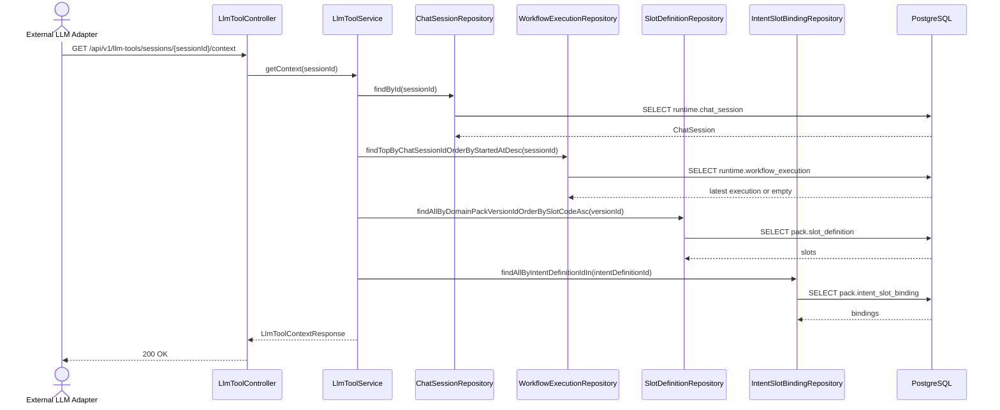

# 523. External LLM Slot Tool API

## Goal

외부 LLM이 고객 상담 중 현재 세션의 워크플로우 실행 컨텍스트와 slot 정의/값을 조회하고, 필요한 slot 값을 저장할 수 있는 REST 기반 tool API를 제공한다.

이 기능은 MCP 서버 구현이 아니라, 외부 LLM adapter 또는 function calling layer가 HTTP tool로 호출할 수 있는 backend API이다.

## Current Implementation Status

현재 구현은 backend `workflow-runtime` bounded context와 루트 `integrations/llm-tools` adapter에 추가된 상태다. 구현 파일은 아직 Git 기준 untracked 파일을 포함한다.

### 생성/변경된 코드

| Path | Layer | 역할 |
| --- | --- | --- |
| `backend/src/main/java/com/init/workflowruntime/presentation/LlmToolController.java` | presentation | `/api/v1/llm-tools/sessions/{sessionId}` 하위 REST endpoint 제공 |
| `backend/src/main/java/com/init/workflowruntime/application/LlmToolService.java` | application | 세션, workflow execution, slot definition, intent-slot binding을 조합해 tool 응답 생성 |
| `backend/src/main/java/com/init/workflowruntime/application/dto/LlmToolContextResponse.java` | application DTO | 세션 전체 tool context 응답 |
| `backend/src/main/java/com/init/workflowruntime/application/dto/LlmToolSlotResponse.java` | application DTO | slot 단건/목록 응답 |
| `backend/src/main/java/com/init/workflowruntime/application/dto/LlmToolSlotValueResponse.java` | application DTO | slot 값 저장 결과 응답 |
| `backend/src/main/java/com/init/workflowruntime/application/dto/UpsertSlotValueRequest.java` | application DTO | slot 값 저장 요청 body |
| `backend/src/main/java/com/init/workflowruntime/domain/WorkflowExecution.java` | domain | `runtime.workflow_execution` 매핑, `slot_values_json` 저장 |
| `backend/src/main/java/com/init/workflowruntime/domain/WorkflowExecutionRepository.java` | domain repository | 최신 workflow execution 조회 및 저장 port |
| `backend/src/main/java/com/init/workflowruntime/infrastructure/persistence/JpaWorkflowExecutionRepository.java` | infrastructure | Spring Data JPA repository adapter |
| `backend/src/main/java/com/init/domainpack/domain/repository/SlotDefinitionRepository.java` | domain repository | `domainPackVersionId + slotCode` 조회 메서드 추가 |
| `backend/src/main/java/com/init/domainpack/infrastructure/persistence/JpaSlotDefinitionRepository.java` | infrastructure | `domainPackVersionId + slotCode` JPA derived query 추가 |
| `backend/src/main/java/com/init/shared/infrastructure/security/SecurityConfig.java` | infrastructure/security | `/api/v1/llm-tools/**`를 `OPERATOR` 권한으로 보호 |
| `backend/src/test/java/com/init/workflowruntime/application/LlmToolServiceTest.java` | test | context 조회, slot 값 저장, 없는 slot 404 검증 |
| `backend/src/test/java/com/init/workflowruntime/presentation/LlmToolControllerTest.java` | test | REST endpoint 응답과 validation 검증 |
| `integrations/llm-tools/tool-schema.mjs` | integration | 외부 LLM에 등록할 function tool schema 정의 |
| `integrations/llm-tools/llm-tool-adapter.mjs` | integration | LLM tool call을 backend REST API 호출로 변환 |
| `integrations/llm-tools/README.md` | integration docs | adapter 사용 예시와 tool 이름 정리 |
| `integrations/llm-tools/llm-tool-adapter.test.mjs` | integration test | schema/adapter 동작 검증 |

## LLM Tool Schema And Adapter

외부 LLM에는 `integrations/llm-tools/tool-schema.mjs`의 `llmSlotTools`를 tools로 등록한다.

Tool schema는 `sessionId`를 노출하지 않는다. 현재 상담 세션 ID는 adapter 생성 시 서버 코드가 주입한다. 이렇게 해야 LLM이 임의 session ID를 조작하는 것을 막을 수 있다.

Tool names:

| Tool | Parameters | Backend call |
| --- | --- | --- |
| `get_current_slot_context` | none | `GET /api/v1/llm-tools/sessions/{sessionId}/context` |
| `list_current_slots` | none | `GET /api/v1/llm-tools/sessions/{sessionId}/slots` |
| `get_current_slot` | `slotCode` | `GET /api/v1/llm-tools/sessions/{sessionId}/slots/{slotCode}` |
| `upsert_current_slot_value` | `slotCode`, `value` | `PUT /api/v1/llm-tools/sessions/{sessionId}/slots/{slotCode}` |

사용 예시:

```js
import {
  createLlmSlotToolHandler,
  llmSlotTools,
} from "./integrations/llm-tools/llm-tool-adapter.mjs";

const handleToolCall = createLlmSlotToolHandler({
  backendBaseUrl: "http://localhost:8080",
  bearerToken: process.env.OPERATOR_JWT,
  sessionId: currentSessionId,
});

// LLM 요청에 llmSlotTools를 tools로 전달한다.
// LLM이 tool_call을 반환하면 handler에 넘겨 backend REST API를 호출한다.
const toolResult = await handleToolCall(toolCall);
```

## REST API

Base path:

```text
/api/v1/llm-tools/sessions/{sessionId}
```

Security:

```text
ROLE_OPERATOR required
```

### GET `/context`

현재 상담 세션 기준으로 외부 LLM이 필요한 전체 tool context를 반환한다.

Response fields:

| Field | Description |
| --- | --- |
| `sessionId` | 상담 세션 ID |
| `workspaceId` | 세션이 속한 workspace ID |
| `domainPackVersionId` | 세션이 사용하는 domain pack version ID |
| `executionId` | 최신 workflow execution ID. 없으면 `null` |
| `executionStatus` | 최신 workflow execution 상태. 없으면 `null` |
| `currentState` | 최신 workflow execution 현재 상태. 없으면 `null` |
| `slotValues` | 현재까지 저장된 slot 값 JSON object |
| `missingSlots` | active slot 중 값이 없는 slotCode 목록 |
| `slots` | active slot 정의, binding 정보, 현재 값 목록 |

Example:

```json
{
  "sessionId": 1,
  "workspaceId": 10,
  "domainPackVersionId": 101,
  "executionId": 50,
  "executionStatus": "RUNNING",
  "currentState": "collect_slots",
  "slotValues": {
    "order_id": "A-100"
  },
  "missingSlots": ["customer_name"],
  "slots": [
    {
      "id": 11,
      "slotCode": "order_id",
      "name": "주문번호",
      "description": "주문 식별자",
      "dataType": "STRING",
      "isSensitive": false,
      "validationRule": { "type": "string" },
      "defaultValue": null,
      "meta": {},
      "status": "ACTIVE",
      "required": true,
      "collectionOrder": 1,
      "promptHint": "주문번호를 물어본다",
      "hasValue": true,
      "value": "A-100"
    }
  ]
}
```

### GET `/slots`

현재 상담 세션의 domain pack version에 속한 active slot 목록을 반환한다.

동작:

- `ChatSession.domainPackVersionId` 기준으로 slot definition 목록을 조회한다.
- `SlotDefinition.STATUS_ACTIVE`인 slot만 노출한다.
- 최신 workflow execution의 `intentDefinitionId`가 있으면 intent-slot binding을 붙여 `required`, `collectionOrder`, `promptHint`를 채운다.
- 최신 workflow execution이 없으면 stored slot value는 빈 object로 본다.

### GET `/slots/{slotCode}`

특정 slotCode의 정의와 현재 값을 반환한다.

동작:

- 세션의 `domainPackVersionId`에 해당 `slotCode`가 있는지 확인한다.
- slot status가 `ACTIVE`가 아니면 404와 동일하게 처리한다.
- 현재 저장 값이 있으면 `hasValue=true`, 없으면 `hasValue=false`와 `value=null`에 준하는 JSON null을 반환한다.

### PUT `/slots/{slotCode}`

외부 LLM이 고객에게서 확보한 slot 값을 저장한다.

Request:

```json
{
  "value": "A-200"
}
```

Response:

```json
{
  "sessionId": 1,
  "executionId": 50,
  "slotCode": "order_id",
  "hasValue": true,
  "value": "A-200"
}
```

동작:

- `value`가 없으면 validation error를 반환한다.
- 세션의 domain pack version에 active slotCode가 있는지 검증한다.
- 최신 workflow execution이 있으면 해당 row의 `slot_values_json`을 갱신한다.
- workflow execution이 없으면 `WorkflowExecution.create(sessionId)`로 `RUNNING` execution을 생성한 뒤 저장한다.
- 기존 `slot_values_json` object에 `{slotCode: value}`를 upsert한다.

## Sequence Diagram



## Application Logic

### `LlmToolService.getContext`

세션, 최신 workflow execution, active slot 목록, 저장된 slot 값을 한 번에 반환한다. 외부 LLM이 다음 질문을 결정하거나 이미 확보한 정보를 확인할 때 사용하는 기본 endpoint이다.

### `LlmToolService.listSlots`

slot 정의 목록만 필요한 경우 사용한다. 전체 context보다 응답 범위가 작지만, 각 slot의 현재 저장 값과 binding 정보도 포함한다.

### `LlmToolService.getSlot`

외부 LLM이 특정 정보가 필요한 시점에 `slotCode`로 단건 조회한다. 예를 들어 `order_id`가 필요한 tool call을 실행하기 전에 현재 값이 있는지 확인할 수 있다.

### `LlmToolService.upsertSlotValue`

외부 LLM이 고객에게서 slot 값을 얻었을 때 저장한다. 저장 대상은 `runtime.workflow_execution.slot_values_json`이며, 실행이 없으면 새 execution을 생성한다.

## Data Model

### `WorkflowExecution`

`runtime.workflow_execution` table에 대응한다.

주요 필드:

| Field | DB column | Purpose |
| --- | --- | --- |
| `chatSessionId` | `chat_session_id` | 상담 세션 연결 |
| `workflowDefinitionId` | `workflow_definition_id` | 실행 workflow 연결 |
| `intentDefinitionId` | `intent_definition_id` | 현재 intent 연결 |
| `status` | `status` | 실행 상태 |
| `currentState` | `current_state` | 현재 workflow state |
| `slotValuesJson` | `slot_values_json` | 외부 LLM/tool이 수집한 slot 값 |
| `policySnapshotJson` | `policy_snapshot_json` | 정책 스냅샷 |
| `riskSnapshotJson` | `risk_snapshot_json` | 리스크 스냅샷 |

현재 구현은 `slotValuesJson`만 직접 갱신한다.

## Error Handling

| Case | Current behavior |
| --- | --- |
| sessionId가 없음 | `SESSION_NOT_FOUND` `NotFoundException` |
| slotCode가 세션 version에 없음 | `SLOT_DEFINITION_NOT_FOUND` `NotFoundException` |
| slotCode가 있지만 status가 active가 아님 | `SLOT_DEFINITION_NOT_FOUND` `NotFoundException` |
| PUT body에 `value` 없음 | validation error |
| 저장된 JSON이 object가 아님 | `JSON_OBJECT_EXPECTED` `InternalException` |
| 저장된 JSON parse 실패 | `JSON_PARSE_FAILED` `InternalException` |
| slot value serialization 실패 | `JSON_WRITE_FAILED` `InternalException` |

## Verification

현재 확인된 검증:

```bash
cd backend
./gradlew compileJava test --tests 'com.init.workflowruntime.application.LlmToolServiceTest' --tests 'com.init.workflowruntime.presentation.LlmToolControllerTest'

cd ..
node --test integrations/llm-tools/llm-tool-adapter.test.mjs
```

검증 결과:

```text
BUILD SUCCESSFUL
tests 5
pass 5
```

테스트 커버리지:

- `getContext`가 세션 기준 slot 정의와 저장 값을 함께 반환하는지 검증
- `upsertSlotValue`가 execution이 없을 때 생성 후 slot 값을 저장하는지 검증
- 존재하지 않는 slotCode가 404 계열 예외로 처리되는지 검증
- controller가 context, slot 단건, slot 값 저장 응답을 반환하는지 검증
- PUT body에 `value`가 없으면 400 validation error가 나는지 검증
- tool schema가 `sessionId`를 노출하지 않는지 검증
- OpenAI-style function tool call parsing을 검증
- `get_current_slot`, `upsert_current_slot_value`가 backend endpoint로 매핑되는지 검증

## Remaining Decisions

1. 외부 연동 표준을 현재 REST tool adapter로 확정할지, 별도 MCP server를 추가할지 결정해야 한다.
2. 외부 LLM이 사용할 인증 방식은 현재 `ROLE_OPERATOR` JWT 전제다. 서버 간 호출용 token 또는 scoped API key가 필요한지 결정해야 한다.
3. `slot_values_json` 저장 값에 대한 dataType별 validation은 현재 `SlotDefinition.validationRuleJson`을 응답으로 제공할 뿐, backend가 직접 강제하지 않는다.
4. sensitive slot 응답 정책은 현재 `isSensitive`를 노출하지만 value masking은 하지 않는다.
5. 최신 workflow execution 선택 기준은 `startedAt DESC` 하나다. 세션당 execution 수명 정책과 동시성 정책을 정해야 한다.
6. OpenAPI/Orval generated client 반영 여부는 별도 작업으로 확인해야 한다.
