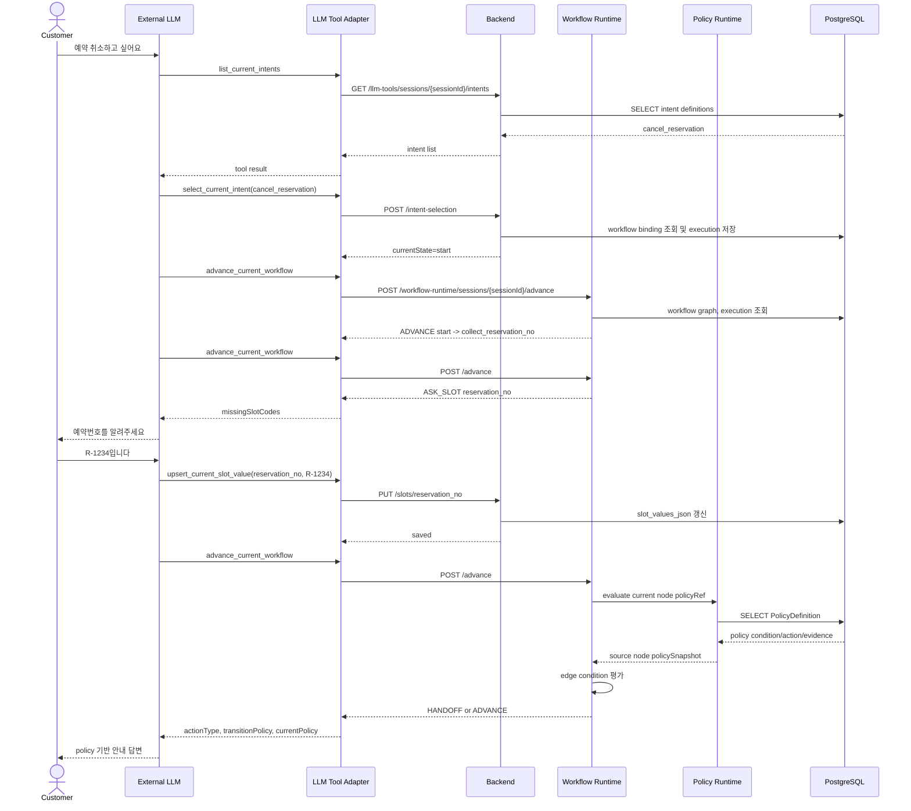

# [BE-5.2.4] Policy-Aware Workflow Runtime Engine And LLM Tool API

> **Backlog**: 5.2.4 워크플로우 런타임 다음 액션 계산 및 외부 LLM tool 연동
> **Bounded Context**: `workflow-runtime`
> **Template**: `_TEMPLATE_BE.md`
> **Branch**: `feature/001-boundary-intent-pipeline`
> **Frontend Scope**: 없음. 이번 스펙은 backend runtime engine과 외부 LLM tool adapter만 다룬다.

---

## Goal

외부 LLM이 고객과 상담할 때 다음 workflow 단계를 임의로 추측하지 않고, backend workflow runtime engine이 현재 대화 상태, slot 값, policy 평가 결과를 기준으로 다음 action/state를 결정하게 한다.

이 기능은 RAG를 사용하지 않는다. 답변 정책은 Domain Pack에 저장된 `PolicyDefinition`과 workflow graph node의 `policyRef`로 직접 연결한다.

---

## Non-Goals

- 프런트엔드 workflow editor 변경
- RAG, vector search, embedding 기반 policy 검색
- LLM이 edge 조건을 직접 판단하는 구조
- LLM이 임의 `sessionId`, `intentCode`, `slotCode`, `policyCode`를 생성해 실행하는 구조
- workflow graph JSON 작성 UI의 최종 UX 정의

---

## Core Concept

### 역할 분리

| 주체 | 책임 |
| --- | --- |
| External LLM | 고객 발화를 이해하고, 필요한 tool을 호출하고, tool 결과의 policy/action/evidence를 참고해 자연어 답변을 생성한다. |
| LLM Tool Adapter | LLM function call을 backend REST API 호출로 변환한다. `sessionId`는 LLM에게 노출하지 않고 서버가 주입한다. |
| Workflow Runtime Engine | 현재 `currentState`, `slotValuesJson`, `policySnapshotJson`, `riskSnapshotJson`으로 outgoing edge 조건을 평가해 다음 action/state를 결정한다. |
| Policy Runtime Service | 현재 node의 `policyRef`로 `PolicyDefinition`을 조회하고, policy condition을 slot/risk/policy snapshot 기준으로 평가한다. |
| Domain Pack | intent, slot, policy, workflow graph 정의의 source of truth다. |

### 중요한 원칙

1. LLM은 다음 workflow state를 직접 고르지 않는다.
2. Workflow engine은 현재 node의 outgoing edge만 평가한다.
3. `condition`이 없는 edge는 자동 이동하지 않는다. 무조건 이동이 필요하면 `{"type":"always"}`를 명시한다.
4. `default` edge는 모든 non-default edge가 실패했을 때만 fallback으로 사용한다.
5. node에 `policyRef`가 있으면 해당 `PolicyDefinition`을 조회해 LLM 답변 context로 내려준다.
6. `policy_hit` edge는 현재 node의 policy 평가 결과를 반영해 즉시 전이할 수 있다.
7. RAG 없이 저장된 policy의 `conditionJson`, `actionJson`, `evidenceJson`, `metaJson`만 사용한다.

---

## Existing Implementation Paths

아래 경로는 현재 저장소에서 확인된 구현 대상이다.

| Path | Layer | 역할 |
| --- | --- | --- |
| `backend/src/main/java/com/init/workflowruntime/presentation/WorkflowRuntimeController.java` | presentation | workflow advance endpoint 제공 |
| `backend/src/main/java/com/init/workflowruntime/application/WorkflowRuntimeService.java` | application | 현재 state 기준 edge 조건 평가 및 state 전이 |
| `backend/src/main/java/com/init/workflowruntime/application/WorkflowRuntimeGraph.java` | application | `WorkflowDefinition.graphJson` 파싱 |
| `backend/src/main/java/com/init/workflowruntime/application/WorkflowConditionEvaluator.java` | application | edge/policy condition 평가 |
| `backend/src/main/java/com/init/workflowruntime/application/WorkflowPolicyRuntimeService.java` | application | node `policyRef` 기준 policy 조회 및 평가 |
| `backend/src/main/java/com/init/workflowruntime/presentation/LlmToolController.java` | presentation | 외부 LLM tool용 REST endpoint 제공 |
| `backend/src/main/java/com/init/workflowruntime/application/LlmToolService.java` | application | intent, slot, policy context tool 응답 생성 |
| `backend/src/main/java/com/init/workflowruntime/domain/WorkflowExecution.java` | domain | 실행 상태, slot/policy/risk snapshot 저장 |
| `backend/src/main/java/com/init/domainpack/domain/repository/PolicyDefinitionRepository.java` | domain repository | `domainPackVersionId + policyCode` policy 조회 |
| `backend/src/main/java/com/init/domainpack/infrastructure/persistence/JpaPolicyDefinitionRepository.java` | infrastructure | policy 조회 JPA adapter |
| `backend/src/main/java/com/init/shared/infrastructure/security/SecurityConfig.java` | infrastructure/security | `/api/v1/llm-tools/**`, `/api/v1/workflow-runtime/**` 권한 보호 |
| `integrations/llm-tools/tool-schema.mjs` | integration | 외부 LLM function tool schema |
| `integrations/llm-tools/llm-tool-adapter.mjs` | integration | tool call을 backend REST API로 변환 |

---

## Data Contract

### Workflow Graph

`WorkflowDefinition.graphJson`은 runtime engine의 실행 계약이다.

```json
{
  "direction": "LR",
  "nodes": [
    {
      "id": "start",
      "type": "START",
      "label": "시작"
    },
    {
      "id": "collect_reservation_no",
      "type": "ACTION",
      "label": "예약번호 확인",
      "policyRef": "reservation_cancel_basic"
    },
    {
      "id": "confirm_cancel",
      "type": "ACTION",
      "label": "취소 가능 여부 확인",
      "policyRef": "reservation_cancel_deadline"
    },
    {
      "id": "handoff",
      "type": "HANDOFF",
      "label": "상담사 이관"
    },
    {
      "id": "done",
      "type": "TERMINAL",
      "label": "종료"
    }
  ],
  "edges": [
    {
      "id": "e_start_collect",
      "from": "start",
      "to": "collect_reservation_no",
      "condition": { "type": "always" }
    },
    {
      "id": "e_collect_confirm",
      "from": "collect_reservation_no",
      "to": "confirm_cancel",
      "condition": {
        "type": "slot_present",
        "slotCode": "reservation_no"
      }
    },
    {
      "id": "e_confirm_handoff",
      "from": "confirm_cancel",
      "to": "handoff",
      "condition": {
        "type": "policy_hit",
        "policyCode": "reservation_cancel_deadline"
      }
    },
    {
      "id": "e_confirm_done",
      "from": "confirm_cancel",
      "to": "done",
      "condition": { "type": "default" }
    }
  ]
}
```

### Node Type

| Type | Runtime 의미 |
| --- | --- |
| `START` | 시작 state. outgoing edge 조건 평가 대상이다. |
| `ACTION` | slot 수집, 정책 확인, 답변 준비 등 일반 실행 state다. `policyRef`를 가질 수 있다. |
| `DECISION` | 여러 edge 조건을 평가하는 분기 state다. 구현상 ACTION과 동일하게 outgoing edge를 평가한다. |
| `ANSWER` | LLM이 현재 policy/slot context를 참고해 답변해야 하는 state다. engine은 state를 이동하지 않고 `actionType=ANSWER`를 반환한다. |
| `HANDOFF` | 상담사 이관 state다. engine은 state를 이동하지 않고 `actionType=HANDOFF`를 반환한다. |
| `TERMINAL` | 종료 state다. execution을 완료 처리하고 `actionType=COMPLETED`를 반환한다. |

### Edge Condition Types

| Type | 필수 필드 | 의미 |
| --- | --- | --- |
| `always` | 없음 | 항상 match된다. 명시적인 무조건 이동에만 사용한다. |
| `default` | 없음 | 다른 non-default edge가 match되지 않을 때 fallback으로 사용한다. |
| `slot_present` | `slotCode` | `slotValuesJson[slotCode]`가 null/blank/empty가 아니면 match된다. |
| `slot_missing` | `slotCode` | slot 값이 없으면 match된다. |
| `slot_equals` | `slotCode`, `value` | slot 값이 `value`와 JSON equality로 같으면 match된다. |
| `all` | `conditions` | 하위 조건이 모두 match되면 match된다. |
| `any` | `conditions` | 하위 조건 중 하나라도 match되면 match된다. |
| `policy_hit` | `policyCode` | `policySnapshot.hits` 또는 snapshot 내부에 해당 `policyCode`가 있으면 match된다. |
| `risk_level_gte` | `riskLevel` | `riskSnapshot`의 최대 risk level이 기준 이상이면 match된다. |

`riskLevel` 허용값은 `LOW`, `MEDIUM`, `HIGH`, `CRITICAL`이다.

### Condition Examples

예약번호가 있을 때만 다음 단계로 이동:

```json
{
  "type": "slot_present",
  "slotCode": "reservation_no"
}
```

자동 취소 가능 값이 true일 때 종료:

```json
{
  "type": "slot_equals",
  "slotCode": "auto_cancel_available",
  "value": true
}
```

예약번호와 고객명이 모두 있어야 이동:

```json
{
  "type": "all",
  "conditions": [
    { "type": "slot_present", "slotCode": "reservation_no" },
    { "type": "slot_present", "slotCode": "customer_name" }
  ]
}
```

정책이 hit되면 상담사 이관:

```json
{
  "type": "policy_hit",
  "policyCode": "reservation_cancel_deadline"
}
```

고위험 이상이면 상담사 이관:

```json
{
  "type": "risk_level_gte",
  "riskLevel": "HIGH"
}
```

### Policy Definition Usage

workflow node의 `policyRef`는 `PolicyDefinition.policyCode`를 가리킨다.

예시 policy:

```json
{
  "policyCode": "reservation_cancel_deadline",
  "name": "예약 취소 마감 정책",
  "description": "체크인 24시간 이내 취소는 상담사 확인이 필요하다.",
  "severity": "HIGH",
  "conditionJson": {
    "type": "slot_equals",
    "slotCode": "within_24h",
    "value": true
  },
  "actionJson": {
    "answerGuide": "체크인 24시간 이내 예약은 즉시 취소 확정이 어렵고 상담사 확인이 필요하다고 안내한다.",
    "allowedActions": ["handoff"],
    "prohibitedActions": ["promise_full_refund"]
  },
  "evidenceJson": [
    {
      "title": "취소 마감 기준",
      "content": "체크인 24시간 이내 취소 요청은 상담사 검토 대상으로 분류한다."
    }
  ],
  "metaJson": {
    "handoffReason": "deadline_policy"
  }
}
```

동작:

- 현재 node에 `policyRef`가 없으면 `currentPolicy=null`이다.
- `policyRef`가 있으면 같은 `domainPackVersionId`의 `PolicyDefinition.policyCode`로 조회한다.
- `conditionJson`이 비어 있거나 executable `type`이 없으면 policy는 match된 것으로 본다.
- `conditionJson`이 있으면 `WorkflowConditionEvaluator`로 slot/policy/risk snapshot을 기준으로 평가한다.
- match되면 `policySnapshot.hits`에 해당 `policyCode`가 들어간다.
- LLM은 `currentPolicy.action`, `currentPolicy.evidence`, `currentPolicy.meta`를 답변 지침으로 사용한다.
- `policy_hit` edge로 전이된 경우, 도착 node의 정책과 별개로 이번 전이를 유발한 source node 정책을 `transitionPolicy`에 담는다.

---

## Runtime State Transition Rules

### Edge Selection

현재 state가 `collect_reservation_no`이면 engine은 `from=collect_reservation_no`인 edge만 평가한다.

평가 순서:

1. 현재 node의 policy를 먼저 평가해 policy snapshot을 만든다.
2. outgoing edge 중 `default`가 아닌 edge를 graph JSON 순서대로 평가한다.
3. 첫 번째 matching edge를 선택한다.
4. matching non-default edge가 없고 `default` edge가 있으면 첫 번째 default edge를 선택한다.
5. 어떤 edge도 선택되지 않고 누락 slot이 있으면 `ASK_SLOT`을 반환하고 state를 유지한다.
6. 어떤 edge도 선택되지 않고 누락 slot도 없으면 `WAIT_CONDITION`을 반환하고 state를 유지한다.

여러 non-default edge가 동시에 match될 수 있으면 graph JSON에 먼저 적힌 edge가 선택된다. 따라서 workflow 작성자는 조건을 상호 배타적으로 설계하거나 우선순위를 edge 순서로 명확히 표현해야 한다.

### Action Type

| `actionType` | 의미 | state 변경 |
| --- | --- | --- |
| `ADVANCE` | 일반 node로 전이됨 | 있음 |
| `ASK_SLOT` | 필요한 slot이 없어 고객에게 질문해야 함 | 없음 |
| `ANSWER` | 현재 또는 target node가 답변 node | target 진입 시 있음, 이미 ANSWER면 없음 |
| `HANDOFF` | 현재 또는 target node가 상담사 이관 node | target 진입 시 있음, 이미 HANDOFF면 없음 |
| `COMPLETED` | terminal state 도달 | 있음 또는 완료 처리 |
| `WAIT` | outgoing edge가 없음 | 없음 |
| `WAIT_CONDITION` | 조건이 아직 충족되지 않음 | 없음 |

---

## REST API

### Security

```text
ROLE_OPERATOR required
```

대상 path:

```text
/api/v1/llm-tools/**
/api/v1/workflow-runtime/**
```

### LLM Tool API

Base path:

```text
/api/v1/llm-tools/sessions/{sessionId}
```

| Method | Path | Description |
| --- | --- | --- |
| `GET` | `/context` | 현재 세션, execution, slot 값, 누락 slot, policy context를 한 번에 조회한다. |
| `GET` | `/policy-context` | 현재 state에 연결된 policy만 조회한다. |
| `GET` | `/intents` | 세션의 domain pack version에 등록된 intent 후보 목록을 조회한다. |
| `POST` | `/intent-selection` | intent를 선택하고 workflow execution을 시작한다. |
| `GET` | `/slots` | active slot 목록과 현재 값을 조회한다. |
| `GET` | `/slots/{slotCode}` | 특정 slot 정의와 현재 값을 조회한다. |
| `PUT` | `/slots/{slotCode}` | 고객에게서 확보한 slot 값을 저장한다. |

### Workflow Runtime API

| Method | Path | Description |
| --- | --- | --- |
| `POST` | `/api/v1/workflow-runtime/sessions/{sessionId}/advance` | 현재 execution의 state/slot/policy/risk 기준으로 다음 action/state를 계산한다. |

---

## Response Contracts

### `GET /context`

```json
{
  "sessionId": 1,
  "workspaceId": 10,
  "domainPackVersionId": 101,
  "executionId": 50,
  "executionStatus": "RUNNING",
  "currentState": "collect_reservation_no",
  "slotValues": {
    "reservation_no": "R-1234"
  },
  "policySnapshot": {
    "hits": []
  },
  "currentPolicy": {
    "id": 300,
    "policyCode": "reservation_cancel_basic",
    "name": "예약 취소 기본 정책",
    "description": "예약 취소 접수 시 예약번호를 확인한다.",
    "severity": "LOW",
    "condition": {},
    "action": {
      "answerGuide": "예약번호를 확인하고 취소 가능 여부를 조회한다."
    },
    "evidence": [],
    "meta": {},
    "status": "ACTIVE",
    "nodeId": "collect_reservation_no",
    "matched": true,
    "missingSlotCodes": [],
    "reason": "policy has no condition"
  },
  "missingSlots": [],
  "slots": []
}
```

### `GET /policy-context`

```json
{
  "sessionId": 1,
  "executionId": 50,
  "currentState": "confirm_cancel",
  "policySnapshot": {
    "hits": [
      {
        "policyCode": "reservation_cancel_deadline",
        "nodeId": "confirm_cancel"
      }
    ]
  },
  "currentPolicy": {
    "id": 301,
    "policyCode": "reservation_cancel_deadline",
    "name": "예약 취소 마감 정책",
    "description": "체크인 24시간 이내 취소는 상담사 확인이 필요하다.",
    "severity": "HIGH",
    "condition": {
      "type": "slot_equals",
      "slotCode": "within_24h",
      "value": true
    },
    "action": {
      "answerGuide": "상담사 확인이 필요하다고 안내한다.",
      "allowedActions": ["handoff"]
    },
    "evidence": [],
    "meta": {
      "handoffReason": "deadline_policy"
    },
    "status": "ACTIVE",
    "nodeId": "confirm_cancel",
    "matched": true,
    "missingSlotCodes": [],
    "reason": "policy condition matched"
  }
}
```

### `POST /advance`

`currentPolicy`는 이동 후 도착한 현재 node의 정책이고, `transitionPolicy`는 이번 edge 선택의 원인이 된 source node 정책이다. `transitionPolicy`는 `policy_hit` edge로 전이한 경우에만 채워진다.

```json
{
  "sessionId": 1,
  "executionId": 50,
  "executionStatus": "RUNNING",
  "previousState": "collect_reservation_no",
  "currentState": "confirm_cancel",
  "currentNodeType": "ACTION",
  "actionType": "ADVANCE",
  "edgeId": "e_collect_confirm",
  "targetState": "confirm_cancel",
  "missingSlotCodes": [],
  "condition": {
    "type": "slot_present",
    "slotCode": "reservation_no"
  },
  "policySnapshot": {
    "hits": []
  },
  "transitionPolicy": null,
  "currentPolicy": {
    "policyCode": "reservation_cancel_deadline",
    "matched": false,
    "missingSlotCodes": ["within_24h"]
  },
  "reason": "transitioned from collect_reservation_no to confirm_cancel"
}
```

`ASK_SLOT` 예시:

```json
{
  "sessionId": 1,
  "executionId": 50,
  "executionStatus": "RUNNING",
  "previousState": "collect_reservation_no",
  "currentState": "collect_reservation_no",
  "currentNodeType": "ACTION",
  "actionType": "ASK_SLOT",
  "edgeId": null,
  "targetState": "collect_reservation_no",
  "missingSlotCodes": ["reservation_no"],
  "condition": null,
  "policySnapshot": {
    "hits": []
  },
  "transitionPolicy": null,
  "currentPolicy": null,
  "reason": "required slot values are missing"
}
```

---

## External LLM Tool Schema

외부 LLM에는 `integrations/llm-tools/tool-schema.mjs`의 `llmSlotTools`를 등록한다.

Tool schema에는 `sessionId`가 없다. `sessionId`는 backend 또는 adapter layer에서 주입한다.

| Tool name | Parameters | Backend call |
| --- | --- | --- |
| `get_current_slot_context` | 없음 | `GET /api/v1/llm-tools/sessions/{sessionId}/context` |
| `get_current_policy_context` | 없음 | `GET /api/v1/llm-tools/sessions/{sessionId}/policy-context` |
| `advance_current_workflow` | 없음 | `POST /api/v1/workflow-runtime/sessions/{sessionId}/advance` |
| `list_current_slots` | 없음 | `GET /api/v1/llm-tools/sessions/{sessionId}/slots` |
| `get_current_slot` | `slotCode` | `GET /api/v1/llm-tools/sessions/{sessionId}/slots/{slotCode}` |
| `upsert_current_slot_value` | `slotCode`, `value` | `PUT /api/v1/llm-tools/sessions/{sessionId}/slots/{slotCode}` |
| `list_current_intents` | 없음 | `GET /api/v1/llm-tools/sessions/{sessionId}/intents` |
| `select_current_intent` | `intentCode` | `POST /api/v1/llm-tools/sessions/{sessionId}/intent-selection` |

---

## Usage Guide

### 1. Adapter 생성

서버 코드에서 현재 상담 세션 ID와 operator JWT를 주입한다.

```js
import {
  createLlmSlotToolHandler,
  llmSlotTools,
} from "./integrations/llm-tools/llm-tool-adapter.mjs";

const handleToolCall = createLlmSlotToolHandler({
  backendBaseUrl: "http://localhost:8080",
  bearerToken: process.env.OPERATOR_JWT,
  sessionId: currentSessionId,
});
```

LLM 요청에는 `llmSlotTools`를 tools로 전달한다.

```js
const response = await llm.responses.create({
  model: "example-model",
  input: [
    {
      role: "system",
      content:
        "너는 CS 상담 assistant다. 다음 workflow 단계는 직접 판단하지 말고 advance_current_workflow tool 결과를 따른다.",
    },
    {
      role: "user",
      content: "예약 취소하고 싶어요.",
    },
  ],
  tools: llmSlotTools,
});
```

LLM이 tool call을 반환하면 adapter에 넘긴다.

```js
for (const toolCall of response.tool_calls) {
  const toolResult = await handleToolCall(toolCall);
  // toolResult를 다시 LLM input에 tool result로 전달한다.
}
```

### 2. 첫 고객 발화에서 intent 선택

고객 발화:

```text
예약 취소하고 싶어요.
```

LLM tool call:

```json
{
  "name": "list_current_intents",
  "arguments": {}
}
```

Backend 응답 예시:

```json
[
  {
    "id": 70,
    "intentCode": "cancel_reservation",
    "name": "예약 취소",
    "description": "고객이 예약 취소를 요청한다.",
    "status": "PUBLISHED"
  },
  {
    "id": 71,
    "intentCode": "change_reservation",
    "name": "예약 변경",
    "description": "고객이 예약 일정을 변경한다.",
    "status": "PUBLISHED"
  }
]
```

LLM은 목록에 있는 code만 선택한다.

```json
{
  "name": "select_current_intent",
  "arguments": {
    "intentCode": "cancel_reservation"
  }
}
```

Backend 응답 예시:

```json
{
  "sessionId": 1,
  "executionId": 50,
  "intentDefinitionId": 70,
  "intentCode": "cancel_reservation",
  "intentName": "예약 취소",
  "workflowDefinitionId": 150,
  "workflowCode": "reservation_cancel",
  "currentState": "start",
  "slotCollectionRequired": true,
  "missingRequiredSlots": ["reservation_no"],
  "requiredSlots": []
}
```

### 3. Workflow advance 호출

LLM은 다음 단계가 무엇인지 직접 판단하지 않고 engine을 호출한다.

```json
{
  "name": "advance_current_workflow",
  "arguments": {}
}
```

`start -> collect_reservation_no` edge가 `always`이면 응답:

```json
{
  "actionType": "ADVANCE",
  "previousState": "start",
  "currentState": "collect_reservation_no",
  "edgeId": "e_start_collect",
  "missingSlotCodes": [],
  "reason": "transitioned from start to collect_reservation_no"
}
```

다시 advance했는데 예약번호가 없으면:

```json
{
  "actionType": "ASK_SLOT",
  "currentState": "collect_reservation_no",
  "missingSlotCodes": ["reservation_no"],
  "reason": "required slot values are missing"
}
```

LLM 고객 답변:

```text
예약번호를 알려주시면 취소 가능 여부를 확인해드릴게요.
```

### 4. 고객 발화에서 slot 저장

고객 발화:

```text
예약번호는 R-1234예요.
```

LLM tool call:

```json
{
  "name": "upsert_current_slot_value",
  "arguments": {
    "slotCode": "reservation_no",
    "value": "R-1234"
  }
}
```

Backend 응답:

```json
{
  "sessionId": 1,
  "executionId": 50,
  "slotCode": "reservation_no",
  "hasValue": true,
  "value": "R-1234"
}
```

### 5. Slot이 채워진 뒤 advance

LLM tool call:

```json
{
  "name": "advance_current_workflow",
  "arguments": {}
}
```

`slot_present(reservation_no)` 조건이 match되어 다음 state로 이동한다.

```json
{
  "actionType": "ADVANCE",
  "previousState": "collect_reservation_no",
  "currentState": "confirm_cancel",
  "edgeId": "e_collect_confirm",
  "condition": {
    "type": "slot_present",
    "slotCode": "reservation_no"
  }
}
```

### 6. Policy context로 답변 생성

현재 state가 `confirm_cancel`이고 node에 `policyRef=reservation_cancel_deadline`이 있으면 LLM은 policy context를 조회할 수 있다.

```json
{
  "name": "get_current_policy_context",
  "arguments": {}
}
```

응답:

```json
{
  "currentState": "confirm_cancel",
  "currentPolicy": {
    "policyCode": "reservation_cancel_deadline",
    "name": "예약 취소 마감 정책",
    "matched": true,
    "action": {
      "answerGuide": "체크인 24시간 이내 예약은 즉시 취소 확정이 어렵고 상담사 확인이 필요하다고 안내한다.",
      "allowedActions": ["handoff"],
      "prohibitedActions": ["promise_full_refund"]
    },
    "evidence": [
      {
        "title": "취소 마감 기준",
        "content": "체크인 24시간 이내 취소 요청은 상담사 검토 대상으로 분류한다."
      }
    ]
  }
}
```

LLM은 이 내용을 근거로 답변하되, 다음 state 이동은 여전히 `advance_current_workflow` 결과를 따른다.

고객 답변 예시:

```text
확인해보니 해당 예약은 취소 마감 정책 확인이 필요합니다. 바로 상담사에게 연결해드릴게요.
```

### 7. Policy hit edge로 상담사 이관

LLM tool call:

```json
{
  "name": "advance_current_workflow",
  "arguments": {}
}
```

현재 node policy가 match되고, edge 조건이 `policy_hit(reservation_cancel_deadline)`이면:

```json
{
  "actionType": "HANDOFF",
  "previousState": "confirm_cancel",
  "currentState": "handoff",
  "currentNodeType": "HANDOFF",
  "edgeId": "e_confirm_handoff",
  "targetState": "handoff",
  "condition": {
    "type": "policy_hit",
    "policyCode": "reservation_cancel_deadline"
  },
  "policySnapshot": {
    "hits": []
  },
  "transitionPolicy": {
    "policyCode": "reservation_cancel_deadline",
    "nodeId": "confirm_cancel",
    "matched": true,
    "action": {
      "answerGuide": "즉시 취소 확정을 약속하지 말고 상담사 확인이 필요하다고 안내한다.",
      "allowedActions": ["handoff"],
      "prohibitedActions": ["promise_full_refund"]
    },
    "reason": "policy condition matched"
  },
  "currentPolicy": null,
  "reason": "transitioned from confirm_cancel to handoff"
}
```

이때 LLM은 상담사 이관 안내 메시지를 생성한다. 실제 상담사 배정/큐 처리는 별도 상담사 개입 기능에서 처리한다.

---

## End-To-End Flow Example



---

## Error Handling

| Case | Error |
| --- | --- |
| sessionId가 없음 | `SESSION_NOT_FOUND` |
| workflow execution이 없는데 advance 호출 | `WORKFLOW_EXECUTION_NOT_FOUND` |
| workflow가 선택되지 않음 | `WORKFLOW_NOT_SELECTED` |
| workflow definition이 없음 | `WORKFLOW_DEFINITION_NOT_FOUND` |
| execution currentState가 없음 | `WORKFLOW_STATE_MISSING` |
| graph node/edge가 잘못됨 | `WORKFLOW_GRAPH_INVALID` |
| currentState가 graph에 없음 | `WORKFLOW_STATE_NOT_FOUND` |
| condition type이 지원되지 않음 | `WORKFLOW_CONDITION_INVALID` |
| node `policyRef`에 해당하는 policy가 없음 | `POLICY_DEFINITION_NOT_FOUND` |
| 저장 JSON parse 실패 | `JSON_PARSE_FAILED` |
| 저장 JSON이 object가 아님 | `JSON_OBJECT_EXPECTED` |

---

## Tests

### Backend Target Tests

```bash
cd backend
./gradlew test \
  --tests 'com.init.workflowruntime.application.WorkflowPolicyRuntimeServiceTest' \
  --tests 'com.init.workflowruntime.application.WorkflowRuntimeServiceTest' \
  --tests 'com.init.workflowruntime.application.LlmToolServiceTest' \
  --tests 'com.init.workflowruntime.presentation.LlmToolControllerTest' \
  --tests 'com.init.workflowruntime.presentation.WorkflowRuntimeControllerTest'
```

검증 항목:

- slot이 없으면 `ASK_SLOT`을 반환하고 currentState를 유지한다.
- slot 조건이 충족되면 target state로 전이한다.
- 조건이 match되지 않으면 `default` edge를 사용한다.
- 현재 node policy가 match되면 `policy_hit` edge로 즉시 전이한다.
- 현재 state의 `policyRef`를 기준으로 policy context를 반환한다.
- LLM tool controller가 context, policy context, slot, intent API를 제공한다.
- workflow runtime controller가 `/advance` 응답을 제공한다.

### LLM Tool Adapter Tests

```bash
node --test integrations/llm-tools/llm-tool-adapter.test.mjs
```

검증 항목:

- tool schema가 `sessionId`를 노출하지 않는다.
- OpenAI-style function tool call arguments를 파싱한다.
- `get_current_policy_context`가 backend policy context endpoint로 매핑된다.
- `advance_current_workflow`가 workflow runtime endpoint로 매핑된다.
- slot, intent 관련 기존 tool 매핑이 유지된다.

### Formatting

```bash
cd backend
./gradlew spotlessJavaCheck
```

현재 branch 상태에서는 `backend/src/main/java/com/init/pipelinejob/domain/model/PipelineJob.java`의 기존 포맷 차이 때문에 전체 Spotless가 실패할 수 있다. 이 스펙의 workflow-runtime 변경 파일은 Spotless 형식에 맞춰야 한다.

---

## Authoring Checklist

Workflow graph를 작성하거나 ML draft-generation에서 생성할 때 아래를 지킨다.

- [ ] 모든 edge에는 `condition`을 명시한다.
- [ ] 무조건 이동은 condition 생략이 아니라 `{"type":"always"}`를 사용한다.
- [ ] fallback은 `{"type":"default"}`로 표현한다.
- [ ] 동일 node의 여러 edge가 동시에 match될 수 있으면 graph JSON 순서가 우선순위임을 의도적으로 사용한다.
- [ ] slot 기반 분기는 `slot_present`, `slot_missing`, `slot_equals` 중 하나로 표현한다.
- [ ] 복합 조건은 `all`, `any`로 표현한다.
- [ ] policy 기반 분기는 node `policyRef`와 edge `policy_hit.policyCode`를 같은 code로 연결한다.
- [ ] LLM 답변 지침은 policy `actionJson`과 `evidenceJson`에 넣는다.
- [ ] RAG가 필요한 지식은 이 기능 범위에 넣지 않는다. policy로 구조화해 Domain Pack에 저장한다.
- [ ] 프런트엔드 editor가 condition을 보존하지 못하는 상태라면, graph JSON은 backend/ML artifact 또는 별도 관리 경로에서 생성한다.

---

## Remaining Decisions

1. frontend workflow editor에서 edge condition과 node `policyRef`를 직접 편집/보존할지 별도 FE 스펙으로 정의해야 한다.
2. `riskSnapshotJson`을 누가 어떤 시점에 갱신할지 별도 risk runtime 정책이 필요하다.
3. policy `actionJson`의 표준 schema를 확정해야 한다. 현재는 JSON object로 내려주고 LLM prompt에서 해석한다.
4. slot value dataType validation을 backend에서 강제할지 결정해야 한다.
5. 세션당 workflow execution 수명 정책과 동시성 정책을 정의해야 한다.
