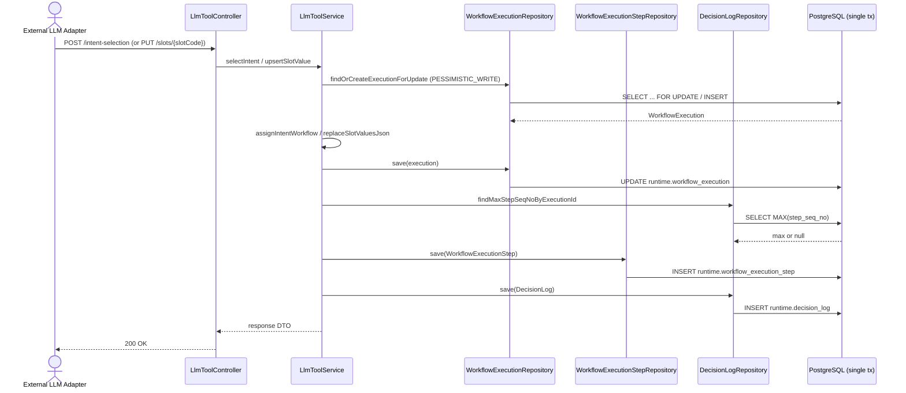
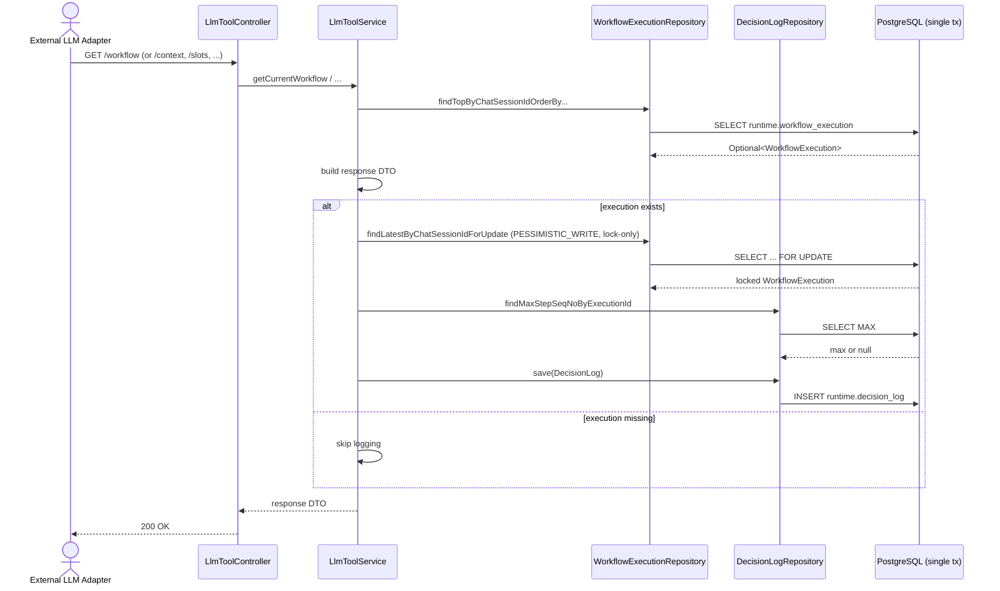
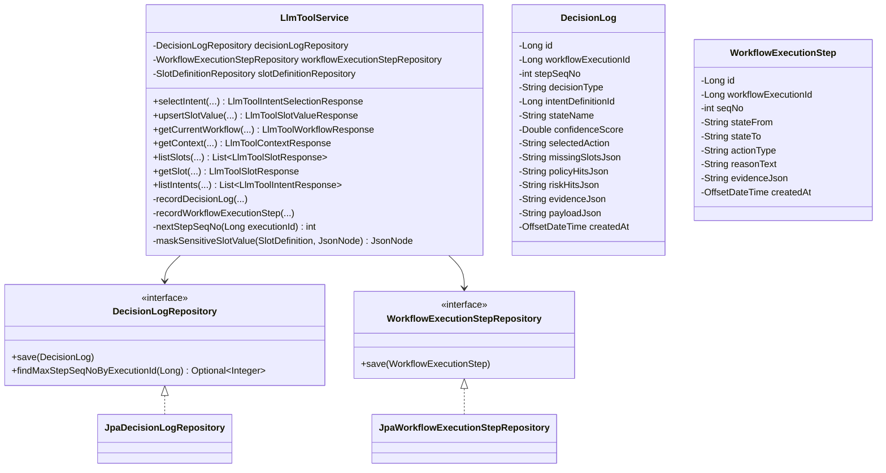

# 525. Decision Log Writer — LLM Tool Calls

## Goal

기존 `LlmToolController/Service` 7개 tool call 경로에 `runtime.decision_log` 쓰기를 추가하여, 외부 LLM이 만든 결정(intent 선택, slot 입력 등)과 read tool 호출까지를 워크플로우 실행 단위로 audit-trail 한다. 쓰기 tool 2건은 `runtime.workflow_execution_step` 의 상태 전이 로그도 같은 트랜잭션에 함께 기록한다.

본 spec은 read-only data fetch tool 5건과 state-mutating tool 2건이 공유하는 단일 `decision_log` 쓰기 책임을 정의한다. 쓰기 책임은 `LlmToolService` 안에 inline 으로 두며 별도 분리하지 않는다(YAGNI; tool 갯수가 7개로 한정).

---

## Background

### 기존 인프라 (재사용)

- `LlmToolController` (`backend/src/main/java/com/init/workflowruntime/presentation/LlmToolController.java:31-85`) — base path `/api/v1/llm-tools/sessions/{sessionId}`, 7개 endpoint.
- `LlmToolService` (`backend/src/main/java/com/init/workflowruntime/application/LlmToolService.java:1-461`) — class-level `@Transactional(readOnly = true)`, 쓰기 메서드(`selectIntent`, `upsertSlotValue`)는 `@Transactional` 로 override.
- `WorkflowExecution` (`backend/src/main/java/com/init/workflowruntime/domain/WorkflowExecution.java`) — `id`, `intentDefinitionId`, `currentState`, `slotValuesJson` 등.
- `findOrCreateExecutionForUpdate` (`LlmToolService.java:256-264`) — 쓰기 메서드에서 `PESSIMISTIC_WRITE` lock으로 execution 확보. 본 spec의 `step_seq_no` 채번 race도 동일 lock으로 보호된다.
- `findActiveSlot` (`LlmToolService.java:299-312`) — `SlotDefinition` 반환. `getIsSensitive()` 를 호출하여 마스킹 판단.
- `SlotDefinition.getIsSensitive()` (`backend/src/main/java/com/init/domainpack/domain/model/SlotDefinition.java`) — `slot_definition.is_sensitive` 컬럼 매핑.

### DB DDL — 테이블은 이미 존재, 인덱스 1개만 신규 추가

- `runtime.decision_log` (`backend/src/main/resources/db/changelog/db.changelog-master.sql:549-567`) — recon-report-525.md 1.1 참조.
- `runtime.workflow_execution_step` (`db.changelog-master.sql:534-547`) — recon-report-525.md 1.9 참조.
- 인덱스 `idx_decision_log_execution_seq` — **현재 Liquibase 미적용**. `.agent/docs/schema.md:890-891` 의 문서 전용 정의만 존재하며 `db.changelog-master.sql` (총 765줄) 어디에도 changeset 이 없다. 본 spec 의 `findMaxStepSeqNoByExecutionId` 쿼리는 모든 tool call 의 hot-path 이므로 본 spec 에서 인덱스 changeset 1건을 신규 추가한다(SC-B1 / CSC-001 보정).

신규 Liquibase changeset 1건: `idx_decision_log_execution_seq` (인덱스만, 테이블 DDL 미변경). 상세는 아래 `Database` 절 참조.

---

## REST API

신규 endpoint 없음. 기존 7개 endpoint 의 응답 형식 변경 없음. `decision_log` 조회 endpoint 는 본 spec 범위 밖(U-003).

---

## Scope — Tool 별 로깅 동작

7개 tool call이 모두 `decision_log` row 1건을 작성한다(U-004 Option B 확정). 단 `WorkflowExecution` 이 존재하는 세션에서만 로깅한다(Q-006 확정).

| Method | `decision_type` (decision_log) | `action_type` (workflow_execution_step) |
| --- | --- | --- |
| `selectIntent` | `INTENT_SELECTED` | `ASSIGN_INTENT` |
| `upsertSlotValue` | `SLOT_UPSERTED` | `UPSERT_SLOT` |
| `getCurrentWorkflow` | `WORKFLOW_FETCHED` | — (read, step row 미작성) |
| `getContext` | `CONTEXT_FETCHED` | — |
| `listSlots` | `SLOTS_LISTED` | — |
| `getSlot` | `SLOT_FETCHED` | — |
| `listIntents` | `INTENTS_LISTED` | — |

상수 정의 위치: `com.init.workflowruntime.domain.DecisionLogType` (final class with `public static final String INTENT_SELECTED = "INTENT_SELECTED"` 등). `WorkflowExecutionStepActionType` 도 동일 패턴(2개 상수만).

### 로깅 스킵 조건 (Hard)

다음 케이스에서는 두 테이블 어디에도 row를 작성하지 않는다(Q-006 확정):

- `findExecution(sessionId)` 가 null 반환(execution 부재) → 로그 스킵.
- read tool에서 `ChatSession` 자체가 없어 `SESSION_NOT_FOUND` 가 throw → tool 응답이 404이고 로그 row 없음(트랜잭션 rollback).

### 쓰기 tool에서 자동 생성된 execution

`selectIntent` / `upsertSlotValue` 는 `findOrCreateExecutionForUpdate` 로 execution 을 생성할 수 있다(`LlmToolService.java:256-264`). 이 경로에서는 execution 생성과 decision_log/step 저장이 같은 트랜잭션 안에서 일어나므로 로깅 스킵 조건에 해당하지 않는다(execution이 명백히 존재).

---

## Sequence Diagram

### Write tool (selectIntent / upsertSlotValue) — 두 테이블 모두 작성



### Read tool — decision_log 만 작성



---

## Class Design

### DDD Layered Structure



### New Application Files

| File | Layer | 역할 |
| --- | --- | --- |
| `backend/src/main/java/com/init/workflowruntime/domain/DecisionLog.java` | domain (Aggregate Root) | `@Entity @Table(name = "decision_log", schema = "runtime")`. 도메인 factory `DecisionLog.record(...)`. setter 없음. |
| `backend/src/main/java/com/init/workflowruntime/domain/DecisionLogType.java` | domain (상수) | `INTENT_SELECTED`, `SLOT_UPSERTED`, `WORKFLOW_FETCHED`, `CONTEXT_FETCHED`, `SLOTS_LISTED`, `SLOT_FETCHED`, `INTENTS_LISTED` |
| `backend/src/main/java/com/init/workflowruntime/domain/DecisionLogRepository.java` | domain interface | `save`, `findMaxStepSeqNoByExecutionId(Long)` |
| `backend/src/main/java/com/init/workflowruntime/infrastructure/persistence/JpaDecisionLogRepository.java` | infrastructure | Spring Data JPA. `@Query("select max(d.stepSeqNo) from DecisionLog d where d.workflowExecutionId = :execId")` |
| `backend/src/main/java/com/init/workflowruntime/domain/WorkflowExecutionStep.java` | domain | `@Entity @Table(name = "workflow_execution_step", schema = "runtime")`. factory `WorkflowExecutionStep.record(...)`. setter 없음. |
| `backend/src/main/java/com/init/workflowruntime/domain/WorkflowExecutionStepActionType.java` | domain (상수) | `ASSIGN_INTENT`, `UPSERT_SLOT` |
| `backend/src/main/java/com/init/workflowruntime/domain/WorkflowExecutionStepRepository.java` | domain interface | `save` |
| `backend/src/main/java/com/init/workflowruntime/infrastructure/persistence/JpaWorkflowExecutionStepRepository.java` | infrastructure | Spring Data JPA. |

### Modified Files

| File | 수정 내용 |
| --- | --- |
| `backend/src/main/java/com/init/workflowruntime/application/LlmToolService.java` | 생성자 주입에 `DecisionLogRepository`, `WorkflowExecutionStepRepository` 추가. 7개 public 메서드 각각 마지막에 `recordDecisionLog(...)` 호출 1줄 추가. 쓰기 2개 메서드는 `recordWorkflowExecutionStep(...)` 호출 추가. 5개 read 메서드는 method-level `@Transactional` 로 override (class-level `readOnly = true` 무효화). `upsertSlotValue` 의 `findActiveSlot` 호출 시 반환값 캡처(`SlotDefinition slotDef = findActiveSlot(...)`)하여 `maskSensitiveSlotValue` 에서 사용. |

---

## Data Model

### DecisionLog Entity (신규)

```java
package com.init.workflowruntime.domain;

import jakarta.persistence.*;
import org.hibernate.annotations.JdbcTypeCode;
import org.hibernate.type.SqlTypes;
import java.time.OffsetDateTime;

@Entity
@Table(name = "decision_log", schema = "runtime")
public class DecisionLog {

  @Id
  @GeneratedValue(strategy = GenerationType.IDENTITY)
  private Long id;

  @Column(name = "workflow_execution_id", nullable = false)
  private Long workflowExecutionId;

  @Column(name = "step_seq_no", nullable = false)
  private int stepSeqNo;

  @Column(name = "decision_type", nullable = false, length = 100)
  private String decisionType;

  @Column(name = "intent_definition_id")
  private Long intentDefinitionId;

  @Column(name = "state_name", length = 100)
  private String stateName;

  @Column(name = "confidence_score")
  private Double confidenceScore;

  @Column(name = "selected_action", length = 100)
  private String selectedAction;

  @Column(name = "missing_slots_json", nullable = false)
  @JdbcTypeCode(SqlTypes.JSON)
  private String missingSlotsJson;

  @Column(name = "policy_hits_json", nullable = false)
  @JdbcTypeCode(SqlTypes.JSON)
  private String policyHitsJson;

  @Column(name = "risk_hits_json", nullable = false)
  @JdbcTypeCode(SqlTypes.JSON)
  private String riskHitsJson;

  @Column(name = "evidence_json", nullable = false)
  @JdbcTypeCode(SqlTypes.JSON)
  private String evidenceJson;

  @Column(name = "payload_json", nullable = false)
  @JdbcTypeCode(SqlTypes.JSON)
  private String payloadJson;

  @Column(name = "created_at", nullable = false, updatable = false)
  private OffsetDateTime createdAt;

  protected DecisionLog() {}

  // factory used by service — all fields explicit
  public static DecisionLog record(
      Long workflowExecutionId,
      int stepSeqNo,
      String decisionType,
      Long intentDefinitionId,
      String stateName,
      Double confidenceScore,
      String selectedAction,
      String missingSlotsJson,
      String payloadJson) {
    DecisionLog log = new DecisionLog();
    log.workflowExecutionId = workflowExecutionId;
    log.stepSeqNo = stepSeqNo;
    log.decisionType = decisionType;
    log.intentDefinitionId = intentDefinitionId;
    log.stateName = stateName;
    log.confidenceScore = confidenceScore;
    log.selectedAction = selectedAction;
    log.missingSlotsJson = missingSlotsJson != null ? missingSlotsJson : "[]";
    log.policyHitsJson = "[]";
    log.riskHitsJson = "[]";
    log.evidenceJson = "[]";
    log.payloadJson = payloadJson != null ? payloadJson : "{}";
    return log;
  }

  @PrePersist
  void onCreate() {
    if (createdAt == null) {
      createdAt = OffsetDateTime.now();
    }
  }

  // getters only (no public setters)
}
```

### WorkflowExecutionStep Entity (신규)

```java
@Entity
@Table(name = "workflow_execution_step", schema = "runtime")
public class WorkflowExecutionStep {

  @Id
  @GeneratedValue(strategy = GenerationType.IDENTITY)
  private Long id;

  @Column(name = "workflow_execution_id", nullable = false)
  private Long workflowExecutionId;

  @Column(name = "seq_no", nullable = false)
  private int seqNo;

  @Column(name = "state_from", length = 100)
  private String stateFrom;

  @Column(name = "state_to", length = 100)
  private String stateTo;

  @Column(name = "action_type", nullable = false, length = 100)
  private String actionType;

  @Column(name = "reason_text", columnDefinition = "text")
  private String reasonText;

  @Column(name = "evidence_json", nullable = false)
  @JdbcTypeCode(SqlTypes.JSON)
  private String evidenceJson;

  @Column(name = "created_at", nullable = false, updatable = false)
  private OffsetDateTime createdAt;

  protected WorkflowExecutionStep() {}

  public static WorkflowExecutionStep record(
      Long workflowExecutionId,
      int seqNo,
      String stateFrom,
      String stateTo,
      String actionType) {
    WorkflowExecutionStep step = new WorkflowExecutionStep();
    step.workflowExecutionId = workflowExecutionId;
    step.seqNo = seqNo;
    step.stateFrom = stateFrom;
    step.stateTo = stateTo;
    step.actionType = actionType;
    step.reasonText = null;
    step.evidenceJson = "[]";
    return step;
  }

  @PrePersist
  void onCreate() {
    if (createdAt == null) {
      createdAt = OffsetDateTime.now();
    }
  }
}
```

---

## Application Logic

### Step Seq 채번 (Hard)

```java
private int nextStepSeqNo(Long executionId) {
  return decisionLogRepository
      .findMaxStepSeqNoByExecutionId(executionId)
      .map(max -> max + 1)
      .orElse(1);
}
```

`decision_log` 테이블의 MAX 만 본다. `workflow_execution_step` 의 MAX 는 보지 않는다 — 모든 tool call이 `decision_log` 에 row를 작성하므로 dlog 의 MAX 가 항상 ≥ step 의 MAX 다(seq 동기화 invariant — Q-002 확정).

쓰기 tool 에서 `step.seq_no` 는 같은 트랜잭션의 `dlog.step_seq_no` 와 동일 값을 사용한다. read tool은 step 을 작성하지 않으므로 step.seq_no 에 gap 이 생긴다(예: step.seq = {1, 4, 7}, dlog.step_seq_no = {1, 2, 3, 4, 5, 6, 7}).

`nextStepSeqNo` 호출은 항상 같은 execution row 에 대한 `PESSIMISTIC_WRITE` lock 이 보호한 상태에서 실행된다(write tool: `findOrCreateExecutionForUpdate`; read tool: `findLatestByChatSessionIdForUpdate` — Transaction Boundary invariant 3 참조). 이로써 동시 호출 race 가 없어 UNIQUE constraint `(workflow_execution_id, step_seq_no, decision_type)` 위반이 발생하지 않는다.

### Column 매핑 (Hard — Minimal Mapping)

기본 매핑 표(U-007 Option A + Q-004 확정):

| Column | Write (INTENT_SELECTED) | Write (SLOT_UPSERTED) | Read (5종 공통) |
| --- | --- | --- | --- |
| `workflow_execution_id` | saved.id | saved.id | execution.id |
| `step_seq_no` | nextStepSeqNo(execId) | nextStepSeqNo(execId) | nextStepSeqNo(execId) |
| `decision_type` | `INTENT_SELECTED` | `SLOT_UPSERTED` | tool 별 상수 |
| `intent_definition_id` | intent.getId() | saved.getIntentDefinitionId() | execution.getIntentDefinitionId() |
| `state_name` | resolveInitialState(workflow) (=saved.getCurrentState()) | saved.getCurrentState() | execution.getCurrentState() |
| `confidence_score` | null | null | null |
| `selected_action` | `"ASSIGN_WORKFLOW"` | null | null |
| `missing_slots_json` | `missingRequiredSlots` JSON serialize | `[]` | `getContext` 만 missingSlots 계산; 나머지 4종 `[]` |
| `policy_hits_json` | `[]` (DB default 사용) | `[]` | `[]` |
| `risk_hits_json` | `[]` | `[]` | `[]` |
| `evidence_json` | `[]` | `[]` | `[]` |
| `payload_json` | `{"intentCode":"<>"}` | `{"slotCode":"<>","value":<mask 적용된 JsonNode>}` | tool 별 — 아래 표 |

read tool 의 `payload_json` :

| Method | `payload_json` |
| --- | --- |
| `getCurrentWorkflow` | `{}` |
| `getContext` | `{}` |
| `listSlots` | `{"returnedCount": <slot 갯수>}` |
| `getSlot` | `{"slotCode":"<>"}` |
| `listIntents` | `{"returnedCount": <intent 갯수>}` |

### Sensitive Slot Masking (Hard — Q-004 확정)

`upsertSlotValue` 의 `payload_json.value` 는 `slotDef.getIsSensitive()` 가 `Boolean.TRUE` 와 동일하면 `"***"` 문자열로 대체. 그 외에는 원본 JsonNode 그대로.

```java
private JsonNode maskSensitiveSlotValue(SlotDefinition slotDef, JsonNode rawValue) {
  if (Boolean.TRUE.equals(slotDef.getIsSensitive())) {
    return TextNode.valueOf("***");
  }
  return rawValue;
}
```

마스킹은 `decision_log.payload_json` 에만 적용. `WorkflowExecution.slotValuesJson` 에는 원본 값을 그대로 저장(기존 동작 유지).

### selectIntent 수정 발췌

```java
@Transactional
public LlmToolIntentSelectionResponse selectIntent(SelectLlmToolIntentCommand command) {
  // ... 기존 로직 그대로 ...
  WorkflowExecution saved = workflowExecutionRepository.save(execution);

  // ... 기존 missingRequiredSlots 계산 그대로 ...

  // 신규: step + decision_log 기록
  int seq = nextStepSeqNo(saved.getId());
  workflowExecutionStepRepository.save(
      WorkflowExecutionStep.record(
          saved.getId(),
          seq,
          null,                                  // state_from: assignment 전 상태 미존재
          saved.getCurrentState(),               // state_to: resolveInitialState 결과
          WorkflowExecutionStepActionType.ASSIGN_INTENT));
  decisionLogRepository.save(
      DecisionLog.record(
          saved.getId(),
          seq,
          DecisionLogType.INTENT_SELECTED,
          intent.getId(),
          saved.getCurrentState(),
          null,
          "ASSIGN_WORKFLOW",
          writeJson(toJsonArray(missingRequiredSlots)),
          writeJson(objectMapper.createObjectNode().put("intentCode", intent.getIntentCode()))));

  return new LlmToolIntentSelectionResponse(/* ... 기존 그대로 ... */);
}
```

### upsertSlotValue 수정 발췌

```java
@Transactional
public LlmToolSlotValueResponse upsertSlotValue(UpsertLlmToolSlotValueCommand command) {
  // ... 기존 검증 ...
  ChatSession session = findSession(sessionId);
  SlotDefinition slotDef = findActiveSlot(session.getDomainPackVersionId(), slotCode); // 반환값 캡처

  WorkflowExecution execution = findOrCreateExecutionForUpdate(session);
  // ... slotValues 갱신 ...
  WorkflowExecution saved = workflowExecutionRepository.save(execution);

  int seq = nextStepSeqNo(saved.getId());
  workflowExecutionStepRepository.save(
      WorkflowExecutionStep.record(
          saved.getId(),
          seq,
          saved.getCurrentState(),               // slot upsert는 state 전이 없음
          saved.getCurrentState(),
          WorkflowExecutionStepActionType.UPSERT_SLOT));

  ObjectNode payload = objectMapper.createObjectNode();
  payload.put("slotCode", slotCode);
  payload.set("value", maskSensitiveSlotValue(slotDef, value));
  decisionLogRepository.save(
      DecisionLog.record(
          saved.getId(),
          seq,
          DecisionLogType.SLOT_UPSERTED,
          saved.getIntentDefinitionId(),
          saved.getCurrentState(),
          null,
          null,
          "[]",
          writeJson(payload)));

  return new LlmToolSlotValueResponse(/* ... 기존 그대로 ... */);
}
```

### Read tool 수정 발췌 (5종 공통 패턴)

```java
@Transactional  // class-level readOnly=true 를 method-level 로 override
public LlmToolContextResponse getContext(GetLlmToolContextCommand command) {
  // ... 기존 로직 그대로 (응답 DTO 빌드까지) ...
  LlmToolContextResponse response = new LlmToolContextResponse(...);

  // 신규: execution 이 있을 때만 dlog 기록 — PESSIMISTIC_WRITE lock 으로 step_seq_no race 직렬화
  if (execution != null) {
    // lock-only call. 반환값은 사용하지 않음. invariant 3 참조.
    workflowExecutionRepository.findLatestByChatSessionIdForUpdate(command.sessionId());
    int seq = nextStepSeqNo(execution.getId());
    decisionLogRepository.save(
        DecisionLog.record(
            execution.getId(),
            seq,
            DecisionLogType.CONTEXT_FETCHED,
            execution.getIntentDefinitionId(),
            execution.getCurrentState(),
            null,
            null,
            writeJson(toJsonArray(response.missingSlots())),
            "{}"));
  }
  return response;
}
```

다른 4개 read 메서드도 동일 패턴:

- `getCurrentWorkflow` → `decision_type = WORKFLOW_FETCHED`, `payload_json = {}`
- `listSlots` → `SLOTS_LISTED`, `payload_json = {"returnedCount": <list.size()>}`
- `getSlot` → `SLOT_FETCHED`, `payload_json = {"slotCode": "<>"}`
- `listIntents` → `INTENTS_LISTED`, `payload_json = {"returnedCount": <list.size()>}`

### Helper — toJsonArray, writeJson

`writeJson` 은 기존 helper(`LlmToolService.java:442-448`) 그대로 재사용. `toJsonArray(List<String>)` 는 신규 private helper.

```java
private ArrayNode toJsonArray(List<String> codes) {
  ArrayNode arr = objectMapper.createArrayNode();
  for (String code : codes) {
    arr.add(code);
  }
  return arr;
}
```

---

## Transaction Boundary (engineering-bound)

본 spec은 `decision_log` 및 `workflow_execution_step` 의 쓰기를 tool call 본 처리와 **같은 트랜잭션**에 묶고, 같은 execution 에 대한 동시 로깅을 `PESSIMISTIC_WRITE` 로 직렬화한다.

근거(인용):

- `CLAUDE.md` (project root, symlink → `AGENTS.md`) lines 323-325 — `CONVENTIONS & ANTI-PATTERNS > Backend (Java/Spring) > 권장 패턴` 절: "클래스 레벨 `@Transactional(readOnly = true)` 기본값, 쓰기 메서드만 개별 오버라이드".
- `CLAUDE.md` lines 339 (동일 절) — "권장 패턴: Command/Result 객체로 서비스 메서드 파라미터/반환 정리" 와 일관된 atomic write 원칙.
- decision_log 의 audit 무결성은 source materials 에 literal 로 명시되지 않았으나, 본 항목은 사용자 묶음 질문(Q-004) 결과 `engineering-bound` 로 채택된 invariant 다. 위반 시 audit/debug 신뢰도 손상(`.handoff/525/uncertainty-register-525.md` U-008).

구현 invariant:

1. **Write tool atomicity**: `selectIntent`, `upsertSlotValue` 는 method-level `@Transactional` (REQUIRED). `findOrCreateExecutionForUpdate` 가 이미 `PESSIMISTIC_WRITE` 로 execution row 를 lock 하므로 dlog/step 의 `step_seq_no` 채번 race 가 없다.
2. **Read tool atomicity**: read tool 5종은 method-level `@Transactional` (REQUIRED — class-level `readOnly=true` override). decision_log 저장이 read 응답 빌드와 같은 tx.
3. **Read tool step_seq_no race 방지 (Hard)**: read tool 은 dlog row 저장 직전에 `workflowExecutionRepository.findLatestByChatSessionIdForUpdate(sessionId)` 를 호출하여 execution row 에 `PESSIMISTIC_WRITE` lock 을 획득한다. 이 호출의 반환값은 사용하지 않으며, 오직 lock 획득을 위해서만 호출한다. 이 lock 이 없으면 두 read 가 동시에 `MAX(step_seq_no) + 1` 을 같은 값으로 계산하여 dlog 의 UNIQUE constraint `(workflow_execution_id, step_seq_no, decision_type)` 위반(`DataIntegrityViolationException`)이 발생할 수 있다(같은 read tool 이 반복 호출되는 경우 동일 `decision_type` 충돌).
4. **dlog 저장 위치**: decision_log 저장 호출은 모든 본 처리(execution.save / response build) 이후, lock 획득(read 의 경우) 이후에 위치. 본 처리 도중 throw 되면 dlog row 도 작성되지 않는다.

codeBuilder execution log 필수 문구: `Engineering-bound invariant adopted: decision_log write is in same transaction as tool call write, with PESSIMISTIC_WRITE serialization of step_seq_no allocation across read and write tool calls`.

---

## Tests

### 테스트 layering (Hard)

기존 `workflowruntime` 패키지의 테스트 컨벤션 그대로(`recon-report-525.md` 1.11).

- **Service 계층 테스트**: `@ExtendWith(MockitoExtension.class)` + `@Mock` repository. `DecisionLogRepository`, `WorkflowExecutionStepRepository` 도 `@Mock` 으로 추가. `ObjectMapper` 는 real instance.
- **Controller 계층 테스트**: 기존 `@WebMvcTest` 패턴 유지. controller 변경이 없으므로 회귀 검증만.

DB fixture 도입 금지(`@DataJpaTest`, `@Sql` 사용 금지).

### Unit Tests — `LlmToolServiceTest`

기존 `LlmToolServiceTest.java` 에 `@Nested` 클래스 추가.

```java
@Nested
@DisplayName("Decision log writer")
class DecisionLogWriter {

  // Writes
  @Test
  @DisplayName("selectIntent 는 decision_log + step 두 row 를 같은 seq 로 작성")
  void selectIntent_writesBothRowsWithSameSeq();

  @Test
  @DisplayName("upsertSlotValue 는 두 row 를 같은 seq 로 작성")
  void upsertSlotValue_writesBothRowsWithSameSeq();

  @Test
  @DisplayName("upsertSlotValue 의 sensitive slot 은 payload_json.value 가 '***' 로 마스킹")
  void upsertSlotValue_masksSensitiveSlotValue();

  @Test
  @DisplayName("upsertSlotValue 의 non-sensitive slot 은 원본 값 유지")
  void upsertSlotValue_preservesNonSensitiveSlotValue();

  @Test
  @DisplayName("selectIntent 의 step.state_from=null, state_to=initialState")
  void selectIntent_stepStateFromNullToInitial();

  @Test
  @DisplayName("upsertSlotValue 의 step.state_from=state_to=currentState")
  void upsertSlotValue_stepStateUnchanged();

  // Reads
  @Test
  @DisplayName("getCurrentWorkflow 는 execution 이 있으면 WORKFLOW_FETCHED 1행 작성, step 미작성")
  void getCurrentWorkflow_writesDecisionLogOnly_whenExecutionExists();

  @Test
  @DisplayName("getCurrentWorkflow 는 execution 이 없으면 로그 스킵")
  void getCurrentWorkflow_skipsLogging_whenNoExecution();

  @Test
  @DisplayName("getContext 는 missingSlots 를 missing_slots_json 에 기록")
  void getContext_recordsMissingSlots();

  @Test
  @DisplayName("listSlots 는 payload_json.returnedCount 에 slot 갯수 기록")
  void listSlots_recordsReturnedCount();

  @Test
  @DisplayName("getSlot 은 payload_json.slotCode 기록")
  void getSlot_recordsSlotCode();

  @Test
  @DisplayName("listIntents 는 returnedCount 기록")
  void listIntents_recordsReturnedCount();

  // Seq numbering
  @Test
  @DisplayName("step_seq_no 는 decision_log MAX + 1")
  void stepSeqNo_isMaxPlusOne();

  @Test
  @DisplayName("같은 execution 에 read 가 연속되면 step_seq_no 가 매번 증가")
  void readsBumpSeqEachCall();

  @Test
  @DisplayName("write 후 read 가 와도 step.seq_no = dlog.step_seq_no")
  void writeAndReadShareSeqWithinSameTransaction(); // step seq = dlog seq for the write row

  // Transaction
  @Test
  @DisplayName("WorkflowExecution.save 가 실패하면 dlog 도 저장되지 않는다 (verify never)")
  void writePath_doesNotWriteLog_whenExecutionSaveThrows();

  @Test
  @DisplayName("read tool 은 dlog 저장 직전에 findLatestByChatSessionIdForUpdate (PESSIMISTIC_WRITE) 를 호출")
  void readPath_acquiresPessimisticLockBeforeDlogSave(); // Mockito InOrder: findExecution → findLatestByChatSessionIdForUpdate → findMaxStepSeqNoByExecutionId → save(DecisionLog)
}
```

### Controller Slice Tests — 회귀

기존 `LlmToolControllerTest` 에는 변경 없음(응답 contract 미변경). 단 `LlmToolService` 가 모킹되므로 신규 의존성이 mock 대상에 추가될 뿐이다.

### Test Checklist

- [ ] 정상 시나리오: 7개 tool 각각 dlog row 1건 생성
- [ ] write tool 2개: step row 1건 + dlog row 1건, 같은 seq
- [ ] read tool 5개: step row 미생성
- [ ] no execution: read tool 호출 시 dlog 미작성, 응답은 정상
- [ ] sensitive slot 마스킹
- [ ] non-sensitive slot 원본 보존
- [ ] step_seq_no 채번 — MAX+1, 처음이면 1
- [ ] missing_slots_json — selectIntent / getContext 에서 정상 채워짐
- [ ] policy_hits_json / risk_hits_json / evidence_json — 모든 row 에서 `[]`
- [ ] confidence_score — 모든 row 에서 null
- [ ] WorkflowExecution.save 실패 시 dlog rollback (Mockito verify)
- [ ] read tool: dlog 저장 직전 `findLatestByChatSessionIdForUpdate` 호출 순서(InOrder) 검증
- [ ] LlmToolControllerTest 기존 회귀 통과(응답 unchange)

---

## Database

기존 두 테이블(`runtime.decision_log`, `runtime.workflow_execution_step`) 의 DDL 은 그대로 재사용. 단 hot-path 쿼리 `findMaxStepSeqNoByExecutionId(executionId)` 의 성능을 위해 인덱스 1개를 추가하는 changeset 을 신설한다.

### 신규 changeset (1건)

**File**: `backend/src/main/resources/db/changelog/db.changelog-master.sql` (append 위치는 line 765 다음 — 기존 마지막 changeset `init:20260522-add-assigned-counselor-id-constraints` 뒤).

```sql
--changeset init:20260523-add-idx-decision-log-execution-seq
--comment: Index decision_log lookups by (workflow_execution_id, step_seq_no) for MAX(step_seq_no) hot path
CREATE INDEX idx_decision_log_execution_seq
    ON runtime.decision_log (workflow_execution_id, step_seq_no);
```

근거:

- `findMaxStepSeqNoByExecutionId` 는 7개 tool call 의 hot path. `WHERE workflow_execution_id = ?` 에 대해 `MAX(step_seq_no)` 를 매번 계산하므로 sequential scan 시 비용이 누적된다.
- 정확성은 `(workflow_execution_id, step_seq_no, decision_type)` UNIQUE constraint + `findLatestByChatSessionIdForUpdate` 의 `PESSIMISTIC_WRITE` 가 보장하지만, 성능은 별도 인덱스가 필요.
- `.agent/docs/schema.md:890-891` 가 이미 동일 인덱스를 정의한 상태이므로 schema 문서와의 정합도 회복된다.

기존 두 테이블의 DDL 변경 없음.

### 기존 DDL (재사용, 변경 없음)

- `runtime.decision_log` (`db.changelog-master.sql:549-567`)
- `runtime.workflow_execution_step` (`db.changelog-master.sql:534-547`)

---

## Error Handling

| Case | HTTP | Error code | 비고 |
| --- | --- | --- | --- |
| (기존) sessionId 없음 | 404 | `SESSION_NOT_FOUND` | dlog row 없음(rollback) |
| (기존) slot/intent 없음 | 404 | `SLOT_DEFINITION_NOT_FOUND`, `INTENT_DEFINITION_NOT_FOUND` | dlog row 없음 |
| (기존) JSON parse 실패 | 500 | `JSON_PARSE_FAILED` | dlog row 없음 |
| (기존) JSON write 실패 | 500 | `JSON_WRITE_FAILED` | dlog row 없음 |
| dlog 저장 시 UNIQUE constraint 위반 | 500 | (Spring `DataIntegrityViolationException` → `GlobalExceptionHandler` fallback) | 정상 경로에서는 발생 안 함 — write tool 은 `findOrCreateExecutionForUpdate` 의 `PESSIMISTIC_WRITE`, read tool 은 invariant 3 의 `findLatestByChatSessionIdForUpdate` `PESSIMISTIC_WRITE` 가 같은 execution 의 `step_seq_no` 채번을 직렬화. lock 우회 코드 변경 발생 시 같은 read tool 의 동시 호출이 `MAX(step_seq_no) + 1` 을 같은 값으로 계산하여 `(workflow_execution_id, step_seq_no, decision_type)` UNIQUE 위반 가능. 발생 시 본 처리 rollback |

신규 에러 코드는 없다.

---

## Verification

```bash
cd backend
./gradlew compileJava test \
  --tests 'com.init.workflowruntime.application.LlmToolServiceTest' \
  --tests 'com.init.workflowruntime.presentation.LlmToolControllerTest'
./gradlew spotlessApply
./gradlew checkstyleMain checkstyleTest
```

기대 결과: BUILD SUCCESSFUL, 신규 `DecisionLogWriter` 테스트 케이스 모두 통과, 기존 회귀 통과.

수동 검증(local):

```bash
docker compose up -d
# 1) Liquibase 가 인덱스 changeset 을 적용했는지 확인
psql ... -c "\d+ runtime.decision_log"  # idx_decision_log_execution_seq 표시 확인
# 2) selectIntent 호출 후 두 테이블 row 확인
psql ... -c "select * from runtime.decision_log order by id desc limit 5;"
psql ... -c "select * from runtime.workflow_execution_step order by id desc limit 5;"
# 3) sensitive slot upsert 후 payload_json.value = '***' 확인
# 4) MAX(step_seq_no) 쿼리 plan 이 idx_decision_log_execution_seq 사용하는지 확인
psql ... -c "EXPLAIN ANALYZE SELECT MAX(step_seq_no) FROM runtime.decision_log WHERE workflow_execution_id = 1;"
```

---

## Out of Scope

- `decision_log` 조회 API (FE/외부 노출) — U-003 Confirmed. 본 spec 범위 밖.
- `confidence_score` LLM-제공 source — U-009 Deferred. tool schema 변경 없음.
- `policy_hits_json` / `risk_hits_json` 의 evaluator 통합 — U-010 Deferred. `[]` 고정.
- `evidence_json` 의 구조화 source — 본 spec에서는 `[]` 고정. 향후 별도 spec.
- `runtime.session_outcome` / `runtime.chat_message` 등 다른 runtime 테이블 — 본 spec 범위 밖.
- decision_log row 의 보존 기간 / 압축 / archival — 운영 정책 spec에 위임.
- `chatdemo.DemoDecisionLogResponse` 와 본 spec 의 통합 — DemoDecisionLogResponse 는 mock 전용(`recon-report-525.md` 1.12).

---

## Additional Notes

- read tool 5종이 method-level `@Transactional` 로 override 되면 class-level `readOnly = true` 가 무효화된다. JPA readOnly 최적화(flush 회피 등)를 잃지만 dlog 저장의 atomicity 가 우선(engineering-bound U-008).
- `WorkflowExecutionStep` 엔티티는 본 spec 의 부수 산출물이다. 본 spec 외 다른 코드가 `workflow_execution_step` 에 접근할 일이 없으므로 read 메서드(예: `findByExecutionId`)는 추가하지 않는다. 추후 step 조회가 필요한 spec에서 확장한다(YAGNI).
- `DecisionLog.record` factory 가 9개 인자를 받는다. 인자 수가 많지만 record 의미가 명확하고 분기 로직이 없어 그대로 둔다. 인자 그룹화(Builder, sub-record) 도입은 본 spec 범위 밖.
- LlmToolService 의 신규 메서드 `recordDecisionLog`, `recordWorkflowExecutionStep` 은 private inline helper 로 유지한다. 별도 `DecisionLogRecorder` 클래스로 분리하지 않는다(Rule of Three — 본 spec 단일 호출).
- 본 spec 은 5.2.x tool 시리즈의 일부다. 5.2.1 ~ 5.2.4 는 별도 backlog, 본 spec(525, 즉 5.2.5)와는 read/write 진입점은 공유하나 audit-log 책임만 신설한다.
