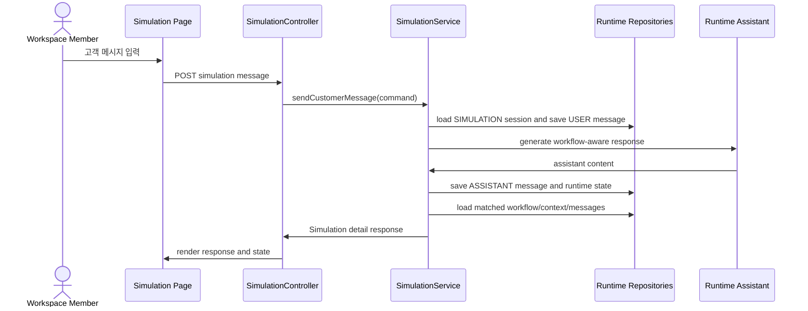

# 상담 시뮬레이션 랩

## Goal

활성 Domain Pack이 있는 워크스페이스에서 운영 상담과 분리된 `SIMULATION` 세션을 생성하고, 고객 역할 메시지로 현재 runtime 응답과 매칭 상태를 검증할 수 있게 한다.

## Problem

상담사는 과거 상담 로그만으로는 예외 케이스와 현장 지식을 충분히 검증하기 어렵다. 운영 중인 Domain Pack과 workflow를 실제 고객 상담처럼 시험하되, 시뮬레이션 기록이 운영 상담 통계, quota, 결제 사용량에 섞이면 안 된다.

## Scope

- 워크스페이스 멤버만 simulation session을 생성, 조회, 메시지 전송할 수 있다.
- 세션은 `runtime.chat_session.channel = 'SIMULATION'`으로 저장한다.
- 현재 운영 중인 published Domain Pack version을 기준으로 세션을 만든다.
- 생성 시 workflow 또는 intent 선택값이 있으면 해당 workflow 실행 상태를 초기화할 수 있다.
- 고객 역할 메시지를 저장하고 system/assistant 응답을 생성한다.
- 응답과 함께 matched intent, workflow, current state, slot 상태를 조회할 수 있다.
- simulation session 목록과 상세를 다시 조회할 수 있다.
- 운영 상담 queue/history/metrics는 `SIMULATION` 채널을 제외한다.

## Non-Goals

- 시뮬레이션 피드백 수집
- 개선 후보 생성
- production workflow 즉시 수정
- 시뮬레이션을 billing/quota 집계에 연결

## Affected Paths

| Path | Change |
| --- | --- |
| `backend/src/main/java/com/init/workflowruntime/` | Simulation application service, DTO, controller 추가 |
| `backend/src/main/java/com/init/workflowruntime/domain/ChatSessionRepository.java` | simulation 전용 조회와 운영 조회 분리 |
| `backend/src/main/java/com/init/workflowruntime/infrastructure/persistence/JpaChatSessionRepository.java` | `channel <> 'SIMULATION'` 운영 필터와 simulation 조회 추가 |
| `backend/src/main/java/com/init/workflowruntime/infrastructure/persistence/JpaConsultationMetricsRepository.java` | 운영 metrics에서 simulation 제외 |
| `frontend/src/pages/workspace/` | workspace 하위 simulation page와 route 추가 |
| `frontend/src/features/simulation/` | OpenAPI 미생성 simulation endpoint wrapper 추가 |
| `frontend/src/shared/ui/ostone/chrome/Sidebar.tsx` | “시뮬레이션” 진입점 추가 |

## REST API

| Method | Path | Description |
| --- | --- | --- |
| POST | `/api/v1/workspaces/{workspaceId}/simulation/sessions` | simulation session 생성 |
| GET | `/api/v1/workspaces/{workspaceId}/simulation/sessions` | simulation session 목록 조회 |
| GET | `/api/v1/workspaces/{workspaceId}/simulation/sessions/{sessionId}` | simulation session 상세 조회 |
| POST | `/api/v1/workspaces/{workspaceId}/simulation/sessions/{sessionId}/messages` | 고객 메시지 입력 후 시스템 응답 생성 |

### Create Request

```json
{
  "customerName": "테스트 고객",
  "intentCode": "refund_request",
  "workflowDefinitionId": 12
}
```

`intentCode`와 `workflowDefinitionId`는 선택값이다. `workflowDefinitionId`가 전달되면 해당 workflow가 현재 published version에 속하는지 검증한다.

### Send Message Request

```json
{
  "content": "환불 진행 상태를 확인하고 싶어요."
}
```

### Detail/Send Response Shape

```json
{
  "session": {
    "id": 10,
    "status": "OPEN",
    "channel": "SIMULATION",
    "metaJson": "{}"
  },
  "messages": [],
  "matchedWorkflow": {
    "workflowDefinitionId": 12,
    "workflowName": "환불 확인",
    "currentState": "collect_order_no"
  },
  "slotValues": {
    "orderNo": "A-100"
  },
  "slots": []
}
```

## Sequence Diagram



## Frontend UX

- Workspace sidebar에 “시뮬레이션” 항목을 추가한다.
- 첫 화면은 session 목록, workflow 선택, 고객 이름 입력, 메시지 composer, runtime 상태 패널을 한 화면에서 제공한다.
- workflow 목록은 기존 `frontend/src/entities/workflow/api/useListAllWorkspaceWorkflows.ts`를 재사용한다.
- loading/error/empty 상태를 제공한다.
- 새 endpoint는 OpenAPI generated client가 없으므로 `frontend/src/features/simulation/`에 수동 wrapper로 둔다.

## Acceptance Criteria

- 활성 Domain Pack이 있는 workspace에서 simulation session을 만들 수 있다.
- 생성된 session은 `SIMULATION` channel로 반환된다.
- `SIMULATION` session은 상담 queue, 상담 history, metrics 집계에서 제외된다.
- 고객 역할 메시지를 보내면 사용자 메시지와 시스템 응답이 session 상세에 표시된다.
- 상세 응답은 matched intent/workflow/current state/slot 상태를 포함한다.
- session 목록과 상세를 재조회할 수 있다.
- 멤버가 아닌 사용자는 simulation API를 사용할 수 없다.

## Validation Plan

- Backend unit/controller tests: simulation 생성, 전송, 목록/상세, membership 검증, 운영 조회/metrics simulation 제외.
- Frontend tests: API wrapper URL/payload, page loading/error/empty/main interaction, sidebar route.
- Local verification: backend targeted tests and frontend targeted tests before PR.

## Open Questions

- quota/결제 사용량 집계 코드가 별도 모듈로 추가되면 동일하게 `SIMULATION` channel exclusion을 적용해야 한다.

## Self Review 1 - Issue Fidelity

- Issue의 생성, workflow/intent 선택, 고객 메시지 입력, runtime 응답, matched state 표시, 목록/상세 조회 요구사항을 모두 포함했다.
- 운영 통계/quota/결제 사용량 분리 요구사항은 현재 확인 가능한 운영 queue/history/metrics 제외로 구체화했고, 미확인 quota/billing 집계는 open question으로 남겼다.
- 제외 범위의 피드백/개선 후보/production workflow 수정은 non-goals에 반영했다.

## Self Review 2 - Ostone Compliance

- Enhancement 이슈이므로 최종 브랜치는 `feature/525-simulation-lab`이다.
- 스펙 파일명은 이슈 번호만 사용하는 `.agent/specs/525.md`이다.
- Backend 중심 mixed work라 backend template 구조를 기준으로 frontend UX 섹션을 추가했다.
- 참조한 경로는 repository에서 확인된 상위 경로 또는 구현 중 생성된 경로이다.
