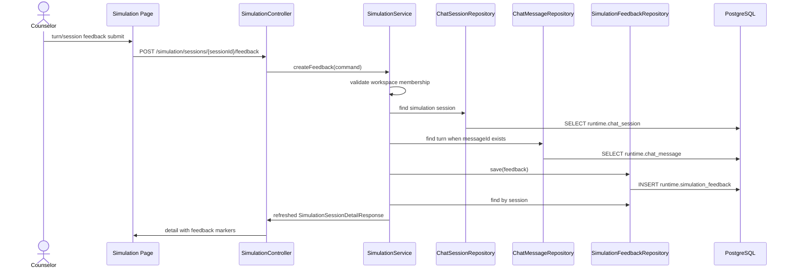

# Backend DDD Spec: simulation feedback collection

> Issue: #526 `feat(simulation): 시뮬레이션 피드백 수집`
> Bounded Context: `workflow-runtime`
> Frontend Surface: `frontend/src/pages/workspace/ui/WorkspaceSimulationPage.tsx`
> Branch: `feature/526-simulation-feedback`

---

## Goal

상담사가 시뮬레이션 session 또는 turn 단위로 현장 판단을 구조화해 남기고, workspace 기준으로 상태별 피드백을 조회할 수 있게 한다.

---

## Problem

현재 simulation 기능은 `runtime.chat_session`과 `runtime.chat_message`를 통해 운영 로그와 분리된 `SIMULATION` 채널 대화를 만들 수 있지만, 시뮬레이션 중 발견한 잘못된 intent 매칭, slot 질문 누락, 부적절한 응답 문구, policy/risk/workflow 오류를 별도 운영 지식 입력으로 저장할 수 없다. 후속 개선 후보 생성 이슈에서 참조하려면 피드백마다 안정적인 식별자와 session/turn 연결 정보가 필요하다.

---

## Scope

- simulation session 단위 피드백 작성
- simulation turn(`chat_message`) 단위 피드백 작성
- 피드백 유형, 설명, 기대 응답/행동, 심각도 저장
- 피드백 상태 `OPEN`, `CANDIDATE_CREATED`, `RESOLVED`, `DISMISSED` 관리
- session 상세 응답에서 피드백이 있는 turn 식별 가능
- workspace별 feedback 목록을 상태별로 조회
- workspace membership 기반 조회/작성 권한 검증

---

## Non-Goals

- 첨부파일/이미지 피드백
- 자동 개선 후보 생성
- review draft 반영
- golden case 등록
- 운영 상담 로그(`corpus.*`, non-simulation `runtime.chat_session`)에 피드백을 섞는 변경

---

## Sequence Diagram



---

## Affected Paths

| Path | Change |
| --- | --- |
| `backend/src/main/resources/db/changelog/db.changelog-master.sql` | `runtime.simulation_feedback` table and indexes |
| `backend/src/main/java/com/init/workflowruntime/domain/` | feedback entity, enums, repository port |
| `backend/src/main/java/com/init/workflowruntime/infrastructure/persistence/` | Spring Data repository adapter |
| `backend/src/main/java/com/init/workflowruntime/application/SimulationService.java` | create/list feedback use cases and detail feedback markers |
| `backend/src/main/java/com/init/workflowruntime/application/dto/` | feedback response/page DTOs and detail extension |
| `backend/src/main/java/com/init/workflowruntime/presentation/SimulationController.java` | session feedback create endpoint |
| `backend/src/main/java/com/init/workflowruntime/presentation/SimulationFeedbackController.java` | workspace feedback list endpoint |
| `backend/src/main/java/com/init/workflowruntime/presentation/dto/` | feedback request DTO |
| `frontend/src/features/simulation/api/simulationApi.ts` | OpenAPI 미생성 feedback endpoint wrapper |
| `frontend/src/pages/workspace/ui/WorkspaceSimulationPage.tsx` | feedback form, turn marker, workspace feedback list |
| `frontend/src/pages/workspace/ui/simulation/workspace-simulation-page.module.css` | feedback UI styling |

---

## Storage

`runtime.simulation_feedback` stores feedback separately from operational 상담 로그.

| Column | Notes |
| --- | --- |
| `id` | stable feedback identifier for follow-up candidate generation |
| `workspace_id` | workspace boundary and list filter |
| `chat_session_id` | required simulation session link |
| `chat_message_id` | optional turn link; null means session-level feedback |
| `feedback_type` | enum string: `INTENT_MISMATCH`, `MISSING_SLOT_QUESTION`, `INAPPROPRIATE_RESPONSE`, `POLICY_CONDITION_MISSING`, `RISK_HANDOFF_REQUIRED`, `WORKFLOW_BRANCH_ERROR`, `OTHER` |
| `description` | required counselor explanation |
| `expected_behavior` | expected response or expected action |
| `severity` | enum string: `LOW`, `MEDIUM`, `HIGH`, `CRITICAL` |
| `status` | enum string: `OPEN`, `CANDIDATE_CREATED`, `RESOLVED`, `DISMISSED`; default `OPEN` |
| `created_by` | member who submitted feedback |
| `created_at`, `updated_at` | audit timestamps |

---

## REST API

### Create Feedback

| Method | Path | Description |
| --- | --- | --- |
| POST | `/api/v1/workspaces/{workspaceId}/simulation/sessions/{sessionId}/feedback` | session 또는 turn feedback 작성 |

Request:

```json
{
  "chatMessageId": 42,
  "feedbackType": "MISSING_SLOT_QUESTION",
  "description": "주문번호 없이 바로 환불 가능 여부를 답했다.",
  "expectedBehavior": "주문번호를 먼저 요청해야 한다.",
  "severity": "HIGH"
}
```

Response: refreshed `SimulationSessionDetailResponse`.

### List Workspace Feedback

| Method | Path | Description |
| --- | --- | --- |
| GET | `/api/v1/workspaces/{workspaceId}/simulation/feedback?status=OPEN&page=0&size=20` | workspace feedback 목록 조회 |

Response:

```json
{
  "content": [
    {
      "id": 1,
      "workspaceId": 10,
      "sessionId": 55,
      "chatMessageId": 42,
      "feedbackType": "MISSING_SLOT_QUESTION",
      "description": "주문번호 없이 바로 환불 가능 여부를 답했다.",
      "expectedBehavior": "주문번호를 먼저 요청해야 한다.",
      "severity": "HIGH",
      "status": "OPEN",
      "createdBy": 7,
      "createdAt": "2026-06-04T10:00:00Z",
      "updatedAt": "2026-06-04T10:00:00Z"
    }
  ],
  "page": 0,
  "size": 20,
  "totalElements": 1,
  "totalPages": 1
}
```

---

## Detail Response Impact

`SimulationSessionDetailResponse` adds `feedback` with:

- `items`: feedback rows for the current session
- `messageFeedbackCounts`: map keyed by `chatMessageId`

This allows the UI to mark turns that already have feedback without embedding feedback into `ChatMessageResponse` or modifying operational chat message shape.

---

## Validation

- `feedbackType`, `description`, `expectedBehavior`, `severity` are required.
- `description` and `expectedBehavior` are trimmed and length-limited.
- `chatMessageId` is optional; when present, it must belong to the selected simulation session.
- feedback can only be created/listed by a workspace member.
- feedback can only target `SIMULATION` channel sessions.
- `status` filter is optional; invalid status values fail with a 400-style business error.

---

## Acceptance Criteria

1. 상담사는 simulation turn 단위로 feedback을 남길 수 있다.
2. 상담사는 simulation session 단위로 feedback을 남길 수 있다.
3. feedback includes 유형, 설명, 기대 응답/기대 행동, 심각도.
4. session 상세에서 feedback이 있는 turn이 표시된다.
5. workspace feedback 목록은 상태별로 조회할 수 있다.
6. feedback rows are stored in `runtime.simulation_feedback`, separate from operational 상담 로그.
7. workspace member가 아닌 사용자는 feedback 조회/작성에 실패한다.
8. 후속 개선 후보 생성에서 참조할 수 있는 stable feedback id가 응답에 포함된다.

---

## Validation Plan

- Backend service tests for feedback creation, turn ownership validation, status filtering, and membership denial.
- Backend controller tests for create/list endpoints and request mapping.
- Frontend API tests for create/list feedback wrappers.
- Frontend page tests for turn feedback submission and feedback markers.
- Run focused backend and frontend tests for the changed simulation surfaces.

---

## Open Questions

- 후속 이슈에서 `CANDIDATE_CREATED`, `RESOLVED`, `DISMISSED` 전이를 담당할 별도 endpoint가 필요한지 여부는 이 이슈 범위 밖이다.
