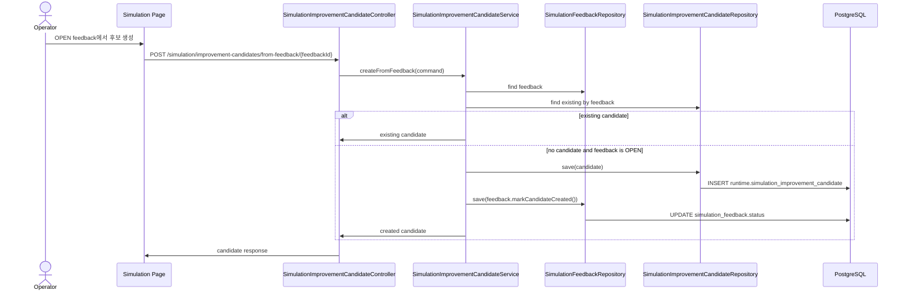

# Backend DDD Spec: simulation improvement candidates

> Issue: #527 `feat(simulation): 개선 후보 생성`
> Dominant Area: Backend
> Frontend Surface: `frontend/src/pages/workspace/ui/WorkspaceSimulationPage.tsx`
> Branch: `feature/527-simulation-candidates`

---

## Goal

Simulation feedback에서 운영 지식팩 변경 후보를 생성하고, 사람이 검토할 수 있도록 대상 version, 변경 대상, 변경 전/후 요약, 근거 피드백, 후보 상태를 조회/관리한다.

## Problem

`runtime.simulation_feedback`는 시뮬레이션 중 발견한 intent, slot, policy, risk, workflow, handoff, response 문제를 저장하지만, 피드백을 바로 Domain Pack에 반영하면 위험하다. 운영자는 `OPEN` 피드백을 기반으로 검토 가능한 개선 후보를 만들고, 후속 review 반영 흐름에서 실제 pack mutation을 수행할 수 있어야 한다.

## Scope

- `OPEN` simulation feedback에서 개선 후보 생성
- feedback type 기반 후보 유형 분류
- 대상 Domain Pack version과 변경 대상 요소 기록
- 변경 전/후 요약과 근거 feedback/session/turn 연결
- 후보 상태 `DRAFT`, `READY_FOR_REVIEW`, `APPLIED`, `REJECTED` 관리
- workspace 후보 목록/상세 조회
- 같은 feedback에서 무분별한 중복 후보 생성 방지
- 후보 생성 후 원본 feedback 상태를 `CANDIDATE_CREATED`로 변경

## Non-Goals

- review draft 자동 반영
- 실제 Domain Pack intent/slot/policy/risk/workflow mutation
- production publish
- LLM 기반 자동 패치 생성
- 후보 승인 workflow 전체 구현

## Sequence Diagram



## Affected Paths

| Path | Purpose |
| --- | --- |
| `backend/src/main/resources/db/changelog/db.changelog-master.sql` | `runtime.simulation_improvement_candidate` table and indexes |
| `backend/src/main/java/com/init/workflowruntime/domain/` | candidate entity, enums, repository port, feedback status transition |
| `backend/src/main/java/com/init/workflowruntime/application/` | candidate create/list/detail/status use cases |
| `backend/src/main/java/com/init/workflowruntime/application/dto/` | candidate response/page DTOs |
| `backend/src/main/java/com/init/workflowruntime/presentation/` | candidate REST controller |
| `backend/src/main/java/com/init/workflowruntime/presentation/dto/` | candidate create/status request DTOs |
| `frontend/src/features/simulation/api/simulationApi.ts` | OpenAPI 미생성 candidate endpoint wrapper |
| `frontend/src/pages/workspace/ui/WorkspaceSimulationPage.tsx` | feedback panel candidate generation and candidate list/detail |
| `frontend/src/pages/workspace/ui/simulation/workspace-simulation-page.module.css` | candidate UI styling |

## Data Model

`runtime.simulation_improvement_candidate`

| Column | Purpose |
| --- | --- |
| `id` | stable candidate identifier |
| `workspace_id` | workspace authorization and filtering |
| `domain_pack_version_id` | target Domain Pack version from the simulation session |
| `feedback_id` | source `runtime.simulation_feedback`; unique for v1 duplicate control |
| `chat_session_id` | evidence simulation session |
| `chat_message_id` | optional evidence turn |
| `candidate_type` | classified change type |
| `target_element_type` | target element category |
| `target_element_id` | optional concrete target id |
| `target_element_key` | optional code/key/state identifier |
| `before_summary` | current behavior/problem summary |
| `after_summary` | expected changed behavior summary |
| `evidence_summary` | source feedback summary |
| `status` | `DRAFT`, `READY_FOR_REVIEW`, `APPLIED`, `REJECTED` |
| `created_by`, `created_at`, `updated_at` | audit fields |

Candidate type enum:

- `INTENT_DESCRIPTION_EXAMPLE`
- `SLOT_QUESTION`
- `POLICY_CONDITION`
- `RISK_RULE`
- `WORKFLOW_STATE_TRANSITION`
- `HANDOFF_CONDITION`
- `RESPONSE_COPY`
- `OTHER`

Target element type enum:

- `INTENT`
- `SLOT`
- `POLICY`
- `RISK_RULE`
- `WORKFLOW`
- `HANDOFF`
- `RESPONSE`
- `UNKNOWN`

## REST API

### Create Candidate From Feedback

| Method | Path | Description |
| --- | --- | --- |
| POST | `/api/v1/workspaces/{workspaceId}/simulation/improvement-candidates/from-feedback/{feedbackId}` | `OPEN` feedback에서 개선 후보 생성 |

Request:

```json
{
  "targetElementType": "SLOT",
  "targetElementId": 123,
  "targetElementKey": "order_number",
  "beforeSummary": "주문번호 확인 질문이 없다.",
  "afterSummary": "환불 상태 확인 전에 주문번호를 요청한다."
}
```

Rules:

- request body fields are optional.
- missing target type is inferred from feedback type.
- missing before/after summaries use feedback description and expected behavior.
- if a candidate already exists for the feedback, return the existing candidate instead of creating another one.
- if no candidate exists, feedback must be `OPEN`.

### List Candidates

| Method | Path | Description |
| --- | --- | --- |
| GET | `/api/v1/workspaces/{workspaceId}/simulation/improvement-candidates?status=DRAFT&page=0&size=20` | workspace 후보 목록 조회 |

### Get Candidate Detail

| Method | Path | Description |
| --- | --- | --- |
| GET | `/api/v1/workspaces/{workspaceId}/simulation/improvement-candidates/{candidateId}` | 후보 상세 조회 |

### Update Candidate Status

| Method | Path | Description |
| --- | --- | --- |
| PATCH | `/api/v1/workspaces/{workspaceId}/simulation/improvement-candidates/{candidateId}/status` | 후보 상태 변경 |

Request:

```json
{
  "status": "READY_FOR_REVIEW"
}
```

## Requirements

- workspace member만 후보 API를 사용할 수 있다.
- 후보는 source feedback의 workspace와 simulation session version을 기준으로 생성된다.
- feedback이 다른 workspace에 속하면 candidate detail/create/list에서 노출하지 않는다.
- feedback source session이 `SIMULATION` 채널이 아니면 후보를 생성하지 않는다.
- 후보 생성 시 원본 feedback 상태는 `CANDIDATE_CREATED`가 된다.
- v1은 rule/template 기반 후보 생성으로 제한하고 LLM patch generation은 수행하지 않는다.

## Acceptance Criteria

1. `OPEN` 피드백에서 개선 후보를 생성할 수 있다.
2. 생성된 후보는 대상 `domainPackVersionId`, `targetElementType`, 후보 유형을 포함한다.
3. 생성된 후보는 변경 전/후 요약과 근거 feedback/session/turn id를 포함한다.
4. 후보 상태는 `DRAFT`, `READY_FOR_REVIEW`, `APPLIED`, `REJECTED`로 관리된다.
5. 같은 feedback에서 반복 생성 요청을 보내도 새 후보가 계속 늘어나지 않는다.
6. 후보 생성 후 원본 feedback 상태가 `CANDIDATE_CREATED`로 바뀐다.
7. workspace 후보 목록과 단건 상세를 조회할 수 있다.
8. frontend simulation feedback panel에서 `OPEN` feedback candidate 생성과 후보 목록 확인이 가능하다.

## Validation Expectations

- Backend domain tests for feedback status transition and candidate creation/status validation.
- Backend service tests for candidate creation, duplicate idempotency, non-`OPEN` rejection, list/detail/status, and membership denial.
- Backend controller tests for create/list/detail/status endpoints.
- Frontend API/page changes should pass TypeScript build.
- Run focused backend tests for `SimulationFeedback`, `SimulationImprovementCandidate`, `SimulationImprovementCandidateService`, and `SimulationImprovementCandidateController`.

## Open Questions

- 하나의 feedback에서 여러 변경 후보를 허용할지는 후속 review workflow에서 결정한다. v1은 중복 방지를 위해 feedback당 후보 1개로 제한한다.
- 실제 Domain Pack mutation과 `APPLIED` 전이의 권한/검증 조건은 후속 review 반영 이슈에서 구체화한다.
