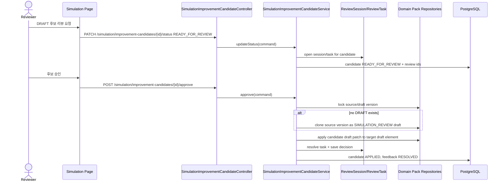

# Backend DDD Spec: simulation improvement candidate review

> Issue: #528 `feat(simulation): 개선 후보 review 반영`
> Dominant Area: Backend
> Frontend Surface: `frontend/src/pages/workspace/ui/WorkspaceSimulationPage.tsx`
> Branch: `feature/528-simulation-review-candidates`

---

## Goal

`READY_FOR_REVIEW` simulation improvement candidate를 review 대상 draft 변경으로 연결하고, reviewer 승인/반려 이력과 draft 반영 결과를 안전하게 추적한다.

## Problem

#526은 simulation feedback 저장을, #527은 feedback 기반 improvement candidate 생성을 제공한다. 그러나 candidate가 review task와 연결되지 않으면 운영자가 근거 session/turn/feedback을 보며 승인/반려할 수 없고, 승인 결과도 Domain Pack draft version에 원자적으로 남지 않는다.

## Scope

- `READY_FOR_REVIEW` 후보를 review session/task로 연결
- candidate별 draft patch 표현 저장
- review task에서 source simulation session, turn, feedback 근거 노출
- candidate 승인/반려 endpoint 제공
- 승인 시 같은 Domain Pack의 DRAFT version에 후보 patch 반영
- 대상 pack에 DRAFT version이 없으면 source version에서 simulation review draft 생성
- 반려 시 사유를 남기고 candidate와 source feedback 상태를 일관되게 갱신
- published version은 명시적 publish 전까지 변경하지 않음
- 같은 draft version에 동시 승인 시 version row lock으로 충돌 방어

## Non-Goals

- 자동 publish
- LLM 기반 자동 수정 생성
- 대량 후보 일괄 승인
- 임의 JSON Patch 또는 workflow graph 구조 자동 편집
- review pipeline checkpoint 화면을 simulation review 전용 화면으로 확장

## Sequence Diagram



## Affected Paths

| Path | Purpose |
| --- | --- |
| `backend/src/main/resources/db/changelog/db.changelog-master.sql` | candidate-review linkage, draft patch, decision metadata |
| `backend/src/main/java/com/init/workflowruntime/domain/` | candidate/feedback review lifecycle transitions |
| `backend/src/main/java/com/init/workflowruntime/application/SimulationImprovementCandidateService.java` | review task creation, approval/rejection, draft patch application |
| `backend/src/main/java/com/init/workflowruntime/presentation/SimulationImprovementCandidateController.java` | approve/reject REST endpoints |
| `backend/src/main/java/com/init/review/domain/model/` | simulation review session/task target support |
| `backend/src/main/java/com/init/domainpack/domain/repository/` | draft and code/key lookup methods |
| `frontend/src/features/simulation/api/simulationApi.ts` | approve/reject API wrappers and candidate review metadata |
| `frontend/src/pages/workspace/ui/WorkspaceSimulationPage.tsx` | candidate review request, evidence, approve/reject controls |
| `frontend/src/pages/workspace/ui/simulation/workspace-simulation-page.module.css` | candidate review control styling |

## Data Model

`runtime.simulation_improvement_candidate` gains:

| Column | Purpose |
| --- | --- |
| `review_session_id` | linked simulation improvement review session |
| `review_task_id` | linked review task for this candidate |
| `applied_domain_pack_version_id` | draft version that received an approved patch |
| `draft_patch_json` | reviewable patch representation; v1 uses `UPDATE_DESCRIPTION` |
| `decision_reason` | approval/rejection reason |
| `decided_by`, `decided_at` | reviewer audit fields |

`draft_patch_json` v1 shape:

```json
{
  "schemaVersion": "simulation-candidate-draft-patch.v1",
  "operation": "UPDATE_DESCRIPTION",
  "targetElementType": "SLOT",
  "targetElementKey": "order_number",
  "beforeSummary": "주문번호 질문이 없다.",
  "afterSummary": "환불 상태 확인 전에 주문번호를 요청한다.",
  "evidenceSummary": "simulation feedback #900 (session #55, turn #42): ..."
}
```

## REST API

### Send Candidate To Review

Existing endpoint:

| Method | Path |
| --- | --- |
| PATCH | `/api/v1/workspaces/{workspaceId}/simulation/improvement-candidates/{candidateId}/status` |

Request:

```json
{ "status": "READY_FOR_REVIEW" }
```

Rules:

- creates or reuses an open `SIMULATION_IMPROVEMENT` review session for the source version.
- creates or reuses a review task with target type `SIMULATION_IMPROVEMENT_CANDIDATE`.
- direct `APPLIED`/`REJECTED` status mutation is rejected; use decision endpoints.

### Approve Candidate

| Method | Path |
| --- | --- |
| POST | `/api/v1/workspaces/{workspaceId}/simulation/improvement-candidates/{candidateId}/approve` |

Request:

```json
{ "reason": "근거가 충분해 draft에 반영합니다." }
```

Rules:

- candidate must be `READY_FOR_REVIEW` and have an open review task.
- if source version is already DRAFT, apply to it.
- if source version is PUBLISHED and the same pack has a DRAFT, apply to the latest DRAFT.
- if no DRAFT exists, clone the source version with source type `SIMULATION_REVIEW` and apply to the new draft.
- approval updates only draft element descriptions in v1; published versions remain unchanged.
- target lookup prefers candidate `targetElementKey`; if absent, source element id is used to discover the stable code/key and remap into the draft.
- target lookup failure aborts the transaction before candidate status or feedback status changes.

### Reject Candidate

| Method | Path |
| --- | --- |
| POST | `/api/v1/workspaces/{workspaceId}/simulation/improvement-candidates/{candidateId}/reject` |

Request:

```json
{ "reason": "근거 feedback만으로는 운영 규칙 변경을 확정할 수 없습니다." }
```

Rules:

- candidate must be `READY_FOR_REVIEW` and have an open review task.
- `reason` is required.
- review task is resolved, review decision is saved, candidate becomes `REJECTED`, source feedback becomes `DISMISSED`.

## Requirements

1. workspace member만 후보 review API를 사용할 수 있다.
2. `READY_FOR_REVIEW` 후보는 review task target으로 연결된다.
3. reviewer는 candidate response에서 simulation session id, turn id, feedback id, evidence summary를 볼 수 있다.
4. 승인은 DRAFT version에만 반영된다.
5. 승인된 후보는 `APPLIED`, 원본 feedback은 `RESOLVED`가 된다.
6. 반려된 후보는 사유와 함께 `REJECTED`, 원본 feedback은 `DISMISSED`가 된다.
7. 승인/반려는 `review.review_decision`에도 남는다.
8. patch 적용 실패 시 후보 상태와 feedback 상태가 부분 변경되지 않는다.

## Validation Expectations

- Backend domain tests for candidate/feedback lifecycle transitions.
- Backend service tests for review task linking, approve-to-draft, reject-with-reason, and target lookup failure.
- Backend controller tests for status, approve, and reject request mapping.
- Frontend API tests for approve/reject wrappers.
- Frontend page tests for review request and approve/reject controls when dependencies are available.

## Open Questions

- v1 patch는 description 중심이다. workflow graph node/edge, policy condition JSON, risk handling action JSON의 구조적 patch는 별도 issue에서 다룬다.
- simulation review 전용 라우트를 별도 구성할지는 UX 범위 확정 후 결정한다. 현재는 simulation 화면의 candidate panel에서 review action을 제공한다.
