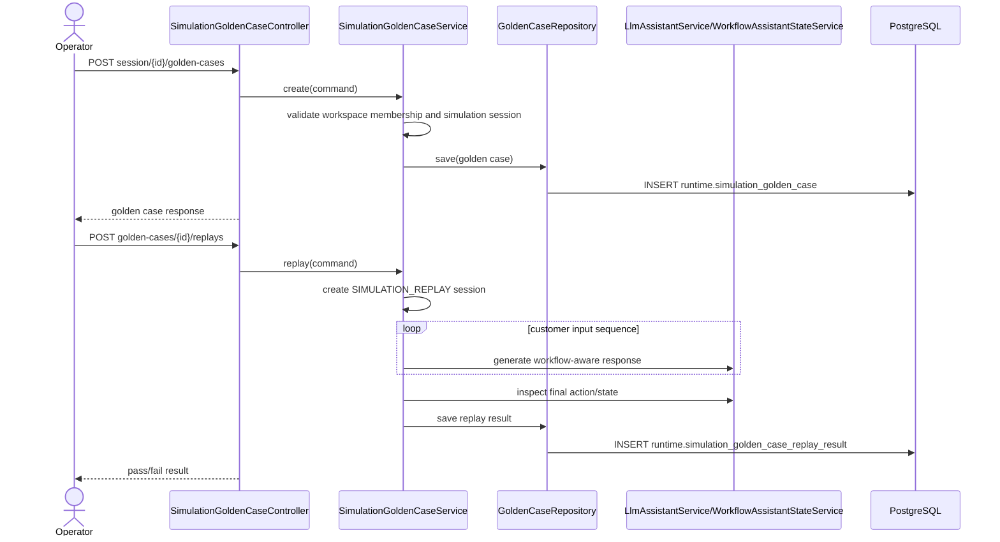

# Golden Case Replay

## Goal

상담사는 시뮬레이션 세션에서 중요한 대화 흐름을 검증 케이스로 저장하고, 이후 Domain Pack version 변경이 해당 흐름의 intent/workflow/state/slot/action 결과를 깨뜨렸는지 replay로 확인할 수 있다.

## Background

Issue #529는 #525 시뮬레이션 랩, #526 시뮬레이션 피드백, #528 개선 후보 review 반영 이후의 회귀 검증 기능이다. 기존 simulation session은 운영 상담과 분리된 `SIMULATION` channel로 저장되고, 이번 기능은 replay 실행도 운영 상담 통계, quota, billing 사용량에 섞이지 않도록 별도 test-mode channel로 분리한다.

## Scope

- simulation session의 고객 입력 turn sequence를 golden case로 저장한다.
- golden case는 기대 intent/workflow/current state/slot/action 값을 JSON snapshot으로 가진다.
- workspace 내 특정 Domain Pack version에 대해 golden case replay를 실행한다.
- replay 결과는 pass/fail, expected snapshot, actual snapshot, 실패 원인 요약을 저장하고 조회한다.
- 화면에서는 고객용 용어인 “검증 케이스”로 등록, replay 실행, 최근 결과 확인을 제공한다.

## Non-goals

- CI 자동 replay 실행은 포함하지 않는다.
- 대량 replay 스케줄링은 포함하지 않는다.
- LLM 응답 전문 exact diff는 강제하지 않는다.
- billing/quota 집계 로직 자체를 확장하지 않는다. replay가 별도 channel로 생성되어 기존 운영 집계에 들어가지 않도록 한다.

## Affected Areas

| Area | Path | Change |
| --- | --- | --- |
| Spec | `.agent/specs/529.md` | issue #529 요구사항과 검증 기준 정리 |
| Backend runtime domain | `backend/src/main/java/com/init/workflowruntime/domain` | golden case, replay result entity/repository 추가 |
| Backend runtime application | `backend/src/main/java/com/init/workflowruntime/application` | 등록, 목록 조회, replay 실행, 비교 로직 추가 |
| Backend runtime presentation | `backend/src/main/java/com/init/workflowruntime/presentation` | simulation 하위 golden case REST endpoint 추가 |
| Backend persistence | `backend/src/main/java/com/init/workflowruntime/infrastructure/persistence` | Spring Data JPA repository 추가 |
| DB changelog | `backend/src/main/resources/db/changelog/db.changelog-master.sql` | runtime schema에 golden case/replay result table 추가 |
| Frontend simulation | `frontend/src/features/simulation/api/simulationApi.ts` | OpenAPI 미생성 endpoint wrapper 확장 |
| Frontend page | `frontend/src/pages/workspace/ui/WorkspaceSimulationPage.tsx` | 검증 케이스 등록/replay/결과 패널 추가 |

## REST API

| Method | Path | Description |
| --- | --- | --- |
| POST | `/api/v1/workspaces/{workspaceId}/simulation/sessions/{sessionId}/golden-cases` | simulation session을 검증 케이스로 등록 |
| GET | `/api/v1/workspaces/{workspaceId}/simulation/golden-cases` | workspace 검증 케이스 목록 조회 |
| POST | `/api/v1/workspaces/{workspaceId}/simulation/golden-cases/{goldenCaseId}/replays` | 지정 Domain Pack version으로 replay 실행 |
| GET | `/api/v1/workspaces/{workspaceId}/simulation/golden-cases/{goldenCaseId}/replays` | 검증 케이스 replay 결과 조회 |

### Create Golden Case Request

```json
{
  "name": "환불 주문번호 누락 회귀",
  "expectedIntentCode": "refund_request",
  "expectedWorkflowCode": "refund.standard",
  "expectedCurrentState": "collect_order_no",
  "expectedActionType": "ASK_SLOT",
  "expectedSlotValues": {
    "orderNo": "A-100"
  }
}
```

### Replay Request

```json
{
  "domainPackVersionId": 102
}
```

### Replay Result Response

```json
{
  "id": 501,
  "goldenCaseId": 77,
  "domainPackVersionId": 102,
  "status": "FAIL",
  "expectedJson": "{\"intentCode\":\"refund_request\"}",
  "actualJson": "{\"intentCode\":\"refund_request\",\"currentState\":\"handoff\"}",
  "failureSummary": "currentState expected collect_order_no but was handoff",
  "replaySessionId": 88,
  "createdAt": "2026-06-05T12:00:00Z"
}
```

## Backend Design



- `runtime.simulation_golden_case.input_messages_json` stores only customer/user messages from the source simulation session in original order.
- `expected_json` and `actual_json` compare stable signals only: `intentCode`, `workflowCode`, `currentState`, `slotValues`, `actionType`.
- Replay creates chat sessions with channel `SIMULATION_REPLAY`, so existing `SIMULATION` session lists and operational channels remain separate.
- Workspace membership and Domain Pack version ownership are checked before create/replay/list.

## Frontend Design

- The existing `WorkspaceSimulationPage` keeps the current simulation lab layout and adds a compact “검증 케이스” panel inside the runtime side pane.
- Register action uses the selected session and prefilled current runtime snapshot, with editable name/action/version fields.
- Workspace golden case list shows latest replay status and a replay button.
- Pass/fail uses text and border treatment in the existing monochrome design system, avoiding new decorative colors.
- Loading, empty, and error states use existing toast/inline state patterns from the simulation page.

## Data and API Impact

- New runtime tables:
  - `runtime.simulation_golden_case`
  - `runtime.simulation_golden_case_replay_result`
- New rows reference `app.workspace`, `app.app_user`, `runtime.chat_session`, and `pack.domain_pack_version`.
- No existing table columns are changed.
- Replay sessions remain persisted for audit/debugging but use `SIMULATION_REPLAY` channel to stay outside normal simulation and operational lists.

## Acceptance Criteria

- A workspace member can register a simulation session as a 검증 케이스.
- The stored golden case includes the ordered customer input sequence and expected intent/workflow/current state/slot/action snapshot.
- A workspace member can run replay against a specific Domain Pack version in the same workspace.
- Replay result stores and returns pass/fail, expected snapshot, actual snapshot, and a concise failure summary.
- If a later Domain Pack version changes stable runtime behavior, the latest replay result is visible as FAIL on the simulation page.
- Unauthorized workspace users cannot create/list/replay golden cases.
- Replay does not appear in normal `SIMULATION` session listing and uses a separate test-mode channel.

## Validation Expectations

- Backend unit tests cover golden case creation, replay comparison pass/fail, workspace/version authorization, and `SIMULATION_REPLAY` channel creation.
- Backend controller tests cover create/list/replay endpoints and request mapping.
- Frontend API tests cover new golden case wrapper paths and response normalization.
- Frontend page tests cover registering a 검증 케이스 and replaying it from the simulation page.

## Open Questions

- Whether future replay should support batch execution across all golden cases is intentionally left for the excluded 대량 replay 스케줄링 scope.
- Whether replay sessions should be auto-pruned is not specified in issue #529 and remains out of scope for this PR.
