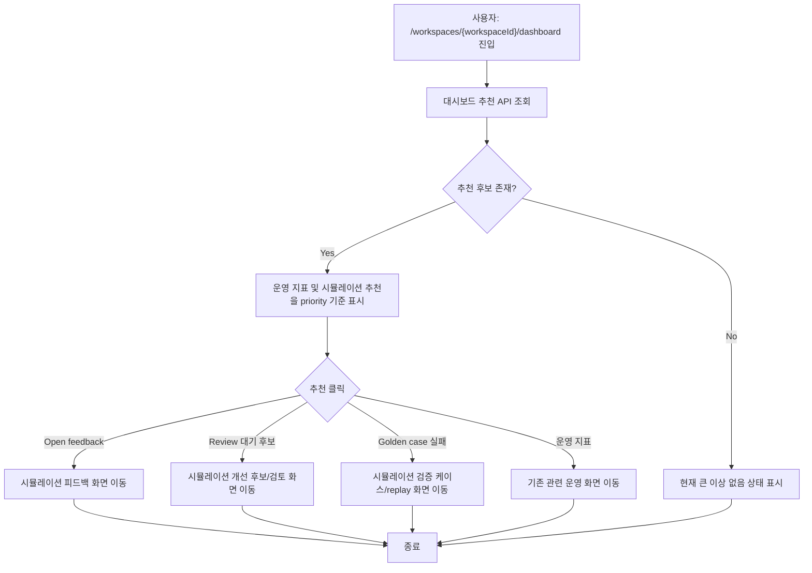

# Frontend FSD Spec: 시뮬레이션 기반 개선 추천

## Goal

워크스페이스 대시보드의 추천 액션 영역에서 운영 상담 지표 기반 추천과 시뮬레이션 피드백/개선 후보/검증 케이스 실패 기반 추천을 같은 우선순위 체계로 보여준다.

---

## User Flow Chart



---

## Design Diff

### As-is vs To-be

| 영역 | As-is | To-be | 변경 내용 |
|------|-------|-------|----------|
| 추천 후보 | 운영 상담 지표 기반 rule만 표시 | 운영 지표와 시뮬레이션 신호 기반 rule을 함께 표시 | backend 추천 rule 확장 |
| 추천 근거 | 단일 evidence label/value | open feedback, review 대기 후보, golden case 실패 수 등 시뮬레이션 근거 표시 | card evidence 확장 |
| 추천 출처 | rule code만 노출 | “운영 지표 기반” 또는 “시뮬레이션에서 발견됨” 출처 표시 | card source label 추가 |
| 이동 링크 | upload/domain-pack/workflow 등 운영 화면 | simulation feedback/candidate/golden case 관련 화면 링크 포함 | targetPath 확장 |
| 데이터 분리 | 운영 지표 쿼리에서 simulation/demo channel 제외 | 시뮬레이션 데이터는 추천 근거로만 별도 조회 | 운영 상담 KPI와 분리 유지 |

---

## Component Tree

```text
WorkspaceDashboardPage
├─ DashboardFilters
├─ DashboardMetricsGrid
├─ ActionRecommendationsPanel
│    └─ ActionRecommendationCard
│         ├─ source label
│         ├─ title/description
│         ├─ evidence label/value
│         └─ target link
├─ KnowledgePackHealthPanel
└─ WorkflowRankingPanel
```

---

## API Integration

### Endpoints

| Method | Path | Description |
|--------|------|-------------|
| GET | `/api/v1/workspaces/{workspaceId}/dashboard/action-recommendations` | 운영 지표 및 시뮬레이션 기반 추천 조회 |

### Response Contract

`WorkspaceDashboardActionRecommendationResult`에 추천 출처를 나타내는 필드를 추가한다.

```json
{
  "ruleCode": "SIMULATION_OPEN_FEEDBACK",
  "priority": 95,
  "sourceLabel": "시뮬레이션에서 발견됨",
  "title": "개선 후보 생성",
  "description": "미처리 시뮬레이션 피드백이 있어 지식팩 개선 후보로 정리할 수 있습니다.",
  "evidenceLabel": "Open feedback",
  "evidenceValue": "4건",
  "targetPath": "/workspaces/1/simulation?feedbackStatus=OPEN"
}
```

---

## Data Flow

```text
WorkspaceDashboardPage
  -> fetchWorkspaceDashboardActionRecommendations()
  -> WorkspaceDashboardController
  -> GetWorkspaceDashboardActionRecommendationsUseCase
  -> WorkspaceDashboardQueryPort.findRecommendationSignals()
  -> JdbcWorkspaceDashboardQueryAdapter
  -> runtime.simulation_feedback
  -> runtime.simulation_improvement_candidate
  -> runtime.simulation_golden_case_replay_result
```

운영 상담 지표용 `runtime.decision_log`, `runtime.workflow_execution` 집계는 기존처럼 simulation/demo channel을 제외한다. 시뮬레이션 집계는 추천 근거로만 사용하며 상담 KPI, 핫패스, completion rate에는 섞지 않는다.

---

## 수정 대상 파일

| 파일 | 변경 유형 | 설명 |
|------|----------|------|
| `backend/src/main/java/com/init/workspace/application/GetWorkspaceDashboardActionRecommendationsUseCase.java` | modify | 시뮬레이션 기반 추천 rule 및 priority 정렬 확장 |
| `backend/src/main/java/com/init/workspace/application/WorkspaceDashboardActionRecommendationResult.java` | modify | 추천 출처 필드 추가 |
| `backend/src/main/java/com/init/workspace/application/WorkspaceDashboardRecommendationSignalsResult.java` | modify | 시뮬레이션 추천 신호 포함 |
| `backend/src/main/java/com/init/workspace/application/WorkspaceDashboardSimulationSignalResult.java` | new | 시뮬레이션 추천 집계 결과 |
| `backend/src/main/java/com/init/workspace/infrastructure/persistence/JdbcWorkspaceDashboardQueryAdapter.java` | modify | open feedback, review 대기 후보, failed golden case 집계 |
| `frontend/src/features/workspace-dashboard-health/api/workspaceDashboardHealthApi.ts` | modify | recommendation 타입에 source label 반영 |
| `frontend/src/pages/workspace/ui/WorkspaceDashboardPage.tsx` | modify | 추천 카드 출처 표시 |
| `frontend/src/pages/workspace/ui/workspace-dashboard-page.module.css` | modify | 추천 출처 UI 스타일 |
| `frontend/src/pages/workspace/ui/WorkspaceSimulationPage.tsx` | modify | dashboard link query로 feedback/candidate 필터 초기화 |

---

## State Management

### Server State

- 추천 응답은 기존 `WorkspaceDashboardActionRecommendations` 형태를 유지한다.
- `recommendations` 배열의 각 item은 기존 priority 체계를 공유한다.
- simulation 기능을 사용하지 않은 workspace에서는 simulation signal count가 모두 0으로 계산되어 simulation rule은 skip된다.

### Client State

- 대시보드 추천 영역은 기존 loading/error/empty 상태를 유지한다.
- `sourceLabel`은 card 내부 보조 라벨로 표시한다.
- simulation 화면은 URL query의 `feedbackStatus`, `candidateStatus`가 유효하면 초기 필터값에 반영한다.

---

## Recommendation Rules

| Rule | 조건 | Priority | Evidence | Link |
|------|------|----------|----------|------|
| `SIMULATION_OPEN_FEEDBACK` | `OPEN` feedback count > 0 | 95 | Open feedback 수 | `/workspaces/{workspaceId}/simulation?feedbackStatus=OPEN` |
| `SIMULATION_REVIEW_PENDING_CANDIDATE` | `READY_FOR_REVIEW` candidate count > 0 | 92 | Review 대기 후보 수 | `/workspaces/{workspaceId}/simulation?candidateStatus=READY_FOR_REVIEW` |
| `SIMULATION_GOLDEN_CASE_FAILED` | latest replay가 `FAIL`인 golden case count > 0 | 88 | 실패한 검증 케이스 수 | `/workspaces/{workspaceId}/simulation?focus=golden-cases` |
| `SIMULATION_REPEATED_FEEDBACK_TYPE` | 같은 유형의 open feedback count >= 3 | 82 | 반복 feedback 유형/count | `/workspaces/{workspaceId}/simulation?feedbackStatus=OPEN` |

운영 지표 기반 rule은 기존 priority와 targetPath를 유지한다.

---

## Tests

### Test Strategy

| 구분 | 방법 | 도구 | 비고 |
|------|------|------|------|
| Backend unit | 추천 rule, priority, empty skip 검증 | JUnit 5 + Mockito | deterministic rule 검증 |
| Backend MVC | 응답 JSON contract 검증 | MockMvc | source label 포함 |
| Frontend component | 추천 카드 source/evidence/link 표시 검증 | Vitest + React Testing Library | existing dashboard test 확장 |
| Frontend state | simulation query filter 초기화 검증 | Vitest + React Testing Library | dashboard link landing 검증 |

### Happy Path

| # | 시나리오 | 사전 조건 | 기대 결과 |
|---|---------|---------|----------|
| 1 | open feedback 존재 | `OPEN` feedback count > 0 | 개선 후보 생성 추천과 count 표시 |
| 2 | review 대기 후보 존재 | `READY_FOR_REVIEW` candidate count > 0 | 검토 진행 추천과 count 표시 |
| 3 | latest replay 실패 존재 | latest replay status `FAIL` | 변경 영향 확인 추천과 count 표시 |
| 4 | 운영/시뮬레이션 추천 혼재 | 여러 rule이 동시에 match | priority 내림차순으로 최대 3개 표시 |

### Error & Edge Cases

| # | 시나리오 | 기대 결과 |
|---|---------|----------|
| 1 | simulation 데이터 없음 | simulation rule skip, 기존 추천 또는 empty state 표시 |
| 2 | same feedback type count가 threshold 미만 | 반복 feedback rule skip |
| 3 | 운영 decision/workflow 집계에 simulation channel 존재 | 운영 지표에는 포함하지 않음 |
| 4 | invalid simulation query parameter | simulation 화면 기본 필터 사용 |

---

## Non-goals

- LLM 기반 추천은 구현하지 않는다.
- 피드백 기반 자동 후보 생성 또는 자동 승인은 구현하지 않는다.
- 알림 발송은 구현하지 않는다.
- 상담 KPI, 핫패스 랭킹, 운영 지식팩 건강도 수치에 simulation 데이터를 섞지 않는다.

---

## Open Questions

- 현재 review 대기 개선 후보는 별도 review route가 아니라 `WorkspaceSimulationPage`의 후보 목록에서 상태별로 다룬다. 전용 review 화면이 생기면 targetPath를 그 화면으로 바꿀 수 있다.
