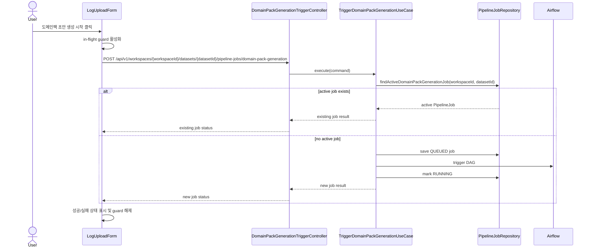

# Backend DDD Spec

## Goal

같은 workspace/dataset에 대한 Domain Pack Generation trigger가 빠르게 반복되어도 pipeline job은 하나만 유지되고, 사용자는 기존 진행 중 job 상태를 명확히 확인할 수 있다.

## Background

상담 로그 업로드 후 `도메인팩 초안 생성 시작` 버튼은 프론트엔드의 `frontend/src/features/log-upload/ui/LogUploadForm.tsx`에서 호출된다. 실제 trigger API는 `backend/src/main/java/com/init/pipelinejob/presentation/DomainPackGenerationTriggerController.java`가 받고, `backend/src/main/java/com/init/pipelinejob/application/TriggerDomainPackGenerationUseCase.java`가 pipeline job 생성과 Airflow trigger를 조율한다.

현재 백엔드는 `backend/src/main/java/com/init/pipelinejob/infrastructure/persistence/PostgreSqlDomainPackGenerationConcurrencyGuard.java`의 advisory lock과 active job 조회로 중복 생성 경로를 제한하지만, active job이 있으면 충돌 오류로 응답한다. 이 방식은 새 job 생성을 막더라도 사용자에게 이미 진행 중인 job으로 이어지는 명확한 성공 상태를 제공하지 못한다.

## Sequence Diagram



## Scope

- `frontend/src/features/log-upload/ui/LogUploadForm.tsx`
  - 생성 요청 pending 중 CTA를 비활성화한다.
  - 빠른 중복 클릭과 toast retry action의 중복 실행을 방지한다.
  - 요청 실패 후 재시도는 같은 dataset 기준으로 한 번씩만 다시 요청한다.
- `backend/src/main/java/com/init/pipelinejob/application/TriggerDomainPackGenerationUseCase.java`
  - active Domain Pack Generation job이 있으면 새 job과 Airflow trigger를 만들지 않고 기존 job 결과를 반환한다.
  - 기존 active job 상태는 클라이언트가 검토 화면 이동이나 상태 표시를 할 수 있도록 기존 response 형태로 전달한다.
- 테스트
  - `backend/src/test/java/com/init/pipelinejob/application/TriggerDomainPackGenerationUseCaseTest.java`
  - `frontend/src/features/log-upload/ui/LogUploadForm.test.tsx`

## Non-goals

- Airflow DAG 내부 idempotency 변경은 포함하지 않는다.
- 이미 final 상태인 과거 job의 재사용 정책은 변경하지 않는다.
- generated OpenAPI 파일을 직접 수정하지 않는다.
- 관리자 retry 정책 전반을 재설계하지 않는다.

## REST API

| Method | Path | Description |
| --- | --- | --- |
| POST | `/api/v1/workspaces/{workspaceId}/datasets/{datasetId}/pipeline-jobs/domain-pack-generation` | Domain Pack Generation pipeline job trigger 또는 기존 active job 반환 |

### Response

새 trigger와 중복 trigger 모두 기존 `DomainPackGenerationTriggerResponse` 형태를 유지한다.

```json
{
  "pipelineJobId": 123,
  "workspaceId": 1,
  "datasetId": 7,
  "jobType": "DOMAIN_PACK_GENERATION",
  "status": "RUNNING",
  "airflowDagId": "domain_pack_generation",
  "airflowRunId": "pipeline_job_123",
  "requestedAt": "2026-05-04T10:00:00Z",
  "startedAt": "2026-05-04T10:00:01Z"
}
```

## Requirements

- 같은 workspace/dataset에 active Domain Pack Generation job이 있으면 backend는 새 `PipelineJob`을 저장하지 않는다.
- active job이 있을 때 backend는 Airflow trigger port를 호출하지 않는다.
- active job 반환 전에 workspace 존재, 사용자 role, dataset 소속 검증은 유지한다.
- 정상 신규 trigger 경로의 quota 검증과 무료 온보딩 claim 동작은 유지한다.
- 생성 버튼은 업로드된 dataset id가 없거나 생성 요청이 pending일 때 비활성화된다.
- 빠른 중복 클릭은 한 번의 mutation 호출로 수렴한다.
- 실패 상태의 재시도 버튼도 pending 중 중복 실행되지 않는다.
- duplicate active job은 프론트엔드에서 실패가 아니라 기존 job id/status를 가진 성공 상태로 표시된다.

## Acceptance Criteria

- 같은 dataset에서 생성 버튼을 여러 번 눌러도 backend `saveAndFlush`와 Airflow trigger는 추가 실행되지 않는다.
- active job이 있는 backend 요청은 기존 `pipelineJobId`와 `status`를 포함한 response를 반환한다.
- 생성 요청 중 사용자는 `생성 요청 중` 상태를 보고 CTA 중복 클릭을 할 수 없다.
- 요청 실패 후 `다시 생성 요청`을 빠르게 반복해도 mutation은 한 번씩만 실행된다.
- backend와 frontend 테스트가 중복 방어 동작을 검증한다.

## Validation

- `cd backend && ./gradlew test --tests com.init.pipelinejob.application.TriggerDomainPackGenerationUseCaseTest`
- `cd frontend && pnpm test -- LogUploadForm.test.tsx`
