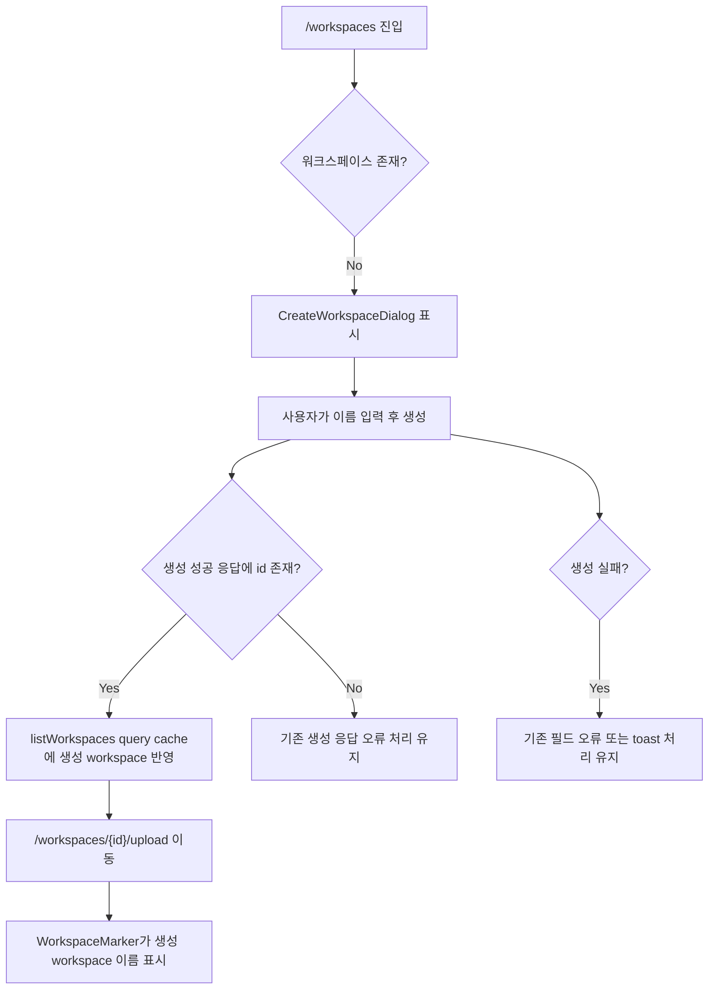

# 워크스페이스 생성 직후 사이드바 이름 갱신

## Goal

워크스페이스 생성 성공 직후 새로고침 없이 사이드바 상단의 현재 워크스페이스 표시와 선택 메뉴에 생성한 워크스페이스가 반영되도록 한다.

## User Flow Chart



## Design Diff

### As-is vs To-be

| 영역 | As-is | To-be | 변경 내용 |
| --- | --- | --- | --- |
| 생성 성공 후 목록 캐시 | `CreateWorkspaceDialog`가 생성 성공 콜백만 호출하고 `listWorkspaces` 캐시 반영은 명확하지 않음 | 생성 응답의 workspace를 `listWorkspaces` query cache에 즉시 upsert 후 같은 query를 invalidate | 업로드 화면 이동 직후 `WorkspaceMarker`가 stale 목록 대신 생성 workspace를 찾을 수 있음 |
| 사이드바 표시 | stale 목록이면 `워크스페이스 선택` 또는 이전 목록 기준 표시 가능 | 생성 응답에 `id/name`이 있으면 새 이름 표시 | 새로고침 없이 현재 작업 공간 인지 |
| 오류 처리 | 생성 실패, 응답 누락, 부모 콜백 실패 처리 존재 | 기존 오류 처리를 유지 | 실패 플로우의 사용자 메시지 변경 없음 |

## Component Tree

```text
WorkspaceRootRedirect
└─ CreateWorkspaceDialog
   └─ useCreateWorkspace mutation
      ├─ listWorkspaces query cache upsert
      ├─ listWorkspaces query invalidation
      └─ onSuccess(created) -> /workspaces/{id}/upload

OstoneShell
└─ WorkspaceMarker
   └─ useListWorkspaces -> current workspace name lookup
```

## API Integration

### Endpoints

| Method | Path | Description |
| --- | --- | --- |
| GET | `/api/v1/workspaces` | 사이드바 marker와 선택 메뉴가 사용하는 workspace 목록 조회 |
| POST | `/api/v1/workspaces` | workspace 생성 |

### Query Key Pattern

- 생성 성공 시 `frontend/src/shared/api/generated/endpoints/workspace-controller/workspace-controller.ts`의 `getListWorkspacesQueryKey()`를 사용한다.
- generated 파일은 직접 수정하지 않는다.
- query cache는 현재 코드와 테스트에서 raw `WorkspaceResponse[]`와 generated `{ data: WorkspaceResponse[] }` 형태가 모두 관찰되므로, 기존 cache shape를 보존하며 upsert한다.

## Data Flow

```text
POST /api/v1/workspaces
  -> WorkspaceResponse created
  -> React Query listWorkspaces cache upsert
  -> invalidate listWorkspaces
  -> navigate /workspaces/{created.id}/upload
  -> WorkspaceMarker unwraps list cache and displays created.name
```

## 수정 대상 파일

| 파일 | 변경 유형 | 설명 |
| --- | --- | --- |
| `frontend/src/features/workspace/ui/CreateWorkspaceDialog.tsx` | modify | 생성 성공 시 listWorkspaces query cache를 즉시 갱신하고 refetch를 유도 |
| `frontend/src/features/workspace/ui/CreateWorkspaceDialog.test.tsx` | modify | 생성 성공 후 cache upsert/invalidation 동작 검증 |
| `.agent/specs/552.md` | new | 이슈 요구사항과 검증 기준 문서화 |

## State Management

### Server State (TanStack Query)

- `useCreateWorkspace` 성공 응답에서 `WorkspaceResponse`를 추출한다.
- `created.id`가 없으면 기존 응답 누락 오류 처리를 유지하고 cache를 변경하지 않는다.
- `created.id`가 있으면 `getListWorkspacesQueryKey()`로 조회 목록 cache를 갱신한다.
- 기존 cache에 같은 `id`가 있으면 생성 응답 필드로 갱신하고, 없으면 목록 끝에 추가한다.
- cache 갱신 후 같은 query key를 invalidate하여 서버 목록으로 재동기화한다.

## Tests

### Test Strategy

| 구분 | 방법 | 도구 | 비고 |
| --- | --- | --- | --- |
| 컴포넌트 단위 | 생성 성공 callback에서 query cache 갱신 호출 검증 | Vitest, React Testing Library | raw cache와 generated response cache 형태를 모두 확인 |
| 회귀 확인 | 워크스페이스 생성 직후 marker가 읽는 query key와 동일한 cache key 사용 확인 | Vitest | `getListWorkspacesQueryKey()` 사용 |

### Test Scenarios

#### Happy Path

| # | 시나리오 | 사전 조건 | 조작 | 기대 결과 |
| --- | --- | --- | --- | --- |
| 1 | 생성 성공 후 raw list cache 갱신 | 기존 workspace 1개가 cache에 있음 | workspace 생성 성공 | 기존 목록 끝에 생성 workspace가 추가되고 query invalidate 호출 |
| 2 | 생성 성공 후 generated response cache 갱신 | 같은 id의 stale workspace가 `{ data }` cache에 있음 | workspace 생성 성공 | 같은 id 항목이 생성 응답으로 교체되고 response shape 유지 |
| 3 | 업로드 화면 이동 | 생성 응답에 id 존재 | 성공 콜백 실행 | `/workspaces/{id}/upload`로 이동하며 marker가 cache에서 생성 workspace 이름 조회 가능 |

#### Error & Edge Cases

| # | 시나리오 | 조작 | 기대 결과 |
| --- | --- | --- | --- |
| 1 | 생성 응답에 id 없음 | 생성 성공 callback이 id 없는 body 반환 | 기존 오류 toast를 표시하고 cache/onSuccess 미호출 |
| 2 | 생성 실패 | API 오류 발생 | 기존 field error 또는 toast 처리 유지 |
| 3 | 부모 성공 콜백 실패 | navigation callback reject | 기존 목록 갱신 실패 toast 유지 |

## Acceptance Criteria

- 워크스페이스 생성 직후 사이드바 상단에 생성한 이름이 표시된다.
- 새로고침 없이 워크스페이스 선택 메뉴에 생성한 workspace가 포함된다.
- 생성 응답에 `id/name`이 있을 때 `listWorkspaces` query cache가 일관되게 갱신된다.
- 생성 실패와 응답 누락 시 기존 오류 처리가 유지된다.
