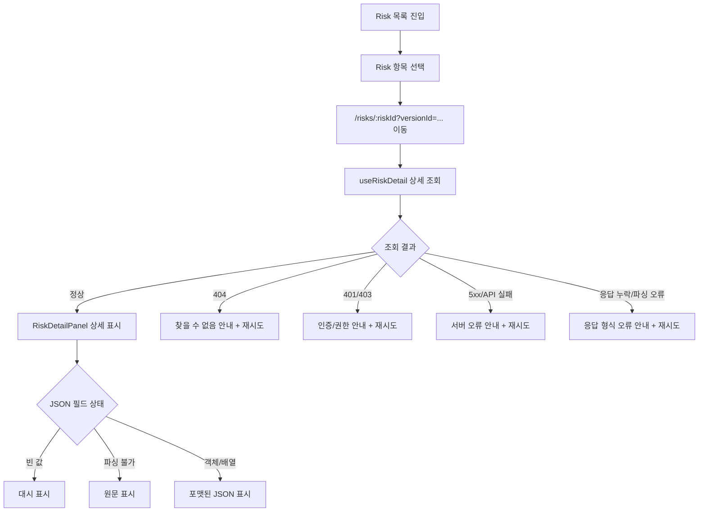

# Risk 상세 오류 원인 분리

## Goal

Risk 목록에서 상세로 진입할 때 발생하는 실패를 404, 권한, 서버/API, 응답 계약 오류로 구분해 운영자가 복구 가능한 안내와 재시도 액션을 받을 수 있게 한다.

## User Flow Chart



## Design Diff

### As-is vs To-be

| 영역 | As-is | To-be | 변경 내용 |
| --- | --- | --- | --- |
| 상세 진입 파라미터 | `RiskDraftReadPage`가 URL의 `workspaceId`, `packId`, `versionId`, `riskId`를 파싱해 상세 패널에 전달 | 기존 전달 구조 유지 | 목록 선택 시 `domainPackSectionPath`로 `versionId`와 `riskId`가 함께 유지되는지 회귀 테스트로 확인 |
| API 에러 메시지 | 알려진 Risk not found 외 다수 오류가 `알 수 없는 오류`로 표시될 수 있음 | 401/403/404/400/422/5xx/응답 계약 오류를 서로 다른 메시지로 표시 | 사용자가 원인과 다음 행동을 구분할 수 있음 |
| 상세 fallback | error placeholder와 toast가 같은 일반 메시지를 사용할 수 있음 | placeholder, toast, error code가 구체 메시지와 API code를 함께 표시 | 재시도 버튼은 유지 |
| JSON 필드 표시 | 문자열 JSON 기준 표시 | 빈 값, 파싱 불가 문자열, 객체/배열 값을 모두 화면 실패 없이 표시 | 응답 필드 변동에도 상세 전체가 무너지지 않음 |

## Component Tree

```text
RiskDraftReadPage
├─ RiskListPanel
│  └─ onSelect(id) -> /workspaces/:workspaceId/domain-packs/:packId/risks/:id?versionId=:versionId
└─ RiskDetailPanel
   ├─ useRiskDetail
   │  └─ mapApiError
   ├─ error placeholder + retry button
   └─ JsonCard(triggerConditionJson, handlingActionJson, evidenceJson, metaJson)
```

## API Integration

### Endpoints

| Method | Path | Description |
| --- | --- | --- |
| GET | `/api/v1/workspaces/{workspaceId}/domain-packs/{packId}/versions/{versionId}/risks/{riskId}` | Risk 상세 조회 |

### Generated Contract

- `frontend/src/shared/api/generated/endpoints/risk-definition-controller/risk-definition-controller.ts`의 `useGetRisk`를 사용한다.
- `frontend/src/shared/api/generated/zod/riskDefinitionResponse.zod.ts` 기준 Risk 상세 JSON 필드는 optional string이다.
- generated 파일은 직접 수정하지 않는다.

## 수정 대상 파일

| 파일 | 변경 유형 | 설명 |
| --- | --- | --- |
| `frontend/src/features/risk-draft-read/model/mapApiError.ts` | modify | Risk 상세 조회 에러를 HTTP 상태, API code, 응답 계약 오류별 메시지로 분리 |
| `frontend/src/features/risk-draft-read/model/mapApiError.test.ts` | modify | 404, 403, 5xx, 응답 계약, 네트워크 오류 매핑 검증 |
| `frontend/src/features/risk-draft-read/ui/RiskDetailPanel.tsx` | modify | JSON 필드가 비어 있거나 문자열이 아니거나 파싱 실패해도 상세 화면 유지 |
| `frontend/src/features/risk-draft-read/ui/RiskDetailPanel.test.tsx` | modify | 상세 오류 메시지와 JSON fallback 렌더링 검증 |
| `frontend/src/pages/domain-pack/ui/RiskDraftReadPage.test.tsx` | existing | Risk 선택 시 URL 파라미터 유지 검증이 이미 존재 |
| `.agent/specs/555.md` | new | 이슈 요구사항과 검증 기준 문서화 |

## State Management

- 상세 서버 상태는 `riskQueryKeys.detail(workspaceId, packId, versionId, riskId)`로 관리한다.
- `riskId`가 없으면 상세 조회는 `idle` 상태이며 API 호출을 비활성화한다.
- 재시도 버튼은 `retryKey` 증가를 통해 같은 query의 `refetch()`를 호출한다.
- 에러 상태는 `code`, `message`, `httpStatus`를 유지해 UI와 toast에서 같은 원인을 표시한다.

## Tests

### Test Strategy

| 구분 | 방법 | 도구 | 비고 |
| --- | --- | --- | --- |
| 에러 매핑 단위 | `mapApiError` 입력별 반환값 검증 | Vitest | API code/HTTP status/일반 Error 구분 |
| 상세 패널 컴포넌트 | `useRiskDetail` mock 상태별 렌더링 검증 | Vitest, React Testing Library | JSON fallback과 toast 메시지 확인 |
| 라우팅 회귀 | Risk 선택 시 navigate path 검증 | Vitest, React Testing Library | 기존 `RiskDraftReadPage.test.tsx` 유지 |
| 수동 확인 | 실제 액티벤처 데이터 Risk 항목 클릭 | 로컬/검증 환경 브라우저 | 데이터 접근 가능 환경에서 정상 상세 표시 확인 |

### Error & Edge Cases

| # | 시나리오 | 기대 결과 |
| --- | --- | --- |
| 1 | 존재하지 않는 risk 상세 조회 | `주의 사항을 찾을 수 없습니다.` 표시 |
| 2 | 권한 없음 | `이 워크스페이스의 주의 사항을 볼 권한이 없습니다.` 표시 |
| 3 | 서버 오류 | 서버 처리 실패 안내와 재시도 버튼 표시 |
| 4 | 상세 응답 data 누락 또는 JSON 파싱 실패 | 응답 형식 오류 안내와 재시도 버튼 표시 |
| 5 | JSON 필드 빈 값 | 상세 화면은 유지되고 해당 필드는 `—` 표시 |
| 6 | JSON 필드 파싱 실패 문자열 | 상세 화면은 유지되고 원문 문자열 표시 |

## Acceptance Criteria

- 정상 Risk 항목 클릭 시 `workspaceId`, `packId`, `versionId`, `riskId`가 유지된 상세 URL로 이동하고 상세 정보가 표시된다.
- 존재하지 않는 Risk는 찾을 수 없음 메시지로 구분된다.
- 권한 오류와 서버/API 오류는 서로 다른 메시지와 API code로 추적 가능하다.
- 오류 placeholder에는 재시도 버튼이 유지된다.
- JSON 필드가 비어 있거나 파싱되지 않아도 상세 화면 전체가 실패하지 않는다.
- Risk 상세 오류 케이스가 Vitest로 검증된다.
- 실제 액티벤처 데이터 접근이 가능한 검증 환경에서는 정상 Risk 항목 클릭 시 상세 필드가 표시되는지 수동 확인한다.
