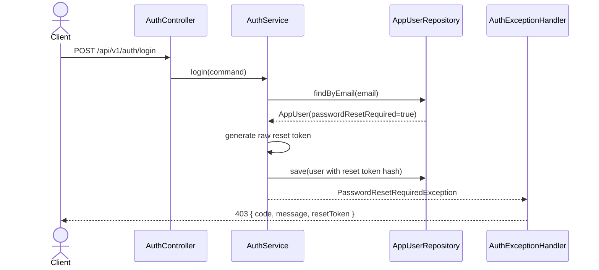
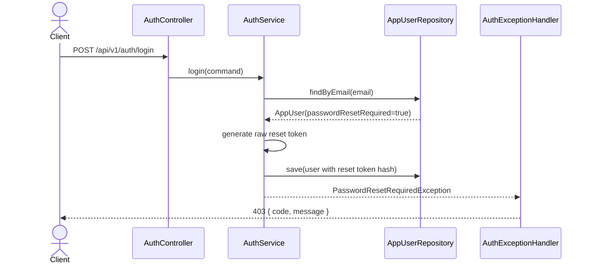

# Issue 570: reset-required 로그인 응답의 재설정 토큰 노출 제한

## Goal

비밀번호 재설정이 필요한 로그인 흐름에서 public HTTP 응답에 raw password reset token이 포함되지 않도록 하고, 클라이언트가 `PASSWORD_RESET_REQUIRED` 코드와 메시지만으로 재설정 필요 상태를 처리하도록 응답 계약을 정리한다.

## Background

현재 로그인 시 사용자가 `passwordResetRequired` 상태이면 백엔드가 새 reset token을 생성해 사용자 계정에 저장한 뒤 `PasswordResetRequiredException`을 던진다. `AuthExceptionHandler`는 이 예외를 `PasswordResetRequiredResponse`로 변환하면서 raw token을 `resetToken` 필드로 반환한다.

반면 `POST /api/v1/auth/password-reset/init`은 응답 본문에 토큰을 포함하지 않고 안내 메시지만 반환하며, 컨트롤러에는 이메일 등 외부 전달 채널로 토큰을 보내는 TODO가 남아 있다. 두 흐름의 public 응답 보안 모델이 서로 다르므로 로그인 오류 응답에서도 raw token을 제거해야 한다.

## Verified Paths

| Path | Purpose |
| --- | --- |
| `backend/src/main/java/com/init/auth/application/AuthService.java` | reset-required 로그인에서 reset token 생성 및 저장 |
| `backend/src/main/java/com/init/auth/application/exception/PasswordResetRequiredException.java` | reset-required 상태를 나타내는 auth 예외 |
| `backend/src/main/java/com/init/auth/presentation/AuthExceptionHandler.java` | reset-required 예외를 HTTP 응답으로 변환 |
| `backend/src/main/java/com/init/shared/presentation/dto/ErrorResponse.java` | 공통 에러 응답 계약 |
| `backend/src/test/java/com/init/auth/application/AuthServiceTest.java` | auth 서비스 단위 테스트 |
| `backend/src/test/java/com/init/auth/presentation/AuthControllerTest.java` | auth 컨트롤러 슬라이스 테스트 |
| `frontend/src/features/auth/ui/login-form/LoginForm.tsx` | `PASSWORD_RESET_REQUIRED` 코드 처리 |

## Current Sequence



## Target Sequence



## REST API Contract

### POST `/api/v1/auth/login`

When credentials are valid but the account requires password reset:

**403 Forbidden**

```json
{
  "code": "PASSWORD_RESET_REQUIRED",
  "message": "비밀번호 재설정이 필요합니다."
}
```

The response must not include `resetToken`, `rawToken`, `token`, or any equivalent raw password reset secret.

## Scope

- Replace the reset-required login error response body with the common `(code, message)` error shape.
- Keep the `PASSWORD_RESET_REQUIRED` error code and `403 Forbidden` status.
- Keep the existing token hash persistence behavior inside `AuthService` unless implementation review finds a direct security regression.
- Update backend tests so they fail if `resetToken` is present in the public login response.

## Non-Goals

- Implement an email delivery service for password reset tokens.
- Add a development-only reset token exposure mode.
- Change `/api/v1/auth/password-reset/init` or `/api/v1/auth/password-reset/complete` request/response semantics.
- Change frontend password reset pages or generated API files unless the backend contract change requires regeneration.

## Affected Module

- Bounded context: `auth`
- Backend layer impact: `application` exception contract, `presentation` response mapping, and backend tests
- Database impact: none
- Frontend impact: no behavior change expected because the login form checks `PASSWORD_RESET_REQUIRED` by error code and does not read a reset token.

## Acceptance Criteria

- `POST /api/v1/auth/login` returns `403 Forbidden` with `code=PASSWORD_RESET_REQUIRED` and a user-facing `message` when password reset is required.
- The public login error response contains no raw reset token field.
- The response contract is represented by the common error response shape or an equivalent DTO without token fields.
- A backend test verifies both the error code and absence of `resetToken`.
- Existing successful login, invalid credential, password reset init, and password reset complete flows are not intentionally changed.

## Validation Plan

- Run the focused auth controller test that covers reset-required login.
- Run the relevant backend auth tests or the full backend test suite when feasible.
- Confirm `rg` finds no `resetToken` field in a reset-required response DTO after the change.

## Open Questions

- The repository still lacks a concrete out-of-band password reset delivery implementation. This issue can align the public response contract now, but operational delivery remains a separate follow-up unless another issue covers it.
