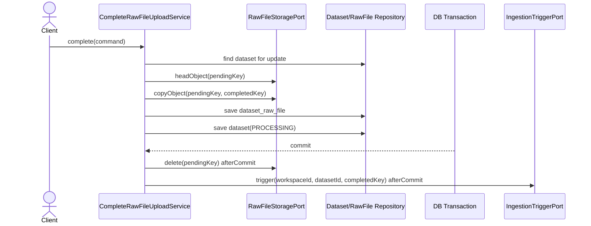

# Backend Spec: 업로드 객체 승격 rollback orphan 방지

## Goal

presigned 원본 로그 업로드 완료 처리에서 DB 트랜잭션이 commit되지 못하더라도 `completed/` 위치로 복사된 S3 객체가 orphan으로 남지 않게 한다.

## Background

이슈 #572는 업로드 완료 처리 중 `pending/` 객체를 `completed/` 객체로 복사한 뒤 DB 저장을 수행하는 현재 흐름에서 발생할 수 있는 orphan을 다룬다. S3 복사는 외부 저장소 변경이라 DB 트랜잭션으로 되돌릴 수 없으므로, 복사 성공 후 DB commit 실패 또는 rollback이 발생하면 `completed/` 객체가 남을 수 있다.

확인된 관련 경로:

- `backend/src/main/java/com/init/corpus/application/CompleteRawFileUploadService.java`
- `backend/src/main/java/com/init/corpus/application/port/RawFileStoragePort.java`
- `backend/src/main/java/com/init/corpus/infrastructure/storage/S3RawFileStorageAdapter.java`
- `backend/src/test/java/com/init/corpus/application/CompleteRawFileUploadServiceTest.java`

## Scope

- `CompleteRawFileUploadService`의 presigned 업로드 완료 경로를 보강한다.
- S3 `pending/` -> `completed/` 복사 성공 후 DB rollback이 발생하면 `completed/` 객체를 보상 삭제한다.
- S3 승격 실패 시 DB 저장, dataset 상태 전이, pending 삭제, ingestion trigger가 진행되지 않음을 테스트한다.
- DB 저장 실패, commit 실패 또는 트랜잭션 rollback 시 final 객체가 삭제되는지 테스트한다.

## Non-Goals

- outbox 테이블 또는 별도 cleanup worker를 새로 도입하지 않는다.
- 업로드 API 계약, 요청/응답 DTO, DB schema는 변경하지 않는다.
- S3 multipart copy나 4GB 초과 업로드 정책은 변경하지 않는다.
- ingestion trigger 실패 후 재시도 정책은 이 이슈에서 다루지 않는다.

## Current Flow

## Required Behavior

### S3 승격 성공 + DB commit 성공

- `pending/` 객체를 `completed/` 객체로 복사한다.
- `dataset_raw_file.object_key`는 `completed/` key로 저장한다.
- dataset은 `PROCESSING`으로 전이한다.
- commit 이후에만 pending 원본 삭제와 ingestion trigger가 실행된다.

### S3 승격 실패

- `copyObject(pendingKey, completedKey)` 실패가 호출자에게 전파된다.
- `dataset_raw_file` 저장과 dataset `PROCESSING` 전이는 실행되지 않는다.
- pending 원본 삭제와 ingestion trigger는 실행되지 않는다.
- `completed/` 객체 삭제 보상은 복사 성공이 확인되지 않은 경우 실행하지 않는다.

### DB 저장 실패, commit 실패 또는 rollback

- S3 복사 성공 이후 DB 저장 단계에서 예외가 발생하거나 트랜잭션이 commit되지 못하면 `completed/` 객체를 삭제한다.
- 보상 삭제 실패는 원래 DB 실패를 가리지 않도록 warn 로그만 남긴다.
- commit되지 않은 트랜잭션에서는 pending 원본 삭제와 ingestion trigger를 실행하지 않는다.

## Implementation Notes

- 기존 `TransactionSynchronizationManager` 기반 afterCommit 후처리 패턴을 유지한다.
- S3 복사 성공 직후 rollback cleanup synchronization을 등록한다.
- cleanup은 `TransactionSynchronization.afterCompletion(int status)`에서 `STATUS_COMMITTED`가 아닌 종료 상태일 때 `completedKey` 삭제를 시도한다.
- 트랜잭션 synchronization이 없는 단위 테스트 컨텍스트에서는 기존처럼 즉시 후처리를 수행하되, rollback cleanup은 실제 트랜잭션 경계에서만 검증한다.

## Acceptance Criteria

- DB rollback 또는 commit 실패 시 `completed/` final S3 객체가 남지 않는다.
- S3 승격 실패 시 DB 저장 및 ingestion trigger가 진행되지 않는다.
- DB 저장 실패 시 `completed/` 객체 삭제 보상 동작이 테스트된다.
- 성공 경로에서는 기존처럼 commit 이후 pending 원본 삭제와 ingestion trigger가 실행된다.

## Validation Plan

- `cd backend && ./gradlew test --tests com.init.corpus.application.CompleteRawFileUploadServiceTest`
- 필요 시 backend 전체 회귀 확인으로 `cd backend && ./gradlew test`를 실행한다.

## Open Questions

- 없음. 이 이슈에서는 별도 outbox/cleanup worker 없이 현재 트랜잭션 synchronization 기반 흐름을 보강한다.
