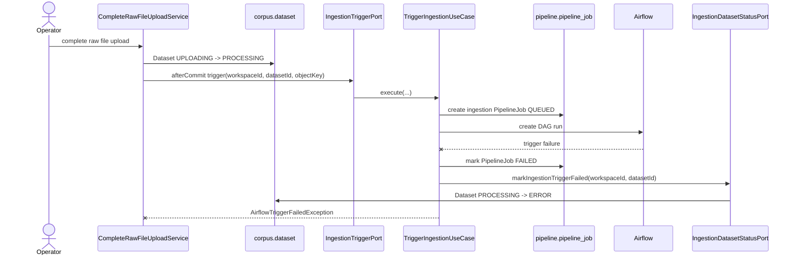

# [BE] 573 — 인제스천 트리거 실패 시 데이터셋 복구 가능 상태 보존

**Issue**: #573
**Branch**: `fix/573-ingestion-trigger-failure`
**Template Base**: `_TEMPLATE_BE.md`
**Bounded Context**: `corpus`, `pipeline-job`

---

## Goal

원본 로그 업로드 완료 후 Airflow 인제스천 트리거가 실패하더라도 데이터셋이 `PROCESSING`에 무기한 머물지 않고 운영자가 실패 상태를 확인할 수 있게 한다.

---

## Problem

presigned 원본 로그 업로드 완료 흐름은 커밋 이후 `IngestionTriggerPort`를 호출한다. 실제 구현은 `pipeline-job`의 `TriggerIngestionUseCase`로 연결되어 `pipeline_job`을 만들고 Airflow DAG를 트리거한다.

현재 동작은 Airflow 트리거 실패 시 `PipelineJob`만 `FAILED`로 전환하고, 이미 커밋된 `Dataset`은 `PROCESSING` 상태로 남길 수 있다. 이 상태는 운영자에게 진행 중처럼 보이며 실패 원인 확인과 후속 조치를 어렵게 만든다.

이슈 본문에 적힌 `com/example/...` 경로는 현재 저장소에는 없으며, 확인된 실제 경로는 아래와 같다.

- `backend/src/main/java/com/init/corpus/application/CompleteRawFileUploadService.java`
- `backend/src/main/java/com/init/pipelinejob/application/TriggerIngestionUseCase.java`
- `backend/src/main/java/com/init/corpus/domain/model/Dataset.java`
- `backend/src/main/java/com/init/corpus/domain/model/DatasetStatus.java`

---

## Scope

- Airflow 인제스천 트리거 실패 시 해당 데이터셋을 `ERROR` 상태로 전환한다.
- `PipelineJob`은 기존처럼 `FAILED` 상태와 실패 메시지를 보존한다.
- 업로드 완료로 생성된 `dataset_raw_file` 및 completed object key는 유지해 운영자가 원인을 확인하고 이후 별도 재처리 전략을 붙일 수 있게 한다.
- 트리거 실패 케이스의 backend 테스트를 추가 또는 갱신한다.

## Non-goals

- 신규 인제스천 재시도 API 추가
- outbox 기반 재시도 큐 도입
- Airflow DAG 내부 실행 실패 콜백 전체의 데이터셋 상태 정책 확장
- 프론트엔드 화면 변경
- DB migration

---

## Sequence Diagram



---

## Design

### Dataset State

`DatasetStatus.ERROR` already exists, so no schema or enum expansion is required.

`Dataset` should expose a domain method that records an ingestion-trigger failure only when the dataset is still in an upload/processing state. This keeps the transition meaningful and avoids overwriting later terminal states such as `DONE`.

Expected transition:

```text
UPLOADING or PROCESSING -> ERROR
READY, DONE, ERROR -> unchanged
```

### Pipeline to Corpus Port

`pipeline-job` should not directly encode corpus state rules in the use case. Add a narrow application port owned by `pipeline-job`:

```java
interface IngestionDatasetStatusPort {
  void markIngestionTriggerFailed(Long workspaceId, Long datasetId);
}
```

Implement the port in the existing `pipelinejob.infrastructure.corpus` adapter style, using `DatasetRepository.findByIdAndWorkspaceIdForUpdate(...)` and `Dataset.save(...)`.

### Trigger Failure Handling

`TriggerIngestionUseCase` keeps the current behavior:

- create ingestion `PipelineJob`
- call Airflow
- on `AirflowTriggerFailedException`, mark the job `FAILED`
- rethrow the exception

New behavior:

- after marking the job failed, also mark the dataset `ERROR`
- do this in its own `REQUIRES_NEW` transaction path so it is not rolled back by the caller's after-commit exception propagation

---

## Acceptance Criteria

- Airflow ingestion trigger failure after raw upload completion no longer leaves the dataset in `PROCESSING`.
- The related ingestion `PipelineJob` remains `FAILED` with its error message.
- A failed dataset is clearly visible as `ERROR` through existing dataset status responses.
- The completed raw file metadata remains available for later operator investigation or future retry design.
- A backend test covers the trigger-failure case.

---

## Validation

Expected local verification:

```bash
cd backend && ./gradlew test \
  --tests '*TriggerIngestionUseCaseTest' \
  --tests '*CompleteRawFileUploadServiceTest' \
  --tests '*DatasetTest' \
  --tests '*CorpusIngestionDatasetStatusAdapterTest'
```

Broader backend verification can use:

```bash
cd backend && ./gradlew test
```

---

## Open Questions

- 인제스천 재시도 API는 별도 요구사항으로 설계할지 결정이 필요하다.
- Airflow DAG가 성공적으로 시작된 뒤 내부 stage 실패 콜백이 도착하는 경우에도 `DatasetStatus.ERROR`로 전환할지는 별도 정책 결정이 필요하다.
