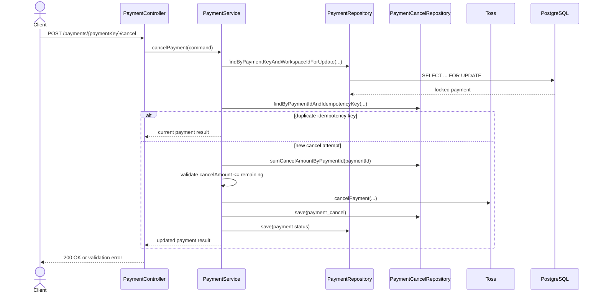

# 동시 부분취소의 취소 가능 금액 race 방지

## Goal

결제 부분취소 요청이 동시에 들어와도 같은 결제의 취소 가능 금액 계산과 저장이 직렬화되고, 같은 idempotency key 재시도가 취소 내역을 중복 저장하지 않도록 한다.

## Problem

부분취소 흐름은 기존 취소 합계를 읽어 잔여 취소 가능 금액을 계산한 뒤 Toss 취소 요청과 DB 저장을 수행한다. 이 구간에서 같은 `payment` 행을 잠그지 않으면 두 요청이 같은 잔여 금액을 보고 각각 승인되어 로컬 취소 합계가 결제 금액을 초과할 수 있다. 또한 `payment_cancel.idempotency_key` 컬럼은 존재하지만 unique 제약과 key 기반 중복 조회가 없어 같은 취소 시도 key가 중복 저장될 수 있다.

Issue 본문에 적힌 `backend/src/main/java/com/example/backend/payment/...` 경로는 현재 체크아웃에 존재하지 않으며, 실제 payment 패키지는 `backend/src/main/java/com/init/payment`이다.

## Scope

- `backend/src/main/java/com/init/payment/application/PaymentService.java`
- `backend/src/main/java/com/init/payment/presentation/PaymentController.java`
- `backend/src/main/java/com/init/payment/domain/model/Payment.java`
- `backend/src/main/java/com/init/payment/domain/repository/PaymentRepository.java`
- `backend/src/main/java/com/init/payment/domain/repository/PaymentCancelRepository.java`
- `backend/src/main/java/com/init/payment/infrastructure/persistence/JpaPaymentRepository.java`
- `backend/src/main/java/com/init/payment/infrastructure/persistence/JpaPaymentCancelRepository.java`
- `backend/src/main/resources/db/changelog/db.changelog-master.sql`
- `backend/src/test/java/com/init/payment/application/PaymentServiceTest.java`
- `backend/src/test/java/com/init/payment/presentation/PaymentControllerTest.java`
- `backend/src/test/java/com/init/payment/domain/model/PaymentTest.java`

## Non-Goals

- Toss 취소 API의 request/response 계약을 변경하지 않는다.
- 결제 승인 confirm 흐름의 멱등 처리 방식을 변경하지 않는다.
- 관리자 전액 환불 유스케이스의 권한, 조회, 화면 계약을 변경하지 않는다.
- payment 스키마 전체를 재설계하거나 취소 시도 테이블을 새로 분리하지 않는다.

## Sequence Diagram

## REST API

기존 결제 취소 엔드포인트를 유지한다.

| Method | Path | Description |
| --- | --- | --- |
| `POST` | `/api/v1/workspaces/{workspaceId}/payments/{paymentKey}/cancel` | 결제 전액 취소 또는 부분취소 |

### Header

| Header | Required | Description |
| --- | --- | --- |
| `Idempotency-Key` | No | 같은 취소 시도 재시도 여부를 판단한다. 없으면 서버가 내부 key를 생성한다. |

## Requirements

- 결제 취소 처리에서 payment row를 pessimistic write lock으로 조회한다.
- 같은 payment의 잔여 취소 가능 금액 계산, Toss 취소 요청, `payment_cancel` 저장, `payment` 상태 저장은 잠긴 payment row 기준으로 직렬화한다.
- `cancelAmount`가 명시된 부분취소는 최신 취소 합계 기준 잔여 금액을 초과하면 Toss를 호출하지 않고 거부한다.
- `cancelAmount`가 없는 전액 취소는 이미 부분취소된 금액을 제외한 남은 금액만 `payment_cancel.cancel_amount`에 기록한다.
- 같은 `(payment_id, idempotency_key)` 취소 기록이 있으면 Toss를 재호출하거나 `payment_cancel`을 중복 저장하지 않는다.
- DB는 기존 duplicate non-null idempotency key row를 정리한 뒤 `(payment_id, idempotency_key)` unique index를 가진다.
- `PARTIAL_CANCELED` 상태 결제는 남은 금액 전액 취소 후 `CANCELED`로 전이될 수 있다.

## Acceptance Criteria

- 동시 부분취소 요청 중 첫 요청 이후 잔여 금액을 초과하는 후속 요청은 승인되지 않는다.
- 같은 idempotency key로 재시도한 취소 요청은 중복 취소 내역을 저장하지 않는다.
- payment cancel idempotency key 중복 정리와 unique 제약이 changelog에 추가된다.
- 결제 취소 controller는 클라이언트가 보낸 `Idempotency-Key` 헤더를 서비스 command로 전달한다.
- 동시 부분취소 직렬화, idempotency key 중복 방지, 부분취소 후 전액 취소 전이가 테스트로 검증된다.

## Validation

- `cd backend && ./gradlew test --tests com.init.payment.application.PaymentServiceTest`
- `cd backend && ./gradlew test --tests com.init.payment.presentation.PaymentControllerTest`
- `cd backend && ./gradlew test --tests com.init.payment.domain.model.PaymentTest`

## Open Questions

- 없음.
