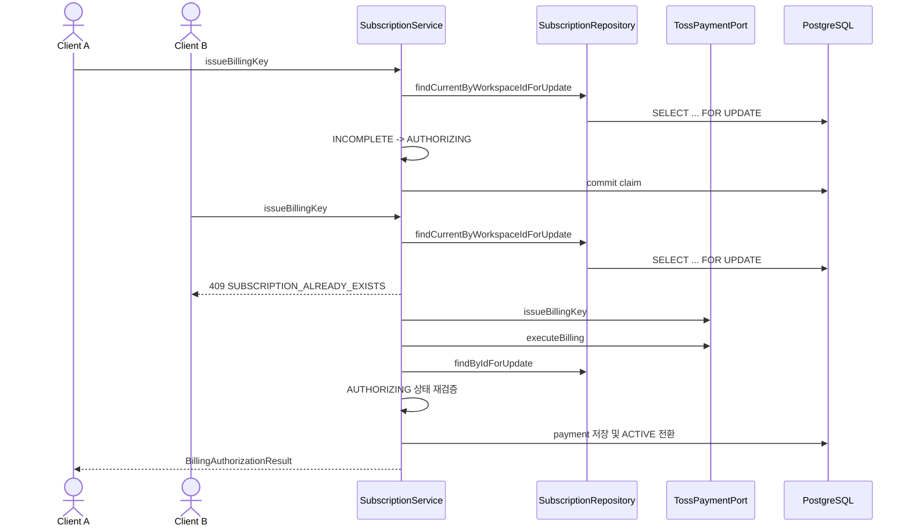

# Backend Spec: billing key authorization 직렬화

## Goal

동일 구독에 대한 billing key 발급 요청이 동시에 들어와도 외부 billing key 발급과 첫 과금이 중복 실행되지 않도록 구독 단위 authorization 흐름을 직렬화한다.

## Problem

현재 billing key 발급 흐름은 구독 상태가 `INCOMPLETE`인지 확인한 뒤 외부 Toss billing key 발급과 첫 과금을 수행하고, 마지막 트랜잭션에서 결제와 구독 활성화를 저장한다. 같은 구독에 대해 동시 요청이 들어오면 두 요청이 모두 초기 상태 확인을 통과한 뒤 외부 첫 과금을 각각 실행할 수 있다.

## Scope

- `backend/src/main/java/com/init/payment/application/SubscriptionService.java`
- `backend/src/main/java/com/init/payment/domain/model/Subscription.java`
- `backend/src/main/java/com/init/payment/domain/model/SubscriptionStatus.java`
- `backend/src/main/java/com/init/payment/domain/repository/SubscriptionRepository.java`
- `backend/src/main/java/com/init/payment/infrastructure/persistence/JpaSubscriptionRepository.java`
- `backend/src/main/resources/db/changelog/db.changelog-master.sql`
- `backend/src/test/java/com/init/payment/application/SubscriptionServiceTest.java`
- `backend/src/test/java/com/init/payment/application/SubscriptionServiceConcurrencyTest.java`

## Non-Goals

- Toss API의 원격 멱등성 정책을 새로 설계하지 않는다.
- billing key 저장 구조나 암호화 방식은 변경하지 않는다.
- 정기결제 스케줄러의 동주기 중복청구 방어 로직은 변경하지 않는다.

## Sequence Diagram

## Behavior

- billing key 발급 시작 시 현재 구독 row를 pessimistic write lock으로 조회하고, `INCOMPLETE` 상태인 경우에만 `AUTHORIZING`으로 전환한다.
- 이미 `AUTHORIZING`, `ACTIVE`, `PAST_DUE` 또는 그 외 비-`INCOMPLETE` 상태인 현재 구독에 대한 billing key 발급 요청은 기존 `ActiveSubscriptionExistsException` 경로로 409 응답을 반환한다.
- 첫 과금 저장 직전에는 구독 row를 다시 lock으로 조회하고 `AUTHORIZING` 상태인지 검증한다.
- Toss billing key 발급 또는 첫 과금 호출이 게이트웨이 오류/거절로 실패하면 구독 상태를 다시 `INCOMPLETE`로 되돌려 사용자가 재시도할 수 있게 한다.
- 첫 과금 결과가 완료 상태가 아니면 결제는 `ABORTED`로 기록하고 구독은 `INCOMPLETE`로 되돌린다.
- `AUTHORIZING`도 워크스페이스의 open subscription으로 간주되도록 partial unique index 조건에 포함한다.

## API Impact

기존 endpoint와 response schema는 변경하지 않는다.

| Method | Path | Change |
|--------|------|--------|
| POST | `/api/v1/workspaces/{workspaceId}/billing/authorizations` | 동일 구독의 진행 중/중복 요청은 409 `SUBSCRIPTION_ALREADY_EXISTS`로 정리 |

## Data Impact

- `payment.subscription.status` enum 값에 `AUTHORIZING`을 추가한다.
- `payment.subscription`의 open subscription partial unique index 조건에 `AUTHORIZING`을 포함한다.

## Acceptance Criteria

- 동일 구독에 대해 billing key 발급 요청 2개가 동시에 실행되어도 `TossPaymentPort.executeBilling`은 한 번만 호출된다.
- 중복 요청은 외부 billing key 발급이나 첫 과금을 실행하기 전에 409로 실패한다.
- 첫 과금 저장 직전 `AUTHORIZING` 상태 재검증이 수행된다.
- 게이트웨이 실패 또는 거절이 발생하면 구독은 재시도 가능한 `INCOMPLETE` 상태로 돌아간다.
- 동시성 테스트가 추가되어 중복 첫 과금 방지를 검증한다.

## Validation

- `cd backend && ./gradlew test --tests com.init.payment.application.SubscriptionServiceTest --tests com.init.payment.application.SubscriptionServiceConcurrencyTest`
- 필요 시 전체 backend 회귀 확인: `cd backend && ./gradlew test`

## Open Questions

- 없음.
