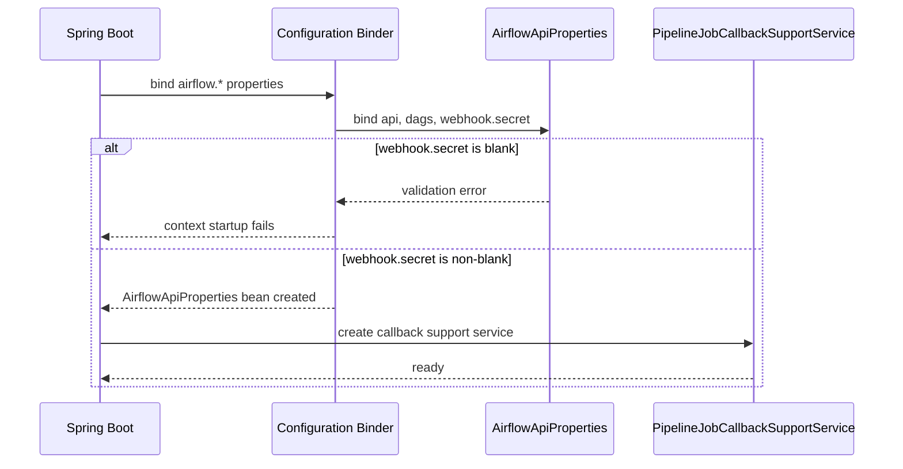

# [BE] #578 — Airflow webhook secret blank 설정 기동 차단

> **Issue**: #578 `fix(pipeline): Airflow webhook secret 공백 설정을 기동 시 차단한다`
> **Scope**: pipeline callback 인증 경계 설정 검증
> **Branch**: `fix/578-airflow-webhook-secret`
> **Template**: `.agent/specs/_TEMPLATE_BE.md`

---

## Goal

기본/운영 프로필에서 `airflow.webhook.secret`이 비어 있거나 공백만 있는 값으로 바인딩되면 Spring 애플리케이션이 정상 기동하지 않도록 한다.

---

## Background

Airflow callback webhook은 `X-Airflow-Webhook-Secret` 헤더를 기대 secret과 비교해 인증한다. 현재 callback 지원 서비스는 기대 secret이 `null`이면 빈 바이트 배열로 비교하고, blank 값도 별도 차단하지 않는다. 배포 환경에서 `AIRFLOW_WEBHOOK_SECRET`이 빈 값으로 주입되면 인증 경계가 약해질 수 있다.

이슈 본문은 `backend/src/main/java/com/example/backend/...` 경로를 언급하지만, 저장소에서 확인한 실제 경로는 아래와 같다.

| 구분 | 검증된 경로 |
|------|-------------|
| callback secret 비교 | `backend/src/main/java/com/init/pipelinejob/application/PipelineJobCallbackSupportService.java` |
| Airflow 설정 바인딩 | `backend/src/main/java/com/init/shared/infrastructure/airflow/AirflowApiProperties.java` |
| Airflow 설정 활성화 | `backend/src/main/java/com/init/shared/infrastructure/airflow/AirflowApiConfig.java` |
| 기본 설정 | `backend/src/main/resources/application.yml` |
| local profile 설정 | `backend/src/main/resources/application-local.yml` |
| prod profile 설정 | `backend/src/main/resources/application-prod.yml` |

---

## Scope

### In Scope

- `airflow.webhook.secret`을 configuration properties 바인딩 모델에 포함한다.
- `airflow.webhook.secret`에 non-blank 검증을 적용한다.
- 기본/운영 프로필에서 `AIRFLOW_WEBHOOK_SECRET`이 blank로 주입되면 애플리케이션 컨텍스트가 실패하도록 한다.
- local profile은 기존 개발용 기본값을 유지한다.
- blank secret 검증 정책을 테스트한다.

### Out of Scope

- Airflow callback API 경로, 헤더명, 요청/응답 형식 변경.
- secret 회전, 다중 secret 지원, Secrets Manager 연동 방식 변경.
- Toss webhook secret 정책 변경.
- Airflow DAG trigger 설정 전반의 필수값 정책 변경.

---

## Sequence Diagram



---

## REST API

신규 엔드포인트 없음. 기존 callback 엔드포인트와 응답 스키마는 유지한다.

| Method | Path | Description |
|--------|------|-------------|
| POST | `/api/v1/pipeline-jobs/{jobId}/callbacks/domain-pack-drafts` | Domain Pack draft callback |
| POST | `/api/v1/pipeline-jobs/{jobId}/callbacks/intent-drafts` | Intent draft callback |
| POST | `/api/v1/pipeline-jobs/{jobId}/callbacks/workflow-drafts` | Workflow draft callback |
| POST | `/api/v1/pipeline-jobs/{jobId}/callbacks/domain-confirmation-checkpoints` | Domain confirmation checkpoint callback |
| POST | `/api/v1/pipeline-jobs/{jobId}/callbacks/human-feedback-checkpoints` | Human feedback checkpoint callback |
| POST | `/api/v1/pipeline-jobs/{jobId}/callbacks/failures` | Pipeline failure callback |

---

## Class Design

### 변경 대상

| 파일 | 변경 내용 |
|------|-----------|
| `backend/src/main/java/com/init/shared/infrastructure/airflow/AirflowApiProperties.java` | `@Validated`, nested `Webhook` record, `@NotBlank secret` 추가 |
| `backend/src/main/java/com/init/pipelinejob/application/PipelineJobCallbackSupportService.java` | 생성자 단계에서 blank webhook secret을 한 번 더 거절하도록 변경 |
| `backend/src/test/java/com/init/shared/infrastructure/airflow/AirflowApiPropertiesTest.java` | 신규 테스트 파일. `backend/src/test/java/com/init/shared` 하위에 `infrastructure/airflow` 패키지를 생성해 blank secret 바인딩 실패 테스트 추가 |
| `backend/src/test/java/com/init/pipelinejob/infrastructure/airflow/AirflowDomainPackGenerationTriggerAdapterTest.java` | `AirflowApiProperties` 생성자 변경 반영 |
| `backend/src/test/java/com/init/pipelinejob/infrastructure/airflow/AirflowIngestionTriggerAdapterTest.java` | `AirflowApiProperties` 생성자 변경 반영 |

### Configuration Properties

`AirflowApiProperties`는 기존 `airflow.api.*`, `airflow.dags.*` 바인딩에 `airflow.webhook.secret`을 추가한다. 기존 Toss 설정의 `@Validated` + nested record 패턴을 따른다.

```java
@ConfigurationProperties(prefix = "airflow")
@Validated
public record AirflowApiProperties(Api api, Dags dags, @NotNull @Valid Webhook webhook) {
  public record Webhook(@NotBlank String secret) {}
}
```

### Callback Support Service

`PipelineJobCallbackSupportService`는 기존 `@Value("${airflow.webhook.secret}")` 주입을 유지하되, 생성자에서 `null` 또는 blank expected secret을 거절한다. 실제 Spring 기동 경계는 configuration properties 검증이 먼저 담당하고, 직접 생성되는 테스트/유닛 경로에서도 같은 정책을 유지한다.

---

## Data / Migration Impact

DB 스키마 변경 없음. 환경 변수 계약은 다음과 같이 명확해진다.

| Profile | `AIRFLOW_WEBHOOK_SECRET` 미설정 | `AIRFLOW_WEBHOOK_SECRET=""` 또는 blank |
|---------|----------------------------------|----------------------------------------|
| default | 기존과 같이 placeholder 해석 실패 또는 설정 실패 | 설정 검증 실패 |
| prod | 기존과 같이 placeholder 해석 실패 또는 설정 실패 | 설정 검증 실패 |
| local | `local-airflow-webhook-secret` 기본값 사용 | 명시적으로 blank를 주입하면 설정 검증 실패 |
| test | `backend/src/test/resources/application.yml`의 테스트 secret 사용 | blank override 시 설정 검증 실패 |

---

## Tests

### 신규 테스트

| 테스트 | 검증 |
|--------|------|
| `AirflowApiPropertiesTest` | `airflow.webhook.secret`이 blank이면 `AirflowApiProperties` 바인딩/검증이 실패한다 |
| `AirflowApiPropertiesTest` | non-blank secret이면 properties가 정상 바인딩되고 secret 값을 조회할 수 있다 |
| `PipelineJobCallbackSupportServiceTest` | 직접 생성 시에도 blank expected secret을 거절한다 |
| `PipelineJobCallbackSupportServiceTest` | non-blank expected secret에서 blank provided secret은 unauthorized 처리된다 |

### 기존 테스트 보정

`AirflowApiProperties` record 생성자가 변경되므로, 직접 생성하는 Airflow adapter 단위 테스트에 `new AirflowApiProperties.Webhook("test-airflow-webhook-secret")`을 추가한다.

### 검증 명령

```bash
cd backend && ./gradlew test --tests com.init.shared.infrastructure.airflow.AirflowApiPropertiesTest
cd backend && ./gradlew test --tests com.init.pipelinejob.application.PipelineJobCallbackSupportServiceTest
cd backend && ./gradlew test --tests com.init.pipelinejob.infrastructure.airflow.AirflowDomainPackGenerationTriggerAdapterTest --tests com.init.pipelinejob.infrastructure.airflow.AirflowIngestionTriggerAdapterTest
```

---

## Acceptance Criteria

- 기본/운영 프로필에서 blank `AIRFLOW_WEBHOOK_SECRET`으로 애플리케이션 컨텍스트가 정상 기동하지 않는다.
- local profile은 명시적 설정이 없으면 기존 개발용 secret 기본값으로 기동 가능하다.
- callback secret 비교 로직은 blank expected secret을 정상 secret으로 받아들이지 않는다.
- blank secret 검증 정책이 자동 테스트로 고정된다.
- callback API 계약과 DB 스키마는 변경되지 않는다.

---

## Open Questions

없음. 이슈는 blank secret 차단과 테스트를 명시하고 있으며, local 기본값은 기존 `application-local.yml`의 값을 유지하는 방향으로 충분히 결정 가능하다.
