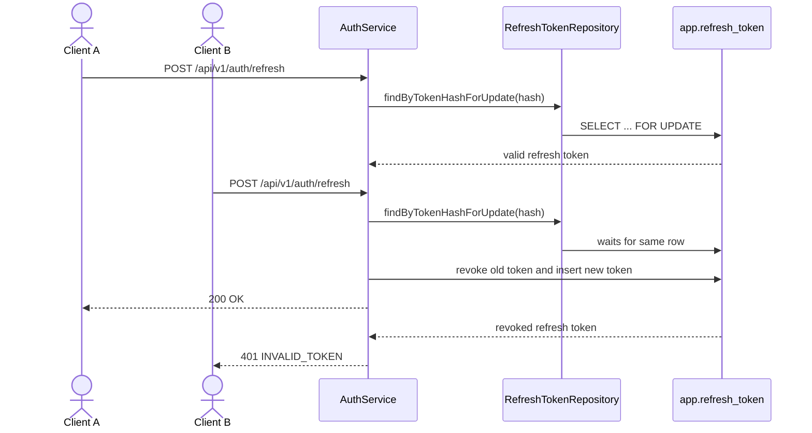

# Refresh token rotation concurrency failure mapping

## Goal

같은 refresh token으로 동시에 rotation 요청이 들어와도 하나의 요청만 새 토큰을 받고 나머지는 500이 아닌 인증 실패로 응답하도록 한다.

## Problem

`AuthService.refresh()`는 refresh token row를 조회한 뒤 `RefreshToken.revoke()`와 새 refresh token 발급을 같은 트랜잭션에서 수행한다. `RefreshToken`에는 `@Version`이 있지만, 같은 token hash를 동시에 읽은 두 요청이 모두 유효성 검사를 통과하면 한 요청의 revoke 이후 다른 요청에서 optimistic locking 충돌이 발생할 수 있다. 이 충돌이 인증 실패로 변환되지 않으면 `/api/v1/auth/refresh` 호출자는 이미 사용된 refresh token에 대해 401 대신 500을 받을 수 있다.

이슈 본문은 `backend/src/main/java/com/example/backend/...` 경로를 언급하지만 현재 저장소에서 확인된 실제 auth 경로는 `backend/src/main/java/com/init/auth/...`다.

## Sequence Diagram



## Scope

- `backend/src/main/java/com/init/auth/application/AuthService.java`의 refresh token 조회를 rotation 전용 row lock 조회로 변경한다.
- `backend/src/main/java/com/init/auth/application/JwtService.java`의 refresh token 발급이 같은 초 안에서도 매번 다른 token value를 만들도록 보장한다.
- `backend/src/main/java/com/init/auth/domain/repository/RefreshTokenRepository.java`에 rotation용 조회 계약을 추가한다.
- `backend/src/main/java/com/init/auth/infrastructure/persistence/JpaRefreshTokenRepository.java`에 `PESSIMISTIC_WRITE` lock 기반 구현을 둔다.
- `backend/src/test/java/com/init/auth/application/AuthServiceTest.java`에 refresh 경로가 lock 조회 계약을 사용하는지 검증을 보강한다.
- `backend/src/test/java/com/init/auth/application/` 아래에 동시 refresh 요청 회귀 테스트를 추가한다.

## Non-Goals

- refresh token 만료 시간 또는 저장 스키마 변경
- `/api/v1/auth/refresh` request/response DTO 변경
- access token 검증, login, logout, password reset 정책 변경
- refresh token 재사용 감지 감사 로그나 전체 세션 폐기 정책 추가

## REST API

| Method | Path | Description |
| --- | --- | --- |
| POST | `/api/v1/auth/refresh` | 기존 refresh token을 폐기하고 새 access/refresh token을 발급 |

### Error Response

동일 refresh token을 이미 다른 요청이 성공적으로 rotation한 경우 실패 요청은 기존 `InvalidTokenException` 매핑을 사용한다.

```json
{
  "code": "INVALID_TOKEN",
  "message": "만료되거나 폐기된 리프레시 토큰입니다."
}
```

HTTP status는 401 Unauthorized다.

## Design Diff

| 영역 | As-is | To-be |
| --- | --- | --- |
| refresh token 조회 | `findByTokenHash()`로 일반 조회 | refresh rotation에서는 `findByTokenHashForUpdate()`로 같은 row를 직렬화 |
| 새 refresh token 값 | 같은 사용자에게 같은 초 안에 발급되면 token value가 같아질 수 있음 | refresh token마다 `jti`를 넣어 token hash unique 충돌을 방지 |
| 동시 요청 처리 | 두 요청이 같은 유효 token 상태를 볼 수 있음 | 두 번째 요청은 첫 번째 요청 commit 이후 revoked 상태를 확인 |
| 실패 매핑 | optimistic locking 충돌이 500으로 표면화될 수 있음 | 이미 사용된 refresh token은 `InvalidTokenException` 기반 401로 응답 |
| logout | 일반 조회 후 revoke | 기존 동작 유지 |

## Acceptance Criteria

- 같은 refresh token으로 동시에 `refresh()`가 호출되면 정확히 하나의 호출만 새 refresh token을 받는다.
- 실패한 동시 호출은 `InvalidTokenException`으로 끝나며 HTTP 경계에서는 401 `INVALID_TOKEN`으로 매핑된다.
- refresh rotation 경로는 token hash 조회 시 row lock 계약을 사용한다.
- 같은 사용자에게 refresh token을 즉시 재발급해도 새 refresh token value는 기존 token과 다르다.
- 기존 만료, 폐기, 존재하지 않는 refresh token 실패 동작은 유지된다.

## Validation Plan

| 구분 | 명령 | 기대 결과 |
| --- | --- | --- |
| Backend targeted tests | `cd backend && ./gradlew test --tests com.init.auth.application.JwtServiceTest --tests com.init.auth.application.AuthServiceTest --tests com.init.auth.application.AuthServiceConcurrencyTest --tests com.init.auth.presentation.AuthControllerTest` | refresh token value uniqueness, refresh lock 조회, 동시 rotation, 401 매핑 회귀 통과 |
| Backend full tests | `cd backend && ./gradlew test` | 백엔드 테스트 회귀 없음 |

## Open Questions

- 없음. 이슈는 같은 refresh token의 동시 rotation 충돌을 인증 실패로 다루는 범위로 한정되어 있다.
