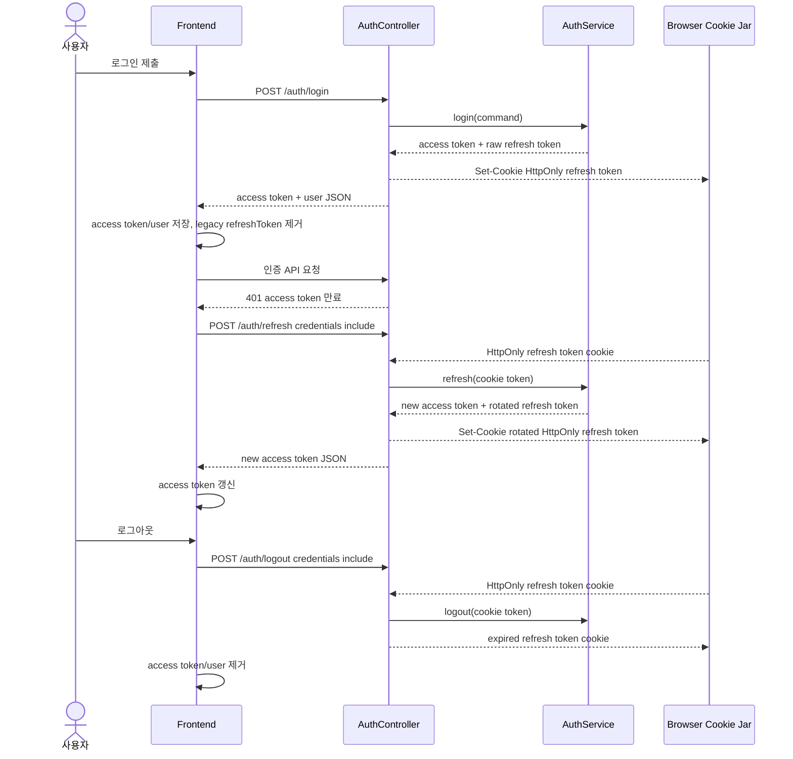

# [FE/BE] 580 — refresh token HttpOnly cookie 전환

## Goal

프론트엔드가 장기 수명 refresh token을 JavaScript에서 직접 읽을 수 없도록, 로그인/갱신/로그아웃 흐름을 HttpOnly cookie 기반 refresh token 전송으로 전환한다.

## Background

현재 인증 흐름은 `frontend/src/shared/lib/auth.ts`가 access token과 refresh token을 모두 `localStorage`에 저장하고, `frontend/src/shared/api/index.ts`가 refresh 요청 본문에 저장된 refresh token을 넣는다. XSS가 발생하면 refresh token까지 탈취되어 access token보다 긴 피해 범위가 생긴다.

백엔드의 `backend/src/main/java/com/init/auth/application/AuthService.java`는 refresh token을 해시해 저장하고 rotation도 수행하지만, `backend/src/main/java/com/init/auth/presentation/AuthController.java`가 refresh token을 JSON 응답/요청 본문으로 노출한다.

## Scope

- `POST /api/v1/auth/login`은 refresh token을 응답 JSON에서 제거하고 `Set-Cookie`로 내려준다.
- `POST /api/v1/auth/refresh`는 refresh token을 요청 body가 아니라 HttpOnly cookie에서 읽고, rotation된 refresh token을 다시 cookie로 내려준다.
- `POST /api/v1/auth/logout`은 cookie refresh token을 폐기하고 브라우저 cookie를 만료시킨다.
- refresh cookie는 HttpOnly, SameSite, path, max-age를 명시하고 운영 환경에서는 Secure를 켠다.
- frontend auth 저장소는 refresh token을 저장/조회하지 않고, 과거 `localStorage.refreshToken` 값은 세션 저장/정리 시 제거한다.
- frontend API client는 refresh/logout 등 cookie 기반 auth 요청에 `credentials: "include"`를 사용한다.
- 로그인, refresh, logout 테스트를 새 저장 방식 기준으로 보강한다.

## Non-goals

- access token을 완전한 메모리 저장 방식으로 전환하지 않는다. 이번 범위에서는 refresh token의 JavaScript 직접 접근 제거를 우선한다.
- CSRF token 발급/검증 엔드포인트를 새로 만들지 않는다. 이번 범위의 CSRF 완화는 SameSite cookie와 Authorization bearer token 기반 보호 API 유지로 제한한다.
- refresh token DB 스키마나 hashing/rotation application service는 변경하지 않는다.

## User Flow Chart

## API Contract

| Method | Path | To-be request | To-be response | Cookie |
|--------|------|---------------|----------------|--------|
| POST | `/api/v1/auth/login` | login JSON body | access token, token type, expiresIn, user | `Set-Cookie: ostone_refresh_token=...; HttpOnly; SameSite=Lax; Path=/api/v1/auth; Max-Age=...` |
| POST | `/api/v1/auth/refresh` | no refresh token body required | new access token, token type, expiresIn | reads and rotates `ostone_refresh_token` |
| POST | `/api/v1/auth/logout` | no refresh token body required | 204 No Content | reads and expires `ostone_refresh_token` |

### Security Notes

- HttpOnly prevents application JavaScript from reading the refresh token.
- Secure must be enabled in production profile. Local HTTP development may keep it disabled through configuration so browser testing still works.
- SameSite defaults to `Lax`, so cross-site POST refresh/logout attempts do not include the cookie in modern browsers.
- Protected product APIs continue to require `Authorization: Bearer {accessToken}`; cookie presence alone does not authorize workspace/admin/product actions.
- If deployment later requires `SameSite=None` for a truly cross-site frontend/API origin, a CSRF token or equivalent origin-bound defense must be added before enabling that mode.

## Affected Modules

### Backend

- `backend/src/main/java/com/init/auth/presentation/AuthController.java`
- `backend/src/main/java/com/init/auth/presentation/dto/LoginResponse.java`
- `backend/src/main/java/com/init/auth/presentation/dto/TokenRefreshResponse.java`
- `backend/src/main/java/com/init/auth/presentation/dto/LogoutRequest.java`
- `backend/src/main/java/com/init/auth/presentation/dto/TokenRefreshRequest.java`
- `backend/src/main/resources/application.yml`
- `backend/src/main/resources/application-dev.yml`
- `backend/src/main/resources/application-prod.yml`
- `backend/src/test/java/com/init/auth/presentation/AuthControllerTest.java`

### Frontend

- `frontend/src/shared/lib/auth.ts`
- `frontend/src/shared/api/index.ts`
- `frontend/src/features/auth/api/authApi.ts`
- `frontend/src/features/auth/model/useLogout.ts`
- `frontend/src/features/auth/ui/login-form/LoginForm.tsx`
- `frontend/src/shared/ui/PrivateRoute.tsx`
- `frontend/src/shared/lib/auth.test.ts`
- `frontend/src/shared/api/index.test.ts`
- `frontend/src/features/auth/api/authApi.test.ts`
- `frontend/src/shared/ui/PrivateRoute.test.tsx`
- `frontend/src/shared/api/generated/endpoints/auth-controller/auth-controller.ts`
- `frontend/src/shared/api/generated/zod/`

Generated OpenAPI client files under `frontend/src/shared/api/generated/` should be regenerated after backend DTO changes, not manually edited.

## Acceptance Criteria

- Login response body no longer contains `refreshToken`.
- Login and refresh responses set an HttpOnly refresh cookie.
- Refresh uses the cookie value and rotates the cookie without requiring JavaScript to read a refresh token.
- Logout revokes the cookie token when present and expires the browser cookie.
- Frontend no longer writes refresh token values to `localStorage` or memory fallback storage.
- Frontend refresh requests use `credentials: "include"` and no refresh-token JSON body.
- Existing stale `localStorage.refreshToken` is removed during session save/token update/clear.
- Login, refresh, and logout tests assert the cookie-based behavior.

## Validation Plan

- Backend:
  - `cd backend && ./gradlew test --tests com.init.auth.presentation.AuthControllerTest`
  - `cd backend && ./gradlew test`
- Frontend:
  - `cd frontend && pnpm test -- src/shared/lib/auth.test.ts src/shared/api/index.test.ts src/features/auth/api/authApi.test.ts src/shared/ui/PrivateRoute.test.tsx src/features/auth/ui/login-form/LoginForm.test.tsx`
  - `cd frontend && pnpm test`
  - `cd frontend && pnpm build`
- Generated API:
  - `cd backend && ./gradlew generateOpenApiDocs`
  - `cd frontend && pnpm api:gen`

## Open Questions

- 없음
