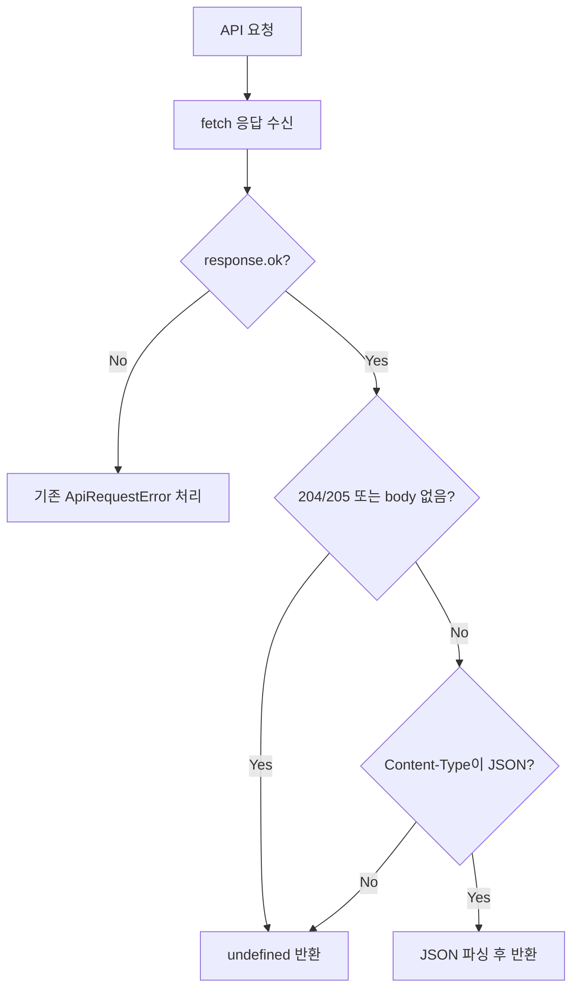

# 빈 성공 응답 API client 안전 처리

## Goal

공통 API client가 200/201 성공 응답에 빈 본문 또는 JSON이 아닌 본문을 받아도 파싱 예외로 실패하지 않게 한다.

## User Flow Chart



## Design Diff

### As-is vs To-be

| 영역 | As-is | To-be | 변경 내용 |
| --- | --- | --- | --- |
| 성공 응답 처리 | 204가 아니면 항상 `response.json()` 호출 | JSON content type이고 body가 있을 때만 JSON 파싱 | 200/201 빈 본문 성공 응답에서 파싱 오류 방지 |
| 빈 성공 본문 정책 | 204만 `undefined` 반환 | 200/201 빈 본문도 `undefined` 반환 | API client의 no payload 정책을 명시 |
| JSON 성공 응답 | 기존처럼 `response.json()` 결과 반환 | response body text를 JSON으로 파싱해 반환 | 정상 JSON payload 동작 유지 |
| JSON이 아닌 성공 본문 | `response.json()` 파싱 오류 발생 | `undefined` 반환 | JSON API client에서 비 JSON 성공 body를 payload 없음으로 취급 |

## Component Tree

```text
shared/api
├─ ApiClient
│  ├─ get/post/patch/delete/request
│  └─ handleResponse
│     └─ parse success body by status, Content-Type, and body text
└─ ApiRequestError
```

## API Integration

### Endpoints

공통 API client의 응답 처리 정책 변경이므로 특정 endpoint contract를 새로 추가하거나 변경하지 않는다.

### Query Key Pattern

서버 상태 query key와 generated endpoint 코드는 변경하지 않는다.

## Data Flow

```text
fetch Response
  -> non-ok: 기존 error JSON fallback + ApiRequestError
  -> 204/205: undefined
  -> JSON Content-Type + non-empty body: JSON.parse(body)
  -> empty body or non-JSON Content-Type: undefined
```

## 수정 대상 파일

| 파일 | 변경 유형 | 설명 |
| --- | --- | --- |
| `frontend/src/shared/api/index.ts` | modify | 성공 응답의 content type과 body 존재 여부를 확인한 뒤 JSON 파싱 |
| `frontend/src/shared/api/index.test.ts` | modify | 200 빈 본문, JSON 성공 응답, JSON이 아닌 성공 응답 단위 테스트 추가 |
| `frontend/src/app/App.test.tsx` | modify | 공통 API client를 지나는 app routing test fetch mock을 실제 JSON `Response`로 정렬 |
| `.agent/specs/582.md` | new | 이슈 요구사항과 검증 기준 문서화 |

## State Management

상태 관리 변경은 없다. 성공 응답 payload가 없는 API 호출은 `undefined`를 반환하며, 기존 호출자가 `void` 또는 optional payload로 다루는 계약을 따른다.

## Tests

### Test Strategy

| 구분 | 방법 | 도구 | 비고 |
| --- | --- | --- | --- |
| API client 단위 | fetch 응답 mock으로 `handleResponse` 경로 검증 | Vitest | 성공 JSON, 204, 200 빈 본문, non-JSON 성공 본문, error fallback |
| App routing 회귀 | 공통 API client를 지나는 route test의 fetch mock 정렬 | Vitest | 실제 `Response` metadata 기반 파싱 경로 검증 |
| 회귀 확인 | shared API client test 파일 단독 실행 | `pnpm test` | `frontend/src/shared/api/index.test.ts` 대상 |

### Test Scenarios

#### Happy Path

| # | 시나리오 | 사전 조건 | 조작 | 기대 결과 |
| --- | --- | --- | --- | --- |
| 1 | JSON 성공 응답 | 200 + `application/json` + body | `apiClient.get` 호출 | JSON payload 반환 |
| 2 | 204 응답 | 204 + body 없음 | `apiClient.get` 호출 | `undefined` 반환 |
| 3 | 200 빈 본문 | 200 + body 없음 | `apiClient.get` 호출 | 예외 없이 `undefined` 반환 |

#### Error & Edge Cases

| # | 시나리오 | 조작 | 기대 결과 |
| --- | --- | --- | --- |
| 1 | JSON이 아닌 성공 본문 | 200 + `text/plain` body | 예외 없이 `undefined` 반환 |
| 2 | non-ok JSON 응답 | 400 + JSON error body | 기존 `ApiRequestError` 발생 |
| 3 | non-ok JSON 파싱 실패 | 500 + 파싱 불가 body | 기존 기본 오류 메시지 사용 |

## Acceptance Criteria

- 200 빈 본문 성공 응답에서 API client가 예외를 던지지 않고 `undefined`를 반환한다.
- JSON 성공 응답은 기존처럼 payload를 반환한다.
- JSON이 아닌 성공 응답은 파싱 예외를 던지지 않고 `undefined`를 반환한다.
- 기존 non-ok 응답의 `ApiRequestError` 처리와 401 session 정리 동작은 유지된다.
- API client 단위 테스트로 위 성공/오류 경로를 검증한다.

## Open Questions

- 없음.
