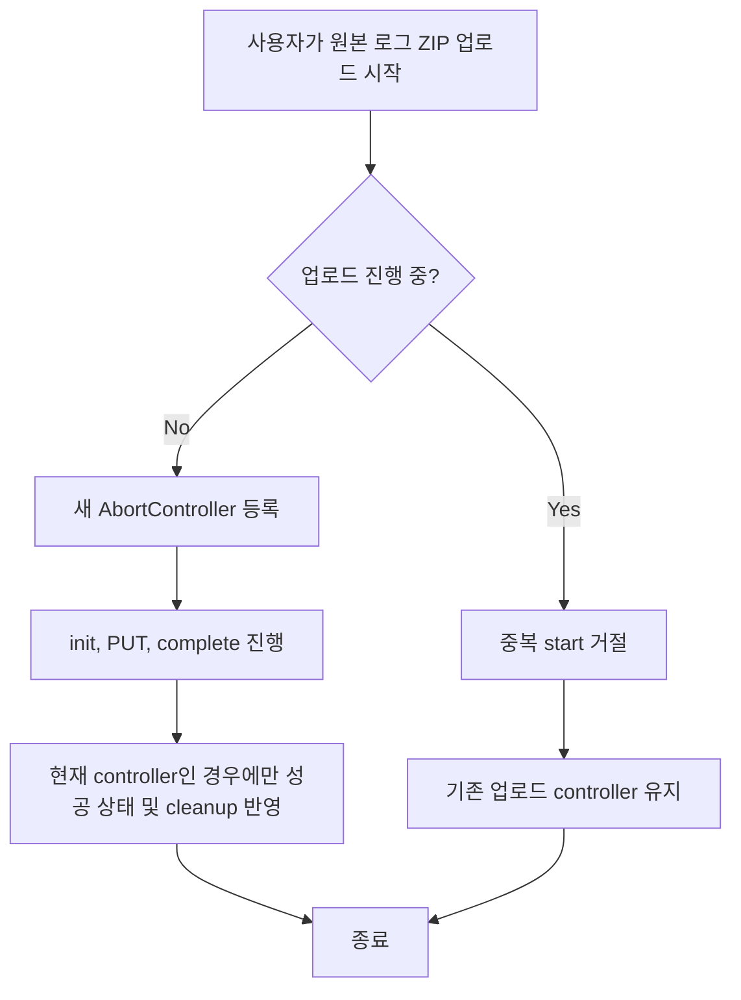

# 원본 로그 업로드 start 중복 race 방지

## Goal

원본 로그 ZIP 업로드 hook에서 업로드 진행 중 중복 `start()` 호출이 발생해도 진행 중 업로드의 취소 핸들과 상태가 이전 요청의 비동기 종료 처리에 의해 훼손되지 않도록 한다.

## Background

Issue #583은 원본 로그 업로드 hook이 `start()`마다 새 `AbortController`를 만들고 `abortRef`에 저장하는 구조에서 발생할 수 있는 race를 지적한다. 이전 요청의 `finally`가 나중에 실행되면 새 요청의 controller 참조를 `null`로 지워 `cancel()` 동작이나 업로드 상태 표시가 엇갈릴 수 있다.

이슈 본문은 `frontend/src/features/upload-raw-file/model/useRawFileUpload.ts`를 언급하지만, 현재 저장소에서 확인된 hook 위치는 `frontend/src/features/log-upload/model/useRawFileUpload.ts`다.

## User Flow Chart



## Design Diff

| 영역 | As-is | To-be |
| --- | --- | --- |
| 중복 start | 새 `AbortController`가 기존 `abortRef`를 덮어쓸 수 있음 | `abortRef.current`가 있으면 새 시작을 거절하고 기존 업로드를 유지 |
| 비동기 cleanup | 모든 요청의 `finally`가 `abortRef.current = null` 실행 | 자신이 등록한 controller일 때만 ref를 비움 |
| 상태 갱신 | 이전 요청의 progress/success/error 종료 처리가 최신 상태를 덮을 수 있음 | 현재 controller와 일치할 때만 progress와 종료 상태를 반영 |
| 테스트 | 정상, 실패, 취소, MIME 보정 중심 | 진행 중 재시작 거절과 기존 controller 유지 회귀 추가 |

## Component Tree

```
features/log-upload
└─ model
   ├─ useRawFileUpload.ts
   └─ useRawFileUpload.test.ts
```

## API Integration

### Endpoints

기존 업로드 API 계약은 변경하지 않는다.

| Method | Path | Description |
| --- | --- | --- |
| POST | `/workspaces/{workspaceId}/datasets/uploads:init` | raw file upload init |
| POST | `/workspaces/{workspaceId}/datasets/uploads/{datasetId}:complete` | raw file upload complete |

## Data Flow

```
LogUploadForm
  -> useRawFileUpload.start()
    -> initRawFileUpload()
    -> putPresignedFile(signal: current AbortController.signal)
    -> completeRawFileUpload()
    -> current controller guard
```

## 수정 대상 파일

| 파일 | 변경 유형 | 설명 |
| --- | --- | --- |
| `frontend/src/features/log-upload/model/useRawFileUpload.ts` | modify | 중복 start 거절 및 controller identity guard 추가 |
| `frontend/src/features/log-upload/model/useRawFileUpload.test.ts` | modify | 진행 중 재시작 정책과 기존 controller 유지 검증 추가 |

## State Management

- Hook 내부 local state만 사용한다.
- 업로드 진행 여부의 동시성 기준은 `abortRef.current !== null`로 둔다.
- 진행 중 중복 `start()`는 새 요청을 만들지 않고 `onError("이미 업로드가 진행 중입니다.")`로 거절한다.
- `onProgress`, 성공, 실패, cleanup은 자신이 만든 controller가 현재 ref와 일치할 때만 상태를 변경한다.

## Tests

### Test Strategy

| 구분 | 방법 | 도구 | 비고 |
| --- | --- | --- | --- |
| Hook unit | `renderHook`으로 start/cancel/reset 동작 검증 | Vitest, React Testing Library | 기존 hook 테스트 파일에 추가 |

### Test Scenarios

#### Happy Path

| # | 시나리오 | 사전 조건 | 조작 | 기대 결과 |
| --- | --- | --- | --- | --- |
| 1 | 정상 업로드 | init, PUT, complete 성공 | `start()` 호출 | `onSuccess` 호출, progress 100 |

#### Error & Edge Cases

| # | 시나리오 | 조작 | 기대 결과 |
| --- | --- | --- | --- |
| 1 | 업로드 진행 중 재시작 | 첫 업로드가 끝나기 전 `start()` 재호출 | 두 번째 init/PUT/complete는 호출되지 않고 `onError`로 거절 |
| 2 | 재시작 거절 후 취소 | 중복 start 거절 뒤 `cancel()` 호출 | 첫 업로드의 `AbortController`가 유지되어 abort됨 |
| 3 | 이전 요청 cleanup | 이전 요청의 `finally`가 늦게 실행 | 현재 controller가 아닌 경우 ref를 비우지 않음 |

## Non-Goals

- 업로드 API request/response contract 변경
- `LogUploadForm` UI/문구 변경
- 업로드 queue 또는 자동 retry 정책 도입
- generated OpenAPI 파일 수정

## Acceptance Criteria

- 업로드 진행 중 `start()`가 다시 호출되어도 최신 또는 진행 중인 upload controller가 잘못 초기화되지 않는다.
- 진행 중 재시작은 명시적으로 거절되고 새 init 요청을 만들지 않는다.
- 이전 async callback과 cleanup은 현재 controller가 아닌 경우 상태와 ref를 변경하지 않는다.
- 관련 Vitest hook 테스트가 재시작 정책과 controller 유지 동작을 검증한다.

## Validation

- `cd frontend && pnpm test -- useRawFileUpload.test.ts`
- `cd frontend && pnpm exec eslint src/features/log-upload/model/useRawFileUpload.ts src/features/log-upload/model/useRawFileUpload.test.ts`
- `cd frontend && pnpm test`
- `cd frontend && pnpm build`
- `cd frontend && pnpm test -- --coverage`

## Open Questions

- 없음.
