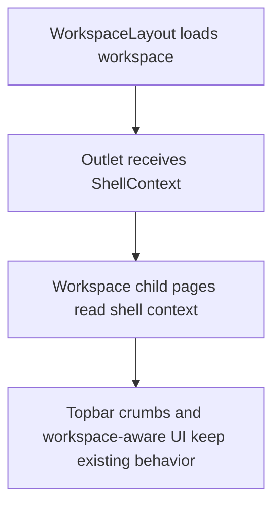

# Issue 587 - shared ShellContext의 entities 의존성 제거

## Goal

`frontend/src/shared/ui/ostone/chrome/ShellContext.ts`가 FSD 하위 계층인 `shared`에서 상위 계층인 `entities`를 import하지 않도록 의존 방향을 바로잡는다.

## User Flow Chart



## Design Diff

### As-is vs To-be

| 영역 | As-is | To-be | 변경 내용 |
| --- | --- | --- | --- |
| FSD 의존성 | `shared/ui/ostone/chrome/ShellContext.ts`가 `@/entities/workspace` 타입에 의존 | `shared` 내부에서 접근 가능한 API DTO 타입 또는 최소 표시 타입에 의존 | `shared -> entities` import 제거 |
| ShellContext 타입 | `WorkspaceResponse \| null` 유지 | 사용처가 기대하는 workspace 타입 안정성 유지 | 런타임 동작 변경 없음 |

## Component Tree

```text
WorkspaceLayout
├─ OstoneShell
└─ Outlet context: ShellContext
   ├─ WorkspaceDashboardPage
   ├─ WorkspaceMembersPage
   ├─ WorkspaceSimulationPage
   ├─ ConsultationPage
   ├─ PipelineReviewPage
   └─ BillingPage
```

## API Integration

새 API 엔드포인트나 요청/응답 계약은 추가하지 않는다. `ShellContext.workspace`는 기존 워크스페이스 조회 응답 형태를 계속 전달한다.

## Data Flow

```text
shared/api/generated/zod WorkspaceResponse type
        │
        ▼
shared/ui/ostone/chrome/ShellContext
        │
        ▼
pages/workspace/ui/WorkspaceLayout Outlet context
        │
        ▼
workspace child pages
```

## 수정 대상 파일

| 파일 | 변경 유형 | 설명 |
| --- | --- | --- |
| `frontend/src/shared/ui/ostone/chrome/ShellContext.ts` | update | `@/entities/workspace` 타입 import를 제거하고 FSD 방향을 지키는 타입 의존성으로 교체 |
| `.agent/specs/587.md` | new | 이슈 요구사항, 범위, 검증 기준 기록 |

## State Management

클라이언트 상태나 서버 상태 관리 방식은 변경하지 않는다. `WorkspaceLayout`이 구성하는 `ShellContext` 객체와 하위 페이지의 `useOutletContext<ShellContext>()` 사용 방식은 유지한다.

## Scope

- `shared` 계층의 `entities` import 제거
- ShellContext 사용처의 타입 계약 유지
- FSD import 방향을 확인할 수 있는 frontend lint 또는 동등한 정적 검증 통과

## Non-goals

- 워크스페이스 API 응답 스키마 변경
- Orval generated 파일 수정 또는 재생성
- Shell 레이아웃 UI, breadcrumb, workspace 로딩/에러 UX 변경
- 전체 FSD lint 규칙 신규 도입

## Acceptance Criteria

| # | 기준 | 확인 방법 |
| --- | --- | --- |
| 1 | `frontend/src/shared`에서 `@/entities` import가 남지 않는다. | `rg "@/entities" frontend/src/shared -g '*.ts' -g '*.tsx'` |
| 2 | `ShellContext.workspace` 타입이 기존 사용처에서 계속 유효하다. | TypeScript 빌드 또는 frontend lint |
| 3 | FSD import 방향 관련 lint 또는 정적 확인이 통과한다. | `pnpm run lint:frontend` 또는 import 검색 |

## Tests

### Test Strategy

| 구분 | 방법 | 도구 | 비고 |
| --- | --- | --- | --- |
| 정적 검사 | prohibited import 검색 | `rg` | `shared -> entities` 제거 확인 |
| 린트 | Frontend ESLint | `pnpm run lint:frontend` | 타입 import 및 FSD 위반 회귀 확인 |

### Error & Edge Cases

| # | 시나리오 | 기대 결과 |
| --- | --- | --- |
| 1 | `WorkspaceLayout`이 workspace를 아직 로드하지 못함 | `ShellContext.workspace`가 `null`로 유지되어 기존 로딩/에러 흐름 변경 없음 |
| 2 | 하위 페이지가 workspace의 `id`, `name` 등 기존 필드 참조 | generated DTO 기반 타입으로 컴파일 가능 |

## Open Questions

없음.
